# JS Bridge通信

<cite>
**本文档引用的文件**
- [Index.ets](file://entry/src/main/ets/pages/Index.ets)
- [Index.ts](file://entry/.preview/default/cache/default/default@PreviewArkTS/esmodule/debug/entry/src/main/ets/pages/Index.ts)
- [patch.js](file://patch.js)
- [harmonylog.md](file://harmonylog.md)
</cite>

## 目录
1. [项目概述](#项目概述)
2. [项目结构](#项目结构)
3. [核心组件](#核心组件)
4. [架构概览](#架构概览)
5. [详细组件分析](#详细组件分析)
6. [依赖关系分析](#依赖关系分析)
7. [性能考量](#性能考量)
8. [故障排除指南](#故障排除指南)
9. [结论](#结论)
10. [附录](#附录)

## 项目概述

本项目是一个基于HarmonyOS的JS Bridge通信系统，实现了H5与原生应用之间的双向通信机制。该系统通过NativeBridge类提供统一的消息分发接口，支持多种消息类型处理，包括音视频控制、用户管理、设备信息等核心功能。

## 项目结构

项目采用ArkTS技术栈，主要结构如下：

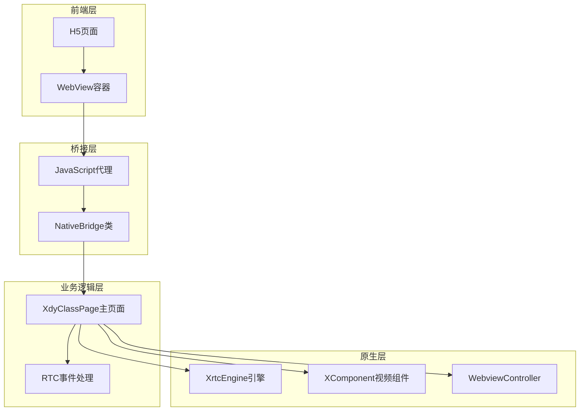

**图表来源**
- [Index.ets](file://entry/src/main/ets/pages/Index.ets#L108-L112)
- [Index.ets](file://entry/src/main/ets/pages/Index.ets#L200-L280)

**章节来源**
- [Index.ets](file://entry/src/main/ets/pages/Index.ets#L1-L1436)

## 核心组件

### NativeBridge类设计

NativeBridge是JS Bridge的核心组件，提供了统一的消息处理接口：

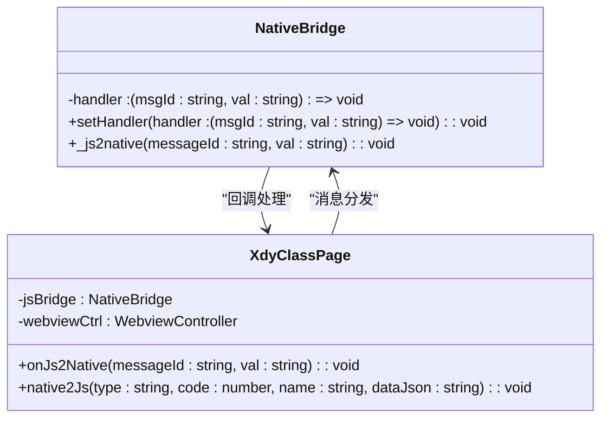

**图表来源**
- [Index.ets](file://entry/src/main/ets/pages/Index.ets#L108-L112)
- [Index.ets](file://entry/src/main/ets/pages/Index.ets#L200-L280)

**章节来源**
- [Index.ets](file://entry/src/main/ets/pages/Index.ets#L108-L112)

### 消息分发机制

系统实现了完整的消息分发机制，支持多种消息类型的处理：

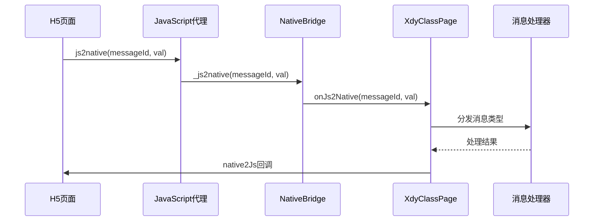

**图表来源**
- [Index.ets](file://entry/src/main/ets/pages/Index.ets#L229-L231)
- [Index.ets](file://entry/src/main/ets/pages/Index.ets#L362-L424)

**章节来源**
- [Index.ets](file://entry/src/main/ets/pages/Index.ets#L362-L424)

## 架构概览

系统采用分层架构设计，实现了H5与原生应用的深度集成：

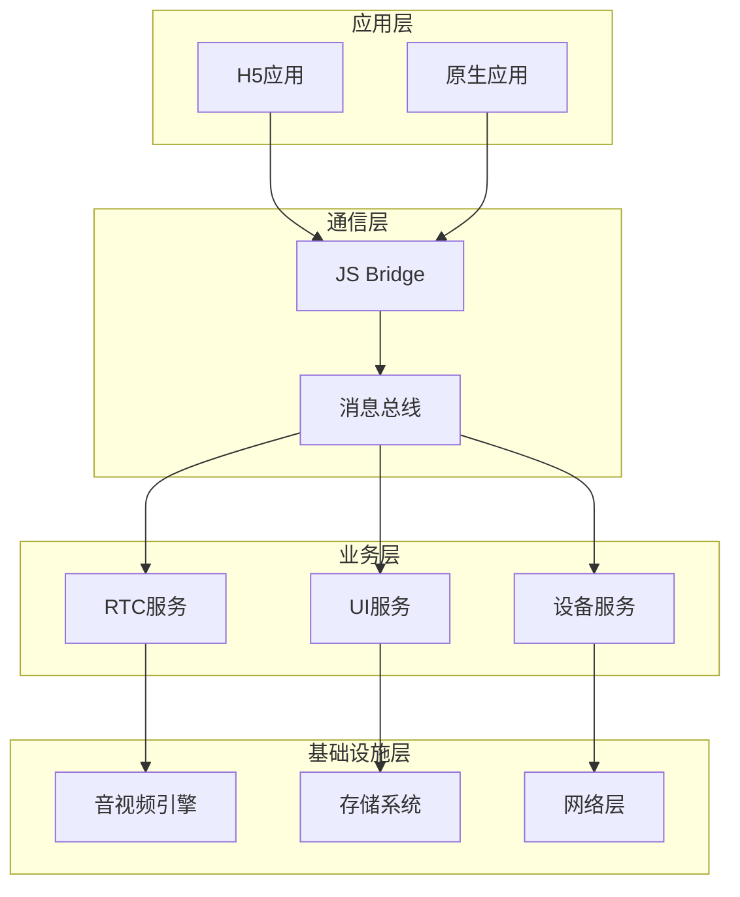

**图表来源**
- [Index.ets](file://entry/src/main/ets/pages/Index.ets#L108-L112)
- [Index.ets](file://entry/src/main/ets/pages/Index.ets#L988-L1001)

## 详细组件分析

### 消息类型处理系统

系统支持多种消息类型的处理，每个消息类型都有专门的处理逻辑：

#### 1000-1052消息类型处理

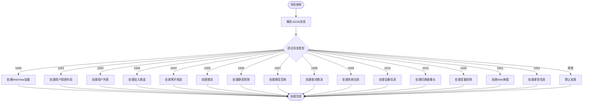

**图表来源**
- [Index.ets](file://entry/src/main/ets/pages/Index.ets#L396-L424)
- [Index.ets](file://entry/src/main/ets/pages/Index.ets#L403-L420)

**章节来源**
- [Index.ets](file://entry/src/main/ets/pages/Index.ets#L396-L424)

### native2Js回调机制

native2Js方法实现了原生向H5的回调机制：

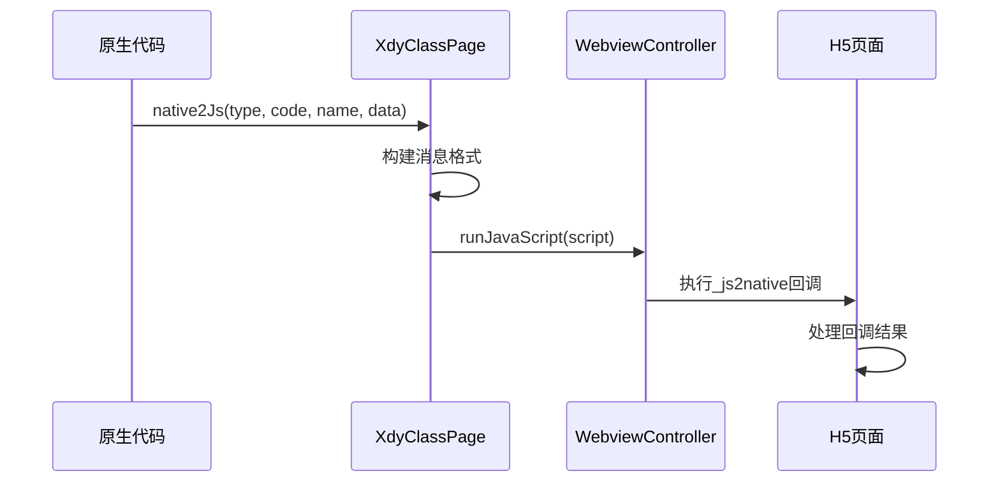

**图表来源**
- [Index.ets](file://entry/src/main/ets/pages/Index.ets#L988-L1001)

**章节来源**
- [Index.ets](file://entry/src/main/ets/pages/Index.ets#L988-L1001)

### 权限管理系统

系统实现了完善的权限申请和管理机制：

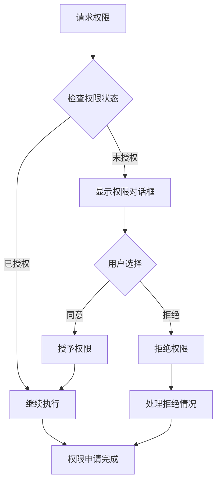

**图表来源**
- [Index.ets](file://entry/src/main/ets/pages/Index.ets#L238-L246)

**章节来源**
- [Index.ets](file://entry/src/main/ets/pages/Index.ets#L238-L246)

## 依赖关系分析

### 组件耦合度分析

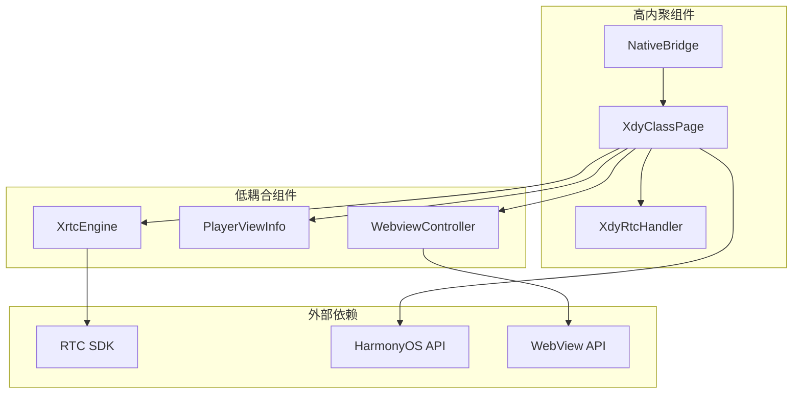

**图表来源**
- [Index.ets](file://entry/src/main/ets/pages/Index.ets#L108-L151)
- [Index.ets](file://entry/src/main/ets/pages/Index.ets#L200-L280)

**章节来源**
- [Index.ets](file://entry/src/main/ets/pages/Index.ets#L108-L151)

### 数据流分析

系统实现了完整的数据流管理：

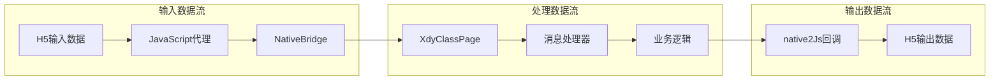

**图表来源**
- [Index.ets](file://entry/src/main/ets/pages/Index.ets#L229-L231)
- [Index.ets](file://entry/src/main/ets/pages/Index.ets#L988-L1001)

**章节来源**
- [Index.ets](file://entry/src/main/ets/pages/Index.ets#L229-L231)

## 性能考量

### 优化策略

系统采用了多项性能优化策略：

1. **延迟初始化**: RTC引擎采用延迟初始化，避免不必要的资源消耗
2. **内存管理**: 实现了完整的生命周期管理，及时释放资源
3. **异步处理**: 所有网络操作采用异步处理，避免阻塞主线程
4. **缓存机制**: 实现了多级缓存，减少重复计算

### 性能监控

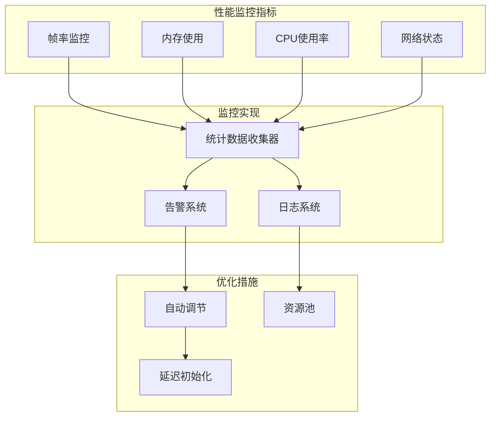

**图表来源**
- [Index.ets](file://entry/src/main/ets/pages/Index.ets#L1319-L1401)

**章节来源**
- [Index.ets](file://entry/src/main/ets/pages/Index.ets#L1319-L1401)

## 故障排除指南

### 常见问题及解决方案

| 问题类型 | 症状描述 | 解决方案 |
|---------|---------|---------|
| 权限拒绝 | 应用无法访问摄像头/麦克风 | 检查权限申请流程，重新授权 |
| RTC连接失败 | 音视频通话无法建立 | 检查网络状态，重新初始化引擎 |
| 消息处理异常 | H5与原生通信中断 | 检查消息格式，验证JSON解析 |
| 视频渲染问题 | 视频画面显示异常 | 检查XComponent状态，重新绑定视图 |

### 错误处理机制

系统实现了多层次的错误处理机制：

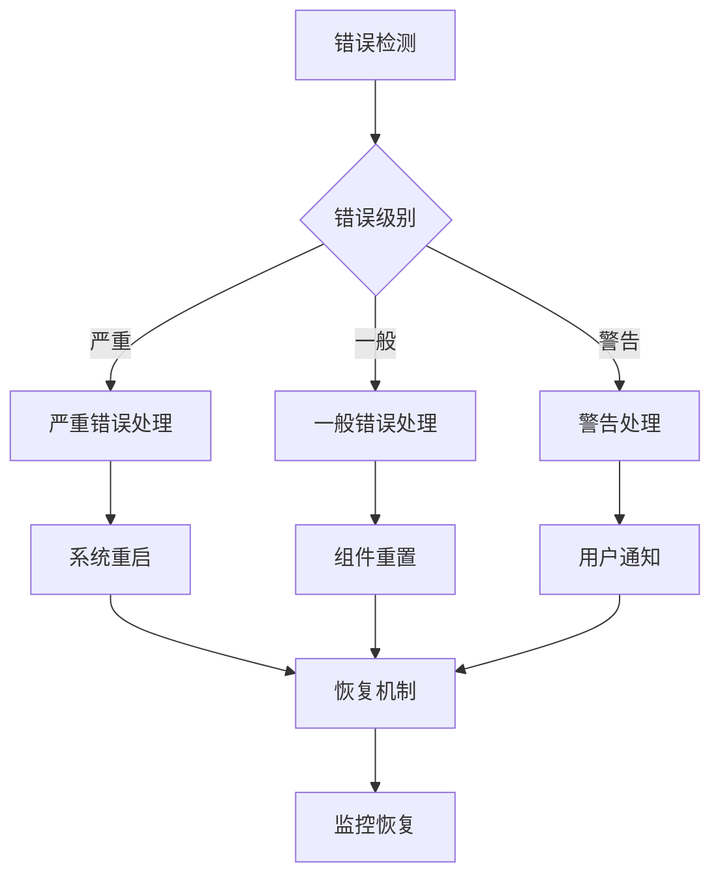

**图表来源**
- [Index.ets](file://entry/src/main/ets/pages/Index.ets#L421-L423)
- [Index.ets](file://entry/src/main/ets/pages/Index.ets#L1403-L1407)

**章节来源**
- [Index.ets](file://entry/src/main/ets/pages/Index.ets#L421-L423)

## 结论

本JS Bridge通信系统实现了H5与HarmonyOS原生应用的深度集成，具有以下特点：

1. **架构清晰**: 采用分层设计，职责明确
2. **扩展性强**: 支持多种消息类型，易于扩展
3. **性能优秀**: 优化的资源管理和异步处理
4. **稳定性高**: 完善的错误处理和恢复机制

系统为音视频教学应用提供了可靠的通信基础，支持复杂的交互场景和实时数据传输需求。

## 附录

### 使用示例

#### 发送消息到原生应用

```typescript
// H5端发送消息
window.js2native('nativeWebRtcAction', JSON.stringify({
    type: '1003',
    name: '加入频道',
    code: 0,
    data: {
        appId: 'your_app_id',
        channelId: 'your_channel_id',
        uid: 123456
    }
}));
```

#### 接收原生回调

```typescript
// 注册回调处理函数
window._native2js = function(messageId, val) {
    const data = JSON.parse(val);
    switch(data.type) {
        case '2003':
            console.log('加入频道成功');
            break;
        case '2005':
            console.log('推流成功');
            break;
    }
};
```

### 最佳实践

1. **消息格式标准化**: 统一使用JSON格式传递消息
2. **错误处理**: 始终包含错误处理逻辑
3. **资源管理**: 及时释放不再使用的资源
4. **性能监控**: 定期监控系统性能指标
5. **安全考虑**: 验证所有输入数据的安全性