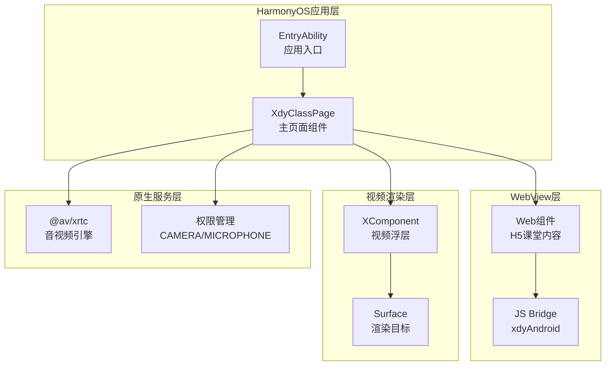
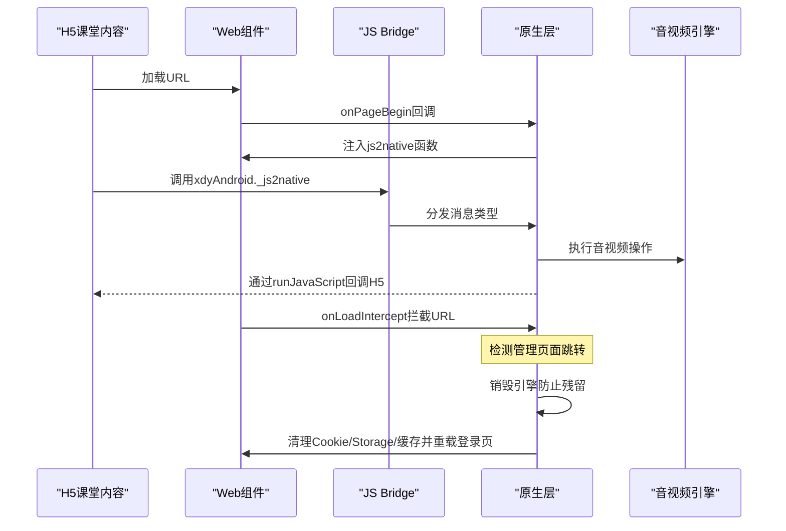
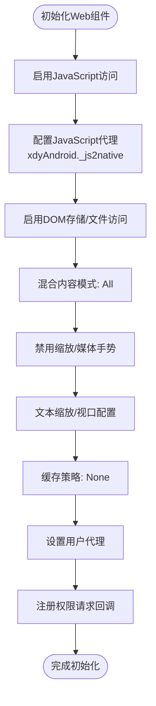
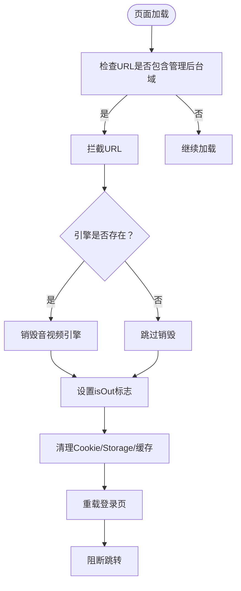
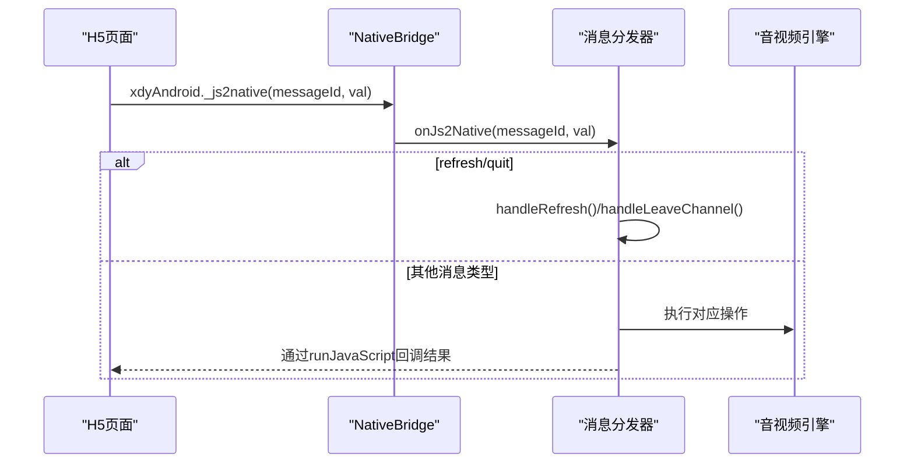
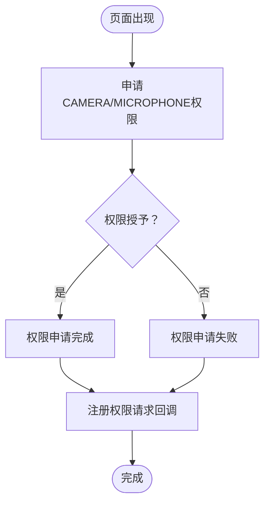
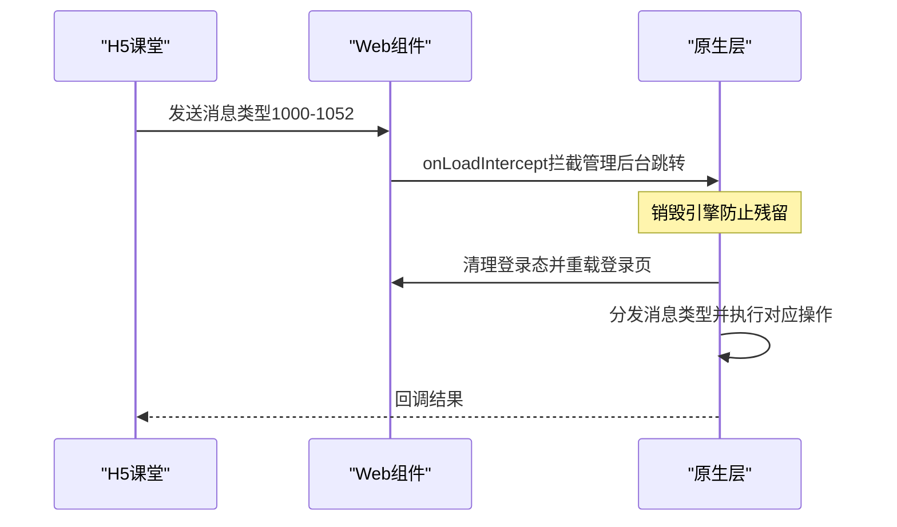
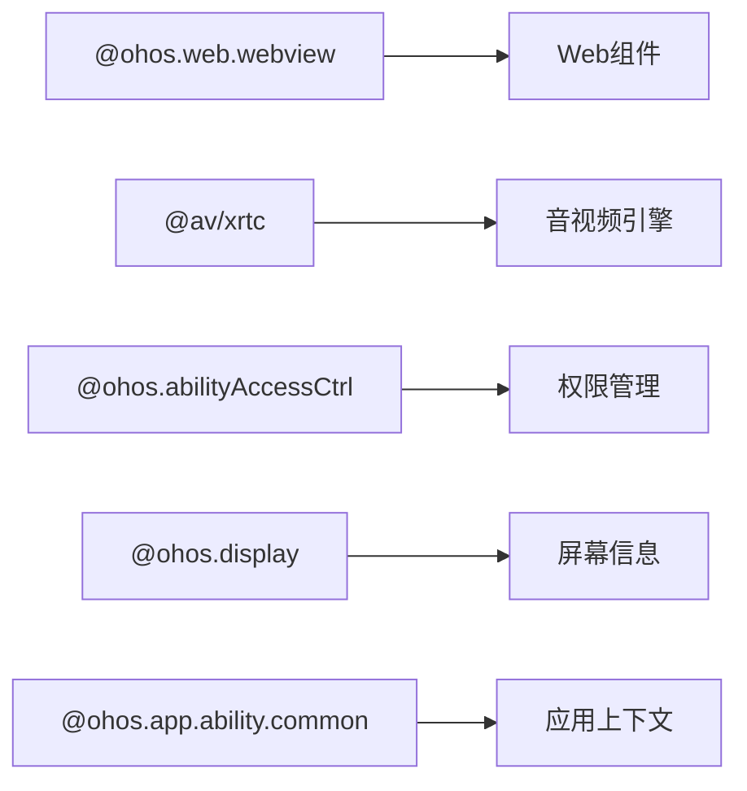

# WebView容器管理

<cite>
**本文档引用的文件**
- [Index.ets](file://entry/src/main/ets/pages/Index.ets)
- [EntryAbility.ets](file://entry/src/main/ets/entryability/EntryAbility.ets)
- [鸿蒙端实现分析与优化建议.md](file://鸿蒙端实现分析与优化建议.md)
</cite>

## 更新摘要
**变更内容**
- 增强WebView拦截逻辑，特别针对管理页面跳转的处理机制
- 新增引擎残留防护机制，防止H5直接跳转退出导致的引擎残留问题
- 完善URL拦截处理流程，包括引擎销毁、状态重置和登录态清理
- 优化边角情况处理，确保引擎状态的一致性和稳定性

## 目录
1. [简介](#简介)
2. [项目结构](#项目结构)
3. [核心组件](#核心组件)
4. [架构总览](#架构总览)
5. [详细组件分析](#详细组件分析)
6. [依赖关系分析](#依赖关系分析)
7. [性能考量](#性能考量)
8. [故障排查指南](#故障排查指南)
9. [结论](#结论)

## 简介
本文件系统性阐述该HarmonyOS项目中WebView容器管理功能的设计与实现，重点覆盖以下方面：
- WebView初始化配置与参数详解
- JavaScript访问控制与代理机制
- URL拦截处理与H5课堂内容集成
- 权限请求处理与生命周期事件
- 混合内容模式、缓存策略、用户代理设置等最佳实践
- WebView与原生应用的交互机制（JS Bridge）
- **新增**：增强的引擎残留防护机制和边角情况处理

## 项目结构
该项目采用ArkTS + Web组件 + XComponent三层架构，其中WebView承载H5课堂内容，XComponent用于视频浮层渲染，ArkTS原生层负责音视频引擎管理与控制。

**图表来源**
- [Index.ets:195-360](file://entry/src/main/ets/pages/Index.ets#L195-L360)
- [EntryAbility.ets:14-65](file://entry/src/main/ets/entryability/EntryAbility.ets#L14-L65)

**章节来源**
- [Index.ets:1-1436](file://entry/src/main/ets/pages/Index.ets#L1-L1436)
- [EntryAbility.ets:1-65](file://entry/src/main/ets/entryability/EntryAbility.ets#L1-L65)

## 核心组件
- Web组件控制器：负责WebView的生命周期、配置与交互
- JS桥接对象：提供H5与原生之间的双向通信通道
- 权限管理器：申请并处理摄像头与麦克风权限
- 音视频引擎：基于XRTC SDK管理推拉流与渲染
- 视频浮层：基于XComponent叠加在WebView之上的视频渲染层
- **新增**：引擎残留防护机制：防止H5直接跳转退出导致的引擎残留问题

**章节来源**
- [Index.ets:195-360](file://entry/src/main/ets/pages/Index.ets#L195-L360)

## 架构总览
WebView容器管理的核心流程如下：
- 初始化阶段：创建WebviewController，配置JavaScript访问、代理、缓存、UA等参数，并注册权限请求回调
- 页面加载阶段：注入全局js2native函数，建立H5到原生的消息通道
- URL拦截阶段：拦截管理后台跳转，清理登录态并重载登录页，**新增**：销毁引擎防止残留
- 生命周期阶段：处理页面出现/消失、权限申请、音视频引擎销毁等

**图表来源**
- [Index.ets:257-342](file://entry/src/main/ets/pages/Index.ets#L257-L342)
- [Index.ets:362-424](file://entry/src/main/ets/pages/Index.ets#L362-L424)

**章节来源**
- [Index.ets:257-342](file://entry/src/main/ets/pages/Index.ets#L257-L342)
- [Index.ets:362-424](file://entry/src/main/ets/pages/Index.ets#L362-L424)

## 详细组件分析

### WebView初始化配置与JavaScript代理
- JavaScript访问控制：启用JavaScript执行能力，确保H5页面可正常运行
- JavaScript代理：通过javaScriptProxy将原生对象暴露给H5，命名空间为xdyAndroid，方法列表包含_js2native
- DOM存储与文件访问：启用DOM存储与文件访问，满足H5课堂内容的本地存储需求
- 混合内容模式：MixedMode.All允许HTTP与HTTPS混合内容加载
- 缩放与媒体手势：禁用缩放与媒体播放手势要求，提升课堂环境稳定性
- 文本缩放与视口：设置文本缩放比例与meta viewport支持，适配移动端布局
- 缓存策略：CacheMode.None禁用缓存，确保H5内容实时更新
- 用户代理：自定义UA字符串，伪装为Android平台，确保H5识别为学生端
- 权限请求：onPermissionRequest回调中授权H5请求的可访问资源

**图表来源**
- [Index.ets:257-287](file://entry/src/main/ets/pages/Index.ets#L257-L287)

**章节来源**
- [Index.ets:257-287](file://entry/src/main/ets/pages/Index.ets#L257-L287)

### URL拦截处理机制与引擎残留防护
- 拦截条件：当URL包含特定管理后台域名时触发拦截
- **增强**：引擎残留防护机制：检测到管理页面跳转时，销毁音视频引擎防止残留
- 处理流程：清理Cookie、localStorage、sessionStorage，移除缓存并重载登录页
- 阻断跳转：返回true阻止H5继续跳转至管理页
- **新增**：边角情况处理：即使onLoadIntercept未彻底销毁，也会在doJoinChannel中进行二次销毁
- **新增**：状态重置：设置isOut标志，防止重复执行和异常状态

**图表来源**
- [Index.ets:303-349](file://entry/src/main/ets/pages/Index.ets#L303-L349)

**章节来源**
- [Index.ets:303-349](file://entry/src/main/ets/pages/Index.ets#L303-L349)

### JavaScript代理配置与消息分发
- 代理对象：NativeBridge类封装_js2native方法，作为H5调用原生的入口
- 消息类型：支持多种消息类型（如1000-1052），分别对应加载、用户视图、加入/离开频道、推流/取消推流、音视频控制等
- 分发逻辑：根据消息类型路由到对应的处理函数，执行音视频操作或回调H5
- 退出与刷新：支持refresh/quit消息，分别触发页面刷新与退出课堂流程

**图表来源**
- [Index.ets:107-112](file://entry/src/main/ets/pages/Index.ets#L107-L112)
- [Index.ets:362-424](file://entry/src/main/ets/pages/Index.ets#L362-L424)

**章节来源**
- [Index.ets:107-112](file://entry/src/main/ets/pages/Index.ets#L107-L112)
- [Index.ets:362-424](file://entry/src/main/ets/pages/Index.ets#L362-L424)

### 权限请求处理
- 权限申请：在页面出现时申请CAMERA与MICROPHONE权限
- 权限回调：成功/失败均记录日志，失败时提示用户
- 与WebView集成：onPermissionRequest回调中授权H5请求的可访问资源

**图表来源**
- [Index.ets:237-247](file://entry/src/main/ets/pages/Index.ets#L237-L247)
- [Index.ets:281-283](file://entry/src/main/ets/pages/Index.ets#L281-L283)

**章节来源**
- [Index.ets:237-247](file://entry/src/main/ets/pages/Index.ets#L237-L247)
- [Index.ets:281-283](file://entry/src/main/ets/pages/Index.ets#L281-L283)

### 页面加载拦截与H5课堂集成
- 加载拦截：拦截管理后台跳转，清理登录态并重载登录页
- 课堂集成：通过消息类型1000-1052与H5课堂内容进行深度集成，包括用户视图布局、成员列表、加入/离开频道、推流/取消推流、音视频控制等
- 生命周期：在页面消失时销毁音视频引擎，释放资源
- **新增**：引擎残留防护：在URL拦截和消息处理中双重保障引擎状态一致性

**图表来源**
- [Index.ets:294-340](file://entry/src/main/ets/pages/Index.ets#L294-L340)
- [Index.ets:426-922](file://entry/src/main/ets/pages/Index.ets#L426-L922)

**章节来源**
- [Index.ets:294-340](file://entry/src/main/ets/pages/Index.ets#L294-L340)
- [Index.ets:426-922](file://entry/src/main/ets/pages/Index.ets#L426-L922)

### WebView配置参数说明与最佳实践
- javaScriptAccess：启用JavaScript执行，确保H5页面可正常运行
- javaScriptProxy：配置JavaScript代理，命名空间xdyAndroid，方法列表包含_js2native
- domStorageAccess/fileAccess：启用DOM存储与文件访问，满足H5课堂内容的本地存储需求
- mixedMode：MixedMode.All允许HTTP与HTTPS混合内容加载
- overviewModeAccess/metaViewport/textZoomRatio/textAutosizing：配置视口与文本缩放，适配移动端布局
- zoomAccess/mediaPlayGestureAccess：禁用缩放与媒体播放手势，提升课堂环境稳定性
- cacheMode：CacheMode.None禁用缓存，确保H5内容实时更新
- userAgent：自定义UA字符串，伪装为Android平台，确保H5识别为学生端
- onPermissionRequest：注册权限请求回调，授权H5请求的可访问资源
- onPageBegin：注入全局js2native函数，建立H5到原生的消息通道
- onLoadIntercept：拦截管理后台跳转，清理登录态并重载登录页，**新增**：引擎残留防护

**章节来源**
- [Index.ets:257-287](file://entry/src/main/ets/pages/Index.ets#L257-L287)
- [Index.ets:284-349](file://entry/src/main/ets/pages/Index.ets#L284-L349)

### WebView与原生应用的交互机制
- JS Bridge：通过xdyAndroid._js2native实现H5到原生的消息传递
- 原生到H5：通过runJavaScript执行H5侧的回调函数
- 消息类型：涵盖加载、用户视图、成员列表、加入/离开频道、推流/取消推流、音视频控制、系统信息、设备信息、切换摄像头、音量增益、课堂记录等
- 生命周期事件：页面出现/消失时处理权限申请、音视频引擎销毁等
- **新增**：引擎残留防护：在消息处理和URL拦截中双重保障引擎状态一致性

**章节来源**
- [Index.ets:107-112](file://entry/src/main/ets/pages/Index.ets#L107-L112)
- [Index.ets:362-424](file://entry/src/main/ets/pages/Index.ets#L362-L424)
- [Index.ets:987-1001](file://entry/src/main/ets/pages/Index.ets#L987-L1001)

## 依赖关系分析
- Web组件依赖：@ohos.web.webview提供Web组件与WebviewController
- 音视频依赖：@av/xrtc提供XRTC引擎与事件处理
- 权限依赖：@ohos.abilityAccessCtrl提供权限申请与管理
- 显示依赖：@ohos.display提供屏幕信息获取
- 应用上下文：@ohos.app.ability.common提供UIAbilityContext

**图表来源**
- [Index.ets:1-10](file://entry/src/main/ets/pages/Index.ets#L1-L10)

**章节来源**
- [Index.ets:1-10](file://entry/src/main/ets/pages/Index.ets#L1-L10)

## 性能考量
- 缓存策略：禁用缓存可确保内容实时更新，但可能增加网络负载；可根据业务需求调整
- 混合内容：允许混合内容加载，需关注安全风险与性能影响
- 视口与文本缩放：合理配置视口与文本缩放，避免过度缩放导致的性能问题
- 权限申请：权限申请应在页面出现时尽早发起，减少后续阻塞
- 生命周期：页面消失时及时销毁音视频引擎，释放内存与CPU资源
- **新增**：引擎残留防护：通过多重检查机制防止引擎残留，提升应用稳定性

## 故障排查指南
- 日志分析：参考harmonylog.md中的日志输出，定位问题发生的时间点与上下文
- 权限问题：若H5无法访问摄像头/麦克风，检查权限申请结果与onPermissionRequest回调
- URL拦截：若管理后台跳转异常，检查onLoadIntercept拦截逻辑与清理步骤
- JS Bridge：若消息类型未生效，检查javaScriptProxy配置与_js2native方法调用
- 生命周期：若页面消失后仍有资源占用，检查aboutToDisappear中的销毁逻辑
- **新增**：引擎残留问题：检查isOut标志设置、引擎销毁流程和边角情况处理
- **新增**：状态同步问题：验证URL拦截和消息处理中的状态一致性

**章节来源**
- [鸿蒙端实现分析与优化建议.md:1-334](file://鸿蒙端实现分析与优化建议.md#L1-L334)

## 结论
该WebView容器管理功能通过合理的初始化配置、严格的URL拦截与完善的JS Bridge机制，实现了H5课堂内容与原生应用的深度集成。**最新更新**增强了引擎残留防护机制，通过URL拦截处理和边角情况处理双重保障，有效防止了H5直接跳转退出导致的引擎残留问题。在权限管理、生命周期控制与资源释放方面也提供了清晰的实现路径。建议在后续迭代中进一步完善异常处理、网络状态监听与性能优化，以提升整体稳定性与用户体验。