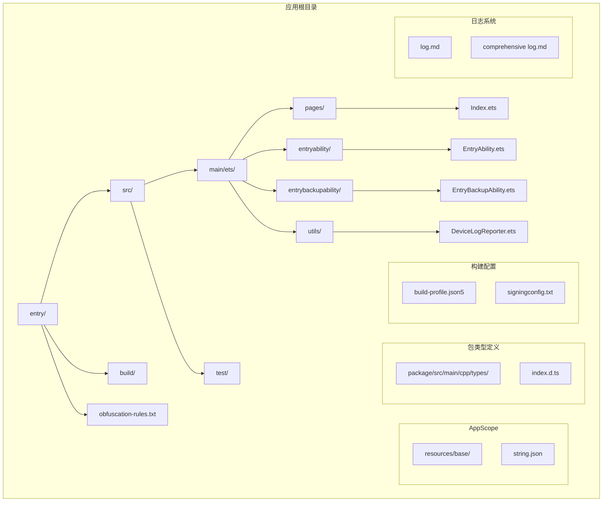
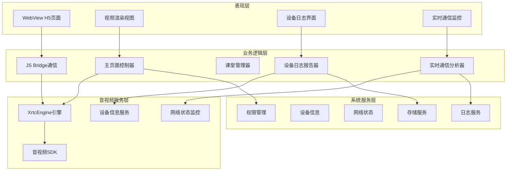
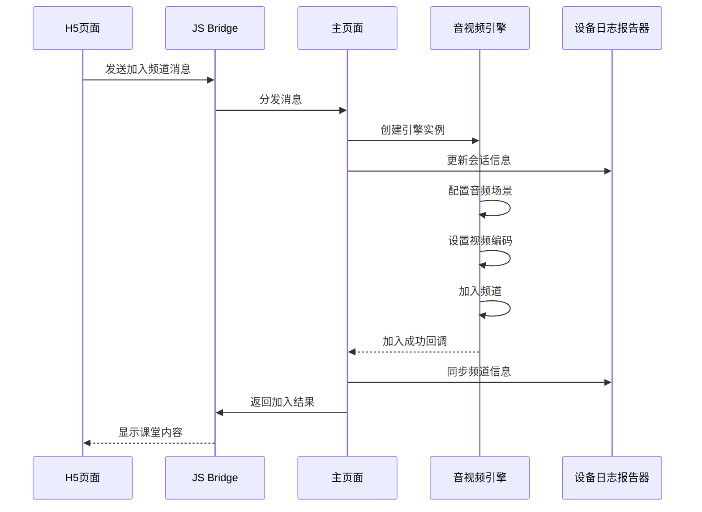
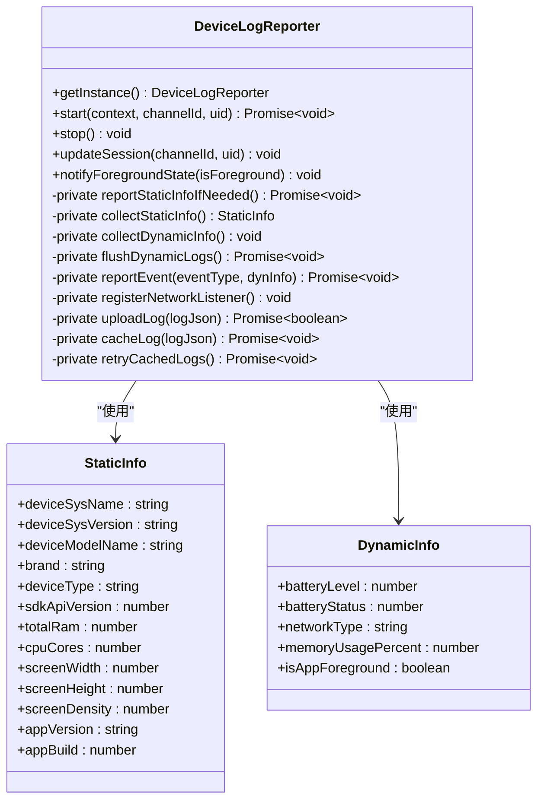
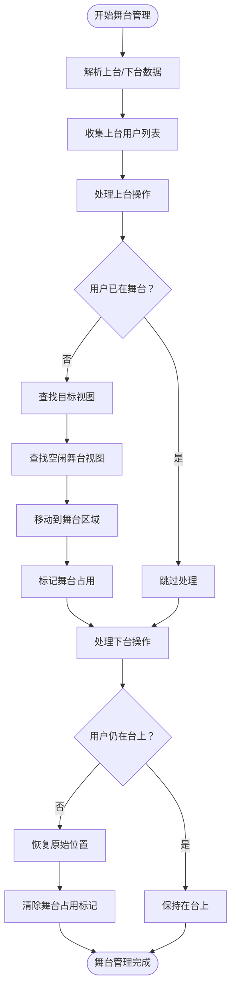
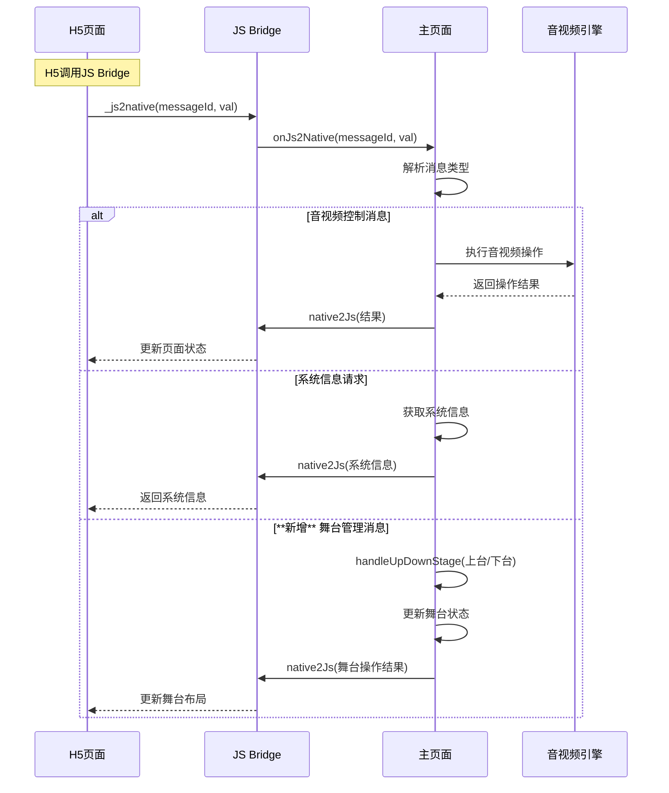
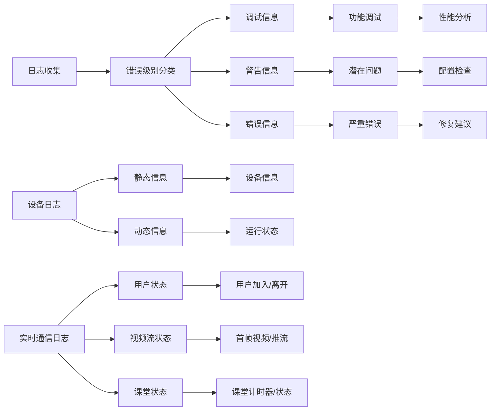

# 主要功能模块

<cite>
**本文档引用的文件**
- [Index.ets](file://entry/src/main/ets/pages/Index.ets)
- [EntryAbility.ets](file://entry/src/main/ets/entryability/EntryAbility.ets)
- [EntryBackupAbility.ets](file://entry/src/main/ets/entrybackupability/EntryBackupAbility.ets)
- [DeviceLogReporter.ets](file://entry/src/main/ets/utils/DeviceLogReporter.ets)
- [index.d.ts](file://package/src/main/cpp/types/libagora_rtc_sdk/index.d.ts)
- [string.json](file://AppScope/resources/base/element/string.json)
- [buildConfig.json](file://entry/build/config/buildConfig.json)
- [build-profile.json5](file://entry/build-profile.json5)
- [signingconfig.txt](file://signingconfig/signingconfig.txt)
- [log.md](file://log.md)
</cite>

## 更新摘要
**变更内容**
- 新增DeviceLogReporter日志报告器工具，提供完整的设备信息收集和上报功能
- 增强视频舞台管理功能，支持showstage角色的视频上台/下台管理
- 重构版本管理系统，完善应用版本信息检测和上报
- 增强设备信息检测功能，支持静态和动态信息的全面收集
- 新增实时通信日志系统，展示应用的实时通信能力
- 增强日志监控功能，支持结构化日志条目和实时通信分析

## 目录
1. [简介](#简介)
2. [项目结构](#项目结构)
3. [核心组件](#核心组件)
4. [架构概览](#架构概览)
5. [详细组件分析](#详细组件分析)
6. [依赖关系分析](#依赖关系分析)
7. [性能考虑](#性能考虑)
8. [故障排除指南](#故障排除指南)
9. [结论](#结论)

## 简介

HarmonyOS在线课堂应用是一个基于HarmonyOS平台开发的教育类应用程序，集成了音视频通话、课堂管理、视频渲染和JS Bridge通信等核心功能模块。该应用采用ArkTS技术栈，通过WebView承载H5课堂内容，同时利用原生音视频SDK实现高质量的实时音视频通信。

**最新更新**：
- 新增DeviceLogReporter日志报告器工具，提供完整的设备信息收集和上报功能
- 增强视频舞台管理功能，支持showstage角色的视频上台/下台管理
- 重构版本管理系统，完善应用版本信息检测和上报
- 增强设备信息检测功能，支持静态和动态信息的全面收集
- 新增实时通信日志系统，展示应用的实时通信能力
- 增强日志监控功能，支持结构化日志条目和实时通信分析

应用的主要特点包括：
- 支持多角色课堂布局（主持人、普通用户、展示舞台等）
- 实时音视频通话和屏幕共享
- 动态视频布局和自适应渲染
- 完整的JS Bridge通信机制
- 丰富的课堂管理功能
- 全面的日志监控和设备信息收集
- 增强的版本管理和配置管理
- 实时通信状态监控和分析能力

## 项目结构

项目采用典型的HarmonyOS应用结构，主要包含以下目录和文件：



**图表来源**
- [Index.ets:1-50](file://entry/src/main/ets/pages/Index.ets#L1-L50)
- [EntryAbility.ets:1-30](file://entry/src/main/ets/entryability/EntryAbility.ets#L1-L30)
- [EntryBackupAbility.ets:1-16](file://entry/src/main/ets/entrybackupability/EntryBackupAbility.ets#L1-L16)
- [DeviceLogReporter.ets:1-50](file://entry/src/main/ets/utils/DeviceLogReporter.ets#L1-L50)

**章节来源**
- [Index.ets:1-50](file://entry/src/main/ets/pages/Index.ets#L1-L50)
- [EntryAbility.ets:1-30](file://entry/src/main/ets/entryability/EntryAbility.ets#L1-L30)
- [EntryBackupAbility.ets:1-16](file://entry/src/main/ets/entrybackupability/EntryBackupAbility.ets#L1-L16)
- [DeviceLogReporter.ets:1-50](file://entry/src/main/ets/utils/DeviceLogReporter.ets#L1-L50)

## 核心组件

### 主页面组件 (XdyClassPage)

主页面组件是整个应用的核心控制器，负责协调各个功能模块的工作。它继承自ArkTS的@Entry装饰器，作为应用的入口页面。

**主要职责：**
- 管理WebView和原生界面的交互
- 处理音视频引擎的生命周期
- 维护视频渲染视图的状态
- 实现JS Bridge消息分发
- **新增**：集成DeviceLogReporter进行设备信息监控
- **新增**：管理视频舞台的上台/下台功能
- **新增**：实时监控和分析课堂通信状态

**关键属性：**
- `playerViews`: 视频渲染视图数组
- `rtcEngine`: 音视频引擎实例
- `webviewCtrl`: WebView控制器
- `jsBridge`: JS Bridge通信对象
- **新增**：`deviceLogReporter`: 设备日志报告器实例
- **新增**：`logMonitor`: 实时通信日志监控器

**章节来源**
- [Index.ets:197-260](file://entry/src/main/ets/pages/Index.ets#L197-L260)
- [Index.ets:1-15](file://entry/src/main/ets/pages/Index.ets#L1-L15)

### 设备日志报告器 (DeviceLogReporter)

**新增功能**：DeviceLogReporter是一个单例类，负责收集和上报设备信息，提供完整的日志监控功能。

**主要职责：**
- 收集静态设备信息（系统版本、设备型号、屏幕尺寸等）
- 采集动态运行信息（电池状态、网络类型、内存使用等）
- 定时上报设备信息到服务器
- 离线缓存和补报机制
- 网络状态监听和异常事件上报
- **新增**：实时通信状态监控和分析

**核心功能：**
- **静态信息收集**：设备系统信息、应用版本信息
- **动态信息采集**：电池状态、网络类型、前台状态
- **定时任务管理**：30秒采集一次，10分钟上报一次
- **异常事件监控**：低电量、网络切换等事件即时上报
- **离线缓存**：最多缓存100条日志，网络恢复后自动补报
- **实时通信监控**：监控课堂状态、用户加入/离开、视频流状态

**章节来源**
- [DeviceLogReporter.ets:57-124](file://entry/src/main/ets/utils/DeviceLogReporter.ets#L57-L124)
- [DeviceLogReporter.ets:166-195](file://entry/src/main/ets/utils/DeviceLogReporter.ets#L166-L195)
- [DeviceLogReporter.ets:295-314](file://entry/src/main/ets/utils/DeviceLogReporter.ets#L295-L314)

### 音视频引擎管理

应用使用@av/xrtc提供的XrtcEngine进行音视频通话管理，支持多种音视频SDK类型。

**支持的SDK类型：**
- Agora RTC (默认)
- HRtc (HarmonyOS原生)
- TRtc (腾讯云)
- Yunxin RTC (网易云)

**引擎配置：**
- 音频场景模式自动识别
- 视频编码配置动态设置
- 连接状态监控
- 错误处理和重连机制

**章节来源**
- [Index.ets:930-990](file://entry/src/main/ets/pages/Index.ets#L930-L990)

### 视频舞台管理系统

**增强功能**：视频舞台管理系统支持showstage角色的视频上台/下台管理，提供更灵活的课堂布局控制。

**舞台管理特性：**
- **上台功能**：将normal/host角色的用户移动到showstage区域
- **下台功能**：恢复用户到原始位置
- **舞台占用管理**：跟踪每个舞台视图的占用状态
- **位置记忆**：保存上台前的原始位置信息
- **兼容性支持**：normal角色可绑定到showstage视图

**支持的视图角色：**
- 主持人视图 (host)
- 普通用户视图 (normal)
- 展示舞台视图 (showstage) - **新增**
- 屏幕共享视图 (screenshare)
- 缩放视图 (zoom)

**章节来源**
- [Index.ets:985-1075](file://entry/src/main/ets/pages/Index.ets#L985-L1075)
- [Index.ets:1241-1353](file://entry/src/main/ets/pages/Index.ets#L1241-L1353)

### JS Bridge通信层

JS Bridge实现了H5页面与原生应用之间的双向通信，支持完整的消息传递机制。

**消息类型：**
- 1000: WebView加载完成
- 1001: 用户视图布局更新
- 1002: 成员列表更新
- 1003: 加入频道
- 1004: 离开频道
- 1005: 推流控制
- 1006: 静音视频
- 1007: 静音音频
- 1008: 取消推流
- 1009: 系统信息
- 1010: 设备信息
- 1014: **视频上台/下台** - **新增**
- 1015: 切换摄像头
- 1020: 音量控制
- 1051: Web弹窗状态
- 1052: 课堂记录信息

**章节来源**
- [Index.ets:367-429](file://entry/src/main/ets/pages/Index.ets#L367-L429)

## 架构概览

应用采用分层架构设计，各层之间职责明确，耦合度低。



**图表来源**
- [Index.ets:197-260](file://entry/src/main/ets/pages/Index.ets#L197-L260)
- [EntryAbility.ets:14-30](file://entry/src/main/ets/entryability/EntryAbility.ets#L14-L30)
- [DeviceLogReporter.ets:57-124](file://entry/src/main/ets/utils/DeviceLogReporter.ets#L57-L124)

## 详细组件分析

### 课堂管理系统

课堂管理系统负责维护课堂状态和用户管理。



**图表来源**
- [Index.ets:930-990](file://entry/src/main/ets/pages/Index.ets#L930-L990)
- [Index.ets:1175-1201](file://entry/src/main/ets/pages/Index.ets#L1175-L1201)
- [Index.ets:1140-1145](file://entry/src/main/ets/pages/Index.ets#L1140-L1145)

**章节来源**
- [Index.ets:541-586](file://entry/src/main/ets/pages/Index.ets#L541-L586)
- [Index.ets:930-990](file://entry/src/main/ets/pages/Index.ets#L930-L990)

### 设备日志报告器实现

**新增功能**：设备日志报告器提供完整的设备信息收集和上报功能。



**图表来源**
- [DeviceLogReporter.ets:57-80](file://entry/src/main/ets/utils/DeviceLogReporter.ets#L57-L80)
- [DeviceLogReporter.ets:10-41](file://entry/src/main/ets/utils/DeviceLogReporter.ets#L10-L41)

**章节来源**
- [DeviceLogReporter.ets:57-124](file://entry/src/main/ets/utils/DeviceLogReporter.ets#L57-L124)
- [DeviceLogReporter.ets:166-195](file://entry/src/main/ets/utils/DeviceLogReporter.ets#L166-L195)
- [DeviceLogReporter.ets:231-270](file://entry/src/main/ets/utils/DeviceLogReporter.ets#L231-L270)

### 视频舞台管理流程

**增强功能**：视频舞台管理系统支持复杂的上台/下台操作。



**图表来源**
- [Index.ets:985-1075](file://entry/src/main/ets/pages/Index.ets#L985-L1075)
- [Index.ets:1046-1075](file://entry/src/main/ets/pages/Index.ets#L1046-L1075)

**章节来源**
- [Index.ets:985-1075](file://entry/src/main/ets/pages/Index.ets#L985-L1075)
- [Index.ets:1046-1075](file://entry/src/main/ets/pages/Index.ets#L1046-L1075)

### JS Bridge通信机制

JS Bridge实现了H5页面与原生应用的双向通信。



**图表来源**
- [Index.ets:367-429](file://entry/src/main/ets/pages/Index.ets#L367-L429)
- [Index.ets:992-1006](file://entry/src/main/ets/pages/Index.ets#L992-L1006)
- [Index.ets:985-1075](file://entry/src/main/ets/pages/Index.ets#L985-L1075)

**章节来源**
- [Index.ets:367-429](file://entry/src/main/ets/pages/Index.ets#L367-L429)
- [Index.ets:992-1006](file://entry/src/main/ets/pages/Index.ets#L992-L1006)
- [Index.ets:985-1075](file://entry/src/main/ets/pages/Index.ets#L985-L1075)

### 实时通信日志监控系统

**新增功能**：应用集成了实时通信日志监控系统，提供详细的课堂通信状态分析。

**日志监控特性：**
- **用户加入监控**：实时跟踪用户加入/离开事件
- **视频流状态监控**：监控首帧视频、推流状态
- **屏幕共享监控**：跟踪屏幕共享开始/结束事件
- **课堂计时器监控**：实时更新课堂时间状态
- **成员列表监控**：跟踪成员列表变化
- **课堂状态监控**：监控课堂开始/结束状态

**日志条目示例**：
- 用户加入：`[XDY] 远端用户加入 uid=2019052200`
- 首帧视频：`[XDY] 远端首帧视频 uid=114444344`
- 屏幕共享：`[XDY] screen_share_play: fromNodeId=114444344`
- 课堂计时：`[XDY] class_update_timer: classTimestamp=1794`

**章节来源**
- [log.md:1-107](file://log.md#L1-L107)

## 依赖关系分析

应用的依赖关系清晰明确，各模块之间通过接口进行解耦。

```mermaid
graph TB
subgraph "外部依赖"
A[@av/xrtc 音视频SDK]
B[@ohos.web.webview WebView]
C[@ohos.display 显示管理]
D[@ohos.abilityAccessCtrl 权限管理]
E[@kit.BasicServicesKit 设备服务]
F[@kit.NetworkKit 网络服务]
G[@kit.ArkData 偏好设置]
H[@kit.AbilityKit 能力管理]
end
subgraph "内部模块"
I[主页面控制器]
J[JS Bridge]
K[视频渲染组件]
L[音视频引擎]
M[设备日志报告器]
N[视频舞台管理]
O[实时通信监控]
end
subgraph "系统服务"
P[HarmonyOS系统API]
Q[设备信息]
R[网络状态]
S[存储服务]
T[日志服务]
end
A --> L
B --> J
C --> I
D --> I
E --> M
F --> M
G --> M
H --> M
L --> P
I --> Q
J --> R
M --> S
O --> T
I --> N
I --> M
I --> O
L --> I
J --> I
K --> I
N --> I
O --> I
```

**图表来源**
- [Index.ets:1-15](file://entry/src/main/ets/pages/Index.ets#L1-L15)
- [EntryAbility.ets:1-10](file://entry/src/main/ets/entryability/EntryAbility.ets#L1-L10)
- [DeviceLogReporter.ets:1-7](file://entry/src/main/ets/utils/DeviceLogReporter.ets#L1-L7)

**章节来源**
- [Index.ets:1-15](file://entry/src/main/ets/pages/Index.ets#L1-L15)
- [EntryAbility.ets:1-10](file://entry/src/main/ets/entryability/EntryAbility.ets#L1-L10)
- [DeviceLogReporter.ets:1-7](file://entry/src/main/ets/utils/DeviceLogReporter.ets#L1-L7)

## 性能考虑

### 渲染性能优化

应用采用了多项性能优化策略：

1. **延迟初始化**: 视图组件采用延迟创建，减少启动时的内存占用
2. **表面复用**: 通过surfaceId复用机制，避免频繁创建销毁
3. **异步渲染**: 视频渲染采用异步方式，不影响主线程流畅度
4. **内存管理**: 及时清理不再使用的视频轨道和渲染资源
5. **舞台管理优化**: 使用位置记忆和批量更新减少重绘次数

### 网络性能优化

1. **连接池管理**: 复用音视频引擎实例，避免重复初始化
2. **错误恢复**: 实现自动重连机制，提高网络稳定性
3. **带宽适配**: 根据网络状况动态调整视频质量
4. **缓存策略**: 合理使用WebView缓存，提升页面加载速度
5. **日志上报优化**: 采用定时批量上报，减少网络请求频率

### 内存管理

应用实现了完善的内存管理机制：
- 及时释放不再使用的音视频资源
- 清理事件监听器和回调函数
- 优化数据结构，减少内存碎片
- 实现弱引用避免循环引用
- **新增**：设备日志缓存队列，避免内存泄漏
- **新增**：实时通信日志缓冲区，优化内存使用

### 设备日志性能优化

**新增功能**：设备日志报告器采用多种优化策略：
- **定时任务分离**：静态信息一次性上报，动态信息定时批量上报
- **缓存队列**：使用Promise队列确保缓存操作的顺序性
- **网络监听**：自动检测网络状态，网络恢复后自动补报
- **异常事件即时上报**：低电量、网络切换等异常事件立即上报
- **实时通信监控优化**：采用高效的日志过滤和分析机制

### 实时通信监控优化

**新增功能**：实时通信监控系统采用多项优化策略：
- **日志采样**：30秒采集一次动态信息，避免过度消耗资源
- **批量上报**：10分钟批量上报一次，减少网络请求频率
- **智能缓存**：最多缓存100条日志，避免内存溢出
- **异常检测**：自动检测网络状态变化和电池状态异常
- **事件优先级**：重要事件（如网络断开、低电量）优先上报

## 故障排除指南

### 常见问题及解决方案

**问题1: 音视频引擎初始化失败**
- 检查App ID和密钥配置
- 确认网络连接正常
- 验证权限申请成功
- 查看日志输出获取详细错误信息

**问题2: 视频画面无法显示**
- 确认XComponent表面ID获取成功
- 检查视频轨道是否正确绑定
- 验证用户权限（摄像头/麦克风）
- 确认渲染模式设置正确

**问题3: JS Bridge通信异常**
- 检查消息格式是否符合规范
- 验证WebView JavaScript代理配置
- 确认消息分发逻辑正确执行
- 查看控制台输出的错误信息

**问题4: 页面刷新后功能异常**
- 确认reset()方法正确执行
- 检查视图数组是否正确清空
- 验证音视频轨道是否正确释放
- 确认状态变量重置完成

**问题5: 设备日志上报失败**
- 检查网络连接状态
- 验证上传URL配置正确
- 查看缓存队列是否正常工作
- 确认设备信息收集权限

**问题6: 舞台管理异常**
- 检查舞台视图是否正确初始化
- 验证用户角色匹配逻辑
- 确认位置记忆功能正常
- 查看舞台占用状态管理

**问题7: 实时通信监控异常**
- 检查日志系统是否正常启动
- 验证日志条目格式是否正确
- 确认监控数据是否正确解析
- 查看日志缓冲区状态

**章节来源**
- [Index.ets:656-698](file://entry/src/main/ets/pages/Index.ets#L656-L698)
- [Index.ets:1408-1412](file://entry/src/main/ets/pages/Index.ets#L1408-L1412)
- [DeviceLogReporter.ets:357-409](file://entry/src/main/ets/utils/DeviceLogReporter.ets#L357-L409)
- [Index.ets:985-1075](file://entry/src/main/ets/pages/Index.ets#L985-L1075)

### 日志分析

应用提供了详细的日志输出，便于问题诊断：



**章节来源**
- [log.md:1-50](file://log.md#L1-L50)
- [DeviceLogReporter.ets:48-56](file://entry/src/main/ets/utils/DeviceLogReporter.ets#L48-L56)

### 版本管理

**重构功能**：应用采用统一的版本管理策略：

1. **构建配置管理**：通过build-profile.json5管理构建选项
2. **签名配置管理**：通过signingconfig.txt管理签名信息
3. **应用版本检测**：在设备信息中包含应用版本和构建号
4. **版本更新提醒**：在signingconfig.txt中提醒更新版本号

**章节来源**
- [build-profile.json5:1-33](file://entry/build-profile.json5#L1-L33)
- [signingconfig.txt:1-4](file://signingconfig/signingconfig.txt#L1-L4)
- [DeviceLogReporter.ets:206-227](file://entry/src/main/ets/utils/DeviceLogReporter.ets#L206-L227)

## 结论

HarmonyOS在线课堂应用展现了现代移动教育应用的设计理念和技术实现。通过合理的架构设计和模块化开发，应用实现了以下目标：

**技术优势：**
- 采用ArkTS技术栈，充分利用HarmonyOS生态优势
- 实现了高性能的音视频通话功能
- 提供了灵活的视频渲染系统
- 建立了完整的JS Bridge通信机制
- **新增**：实现了全面的设备日志监控功能
- **增强**：提供了灵活的视频舞台管理功能
- **新增**：集成了实时通信日志监控系统

**功能特色：**
- 支持多角色课堂布局，满足不同教学场景需求
- 实现了完整的课堂管理功能
- 提供了丰富的交互体验
- 具备良好的扩展性和定制化能力
- **新增**：完善的日志监控和分析能力
- **增强**：灵活的视频舞台布局管理
- **新增**：实时通信状态监控和分析

**未来发展方向：**
- 进一步优化音视频质量和性能
- 增强课堂互动功能
- 扩展更多教学工具集成
- 提升用户体验和易用性
- **新增**：增强日志分析和设备监控功能
- **增强**：优化舞台管理算法和性能
- **新增**：扩展实时通信监控覆盖范围

该应用为HarmonyOS平台上的教育应用开发提供了优秀的参考范例，展示了如何在限制性的环境中实现复杂的功能需求。新增的DeviceLogReporter工具、增强的视频舞台管理功能和实时通信监控系统进一步提升了应用的监控能力和用户体验。这些改进使得应用不仅能够提供高质量的在线课堂体验，还能够有效地监控和分析实时通信状态，为教学质量和用户体验的持续改进提供了强有力的技术支撑。