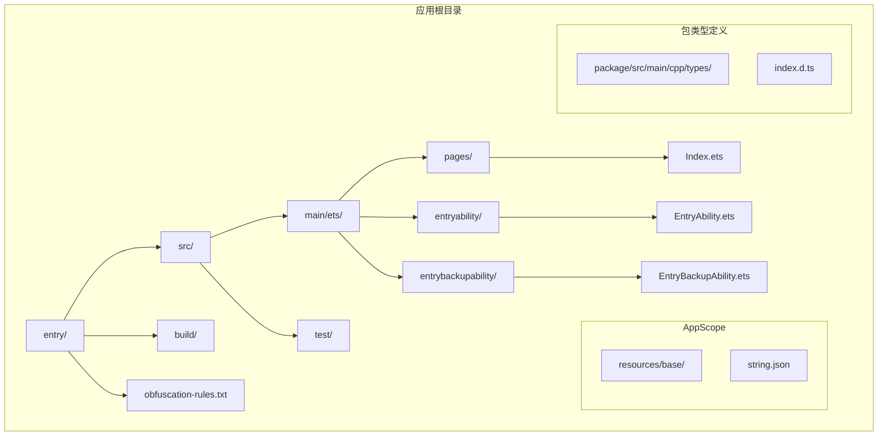
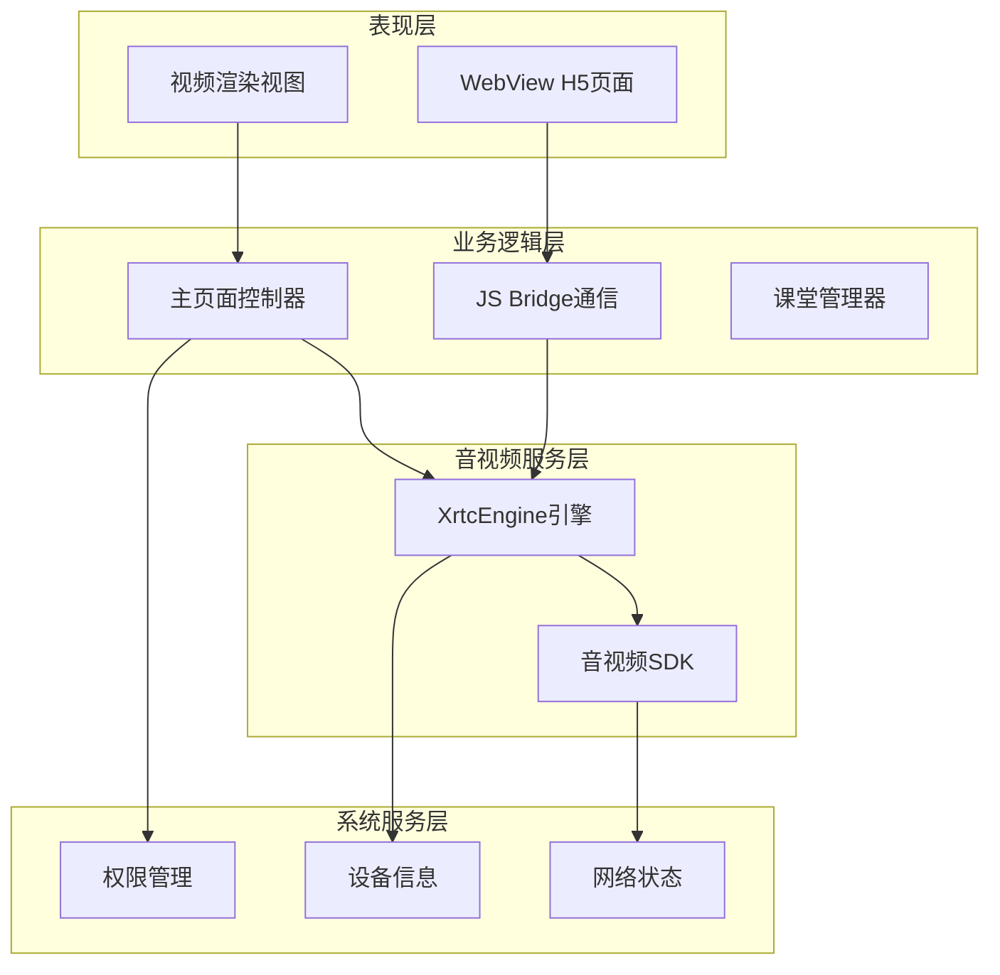
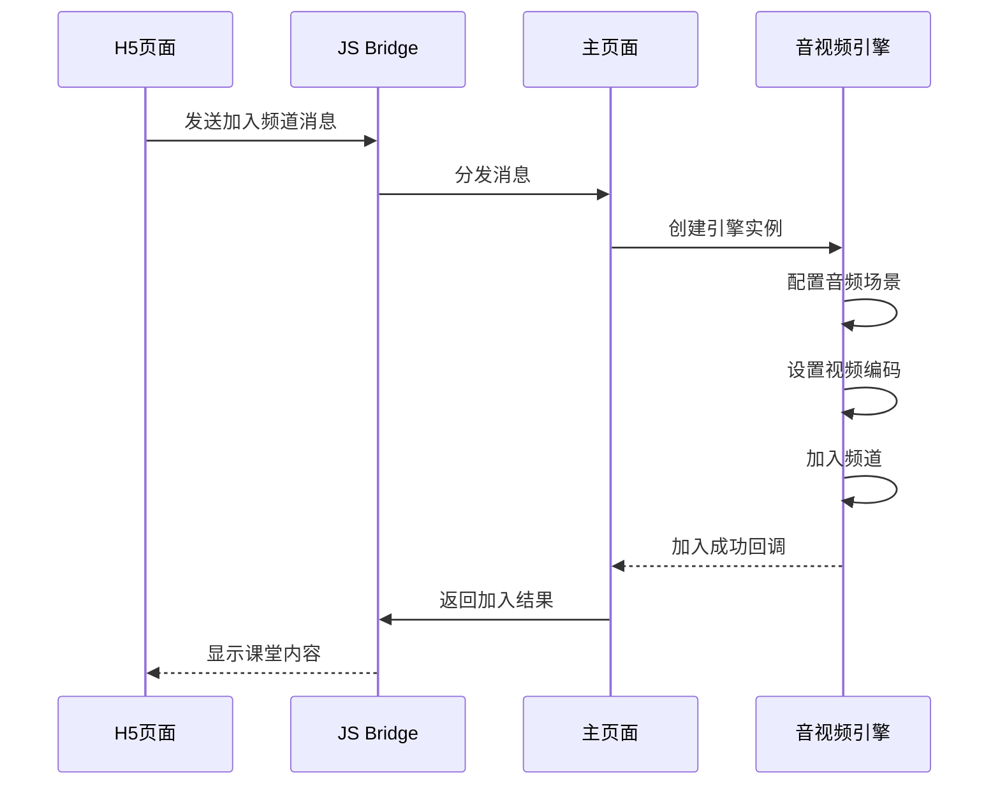
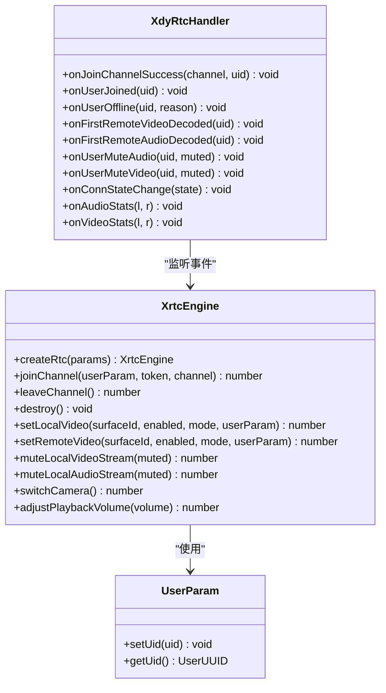
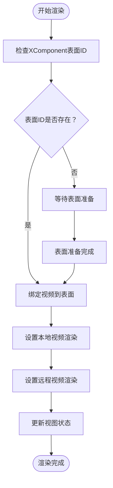
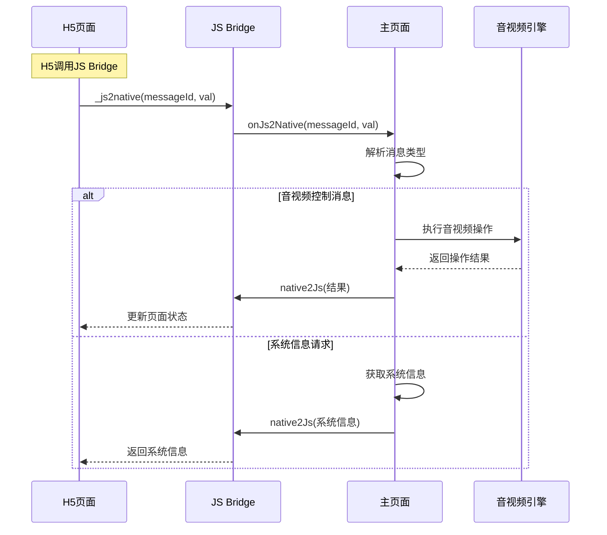
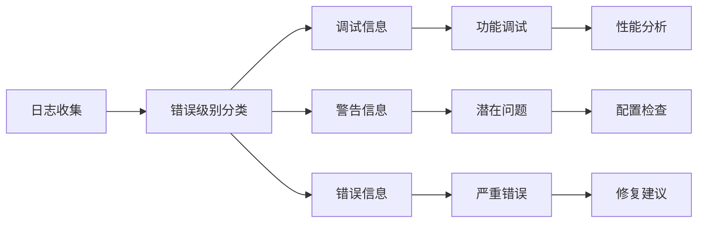

# 主要功能模块

<cite>
**本文档引用的文件**
- [Index.ets](file://entry/src/main/ets/pages/Index.ets)
- [EntryAbility.ets](file://entry/src/main/ets/entryability/EntryAbility.ets)
- [EntryBackupAbility.ets](file://entry/src/main/ets/entrybackupability/EntryBackupAbility.ets)
- [index.d.ts](file://package/src/main/cpp/types/libagora_rtc_sdk/index.d.ts)
- [string.json](file://AppScope/resources/base/element/string.json)
- [buildConfig.json](file://entry/build/config/buildConfig.json)
- [harmonylog.md](file://harmonylog.md)
</cite>

## 目录
1. [简介](#简介)
2. [项目结构](#项目结构)
3. [核心组件](#核心组件)
4. [架构概览](#架构概览)
5. [详细组件分析](#详细组件分析)
6. [依赖关系分析](#依赖关系分析)
7. [性能考虑](#性能考虑)
8. [故障排除指南](#故障排除指南)
9. [结论](#结论)

## 简介

HarmonyOS在线课堂应用是一个基于HarmonyOS平台开发的教育类应用程序，集成了音视频通话、课堂管理、视频渲染和JS Bridge通信等核心功能模块。该应用采用ArkTS技术栈，通过WebView承载H5课堂内容，同时利用原生音视频SDK实现高质量的实时音视频通信。

应用的主要特点包括：
- 支持多角色课堂布局（主持人、普通用户、展示舞台等）
- 实时音视频通话和屏幕共享
- 动态视频布局和自适应渲染
- 完整的JS Bridge通信机制
- 丰富的课堂管理功能

## 项目结构

项目采用典型的HarmonyOS应用结构，主要包含以下目录和文件：



**图表来源**
- [Index.ets](file://entry/src/main/ets/pages/Index.ets#L1-L50)
- [EntryAbility.ets](file://entry/src/main/ets/entryability/EntryAbility.ets#L1-L30)
- [EntryBackupAbility.ets](file://entry/src/main/ets/entrybackupability/EntryBackupAbility.ets#L1-L16)

**章节来源**
- [Index.ets](file://entry/src/main/ets/pages/Index.ets#L1-L50)
- [EntryAbility.ets](file://entry/src/main/ets/entryability/EntryAbility.ets#L1-L30)
- [EntryBackupAbility.ets](file://entry/src/main/ets/entrybackupability/EntryBackupAbility.ets#L1-L16)

## 核心组件

### 主页面组件 (XdyClassPage)

主页面组件是整个应用的核心控制器，负责协调各个功能模块的工作。它继承自ArkTS的@Entry装饰器，作为应用的入口页面。

**主要职责：**
- 管理WebView和原生界面的交互
- 处理音视频引擎的生命周期
- 维护视频渲染视图的状态
- 实现JS Bridge消息分发

**关键属性：**
- `playerViews`: 视频渲染视图数组
- `rtcEngine`: 音视频引擎实例
- `webviewCtrl`: WebView控制器
- `jsBridge`: JS Bridge通信对象

**章节来源**
- [Index.ets](file://entry/src/main/ets/pages/Index.ets#L197-L260)

### 音视频引擎管理

应用使用@av/xrtc提供的XrtcEngine进行音视频通话管理，支持多种音视频SDK类型。

**支持的SDK类型：**
- Agora RTC (默认)
- HRtc (HarmonyOS原生)
- TRtc (腾讯云)
- Yunxin RTC (网易云)

**引擎配置：**
- 音频场景模式自动识别
- 视频编码配置动态设置
- 连接状态监控
- 错误处理和重连机制

**章节来源**
- [Index.ets](file://entry/src/main/ets/pages/Index.ets#L930-L990)

### 视频渲染系统

视频渲染系统采用XComponent技术实现，支持多用户、多角色的视频画面渲染。

**渲染特性：**
- 自适应布局计算
- 角色匹配绑定
- 动态视图创建和销毁
- 表面ID管理

**支持的视图角色：**
- 主持人视图 (host)
- 普通用户视图 (normal)
- 展示舞台视图 (showstage)
- 屏幕共享视图 (screenshare)
- 缩放视图 (zoom)

**章节来源**
- [Index.ets](file://entry/src/main/ets/pages/Index.ets#L1009-L1142)

### JS Bridge通信层

JS Bridge实现了H5页面与原生应用之间的双向通信，支持完整的消息传递机制。

**消息类型：**
- 1000: WebView加载完成
- 1001: 用户视图布局更新
- 1002: 成员列表更新
- 1003: 加入频道
- 1004: 离开频道
- 1005: 推流控制
- 1006: 静音视频
- 1007: 静音音频
- 1008: 取消推流
- 1009: 系统信息
- 1010: 设备信息
- 1015: 切换摄像头
- 1020: 音量控制
- 1051: Web弹窗状态
- 1052: 课堂记录信息

**章节来源**
- [Index.ets](file://entry/src/main/ets/pages/Index.ets#L367-L429)

## 架构概览

应用采用分层架构设计，各层之间职责明确，耦合度低。



**图表来源**
- [Index.ets](file://entry/src/main/ets/pages/Index.ets#L197-L260)
- [EntryAbility.ets](file://entry/src/main/ets/entryability/EntryAbility.ets#L14-L30)

## 详细组件分析

### 课堂管理系统

课堂管理系统负责维护课堂状态和用户管理。



**图表来源**
- [Index.ets](file://entry/src/main/ets/pages/Index.ets#L930-L990)
- [Index.ets](file://entry/src/main/ets/pages/Index.ets#L1175-L1201)

**章节来源**
- [Index.ets](file://entry/src/main/ets/pages/Index.ets#L541-L586)
- [Index.ets](file://entry/src/main/ets/pages/Index.ets#L930-L990)

### 音视频通话实现

音视频通话功能通过XrtcEngine实现，支持多种音视频SDK。



**图表来源**
- [Index.ets](file://entry/src/main/ets/pages/Index.ets#L135-L151)
- [index.d.ts](file://package/src/main/cpp/types/libagora_rtc_sdk/index.d.ts#L1-L50)

**章节来源**
- [Index.ets](file://entry/src/main/ets/pages/Index.ets#L135-L151)
- [index.d.ts](file://package/src/main/cpp/types/libagora_rtc_sdk/index.d.ts#L1-L50)

### 视频渲染流程

视频渲染系统采用XComponent技术，实现高效的视频画面渲染。



**图表来源**
- [Index.ets](file://entry/src/main/ets/pages/Index.ets#L1415-L1435)
- [Index.ets](file://entry/src/main/ets/pages/Index.ets#L1056-L1082)

**章节来源**
- [Index.ets](file://entry/src/main/ets/pages/Index.ets#L1415-L1435)
- [Index.ets](file://entry/src/main/ets/pages/Index.ets#L1056-L1082)

### JS Bridge通信机制

JS Bridge实现了H5页面与原生应用的双向通信。



**图表来源**
- [Index.ets](file://entry/src/main/ets/pages/Index.ets#L367-L429)
- [Index.ets](file://entry/src/main/ets/pages/Index.ets#L992-L1006)

**章节来源**
- [Index.ets](file://entry/src/main/ets/pages/Index.ets#L367-L429)
- [Index.ets](file://entry/src/main/ets/pages/Index.ets#L992-L1006)

## 依赖关系分析

应用的依赖关系清晰明确，各模块之间通过接口进行解耦。

```mermaid
graph TB
subgraph "外部依赖"
A[@av/xrtc 音视频SDK]
B[@ohos.web.webview WebView]
C[@ohos.display 显示管理]
D[@ohos.abilityAccessCtrl 权限管理]
end
subgraph "内部模块"
E[主页面控制器]
F[JS Bridge]
G[视频渲染组件]
H[音视频引擎]
end
subgraph "系统服务"
I[HarmonyOS系统API]
J[设备信息]
K[网络状态]
end
A --> H
B --> F
C --> E
D --> E
H --> I
E --> J
F --> K
E --> H
E --> F
E --> G
```

**图表来源**
- [Index.ets](file://entry/src/main/ets/pages/Index.ets#L1-L15)
- [EntryAbility.ets](file://entry/src/main/ets/entryability/EntryAbility.ets#L1-L10)

**章节来源**
- [Index.ets](file://entry/src/main/ets/pages/Index.ets#L1-L15)
- [EntryAbility.ets](file://entry/src/main/ets/entryability/EntryAbility.ets#L1-L10)

## 性能考虑

### 渲染性能优化

应用采用了多项性能优化策略：

1. **延迟初始化**: 视图组件采用延迟创建，减少启动时的内存占用
2. **表面复用**: 通过surfaceId复用机制，避免频繁创建销毁
3. **异步渲染**: 视频渲染采用异步方式，不影响主线程流畅度
4. **内存管理**: 及时清理不再使用的视频轨道和渲染资源

### 网络性能优化

1. **连接池管理**: 复用音视频引擎实例，避免重复初始化
2. **错误恢复**: 实现自动重连机制，提高网络稳定性
3. **带宽适配**: 根据网络状况动态调整视频质量
4. **缓存策略**: 合理使用WebView缓存，提升页面加载速度

### 内存管理

应用实现了完善的内存管理机制：
- 及时释放不再使用的音视频资源
- 清理事件监听器和回调函数
- 优化数据结构，减少内存碎片
- 实现弱引用避免循环引用

## 故障排除指南

### 常见问题及解决方案

**问题1: 音视频引擎初始化失败**
- 检查App ID和密钥配置
- 确认网络连接正常
- 验证权限申请成功
- 查看日志输出获取详细错误信息

**问题2: 视频画面无法显示**
- 确认XComponent表面ID获取成功
- 检查视频轨道是否正确绑定
- 验证用户权限（摄像头/麦克风）
- 确认渲染模式设置正确

**问题3: JS Bridge通信异常**
- 检查消息格式是否符合规范
- 验证WebView JavaScript代理配置
- 确认消息分发逻辑正确执行
- 查看控制台输出的错误信息

**问题4: 页面刷新后功能异常**
- 确认reset()方法正确执行
- 检查视图数组是否正确清空
- 验证音视频轨道是否正确释放
- 确认状态变量重置完成

**章节来源**
- [Index.ets](file://entry/src/main/ets/pages/Index.ets#L656-L698)
- [Index.ets](file://entry/src/main/ets/pages/Index.ets#L1408-L1412)

### 日志分析

应用提供了详细的日志输出，便于问题诊断：



**章节来源**
- [harmonylog.md](file://harmonylog.md#L1-L50)

## 结论

HarmonyOS在线课堂应用展现了现代移动教育应用的设计理念和技术实现。通过合理的架构设计和模块化开发，应用实现了以下目标：

**技术优势：**
- 采用ArkTS技术栈，充分利用HarmonyOS生态优势
- 实现了高性能的音视频通话功能
- 提供了灵活的视频渲染系统
- 建立了完整的JS Bridge通信机制

**功能特色：**
- 支持多角色课堂布局，满足不同教学场景需求
- 实现了完整的课堂管理功能
- 提供了丰富的交互体验
- 具备良好的扩展性和定制化能力

**未来发展方向：**
- 进一步优化音视频质量和性能
- 增强课堂互动功能
- 扩展更多教学工具集成
- 提升用户体验和易用性

该应用为HarmonyOS平台上的教育应用开发提供了优秀的参考范例，展示了如何在限制性的环境中实现复杂的功能需求。