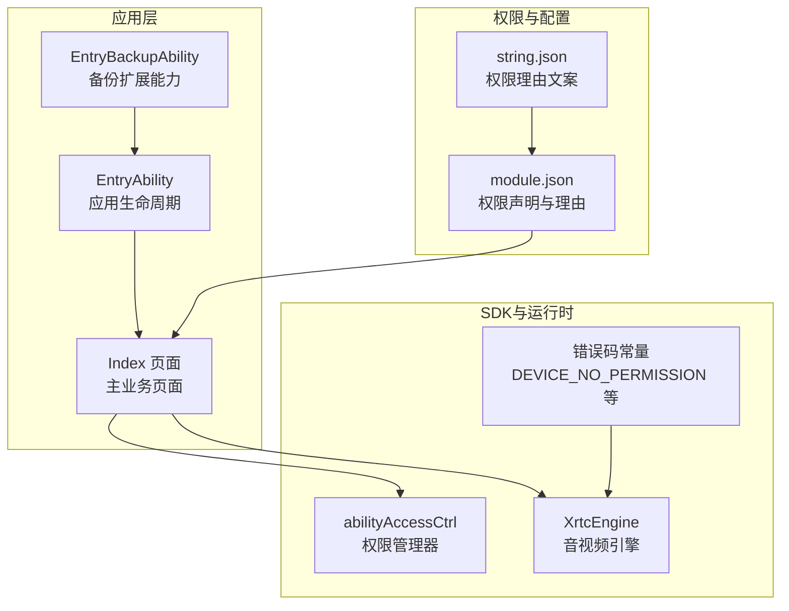
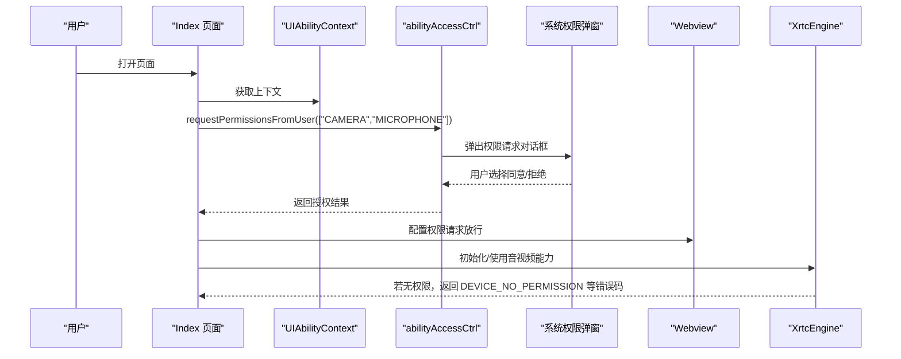
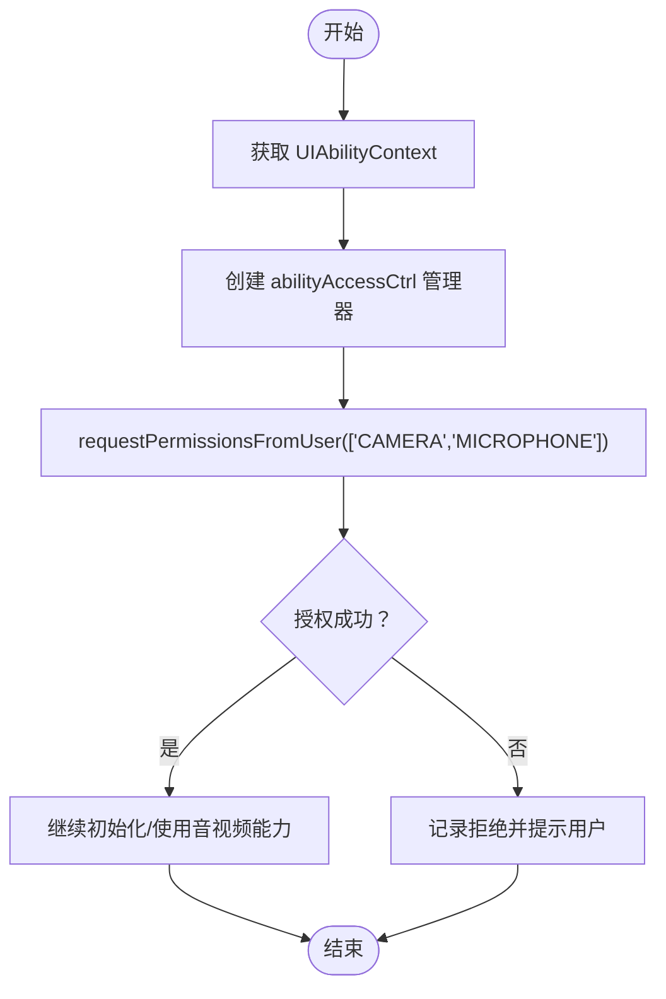
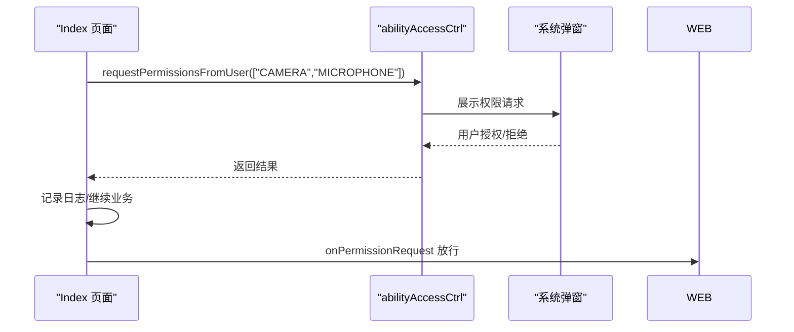
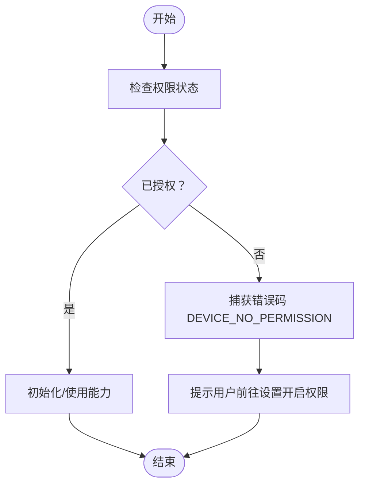
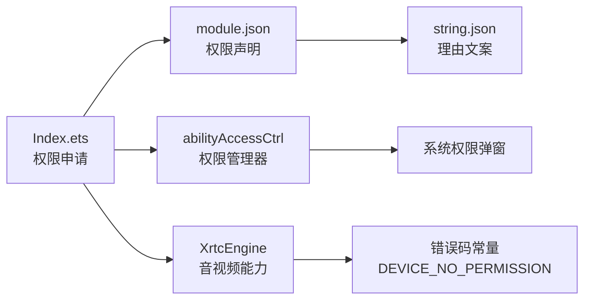

# 权限和安全

<cite>
**本文引用的文件**
- [EntryAbility.ets](file://entry/src/main/ets/entryability/EntryAbility.ets)
- [Index.ets](file://entry/src/main/ets/pages/Index.ets)
- [EntryBackupAbility.ets](file://entry/src/main/ets/entrybackupability/EntryBackupAbility.ets)
- [module.json](file://entry/.preview/default/intermediates/merge_profile/default/module.json)
- [string.json](file://entry/src/main/resources/base/element/string.json)
- [k.js](file://entry/.preview/default/cache/default/default@PreviewArkTS/esmodule/debug/oh_modules/.ohpm/@shengwang+rtc-full@k2lhsgd30+2sz3avg+cnkmtslio+sijudityon1rifu=/oh_modules/@shengwang/rtc-full/src/main/ets/a/k.js)
- [n1.js](file://entry/.preview/default/cache/default/default@PreviewArkTS/esmodule/debug/oh_modules/.ohpm/@shengwang+rtc-full@k2lhsgd30+2sz3avg+cnkmtslio+sijudityon1rifu=/oh_modules/@shengwang/rtc-full/src/main/ets/z/n1.js)
</cite>

## 目录
1. [简介](#简介)
2. [项目结构](#项目结构)
3. [核心组件](#核心组件)
4. [架构总览](#架构总览)
5. [详细组件分析](#详细组件分析)
6. [依赖关系分析](#依赖关系分析)
7. [性能考量](#性能考量)
8. [故障排查指南](#故障排查指南)
9. [结论](#结论)
10. [附录](#附录)

## 简介
本文件聚焦于本项目的权限与安全功能，系统性阐述以下内容：
- 设备权限申请流程：摄像头与麦克风权限的获取、权限状态检查、权限拒绝处理机制
- abilityAccessCtrl 权限管理器的使用：权限请求 API、权限状态查询、权限变更监听
- 应用安全考虑：数据保护、隐私处理、权限最小化原则
- 最佳实践与常见问题解决方案

## 项目结构
本项目采用 ArkTS + Webview 的混合架构，主页面通过 Webview 承载 H5 内容，同时在原生侧进行权限申请与媒体能力控制。权限相关的关键位置如下：
- 权限声明与理由：模块清单中集中声明 CAMERA、MICROPHONE、INTERNET、READ_MEDIA、WRITE_MEDIA 等权限及其使用场景与理由
- 权限申请入口：主页面在生命周期中发起权限请求
- 权限状态与错误处理：结合 SDK 常见错误码与权限状态常量进行处理
- 备份扩展能力：备份与恢复能力的实现

图表来源
- [module.json](file://entry/.preview/default/intermediates/merge_profile/default/module.json#L33-L76)
- [string.json](file://entry/src/main/resources/base/element/string.json#L16-L30)
- [Index.ets](file://entry/src/main/ets/pages/Index.ets#L238-L246)
- [k.js](file://entry/.preview/default/cache/default/default@PreviewArkTS/esmodule/debug/oh_modules/.ohpm/@shengwang+rtc-full@k2lhsgd30+2sz3avg+cnkmtslio+sijudityon1rifu=/oh_modules/@shengwang/rtc-full/src/main/ets/a/k.js#L244-L259)

章节来源
- [module.json](file://entry/.preview/default/intermediates/merge_profile/default/module.json#L1-L118)
- [string.json](file://entry/src/main/resources/base/element/string.json#L1-L32)
- [Index.ets](file://entry/src/main/ets/pages/Index.ets#L1-L1436)

## 核心组件
- abilityAccessCtrl 权限管理器：负责向用户请求 CAMERA 与 MICROPHONE 权限，返回授权状态并支持后续状态查询
- Index 页面：在页面出现时发起权限请求；在离开时清理资源；对 Webview 的权限请求进行统一放行
- EntryAbility：应用生命周期管理，提供全局上下文
- EntryBackupAbility：备份与恢复扩展能力
- 错误码常量：包含 DEVICE_NO_PERMISSION 等常量，用于识别设备无权限类错误

章节来源
- [Index.ets](file://entry/src/main/ets/pages/Index.ets#L238-L246)
- [EntryAbility.ets](file://entry/src/main/ets/entryability/EntryAbility.ets#L1-L65)
- [EntryBackupAbility.ets](file://entry/src/main/ets/entrybackupability/EntryBackupAbility.ets#L1-L16)
- [k.js](file://entry/.preview/default/cache/default/default@PreviewArkTS/esmodule/debug/oh_modules/.ohpm/@shengwang+rtc-full@k2lhsgd30+2sz3avg+cnkmtslio+sijudityon1rifu=/oh_modules/@shengwang/rtc-full/src/main/ets/a/k.js#L244-L259)

## 架构总览
下图展示了权限申请与处理的整体流程，以及与 Webview、引擎、权限管理器之间的交互。

图表来源
- [Index.ets](file://entry/src/main/ets/pages/Index.ets#L238-L246)
- [Index.ets](file://entry/src/main/ets/pages/Index.ets#L281-L283)
- [k.js](file://entry/.preview/default/cache/default/default@PreviewArkTS/esmodule/debug/oh_modules/.ohpm/@shengwang+rtc-full@k2lhsgd30+2sz3avg+cnkmtslio+sijudityon1rifu=/oh_modules/@shengwang/rtc-full/src/main/ets/a/k.js#L244-L259)

## 详细组件分析

### abilityAccessCtrl 权限管理器使用
- 权限请求 API
  - 在 Index 页面的生命周期中，通过 abilityAccessCtrl 的管理器实例发起权限请求，一次性申请 CAMERA 与 MICROPHONE
  - 请求成功或失败均记录日志，便于定位问题
- 权限状态查询
  - 通过 GrantStatus 常量判断授权状态，确保在使用摄像头/麦克风前进行状态校验
- 权限变更监听
  - 代码中未直接展示监听回调注册，建议在需要时通过能力扩展接口进行监听，以便在权限变化时动态调整 UI 或行为

图表来源
- [Index.ets](file://entry/src/main/ets/pages/Index.ets#L238-L246)

章节来源
- [Index.ets](file://entry/src/main/ets/pages/Index.ets#L238-L246)
- [n1.js](file://entry/.preview/default/cache/default/default@PreviewArkTS/esmodule/debug/oh_modules/.ohpm/@shengwang+rtc-full@k2lhsgd30+2sz3avg+cnkmtslio+sijudityon1rifu=/oh_modules/@shengwang/rtc-full/src/main/ets/z/n1.js#L71-L103)

### 设备权限申请流程（摄像头与麦克风）
- 申请时机：在 Index 页面 aboutToAppear 生命周期中发起
- 申请内容：一次性请求 CAMERA 与 MICROPHONE
- 成功/失败处理：成功打印完成信息，失败打印警告信息
- Webview 权限请求：对 Webview 的权限请求统一放行，避免阻断页面功能

图表来源
- [Index.ets](file://entry/src/main/ets/pages/Index.ets#L238-L246)
- [Index.ets](file://entry/src/main/ets/pages/Index.ets#L281-L283)

章节来源
- [Index.ets](file://entry/src/main/ets/pages/Index.ets#L238-L246)
- [Index.ets](file://entry/src/main/ets/pages/Index.ets#L281-L283)

### 权限状态检查与错误处理
- 状态检查：通过 GrantStatus 常量判断是否已授权
- 错误处理：当设备无权限时，SDK 返回 DEVICE_NO_PERMISSION 等错误码，应根据错误码进行提示与引导
- 业务影响：若无权限，音视频初始化或推流会失败，需在 UI 上提示用户前往设置开启权限

图表来源
- [n1.js](file://entry/.preview/default/cache/default/default@PreviewArkTS/esmodule/debug/oh_modules/.ohpm/@shengwang+rtc-full@k2lhsgd30+2sz3avg+cnkmtslio+sijudityon1rifu=/oh_modules/@shengwang/rtc-full/src/main/ets/z/n1.js#L71-L103)
- [k.js](file://entry/.preview/default/cache/default/default@PreviewArkTS/esmodule/debug/oh_modules/.ohpm/@shengwang+rtc-full@k2lhsgd30+2sz3avg+cnkmtslio+sijudityon1rifu=/oh_modules/@shengwang/rtc-full/src/main/ets/a/k.js#L244-L259)

章节来源
- [n1.js](file://entry/.preview/default/cache/default/default@PreviewArkTS/esmodule/debug/oh_modules/.ohpm/@shengwang+rtc-full@k2lhsgd30+2sz3avg+cnkmtslio+sijudityon1rifu=/oh_modules/@shengwang/rtc-full/src/main/ets/z/n1.js#L71-L103)
- [k.js](file://entry/.preview/default/cache/default/default@PreviewArkTS/esmodule/debug/oh_modules/.ohpm/@shengwang+rtc-full@k2lhsgd30+2sz3avg+cnkmtslio+sijudityon1rifu=/oh_modules/@shengwang/rtc-full/src/main/ets/a/k.js#L244-L259)

### Webview 权限与安全策略
- 权限请求放行：对 Webview 的权限请求统一授予，避免因权限阻断导致页面功能异常
- Cookie 与缓存：在退出/刷新场景中清理 Cookie、LocalStorage、SessionStorage 与缓存，降低敏感数据残留风险
- UA 与模式：设置合理的 UA 与混合内容模式，兼顾兼容性与安全性

章节来源
- [Index.ets](file://entry/src/main/ets/pages/Index.ets#L281-L283)
- [Index.ets](file://entry/src/main/ets/pages/Index.ets#L318-L336)

### 备份与恢复扩展能力
- 备份扩展 Ability：提供 onBackup 与 onRestore 生命周期钩子，便于在系统备份/恢复时进行状态同步
- 与权限无关，但属于应用整体安全与可靠性的一部分

章节来源
- [EntryBackupAbility.ets](file://entry/src/main/ets/entrybackupability/EntryBackupAbility.ets#L1-L16)

## 依赖关系分析
- 权限声明与理由：模块清单集中声明 CAMERA、MICROPHONE、INTERNET、READ_MEDIA、WRITE_MEDIA 等权限，并提供使用场景与理由文案
- 权限申请与使用：Index 页面在生命周期中申请权限，随后在业务中使用音视频能力
- 错误码与状态：SDK 提供 DEVICE_NO_PERMISSION 等错误码与 GrantStatus 常量，用于状态判断与错误处理

图表来源
- [module.json](file://entry/.preview/default/intermediates/merge_profile/default/module.json#L33-L76)
- [string.json](file://entry/src/main/resources/base/element/string.json#L16-L30)
- [Index.ets](file://entry/src/main/ets/pages/Index.ets#L238-L246)
- [k.js](file://entry/.preview/default/cache/default/default@PreviewArkTS/esmodule/debug/oh_modules/.ohpm/@shengwang+rtc-full@k2lhsgd30+2sz3avg+cnkmtslio+sijudityon1rifu=/oh_modules/@shengwang/rtc-full/src/main/ets/a/k.js#L244-L259)

章节来源
- [module.json](file://entry/.preview/default/intermediates/merge_profile/default/module.json#L1-L118)
- [string.json](file://entry/src/main/resources/base/element/string.json#L1-L32)
- [Index.ets](file://entry/src/main/ets/pages/Index.ets#L1-L1436)
- [k.js](file://entry/.preview/default/cache/default/default@PreviewArkTS/esmodule/debug/oh_modules/.ohpm/@shengwang+rtc-full@k2lhsgd30+2sz3avg+cnkmtslio+sijudityon1rifu=/oh_modules/@shengwang/rtc-full/src/main/ets/a/k.js#L244-L259)

## 性能考量
- 权限申请时机：在页面即将出现时发起，避免在后台频繁请求导致卡顿
- 资源清理：在页面消失或退出时及时清理音视频资源与 Webview 缓存，减少内存占用
- 错误快速反馈：对无权限类错误进行快速提示，避免无效重试

## 故障排查指南
- 权限被拒绝
  - 现象：申请返回失败或 SDK 抛出 DEVICE_NO_PERMISSION
  - 处理：引导用户前往系统设置开启权限；在 UI 上提供“去设置”按钮
- Webview 功能受限
  - 现象：页面无法正常加载或交互异常
  - 处理：确认 onPermissionRequest 已放行；清理 Cookie、LocalStorage、SessionStorage 与缓存后重试
- 引擎初始化失败
  - 现象：加入频道或推流失败
  - 处理：检查权限状态；确认已授权 CAMERA 与 MICROPHONE；必要时重启应用

章节来源
- [Index.ets](file://entry/src/main/ets/pages/Index.ets#L238-L246)
- [Index.ets](file://entry/src/main/ets/pages/Index.ets#L318-L336)
- [k.js](file://entry/.preview/default/cache/default/default@PreviewArkTS/esmodule/debug/oh_modules/.ohpm/@shengwang+rtc-full@k2lhsgd30+2sz3avg+cnkmtslio+sijudityon1rifu=/oh_modules/@shengwang/rtc-full/src/main/ets/a/k.js#L244-L259)

## 结论
本项目在权限与安全方面遵循“最小权限”原则，仅在必要时申请 CAMERA 与 MICROPHONE，并通过 abilityAccessCtrl 进行统一管理。配合模块清单中的权限声明与理由文案，以及 Webview 的权限放行与数据清理策略，形成较为完善的权限与安全闭环。建议在后续迭代中补充权限变更监听与更细粒度的权限提示，进一步提升用户体验与安全性。

## 附录
- 权限最小化原则：仅申请当前业务必需的权限，避免过度索取
- 隐私处理：在退出/刷新场景中清理敏感数据，降低泄露风险
- 用户引导：针对权限拒绝提供清晰的设置指引与二次尝试机制