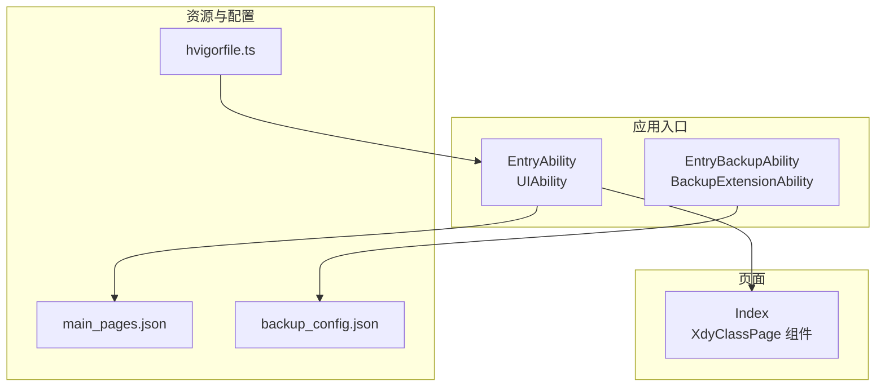
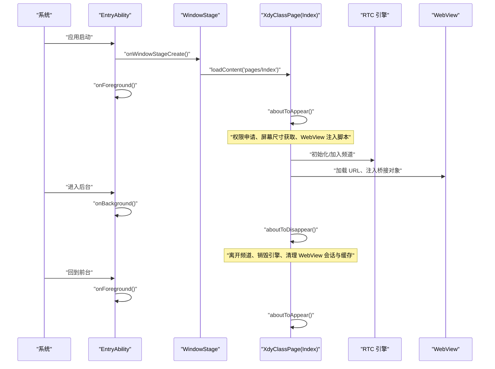
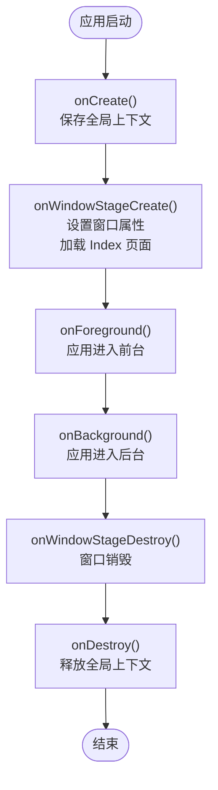
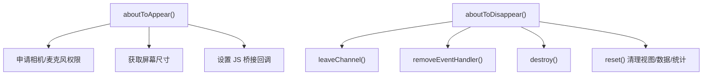
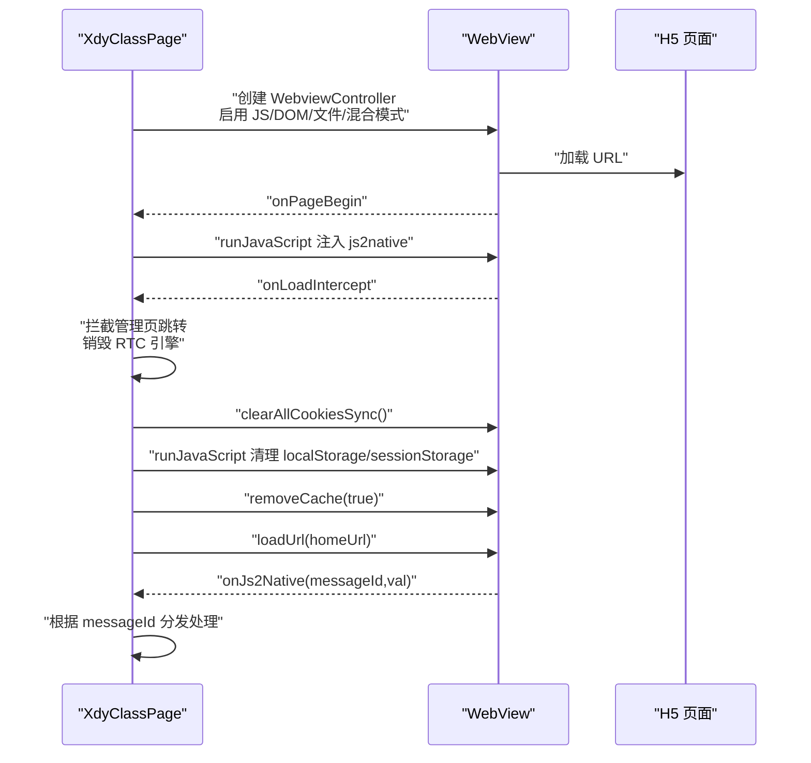
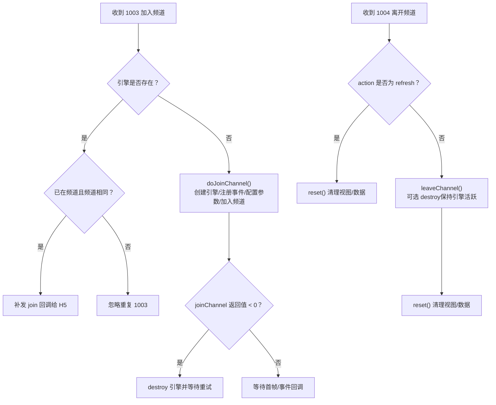

# 生命周期管理

<cite>
**本文引用的文件**
- [EntryAbility.ets](file://entry/src/main/ets/entryability/EntryAbility.ets)
- [Index.ets](file://entry/src/main/ets/pages/Index.ets)
- [EntryBackupAbility.ets](file://entry/src/main/ets/entrybackupability/EntryBackupAbility.ets)
- [main_pages.json](file://entry/src/main/resources/base/profile/main_pages.json)
- [backup_config.json](file://entry/src/main/resources/base/profile/backup_config.json)
- [hvigorfile.ts](file://hvigorfile.ts)
</cite>

## 目录
1. [简介](#简介)
2. [项目结构](#项目结构)
3. [核心组件](#核心组件)
4. [架构总览](#架构总览)
5. [详细组件分析](#详细组件分析)
6. [依赖关系分析](#依赖关系分析)
7. [性能考量](#性能考量)
8. [故障排查指南](#故障排查指南)
9. [结论](#结论)
10. [附录](#附录)

## 简介
本文件围绕应用与页面生命周期管理进行系统化梳理，重点覆盖以下方面：
- 应用启动、前台/后台切换、页面显示/隐藏等生命周期事件的处理机制
- EntryAbility 与 XdyClassPage 的生命周期钩子函数（如 aboutToAppear、aboutToDisappear 等）的职责与实现要点
- 资源清理策略：RTC 引擎销毁、WebView 清理、内存释放等
- 最佳实践：状态保存、资源回收、异常处理等

## 项目结构
该项目采用 ArkTS（ArkUI + TypeScript）开发，入口能力为 UIAbility，页面为自定义组件。核心文件如下：
- 应用入口能力：EntryAbility.ets
- 页面组件：Index.ets（包含主页面 XdyClassPage）
- 备份扩展能力：EntryBackupAbility.ets
- 页面清单：main_pages.json
- 备份配置：backup_config.json
- 构建配置：hvigorfile.ts



图表来源
- [EntryAbility.ets](file://entry/src/main/ets/entryability/EntryAbility.ets#L1-L65)
- [Index.ets](file://entry/src/main/ets/pages/Index.ets#L195-L220)
- [EntryBackupAbility.ets](file://entry/src/main/ets/entrybackupability/EntryBackupAbility.ets#L1-L16)
- [main_pages.json](file://entry/src/main/resources/base/profile/main_pages.json#L1-L6)
- [backup_config.json](file://entry/src/main/resources/base/profile/backup_config.json#L1-L3)
- [hvigorfile.ts](file://hvigorfile.ts#L1-L6)

章节来源
- [EntryAbility.ets](file://entry/src/main/ets/entryability/EntryAbility.ets#L1-L65)
- [Index.ets](file://entry/src/main/ets/pages/Index.ets#L195-L220)
- [EntryBackupAbility.ets](file://entry/src/main/ets/entrybackupability/EntryBackupAbility.ets#L1-L16)
- [main_pages.json](file://entry/src/main/resources/base/profile/main_pages.json#L1-L6)
- [backup_config.json](file://entry/src/main/resources/base/profile/backup_config.json#L1-L3)
- [hvigorfile.ts](file://hvigorfile.ts#L1-L6)

## 核心组件
- EntryAbility：负责应用生命周期（onCreate/onDestroy/onForeground/onBackground）、窗口阶段创建（onWindowStageCreate）以及页面内容加载（loadContent）。
- XdyClassPage（Index 页面）：承载主业务逻辑，包含 RTC 引擎管理、WebView 交互、视频浮层渲染、消息桥接与资源清理。
- EntryBackupAbility：备份与恢复扩展能力，用于应用数据备份与恢复流程。

章节来源
- [EntryAbility.ets](file://entry/src/main/ets/entryability/EntryAbility.ets#L14-L65)
- [Index.ets](file://entry/src/main/ets/pages/Index.ets#L195-L220)
- [EntryBackupAbility.ets](file://entry/src/main/ets/entrybackupability/EntryBackupAbility.ets#L6-L16)

## 架构总览
应用生命周期与页面生命周期协同工作：
- EntryAbility 在 onWindowStageCreate 中加载 Index 页面，并在 onForeground/onBackground 中响应应用前后台切换。
- Index 页面通过 aboutToAppear/aboutToDisappear 管理页面级资源（权限申请、RTC 初始化/销毁、WebView 注入脚本与清理）。
- EntryBackupAbility 提供备份/恢复能力，确保数据一致性。



图表来源
- [EntryAbility.ets](file://entry/src/main/ets/entryability/EntryAbility.ets#L31-L49)
- [EntryAbility.ets](file://entry/src/main/ets/entryability/EntryAbility.ets#L56-L64)
- [Index.ets](file://entry/src/main/ets/pages/Index.ets#L229-L247)
- [Index.ets](file://entry/src/main/ets/pages/Index.ets#L248-L255)

## 详细组件分析

### EntryAbility 生命周期与窗口阶段
- onCreate：保存全局上下文，设置颜色模式，记录日志。
- onWindowStageCreate：设置窗口方向、全屏、系统栏可见性；加载 Index 页面。
- onWindowStageDestroy：窗口销毁时记录日志（页面资源清理在页面层处理）。
- onForeground/onBackground：应用前后台切换时的日志记录。
- onDestroy：释放全局上下文，记录日志。



图表来源
- [EntryAbility.ets](file://entry/src/main/ets/entryability/EntryAbility.ets#L14-L65)

章节来源
- [EntryAbility.ets](file://entry/src/main/ets/entryability/EntryAbility.ets#L14-L65)

### XdyClassPage 生命周期钩子与资源管理
- aboutToAppear：权限申请（相机/麦克风）、屏幕尺寸获取、设置 JS 桥接回调。
- aboutToDisappear：离开频道、移除事件处理器、销毁 RTC 引擎，清理状态与视图。



图表来源
- [Index.ets](file://entry/src/main/ets/pages/Index.ets#L229-L247)
- [Index.ets](file://entry/src/main/ets/pages/Index.ets#L248-L255)

章节来源
- [Index.ets](file://entry/src/main/ets/pages/Index.ets#L229-L255)

### WebView 与 JS 桥接
- 页面构建时创建 WebviewController，启用 JavaScript、DOM Storage、文件访问、混合模式等。
- 注入全局 js2native 函数，桥接到 xdyAndroid._js2native。
- onLoadIntercept 拦截特定域名跳转，销毁 RTC 引擎、清理 Cookie/LocalStorage/Cache 并重载登录页。
- onJs2Native 分发消息类型（如 refresh/quit/1000-1052），驱动页面行为。



图表来源
- [Index.ets](file://entry/src/main/ets/pages/Index.ets#L257-L360)
- [Index.ets](file://entry/src/main/ets/pages/Index.ets#L284-L340)
- [Index.ets](file://entry/src/main/ets/pages/Index.ets#L363-L424)

章节来源
- [Index.ets](file://entry/src/main/ets/pages/Index.ets#L257-L360)
- [Index.ets](file://entry/src/main/ets/pages/Index.ets#L284-L340)
- [Index.ets](file://entry/src/main/ets/pages/Index.ets#L363-L424)

### RTC 引擎生命周期与状态机
- doJoinChannel：根据 SDK 类型选择引擎类型，配置音频场景、视频编码参数，创建引擎并注册事件处理器，最后 joinChannel。
- handleJoinChannel：处理 H5 发送的加入频道消息，避免重复加入与刷新场景下的异常。
- handleLeaveChannel：处理退出/刷新场景，控制是否销毁引擎与 leaveChannel。
- reset：停止本地推流、解除视频绑定、清空视图数组与数据，确保资源回收。
- 推流绑定 pushStream/cancelStream：根据用户角色与视图槽位进行绑定/解绑，支持本地/远端视频渲染。



图表来源
- [Index.ets](file://entry/src/main/ets/pages/Index.ets#L536-L581)
- [Index.ets](file://entry/src/main/ets/pages/Index.ets#L924-L985)
- [Index.ets](file://entry/src/main/ets/pages/Index.ets#L583-L649)

章节来源
- [Index.ets](file://entry/src/main/ets/pages/Index.ets#L536-L581)
- [Index.ets](file://entry/src/main/ets/pages/Index.ets#L924-L985)
- [Index.ets](file://entry/src/main/ets/pages/Index.ets#L583-L649)

### 备份与恢复扩展
- EntryBackupAbility 提供 onBackup/onRestore 生命周期方法，便于在备份/恢复过程中进行状态同步与资源准备。

章节来源
- [EntryBackupAbility.ets](file://entry/src/main/ets/entrybackupability/EntryBackupAbility.ets#L6-L16)

## 依赖关系分析
- EntryAbility 依赖 WindowStage 进行窗口配置与页面加载。
- Index 页面依赖 WebView、RTC 引擎、权限管理模块与 display 模块。
- 页面与 H5 通过 JS 桥接通信，消息类型覆盖加载、用户视图、用户列表、加入/离开频道、推流/取消推流、音视频控制、设备信息等。

```mermaid
graph LR
EA["EntryAbility"] --> WS["WindowStage"]
WS --> IDX["XdyClassPage(Index)"]
IDX --> WV["WebView"]
IDX --> RTC["RTC 引擎"]
IDX --> Perm["权限管理"]
IDX --> Disp["display"]
WV <- --> JS["H5 页面"]
```

图表来源
- [EntryAbility.ets](file://entry/src/main/ets/entryability/EntryAbility.ets#L31-L49)
- [Index.ets](file://entry/src/main/ets/pages/Index.ets#L1-L10)
- [Index.ets](file://entry/src/main/ets/pages/Index.ets#L257-L360)

章节来源
- [EntryAbility.ets](file://entry/src/main/ets/entryability/EntryAbility.ets#L31-L49)
- [Index.ets](file://entry/src/main/ets/pages/Index.ets#L1-L10)
- [Index.ets](file://entry/src/main/ets/pages/Index.ets#L257-L360)

## 性能考量
- 页面显示/隐藏时的资源回收：在 aboutToDisappear 中及时销毁 RTC 引擎与清理 WebView 缓存，避免后台占用。
- 引擎复用策略：在退出场景不销毁引擎，复用以减少初始化开销；刷新场景仅 reset，避免重复创建。
- WebView 清理：在拦截跳转与退出时统一清理 Cookie、LocalStorage、SessionStorage 与缓存，降低内存压力。
- 事件处理：移除事件处理器后再销毁引擎，防止回调持有失效引用导致内存泄漏。

[本节为通用性能建议，无需列出具体文件来源]

## 故障排查指南
- 页面无法显示/白屏
  - 检查 onWindowStageCreate 中 loadContent 是否成功，查看日志输出。
  - 确认 Index 页面构建逻辑与 WebView 加载顺序。
- 权限申请失败
  - 检查 aboutToAppear 中权限请求流程与异常捕获。
- RTC 加入失败
  - 查看 joinChannel 返回值与错误日志；必要时销毁引擎后重试。
- 退出/刷新异常
  - 确认 isOut/isRefreshing 标志位与 reset 流程；检查是否正确调用 leaveChannel 与清理 WebView。
- WebView 跳转异常
  - 检查 onLoadIntercept 拦截逻辑与重载登录页流程。

章节来源
- [EntryAbility.ets](file://entry/src/main/ets/entryability/EntryAbility.ets#L31-L49)
- [Index.ets](file://entry/src/main/ets/pages/Index.ets#L229-L247)
- [Index.ets](file://entry/src/main/ets/pages/Index.ets#L536-L581)
- [Index.ets](file://entry/src/main/ets/pages/Index.ets#L583-L649)
- [Index.ets](file://entry/src/main/ets/pages/Index.ets#L284-L340)

## 结论
本项目通过 EntryAbility 与 XdyClassPage 的协作，实现了从应用启动、前后台切换到页面显示/隐藏的完整生命周期管理。页面层在 aboutToAppear/aboutToDisappear 中承担了关键的资源初始化与清理职责，结合 WebView 与 RTC 引擎的状态机设计，形成了稳定可靠的课堂场景运行时。建议在后续迭代中进一步完善异常监控与日志分级，确保在复杂场景下的可维护性与稳定性。

[本节为总结性内容，无需列出具体文件来源]

## 附录

### 生命周期钩子与职责对照
- EntryAbility
  - onCreate：保存全局上下文、设置颜色模式
  - onWindowStageCreate：窗口配置、加载首页
  - onForeground/onBackground：应用前后台切换
  - onDestroy：释放全局上下文
- XdyClassPage
  - aboutToAppear：权限申请、屏幕尺寸、JS 桥接
  - aboutToDisappear：离开频道、销毁引擎、清理 WebView 与状态

章节来源
- [EntryAbility.ets](file://entry/src/main/ets/entryability/EntryAbility.ets#L14-L65)
- [Index.ets](file://entry/src/main/ets/pages/Index.ets#L229-L255)

### 资源清理清单
- RTC 引擎：leaveChannel、removeEventHandler、destroy（按场景决定是否销毁）
- WebView：clearAllCookiesSync、runJavaScript 清理存储、removeCache、loadUrl
- 页面状态：reset 清空视图数组、统计数据、成员与模型映射

章节来源
- [Index.ets](file://entry/src/main/ets/pages/Index.ets#L248-L255)
- [Index.ets](file://entry/src/main/ets/pages/Index.ets#L306-L316)
- [Index.ets](file://entry/src/main/ets/pages/Index.ets#L377-L394)
- [Index.ets](file://entry/src/main/ets/pages/Index.ets#L617-L639)
- [Index.ets](file://entry/src/main/ets/pages/Index.ets#L651-L693)