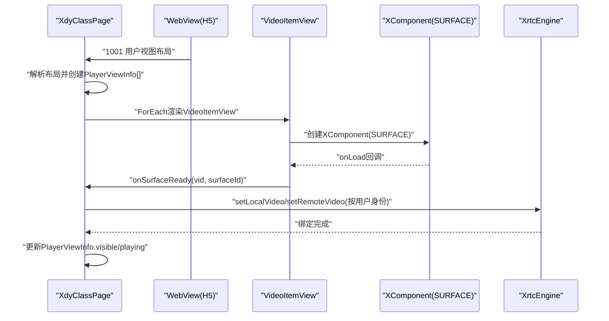
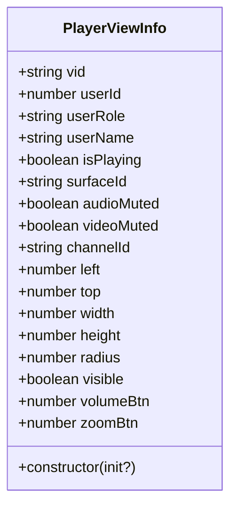
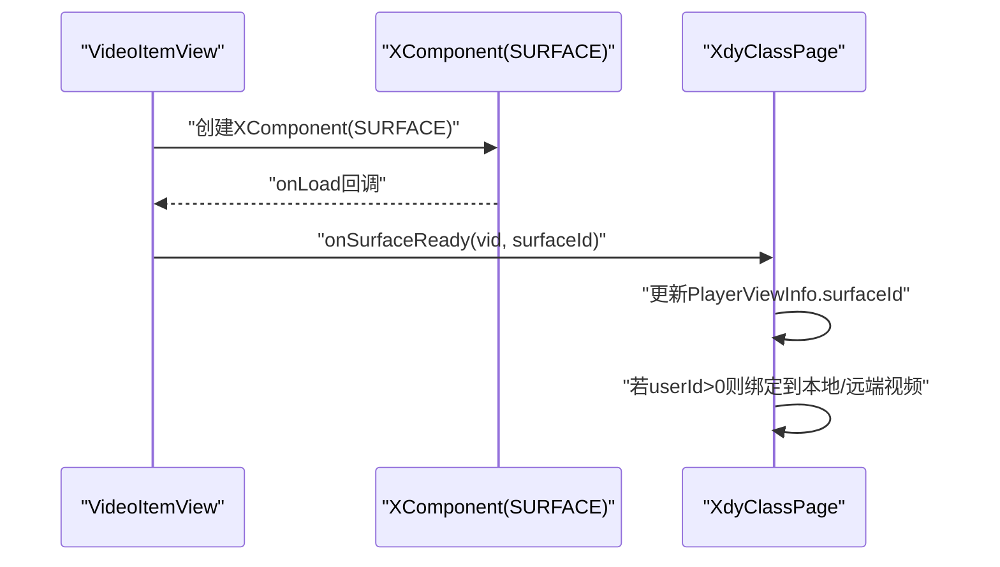
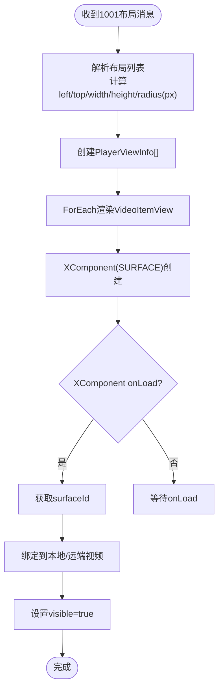
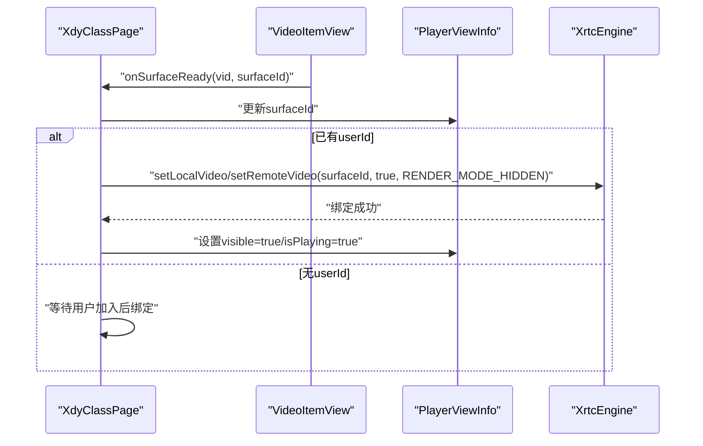
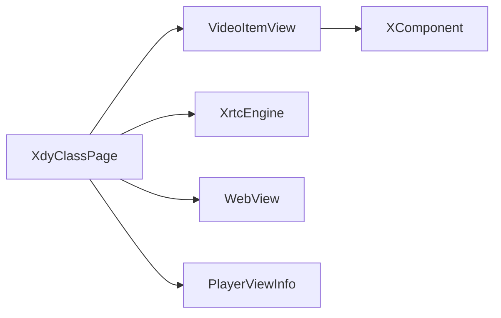

# 视频渲染系统

<cite>
**本文引用的文件**
- [Index.ets](file://entry/src/main/ets/pages/Index.ets)
- [index.d.ts](file://package/src/main/cpp/types/libagora_rtc_sdk/index.d.ts)
</cite>

## 目录
1. [简介](#简介)
2. [项目结构](#项目结构)
3. [核心组件](#核心组件)
4. [架构总览](#架构总览)
5. [详细组件分析](#详细组件分析)
6. [依赖关系分析](#依赖关系分析)
7. [性能考虑](#性能考虑)
8. [故障排查指南](#故障排查指南)
9. [结论](#结论)
10. [附录](#附录)

## 简介
本文件面向HarmonyOS端的视频渲染系统，聚焦于XComponent视频渲染组件的使用与实现，涵盖以下主题：
- PlayerViewInfo数据模型的设计与字段语义
- VideoItemView组件的构建、绑定与解绑流程
- 视频视图的创建、布局管理与层级控制
- surfaceId的获取与管理机制
- 透明穿透处理与响应式布局适配
- 性能优化建议（视图复用、内存管理、渲染效率）

该系统采用ArkTS + XComponent + Agora RTC SDK的组合，将H5课堂内容与视频画面叠加显示，通过XComponent承载视频渲染，实现“视频浮层”覆盖在WebView之上的效果。

## 项目结构
本项目采用“页面级组件 + 组件内嵌套”的组织方式，视频渲染相关的核心位于页面入口文件中：
- 页面主组件：XdyClassPage
- 视频项组件：VideoItemView
- 数据模型：PlayerViewInfo
- 渲染载体：XComponent(SURFACE)
- 通信桥接：WebView与原生的JS桥接

```mermaid
graph TB
subgraph "页面层"
XdyClassPage["XdyClassPage<br/>主页面组件"]
WebView["WebView<br/>课堂内容"]
VideoLayer["视频浮层<br/>Stack + ForEach"]
end
subgraph "视频项层"
VideoItemView["VideoItemView<br/>单个视频项"]
XComp["XComponent(SURFACE)<br/>承载渲染"]
end
subgraph "数据层"
PlayerViewInfo["PlayerViewInfo<br/>视图数据模型"]
end
subgraph "SDK层"
Agora["@av/xrtc<br/>XrtcEngine"]
end
XdyClassPage --> WebView
XdyClassPage --> VideoLayer
VideoLayer --> VideoItemView
VideoItemView --> XComp
XdyClassPage --> Agora
PlayerViewInfo -.-> VideoItemView
```

图表来源
- [Index.ets](file://entry/src/main/ets/pages/Index.ets#L195-L360)
- [Index.ets](file://entry/src/main/ets/pages/Index.ets#L153-L192)

章节来源
- [Index.ets](file://entry/src/main/ets/pages/Index.ets#L195-L360)

## 核心组件
- PlayerViewInfo：视频视图的数据模型，包含位置、尺寸、圆角、可见性、角色、用户信息、音视频静音状态、通道ID、surfaceId等字段，用于驱动VideoItemView的渲染与绑定。
- VideoItemView：单个视频项的UI组件，内部包含XComponent(SURFACE)，负责在指定位置绘制视频画面，并根据visible控制透明度与层级。
- XdyClassPage：页面主组件，负责：
  - 从H5消息解析布局与成员信息
  - 创建/更新PlayerViewInfo数组
  - 通过XComponent的onLoad回调获取surfaceId
  - 将surfaceId绑定到本地或远端用户
  - 管理生命周期内的推流/取消推流与资源释放

章节来源
- [Index.ets](file://entry/src/main/ets/pages/Index.ets#L26-L66)
- [Index.ets](file://entry/src/main/ets/pages/Index.ets#L153-L192)
- [Index.ets](file://entry/src/main/ets/pages/Index.ets#L195-L360)

## 架构总览
系统采用“页面容器 + 视频浮层 + 视频项 + XComponent”的分层架构：
- 页面容器承载WebView与视频浮层
- 视频浮层通过Stack叠加在WebView之上，使用透明穿透策略，确保点击事件透传至WebView
- 视频项组件基于PlayerViewInfo进行渲染，每个视频项拥有独立的XComponent(SURFACE)
- 页面主组件负责从H5消息中解析布局，创建PlayerViewInfo数组；当XComponent加载完成后，通过onLoad回调获取surfaceId并绑定到对应用户

图表来源
- [Index.ets](file://entry/src/main/ets/pages/Index.ets#L344-L360)
- [Index.ets](file://entry/src/main/ets/pages/Index.ets#L153-L192)
- [Index.ets](file://entry/src/main/ets/pages/Index.ets#L1410-L1430)
- [Index.ets](file://entry/src/main/ets/pages/Index.ets#L1004-L1137)

章节来源
- [Index.ets](file://entry/src/main/ets/pages/Index.ets#L344-L360)
- [Index.ets](file://entry/src/main/ets/pages/Index.ets#L153-L192)
- [Index.ets](file://entry/src/main/ets/pages/Index.ets#L1410-L1430)
- [Index.ets](file://entry/src/main/ets/pages/Index.ets#L1004-L1137)

## 详细组件分析

### PlayerViewInfo 数据模型
- 字段含义
  - vid：视频项唯一标识
  - userId/userRole/userName：用户身份与角色、用户名
  - isPlaying：是否正在播放（绑定完成）
  - surfaceId：XComponent的surfaceId，用于绑定到本地或远端视频
  - audioMuted/videoMuted：音视频静音状态
  - channelId：频道ID
  - left/top/width/height/radius：布局参数（px）
  - visible：是否可见（影响透明度与层级）
  - volumeBtn/zoomBtn：UI按钮状态（用于H5交互）
- 初始化与构造
  - 提供Partial初始化，便于从H5布局消息快速填充

图表来源
- [Index.ets](file://entry/src/main/ets/pages/Index.ets#L26-L66)

章节来源
- [Index.ets](file://entry/src/main/ets/pages/Index.ets#L26-L66)

### VideoItemView 组件实现
- 组成
  - XComponent(SURFACE)：承载视频渲染
  - 文本标签：显示用户名（可选）
- 关键行为
  - onLoad回调中获取XComponent的surfaceId并回传给父组件
  - 根据visible控制opacity与zIndex，实现透明穿透与层级管理
  - 根据radius、position、width/height进行裁剪与定位
- 与PlayerViewInfo的关系
  - 通过@ObjectLink双向绑定，随PlayerViewInfo变化自动更新

图表来源
- [Index.ets](file://entry/src/main/ets/pages/Index.ets#L153-L192)
- [Index.ets](file://entry/src/main/ets/pages/Index.ets#L1410-L1430)

章节来源
- [Index.ets](file://entry/src/main/ets/pages/Index.ets#L153-L192)
- [Index.ets](file://entry/src/main/ets/pages/Index.ets#L1410-L1430)

### 视频视图创建与布局管理
- 创建流程
  - H5发送“1001 用户视图布局”消息
  - 页面解析布局列表，按百分比转换为px，生成PlayerViewInfo[]
  - 通过ForEach渲染VideoItemView，每个VideoItemView内部创建XComponent(SURFACE)
- 布局适配
  - 屏幕宽度通过display获取，布局百分比转换为px
  - 圆角、位置、尺寸均以px为单位，支持响应式布局
- 透明穿透
  - 视频浮层Stack设置HitTestMode.Transparent，使点击事件透传给WebView
  - 通过visible控制opacity，空闲槽位以透明隐藏

图表来源
- [Index.ets](file://entry/src/main/ets/pages/Index.ets#L434-L481)
- [Index.ets](file://entry/src/main/ets/pages/Index.ets#L344-L360)
- [Index.ets](file://entry/src/main/ets/pages/Index.ets#L153-L192)

章节来源
- [Index.ets](file://entry/src/main/ets/pages/Index.ets#L434-L481)
- [Index.ets](file://entry/src/main/ets/pages/Index.ets#L344-L360)
- [Index.ets](file://entry/src/main/ets/pages/Index.ets#L153-L192)

### surfaceId 的获取与管理机制
- 获取时机
  - VideoItemView在XComponent.onLoad回调中调用getXComponentSurfaceId获取surfaceId
  - 页面主组件通过onSurfaceReady接收surfaceId并写入对应的PlayerViewInfo
- 绑定策略
  - pushStream优先匹配精确角色的空闲视图；若无则尝试兼容角色（如normal可绑定到showstage）
  - 若视图surfaceId尚未就绪，则先记录userId等待绑定
  - 绑定时根据用户身份选择setLocalVideo或setRemoteVideo，并设置RenderMode.RENDER_MODE_HIDDEN
- 解绑与复用
  - reset时解除所有视频绑定并清空playerViews数组，触发ForEach重新创建，从而重新获取surfaceId
  - 取消推流时将visible=false，恢复透明穿透

图表来源
- [Index.ets](file://entry/src/main/ets/pages/Index.ets#L1410-L1430)
- [Index.ets](file://entry/src/main/ets/pages/Index.ets#L1004-L1137)
- [Index.ets](file://entry/src/main/ets/pages/Index.ets#L651-L693)

章节来源
- [Index.ets](file://entry/src/main/ets/pages/Index.ets#L1410-L1430)
- [Index.ets](file://entry/src/main/ets/pages/Index.ets#L1004-L1137)
- [Index.ets](file://entry/src/main/ets/pages/Index.ets#L651-L693)

### 层级控制与透明穿透
- 层级
  - WebView为底层，视频浮层Stack置于顶层（zIndex=10）
  - VideoItemView根据visible决定zIndex与opacity，空闲槽位透明且层级较低
- 透明穿透
  - 视频浮层Stack设置HitTestMode.Transparent，确保点击事件透传给WebView
  - 仅在visible为true时提升zIndex与opacity，避免遮挡WebView交互

章节来源
- [Index.ets](file://entry/src/main/ets/pages/Index.ets#L344-L360)
- [Index.ets](file://entry/src/main/ets/pages/Index.ets#L183-L191)

### 响应式布局适配
- 屏幕尺寸获取
  - 通过display.getDefaultDisplaySync获取屏幕宽高，按最大值作为基准计算布局
- 百分比到px的转换
  - 布局消息中的百分比按屏幕基准转换为px，确保不同设备上布局一致
- 动态刷新
  - handleRefresh仅清空视图数组与数据，不销毁引擎，复用引擎直接重新绑定

章节来源
- [Index.ets](file://entry/src/main/ets/pages/Index.ets#L229-L247)
- [Index.ets](file://entry/src/main/ets/pages/Index.ets#L434-L481)
- [Index.ets](file://entry/src/main/ets/pages/Index.ets#L695-L715)

## 依赖关系分析
- 组件耦合
  - XdyClassPage与VideoItemView通过@ObjectLink与回调建立松耦合
  - VideoItemView与XComponent强耦合，依赖onLoad回调获取surfaceId
- 外部依赖
  - @av/xrtc：XrtcEngine、UserParam、RenderMode等
  - @ohos.web.webview：WebView控制器
  - @ohos.display：屏幕信息
- 数据依赖
  - PlayerViewInfo作为数据源驱动VideoItemView渲染
  - H5消息驱动PlayerViewInfo数组的创建与更新

图表来源
- [Index.ets](file://entry/src/main/ets/pages/Index.ets#L195-L360)
- [Index.ets](file://entry/src/main/ets/pages/Index.ets#L153-L192)

章节来源
- [Index.ets](file://entry/src/main/ets/pages/Index.ets#L195-L360)
- [Index.ets](file://entry/src/main/ets/pages/Index.ets#L153-L192)

## 性能考虑
- 视图复用
  - 复用XComponent(SURFACE)：通过clear playerViews数组触发ForEach重建，重新获取surfaceId，避免频繁销毁/重建引擎
  - 复用XrtcEngine：刷新场景不销毁引擎，减少初始化开销
- 内存管理
  - reset时解除所有视频绑定并清空数组，避免残留引用
  - 退出课堂时仅leaveChannel不destroy，复用引擎避免重复初始化
- 渲染效率
  - RenderMode.RENDER_MODE_HIDDEN：隐藏模式下不进行额外渲染，降低GPU压力
  - 透明穿透：仅在可见时提升zIndex与opacity，减少不必要的绘制
- 事件与回调
  - 通过onSurfaceReady与onLoad回调异步获取surfaceId，避免阻塞主线程
  - 统一通过native2Js回调H5，减少跨层调用次数

章节来源
- [Index.ets](file://entry/src/main/ets/pages/Index.ets#L651-L693)
- [Index.ets](file://entry/src/main/ets/pages/Index.ets#L1410-L1430)
- [Index.ets](file://entry/src/main/ets/pages/Index.ets#L1004-L1137)
- [Index.ets](file://entry/src/main/ets/pages/Index.ets#L924-L985)

## 故障排查指南
- surfaceId为空
  - 检查XComponent是否成功onLoad，确认onSurfaceReady回调是否触发
  - 确认pushStream时是否等待surfaceId就绪后再绑定
- 视频不显示
  - 检查PlayerViewInfo.visible与zIndex是否正确
  - 确认RenderMode是否为RENDER_MODE_HIDDEN
- 点击无响应
  - 检查视频浮层Stack的HitTestMode是否为Transparent
  - 确认visible为true时zIndex与opacity是否提升
- 推流/取消推流异常
  - 检查XrtcEngine状态与用户身份（本地/远端）
  - 确认muteLocalVideoStream/muteLocalAudioStream与enableLocalVideo/enableLocalAudio的调用顺序

章节来源
- [Index.ets](file://entry/src/main/ets/pages/Index.ets#L1410-L1430)
- [Index.ets](file://entry/src/main/ets/pages/Index.ets#L1004-L1137)
- [Index.ets](file://entry/src/main/ets/pages/Index.ets#L344-L360)

## 结论
本视频渲染系统通过XComponent(SURFACE)承载视频渲染，结合PlayerViewInfo数据模型与VideoItemView组件，实现了稳定的视频浮层叠加与透明穿透。系统在性能方面采用视图复用、内存清理与隐藏渲染模式等策略，在功能方面支持响应式布局与动态刷新。建议在实际部署中关注surfaceId获取时机、角色匹配与渲染模式的选择，以获得更佳的用户体验与稳定性。

## 附录
- 关键API参考（来自SDK类型声明）
  - joinChannel、leaveChannel、enableLocalVideo、enableLocalAudio、setLocalVideo、setRemoteVideo、muteLocalVideoStream、muteLocalAudioStream、setLocalRenderMode、setRemoteRenderMode、adjustPlaybackVolume、switchCamera、setAudioProfileScenario、configVideoEncoder等

章节来源
- [index.d.ts](file://package/src/main/cpp/types/libagora_rtc_sdk/index.d.ts#L1-L298)