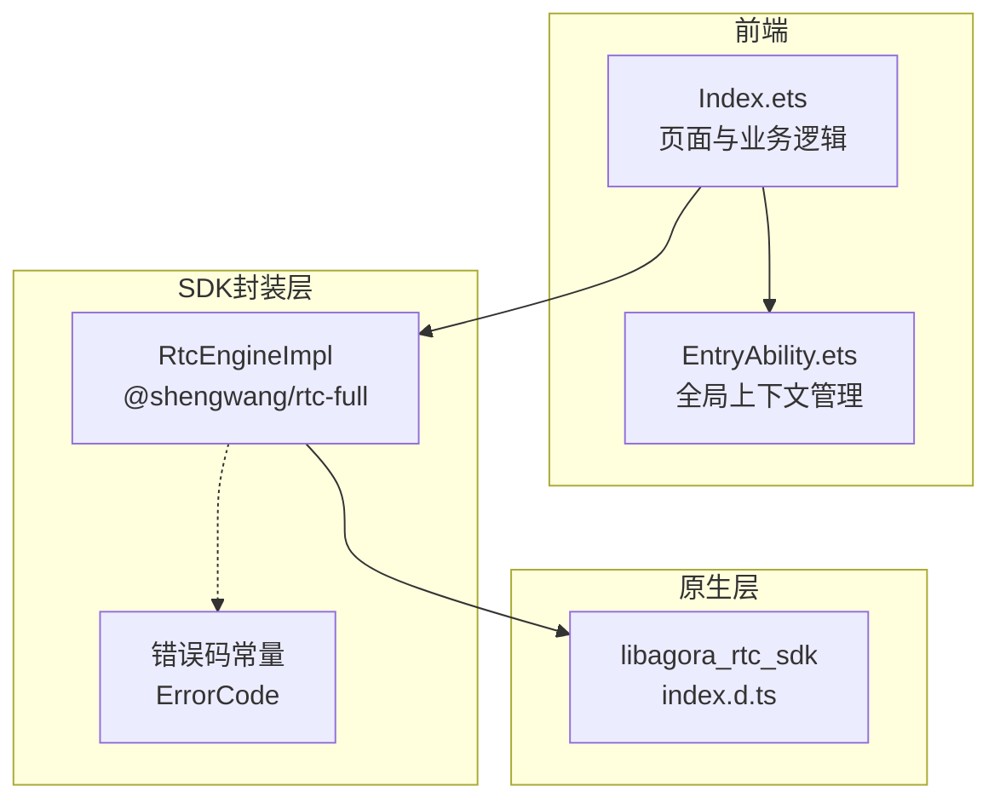
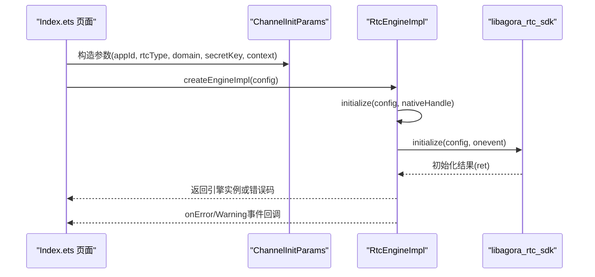
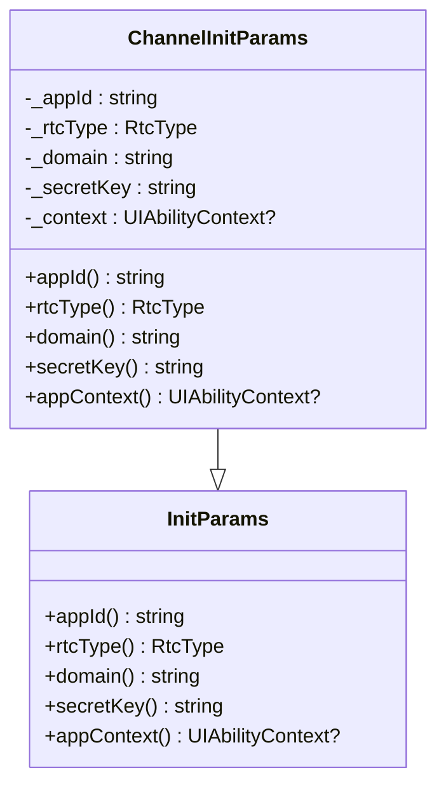
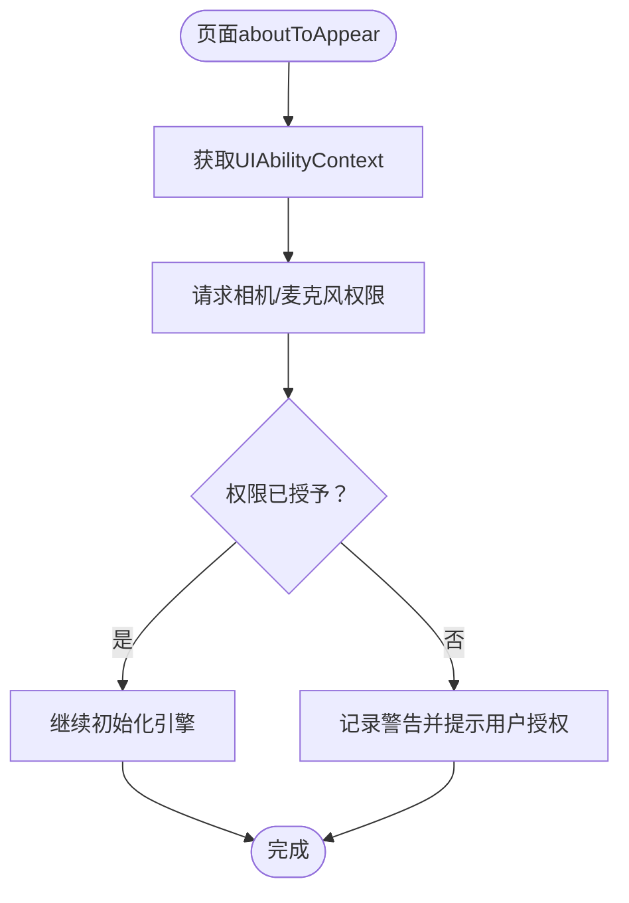
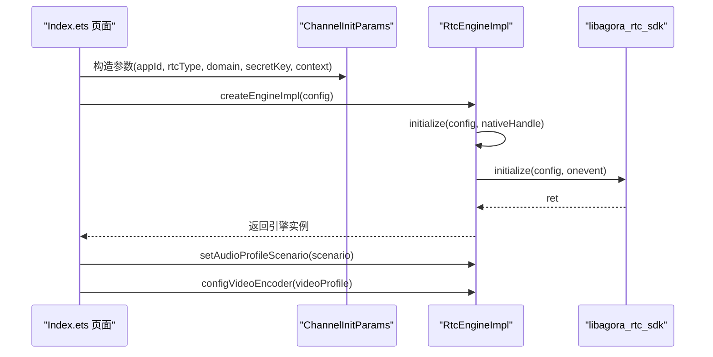
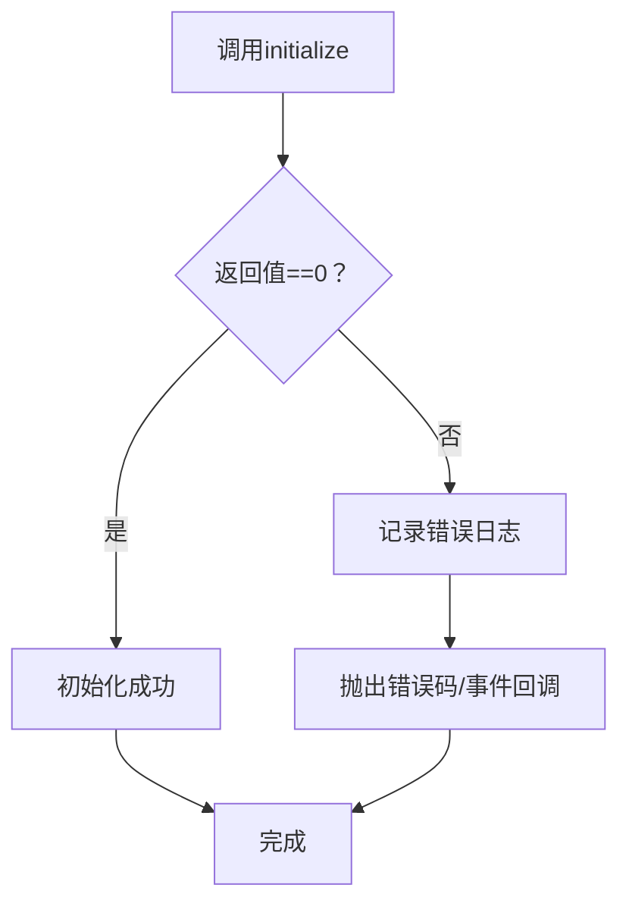
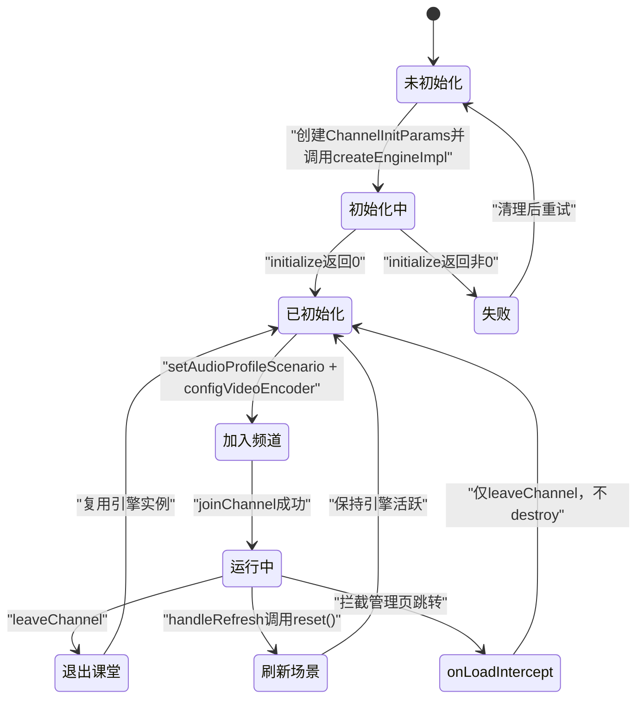
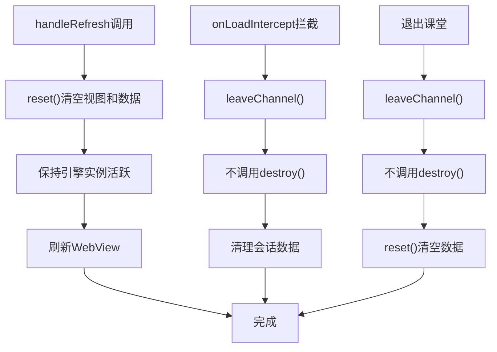
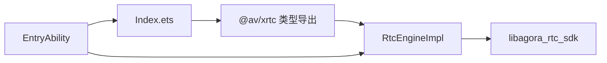

# RTC引擎初始化

<cite>
**本文档引用的文件**
- [Index.ets](file://entry/src/main/ets/pages/Index.ets)
- [EntryAbility.ets](file://entry/src/main/ets/entryability/EntryAbility.ets)
- [b.js](file://entry/.preview/default/cache/default/default@PreviewArkTS/esmodule/debug/oh_modules/.ohpm/@shengwang+rtc-full@k2lhsgd30+2sz3avg+cnkmtslio+sijudityon1rifu=/oh_modules/@shengwang/rtc-full/src/main/ets/a/b.js)
- [k.js](file://entry/.preview/default/cache/default/default@PreviewArkTS/esmodule/debug/oh_modules/.ohpm/@shengwang+rtc-full@k2lhsgd30+2sz3avg+cnkmtslio+sijudityon1rifu=/oh_modules/@shengwang/rtc-full/src/main/ets/a/k.js)
- [index.d.ts](file://package/src/main/cpp/types/libagora_rtc_sdk/index.d.ts)
</cite>

## 更新摘要
**变更内容**
- 更新了引擎生命周期管理策略，重点改进HarmonyOS平台上的引擎复用机制
- 新增了onLoadIntercept场景下的引擎保持策略，避免完全销毁导致的初始化失败(-7)
- 完善了刷新场景的处理逻辑，确保引擎活跃状态维持
- 增强了退出课堂时的引擎管理策略，仅leaveChannel不destroy

## 目录
1. [引言](#引言)
2. [项目结构](#项目结构)
3. [核心组件](#核心组件)
4. [架构总览](#架构总览)
5. [详细组件分析](#详细组件分析)
6. [依赖关系分析](#依赖关系分析)
7. [性能考虑](#性能考虑)
8. [故障排查指南](#故障排查指南)
9. [结论](#结论)

## 引言
本文件聚焦于HarmonyOS项目中RTC引擎的初始化流程，围绕XrtcEngine的创建过程展开，详细解释InitParams配置类的实现、应用ID、域名、密钥等参数设置，以及引擎上下文注入、权限检查与初始化流程。同时说明ChannelInitParams类如何继承InitParams并提供具体实现方法；解释引擎初始化失败的处理机制与错误码含义；最后给出引擎生命周期管理的最佳实践，包括初始化时机、资源分配与内存管理。

**更新** 本版本重点反映了HarmonyOS平台特有的引擎生命周期管理改进，特别是避免完全销毁引擎以防止初始化失败的策略。

## 项目结构
本项目采用ArkTS前端与原生SDK结合的方式实现RTC功能。前端通过Index.ets控制页面逻辑与引擎生命周期，底层通过@shengwang/rtc-full包提供的RtcEngineImpl封装与libagora_rtc_sdk进行交互。

**图表来源**
- [Index.ets:114-132](file://entry/src/main/ets/pages/Index.ets#L114-L132)
- [EntryAbility.ets:10-12](file://entry/src/main/ets/entryability/EntryAbility.ets#L10-L12)
- [b.js:348-359](file://entry/.preview/default/cache/default/default@PreviewArkTS/esmodule/debug/oh_modules/.ohpm/@shengwang+rtc-full@k2lhsgd30+2sz3avg+cnkmtslio+sijudityon1rifu=/oh_modules/@shengwang/rtc-full/src/main/ets/a/b.js#L348-L359)
- [k.js:80-147](file://entry/.preview/default/cache/default/default@PreviewArkTS/esmodule/debug/oh_modules/.ohpm/@shengwang+rtc-full@k2lhsgd30+2sz3avg+cnkmtslio+sijudityon1rifu=/oh_modules/@shengwang/rtc-full/src/main/ets/a/k.js#L80-L147)
- [index.d.ts:1-19](file://package/src/main/cpp/types/libagora_rtc_sdk/index.d.ts#L1-L19)

**章节来源**
- [Index.ets:114-132](file://entry/src/main/ets/pages/Index.ets#L114-L132)
- [EntryAbility.ets:10-12](file://entry/src/main/ets/entryability/EntryAbility.ets#L10-L12)
- [b.js:348-359](file://entry/.preview/default/cache/default/default@PreviewArkTS/esmodule/debug/oh_modules/.ohpm/@shengwang+rtc-full@k2lhsgd30+2sz3avg+cnkmtslio+sijudityon1rifu=/oh_modules/@shengwang/rtc-full/src/main/ets/a/b.js#L348-L359)

## 核心组件
- InitParams配置基类：定义引擎初始化所需的核心参数抽象，包括应用ID、RTC类型、域名、密钥与应用上下文等。
- ChannelInitParams：InitParams的具体实现，负责将业务侧参数映射到引擎配置。
- RtcEngineImpl：SDK封装层的核心类，负责引擎创建、初始化、销毁与能力调用，并统一错误码。
- 错误码常量：集中定义各类错误码，便于定位初始化与运行期问题。
- 全局上下文管理：EntryAbility提供全局UIAbilityContext，确保引擎具备必要的系统能力访问权限。

**更新** 新增了全局上下文管理组件，为引擎提供稳定的系统级权限访问。

**章节来源**
- [Index.ets:114-132](file://entry/src/main/ets/pages/Index.ets#L114-L132)
- [EntryAbility.ets:10-12](file://entry/src/main/ets/entryability/EntryAbility.ets#L10-L12)
- [b.js:348-359](file://entry/.preview/default/cache/default/default@PreviewArkTS/esmodule/debug/oh_modules/.ohpm/@shengwang+rtc-full@k2lhsgd30+2sz3avg+cnkmtslio+sijudityon1rifu=/oh_modules/@shengwang/rtc-full/src/main/ets/a/b.js#L348-L359)
- [k.js:80-147](file://entry/.preview/default/cache/default/default@PreviewArkTS/esmodule/debug/oh_modules/.ohpm/@shengwang+rtc-full@k2lhsgd30+2sz3avg+cnkmtslio+sijudityon1rifu=/oh_modules/@shengwang/rtc-full/src/main/ets/a/k.js#L80-L147)

## 架构总览
下图展示了从页面发起引擎初始化到原生SDK完成初始化的关键交互路径，以及错误码的来源与传播。

**图表来源**
- [Index.ets:953-978](file://entry/src/main/ets/pages/Index.ets#L953-L978)
- [b.js:348-359](file://entry/.preview/default/cache/default/default@PreviewArkTS/esmodule/debug/oh_modules/.ohpm/@shengwang+rtc-full@k2lhsgd30+2sz3avg+cnkmtslio+sijudityon1rifu=/oh_modules/@shengwang/rtc-full/src/main/ets/a/b.js#L348-L359)
- [index.d.ts:1-19](file://package/src/main/cpp/types/libagora_rtc_sdk/index.d.ts#L1-L19)

## 详细组件分析

### InitParams与ChannelInitParams
- InitParams：定义引擎初始化所需的抽象参数，包括appId、rtcType、domain、secretKey与appContext等。
- ChannelInitParams：继承InitParams，提供具体的getter实现，将业务侧参数注入到引擎配置中。

**图表来源**
- [Index.ets:124-141](file://entry/src/main/ets/pages/Index.ets#L124-L141)

**章节来源**
- [Index.ets:124-141](file://entry/src/main/ets/pages/Index.ets#L124-L141)

### 引擎上下文注入与权限检查
- 上下文注入：在构造ChannelInitParams时，从页面上下文中获取UIAbilityContext并传递给引擎配置，确保引擎具备必要的系统能力访问权限。
- 权限检查：在页面生命周期中，通过abilityAccessCtrl向用户申请相机与麦克风权限，避免引擎初始化后因权限不足导致的运行期错误。

**图表来源**
- [Index.ets:238-256](file://entry/src/main/ets/pages/Index.ets#L238-L256)

**章节来源**
- [Index.ets:238-256](file://entry/src/main/ets/pages/Index.ets#L238-L256)

### 初始化流程与参数设置
- 参数准备：根据业务类型选择RtcType（如Agora、HRtc、TRtc、WRtc），并准备domain、secretKey等参数。
- 引擎创建：通过ChannelInitParams构造配置，调用RtcEngineImpl.createEngineImpl完成初始化。
- 音频场景与视频编码：根据频道模式设置音频场景（默认/音乐/聊天室），并配置视频编码参数。

**图表来源**
- [Index.ets:953-978](file://entry/src/main/ets/pages/Index.ets#L953-L978)
- [b.js:348-359](file://entry/.preview/default/cache/default/default@PreviewArkTS/esmodule/debug/oh_modules/.ohpm/@shengwang+rtc-full@k2lhsgd30+2sz3avg+cnkmtslio+sijudityon1rifu=/oh_modules/@shengwang/rtc-full/src/main/ets/a/b.js#L348-L359)

**章节来源**
- [Index.ets:953-978](file://entry/src/main/ets/pages/Index.ets#L953-L978)

### 初始化失败处理与错误码
- 初始化失败：当RtcEngineImpl.initialize返回非0值时，记录错误日志并返回错误码。
- 运行期错误：引擎通过事件回调上报Warning与Error，页面统一处理并上报至H5。
- 错误码覆盖：包含网络、权限、令牌、连接中断、资源限制、无效参数等多种错误类型，便于快速定位问题。

**图表来源**
- [b.js:348-359](file://entry/.preview/default/cache/default/default@PreviewArkTS/esmodule/debug/oh_modules/.ohpm/@shengwang+rtc-full@k2lhsgd30+2sz3avg+cnkmtslio+sijudityon1rifu=/oh_modules/@shengwang/rtc-full/src/main/ets/a/b.js#L348-L359)
- [k.js:80-147](file://entry/.preview/default/cache/default/default@PreviewArkTS/esmodule/debug/oh_modules/.ohpm/@shengwang+rtc-full@k2lhsgd30+2sz3avg+cnkmtslio+sijudityon1rifu=/oh_modules/@shengwang/rtc-full/src/main/ets/a/k.js#L80-L147)

**章节来源**
- [b.js:348-359](file://entry/.preview/default/cache/default/default@PreviewArkTS/esmodule/debug/oh_modules/.ohpm/@shengwang+rtc-full@k2lhsgd30+2sz3avg+cnkmtslio+sijudityon1rifu=/oh_modules/@shengwang/rtc-full/src/main/ets/a/b.js#L348-L359)
- [k.js:80-147](file://entry/.preview/default/cache/default/default@PreviewArkTS/esmodule/debug/oh_modules/.ohpm/@shengwang+rtc-full@k2lhsgd30+2sz3avg+cnkmtslio+sijudityon1rifu=/oh_modules/@shengwang/rtc-full/src/main/ets/a/k.js#L80-L147)

### 引擎生命周期管理最佳实践
- 初始化时机：在页面可见且权限已授权后进行，避免在无上下文或无权限时初始化。
- 资源分配：在doJoinChannel中统一配置音频场景与视频编码，减少重复初始化成本。
- 复用策略：在onLoadIntercept场景中保留引擎实例以避免频繁销毁/重建，降低HarmonyOS平台上的初始化失败风险。
- 销毁策略：退出课堂时仅leaveChannel而不destroy，复用引擎实例；刷新场景仅reset视图与数据，不销毁引擎。
- HarmonyOS平台特殊处理：由于RtcNapi.destroySync()在HarmonyOS上不可靠，引擎销毁后native引擎实际未清理，重进时initialize()失败返回-7。因此采用保持引擎活跃的策略。

**更新** 重点强调了HarmonyOS平台的引擎复用策略，避免完全销毁导致的初始化失败问题。

**图表来源**
- [Index.ets:302-325](file://entry/src/main/ets/pages/Index.ets#L302-L325)
- [Index.ets:617-621](file://entry/src/main/ets/pages/Index.ets#L617-L621)
- [Index.ets:631-636](file://entry/src/main/ets/pages/Index.ets#L631-L636)

**章节来源**
- [Index.ets:302-325](file://entry/src/main/ets/pages/Index.ets#L302-L325)
- [Index.ets:617-621](file://entry/src/main/ets/pages/Index.ets#L617-L621)
- [Index.ets:631-636](file://entry/src/main/ets/pages/Index.ets#L631-L636)

### 刷新场景与引擎复用策略
- 刷新场景处理：handleRefresh仅调用reset()清空视图和数据，不销毁RTC引擎，确保引擎活跃状态。
- onLoadIntercept场景：拦截管理页跳转时，仅调用leaveChannel而不destroy，保持native引擎活跃，防止重进时返回-7错误。
- 退出课堂场景：仅调用leaveChannel，不destroy，复用引擎实例以避免HarmonyOS平台的初始化失败问题。

**更新** 新增了专门针对刷新场景的引擎复用策略说明。

**图表来源**
- [Index.ets:709-729](file://entry/src/main/ets/pages/Index.ets#L709-L729)
- [Index.ets:302-325](file://entry/src/main/ets/pages/Index.ets#L302-L325)
- [Index.ets:617-636](file://entry/src/main/ets/pages/Index.ets#L617-L636)

**章节来源**
- [Index.ets:709-729](file://entry/src/main/ets/pages/Index.ets#L709-L729)
- [Index.ets:302-325](file://entry/src/main/ets/pages/Index.ets#L302-L325)
- [Index.ets:617-636](file://entry/src/main/ets/pages/Index.ets#L617-L636)

## 依赖关系分析
- 页面依赖：Index.ets依赖@av/xrtc导出的XrtcEngine、InitParams、RtcType等类型与能力。
- 全局上下文：EntryAbility提供全局UIAbilityContext，确保引擎具备系统级权限访问能力。
- SDK封装：RtcEngineImpl封装RtcNapi，统一错误码与能力调用。
- 原生接口：libagora_rtc_sdk提供initialize/destroy/joinChannel等底层能力。

**图表来源**
- [Index.ets:5-10](file://entry/src/main/ets/pages/Index.ets#L5-L10)
- [EntryAbility.ets:10-12](file://entry/src/main/ets/entryability/EntryAbility.ets#L10-L12)
- [b.js:348-359](file://entry/.preview/default/cache/default/default@PreviewArkTS/esmodule/debug/oh_modules/.ohpm/@shengwang+rtc-full@k2lhsgd30+2sz3avg+cnkmtslio+sijudityon1rifu=/oh_modules/@shengwang/rtc-full/src/main/ets/a/b.js#L348-L359)
- [index.d.ts:1-19](file://package/src/main/cpp/types/libagora_rtc_sdk/index.d.ts#L1-L19)

**章节来源**
- [Index.ets:5-10](file://entry/src/main/ets/pages/Index.ets#L5-L10)
- [EntryAbility.ets:10-12](file://entry/src/main/ets/entryability/EntryAbility.ets#L10-L12)
- [b.js:348-359](file://entry/.preview/default/cache/default/default@PreviewArkTS/esmodule/debug/oh_modules/.ohpm/@shengwang+rtc-full@k2lhsgd30+2sz3avg+cnkmtslio+sijudityon1rifu=/oh_modules/@shengwang/rtc-full/src/main/ets/a/b.js#L348-L359)
- [index.d.ts:1-19](file://package/src/main/cpp/types/libagora_rtc_sdk/index.d.ts#L1-L19)

## 性能考虑
- 复用引擎实例：在HarmonyOS平台上，频繁destroy可能导致初始化失败（如-7），建议在onLoadIntercept场景中复用引擎，仅leaveChannel不destroy。
- 预配置音频场景与视频编码：在引擎创建后尽早设置，避免多次切换带来的性能损耗。
- 权限前置：在页面可见阶段完成权限申请，减少初始化阶段的阻塞与失败概率。
- 刷新优化：刷新场景仅reset视图与数据，不销毁引擎，显著提升用户体验。

**更新** 新增了针对HarmonyOS平台的性能优化建议，特别强调了引擎复用的重要性。

## 故障排查指南
- 初始化失败（ERR_INIT_NET_ENGINE/ERR_LOAD_MEDIA_ENGINE等）：检查网络环境与设备权限，确认initialize返回值与日志。
- 权限相关（ERR_NO_PERMISSION/DEVICE_NO_PERMISSION）：确认已申请并获得相机与麦克风权限。
- 令牌与通道（ERR_TOKEN_EXPIRED/ERR_INVALID_TOKEN/ERR_JOIN_CHANNEL_REJECTED）：核对secretKey与channelKey的有效性。
- 连接中断（ERR_CONNECTION_INTERRUPTED/ERR_CONNECTION_LOST）：检查网络稳定性与服务器状态。
- 资源限制（ERR_RESOURCE_LIMITED/ERR_NOT_IN_CHANNEL）：避免并发过多引擎实例，确保leaveChannel后再创建新实例。
- HarmonyOS平台特定错误（-7）：这是destroySync()不可靠导致的初始化失败，通过保持引擎活跃状态解决。

**更新** 新增了HarmonyOS平台特定的故障排查指南，重点关注-7错误的解决方案。

**章节来源**
- [k.js:80-147](file://entry/.preview/default/cache/default/default@PreviewArkTS/esmodule/debug/oh_modules/.ohpm/@shengwang+rtc-full@k2lhsgd30+2sz3avg+cnkmtslio+sijudityon1rifu=/oh_modules/@shengwang/rtc-full/src/main/ets/a/k.js#L80-L147)
- [b.js:393-404](file://entry/.preview/default/cache/default/default@PreviewArkTS/esmodule/debug/oh_modules/.ohpm/@shengwang+rtc-full@k2lhsgd30+2sz3avg+cnkmtslio+sijudityon1rifu=/oh_modules/@shengwang/rtc-full/src/main/ets/a/b.js#L393-L404)

## 结论
本文档系统梳理了HarmonyOS项目中RTC引擎的初始化流程，明确了InitParams与ChannelInitParams的职责与实现方式，解释了上下文注入与权限检查的重要性，并给出了初始化失败的处理机制与错误码含义。结合生命周期管理的最佳实践，可在HarmonyOS平台上稳定地创建与复用引擎实例，提升用户体验与系统可靠性。

**更新** 本版本特别强调了HarmonyOS平台特有的引擎生命周期管理策略，通过避免完全销毁引擎来防止初始化失败，显著提升了系统的稳定性和用户体验。