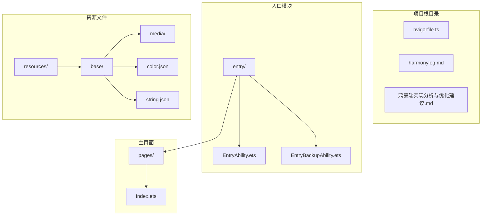
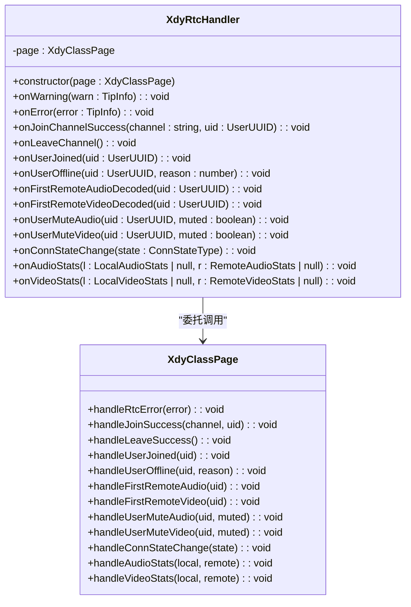
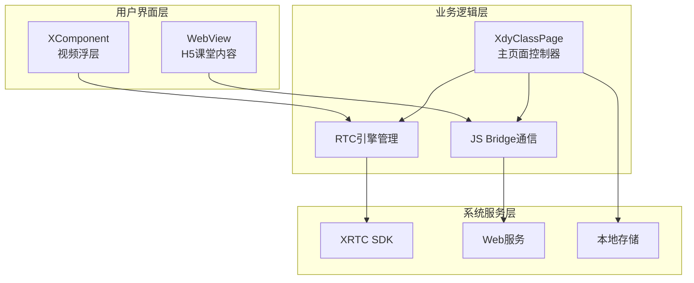
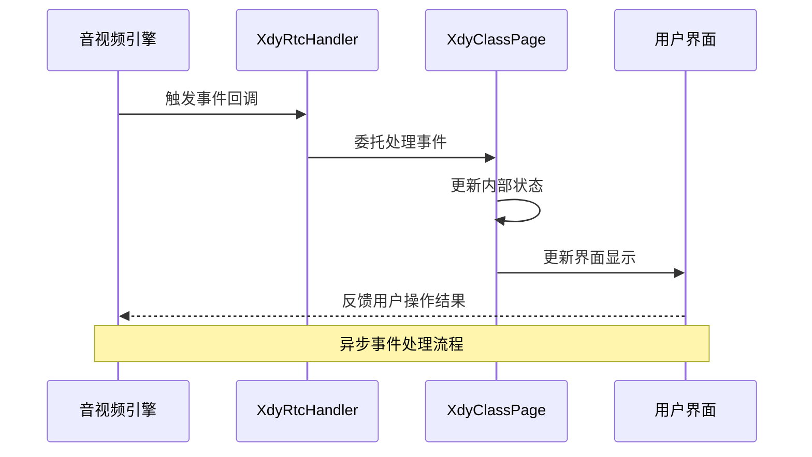
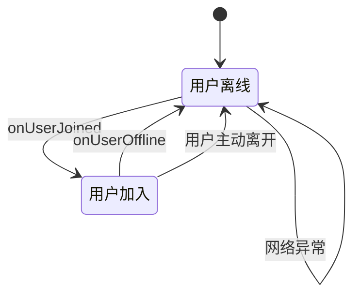
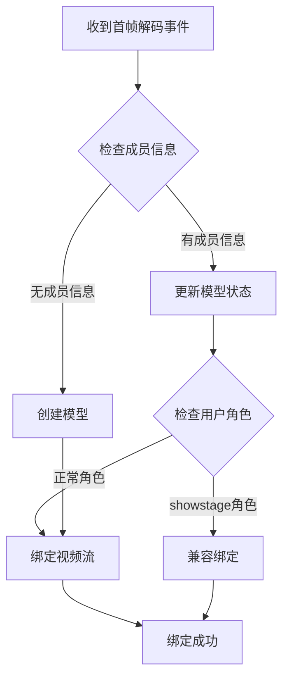
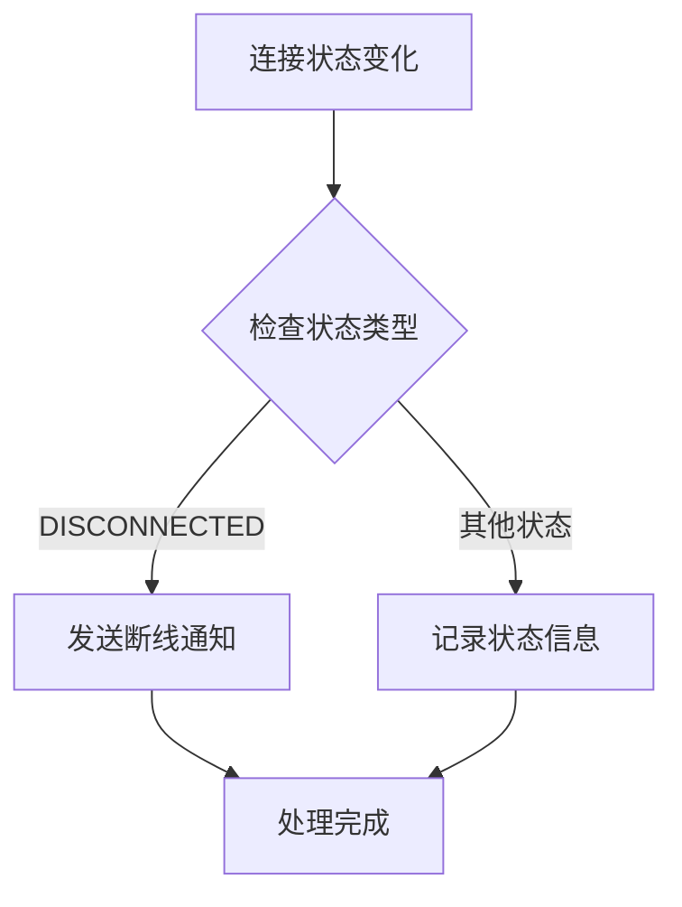
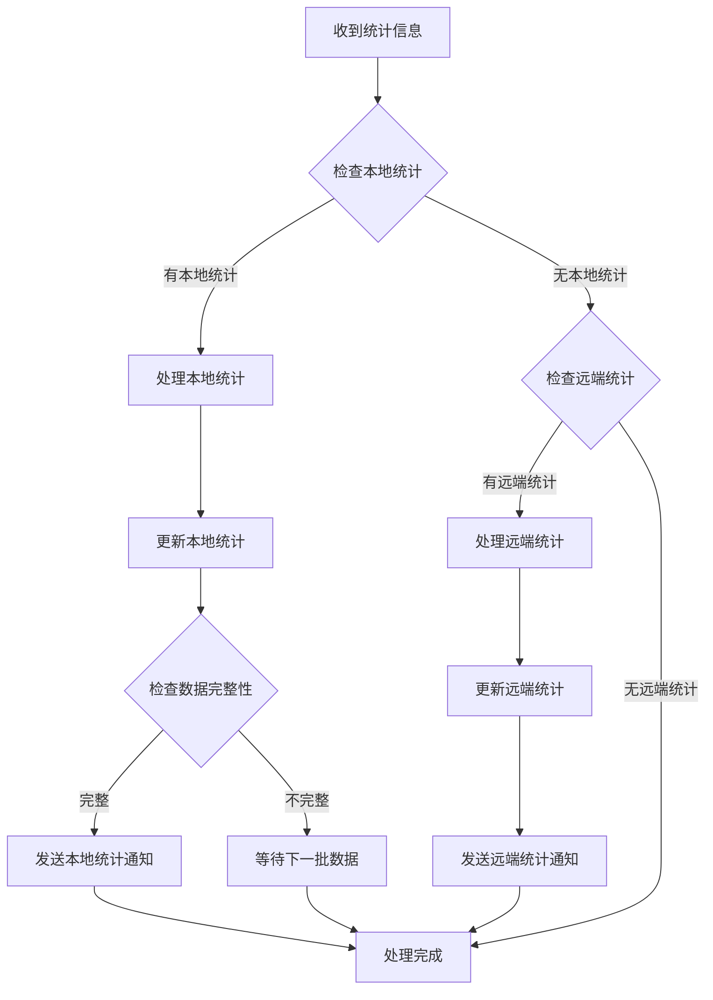
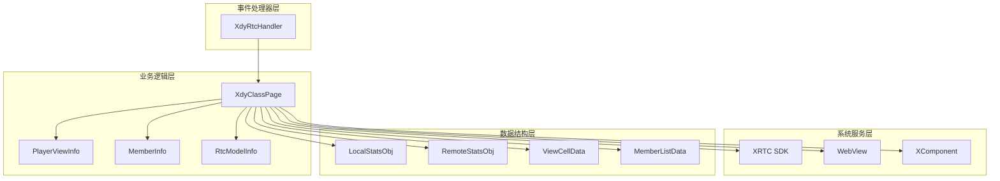
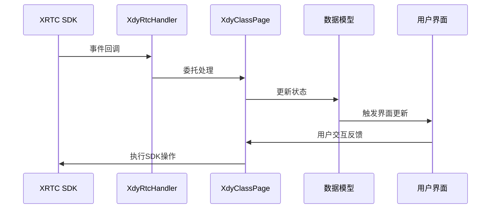

# 事件处理器实现

<cite>
**本文档引用的文件**
- [Index.ets](file://entry/src/main/ets/pages/Index.ets)
- [EntryAbility.ets](file://entry/src/main/ets/entryability/EntryAbility.ets)
- [EntryBackupAbility.ets](file://entry/src/main/ets/entrybackupability/EntryBackupAbility.ets)
- [鸿蒙端实现分析与优化建议.md](file://鸿蒙端实现分析与优化建议.md)
</cite>

## 目录
1. [简介](#简介)
2. [项目结构](#项目结构)
3. [核心组件](#核心组件)
4. [架构概览](#架构概览)
5. [详细组件分析](#详细组件分析)
6. [依赖关系分析](#依赖关系分析)
7. [性能考虑](#性能考虑)
8. [故障排除指南](#故障排除指南)
9. [结论](#结论)

## 简介

本文档深入分析了XdyRtcHandler类的IEngineEventHandler接口实现，这是一个关键的事件处理器组件，负责管理HarmonyOS课堂应用中的实时音视频通信事件。该处理器实现了完整的事件回调机制，包括警告处理、错误处理、用户状态变更、音视频首帧解码、静音状态变化以及连接状态监控等功能。

该实现基于ArkTS技术栈，采用ArkUI框架构建，通过XComponent进行视频渲染，结合WebView承载H5课堂内容，形成了独特的三层架构设计。

## 项目结构

项目采用模块化的组织方式，主要包含以下关键目录和文件：



**图表来源**
- [Index.ets](file://entry/src/main/ets/pages/Index.ets#L1-L1436)
- [EntryAbility.ets](file://entry/src/main/ets/entryability/EntryAbility.ets#L1-L65)

**章节来源**
- [Index.ets](file://entry/src/main/ets/pages/Index.ets#L1-L1436)
- [EntryAbility.ets](file://entry/src/main/ets/entryability/EntryAbility.ets#L1-L65)

## 核心组件

### XdyRtcHandler类概述

XdyRtcHandler是事件处理器的核心实现，它实现了IEngineEventHandler接口的所有方法，为音视频引擎提供完整的事件回调支持。



**图表来源**
- [Index.ets](file://entry/src/main/ets/pages/Index.ets#L134-L151)

### 事件处理器架构

事件处理器采用委托模式，将具体的业务逻辑委托给XdyClassPage类处理，实现了关注点分离的设计原则。

**章节来源**
- [Index.ets](file://entry/src/main/ets/pages/Index.ets#L134-L151)

## 架构概览

### 整体架构设计

系统采用三层架构设计，实现了H5课堂内容、原生音视频处理和视频渲染的有机结合：



**图表来源**
- [Index.ets](file://entry/src/main/ets/pages/Index.ets#L195-L360)
- [鸿蒙端实现分析与优化建议.md](file://鸿蒙端实现分析与优化建议.md#L7-L23)

### 事件处理流程

事件处理采用异步回调机制，确保UI线程的响应性和系统的稳定性：



**图表来源**
- [Index.ets](file://entry/src/main/ets/pages/Index.ets#L134-L151)

## 详细组件分析

### 警告处理 (onWarning)

警告处理是最基础的事件处理，主要用于记录和监控系统运行状态：

```mermaid
flowchart TD
START[收到警告事件] --> GETCODE[获取警告代码]
GETCODE --> LOGWARN[记录警告日志]
LOGWARN --> END[处理完成]
STYLE_START fill:#e1f5fe
STYLE_END fill:#e8f5e8
```

**图表来源**
- [Index.ets](file://entry/src/main/ets/pages/Index.ets#L138)

### 错误处理 (onError)

错误处理提供了完整的错误上报机制，确保系统能够及时发现和报告异常：

```mermaid
flowchart TD
ERRORSTART[收到错误事件] --> GETERROR[获取错误信息]
GETERROR --> CALLHANDLE[调用页面处理方法]
CALLHANDLE --> NATIVE2JS[向H5发送错误通知]
NATIVE2JS --> LOGERROR[记录错误日志]
LOGERROR --> ERROREND[错误处理完成]
STYLE_ERRORSTART fill:#ffebee
STYLE_ERROREND fill:#e8f5e8
```

**图表来源**
- [Index.ets](file://entry/src/main/ets/pages/Index.ets#L139-L1406)

### 用户加入/离线处理

用户状态管理是音视频应用的核心功能之一：



**图表来源**
- [Index.ets](file://entry/src/main/ets/pages/Index.ets#L142-L143)

### 音视频首帧解码事件

首帧解码事件处理实现了智能的视频流绑定机制：



**图表来源**
- [Index.ets](file://entry/src/main/ets/pages/Index.ets#L1236-L1263)

### 静音状态变化处理

静音状态管理提供了完整的音频视频静音控制机制：

```mermaid
flowchart TD
MUTESTART[收到静音状态变化] --> CHECKSELF{是否本地用户}
CHECKSELF --> |是| HANDLELOCAL[处理本地静音]
CHECKSELF --> |否| HANDLEREMOTE[处理远端静音]
HANDLELOCAL --> UPDATEMODEL[更新模型状态]
HANDLEREMOTE --> UPDATEMODEL
UPDATEMODEL --> UPDATEUI[更新界面显示]
UPDATEUI --> MUTEND[处理完成]
STYLE_MUTESTART fill:#fff3e0
STYLE_MUTEND fill:#e8f5e8
```

**图表来源**
- [Index.ets](file://entry/src/main/ets/pages/Index.ets#L1294-L1310)

### 连接状态变化处理

连接状态监控提供了网络状态的实时反馈：



**图表来源**
- [Index.ets](file://entry/src/main/ets/pages/Index.ets#L1312-L1317)

### 音频和视频统计信息处理

统计信息处理实现了完整的性能监控机制：



**图表来源**
- [Index.ets](file://entry/src/main/ets/pages/Index.ets#L1319-L1401)

**章节来源**
- [Index.ets](file://entry/src/main/ets/pages/Index.ets#L134-L151)
- [Index.ets](file://entry/src/main/ets/pages/Index.ets#L1169-L1407)

## 依赖关系分析

### 组件依赖图



**图表来源**
- [Index.ets](file://entry/src/main/ets/pages/Index.ets#L1-L92)

### 事件处理依赖链

事件处理遵循清晰的依赖关系，确保系统的稳定性和可维护性：



**图表来源**
- [Index.ets](file://entry/src/main/ets/pages/Index.ets#L134-L151)

**章节来源**
- [Index.ets](file://entry/src/main/ets/pages/Index.ets#L1-L1436)

## 性能考虑

### 事件处理性能优化

基于项目分析，以下是针对事件处理器实现的最佳实践和性能优化建议：

#### 1. 异步事件处理

事件处理器采用异步回调机制，避免阻塞主线程：

```typescript
// 建议：在事件处理中使用异步操作
async handleAsyncEvent(eventData: any): Promise<void> {
    try {
        // 异步处理逻辑
        await this.processEventData(eventData);
        // 异步更新UI
        this.updateUIAsync();
    } catch (error) {
        console.error('事件处理错误:', error);
    }
}
```

#### 2. 内存管理优化

合理管理内存使用，避免内存泄漏：

```typescript
// 建议：及时清理事件处理器
cleanup(): void {
    if (this.rtcEngine && this.rtcHandler) {
        this.rtcEngine.removeEventHandler(this.rtcHandler);
        this.rtcHandler = null;
    }
}
```

#### 3. 统计数据缓存策略

优化统计数据的缓存和处理：

```typescript
// 建议：实现数据去重和批量处理
processStatsBatch(statsArray: any[]): void {
    const uniqueStats = this.removeDuplicates(statsArray);
    const processedStats = this.batchProcess(uniqueStats);
    this.sendBatchNotifications(processedStats);
}
```

#### 4. 网络状态监控

增强网络状态的监控能力：

```typescript
// 建议：添加网络状态监听
setupNetworkListener(): void {
    // 监听网络变化
    connection.on('netAvailable', () => {
        this.handleNetworkRecovery();
    });
    
    connection.on('netLost', () => {
        this.handleNetworkLoss();
    });
}
```

**章节来源**
- [鸿蒙端实现分析与优化建议.md](file://鸿蒙端实现分析与优化建议.md#L130-L233)

## 故障排除指南

### 常见问题诊断

#### 1. 事件处理异常

**问题症状：** 事件回调不触发或处理异常

**诊断步骤：**
1. 检查事件处理器是否正确注册
2. 验证事件回调方法的实现
3. 查看日志输出确认事件触发

**解决方案：**
```typescript
// 确保事件处理器正确注册
if (this.rtcEngine && this.rtcHandler) {
    this.rtcEngine.addEventHandler(this.rtcHandler);
}
```

#### 2. 音视频流绑定失败

**问题症状：** 用户加入后无法看到视频流

**诊断步骤：**
1. 检查surfaceId是否正确获取
2. 验证视频流绑定逻辑
3. 确认用户角色匹配

**解决方案：**
```typescript
// 确保视频流正确绑定
if (pv.surfaceId && this.rtcEngine) {
    const up: UserParam = new UserParam(uid);
    if (uid === this.selfUid) {
        this.rtcEngine.setLocalVideo(surfaceId, true, RenderMode.RENDER_MODE_HIDDEN, up);
    } else {
        this.rtcEngine.setRemoteVideo(surfaceId, true, RenderMode.RENDER_MODE_HIDDEN, up);
    }
}
```

#### 3. 统计数据异常

**问题症状：** 音视频统计数据不准确

**诊断步骤：**
1. 检查统计数据的计算逻辑
2. 验证数据更新的时机
3. 确认数据类型的正确性

**解决方案：**
```typescript
// 确保统计数据正确计算
const now: number = local.getSentBitrate() * 2 / 8 * 1024;
this.localVideoBytes += now;
this.localStats.videoSendBytesNow = now;
```

**章节来源**
- [Index.ets](file://entry/src/main/ets/pages/Index.ets#L1403-L1407)

## 结论

XdyRtcHandler类的IEngineEventHandler接口实现展现了优秀的软件工程实践，具有以下特点：

### 技术优势

1. **清晰的架构设计**：采用委托模式，实现了关注点分离
2. **完整的事件覆盖**：涵盖了音视频通信的所有关键事件
3. **良好的错误处理**：提供了完善的异常处理和日志记录机制
4. **性能优化考虑**：采用了异步处理和内存管理策略

### 最佳实践总结

1. **事件处理模式**：通过委托模式实现事件处理的模块化
2. **状态管理**：使用Map和对象管理用户状态和统计数据
3. **生命周期管理**：正确处理组件的创建、更新和销毁
4. **错误处理**：提供完整的错误捕获和上报机制

### 未来改进方向

基于现有实现，建议重点关注以下方面的优化：

1. **增强异常处理**：添加全局错误边界和异常恢复机制
2. **性能监控**：实现更详细的性能指标收集和分析
3. **网络状态管理**：增强网络状态的自动检测和恢复能力
4. **代码结构优化**：按照建议的目录结构进一步模块化

该事件处理器实现为HarmonyOS课堂应用提供了稳定可靠的音视频通信基础，为后续的功能扩展和性能优化奠定了坚实的基础。