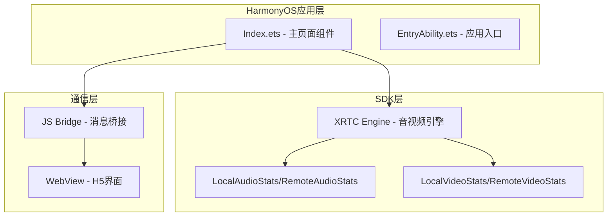
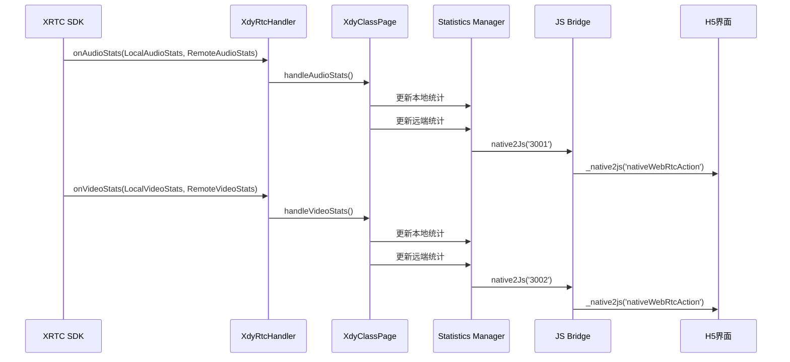
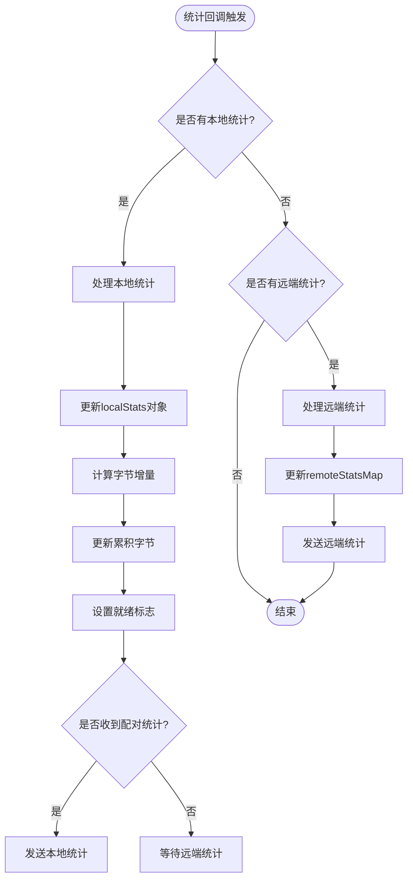
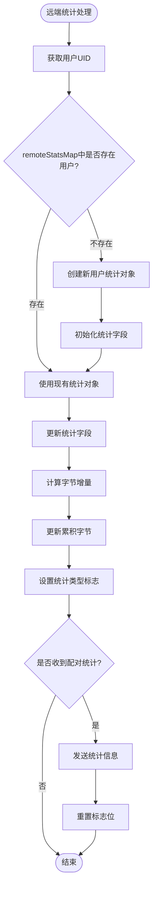
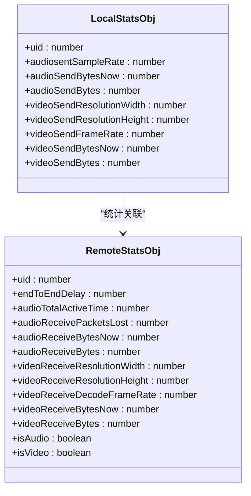
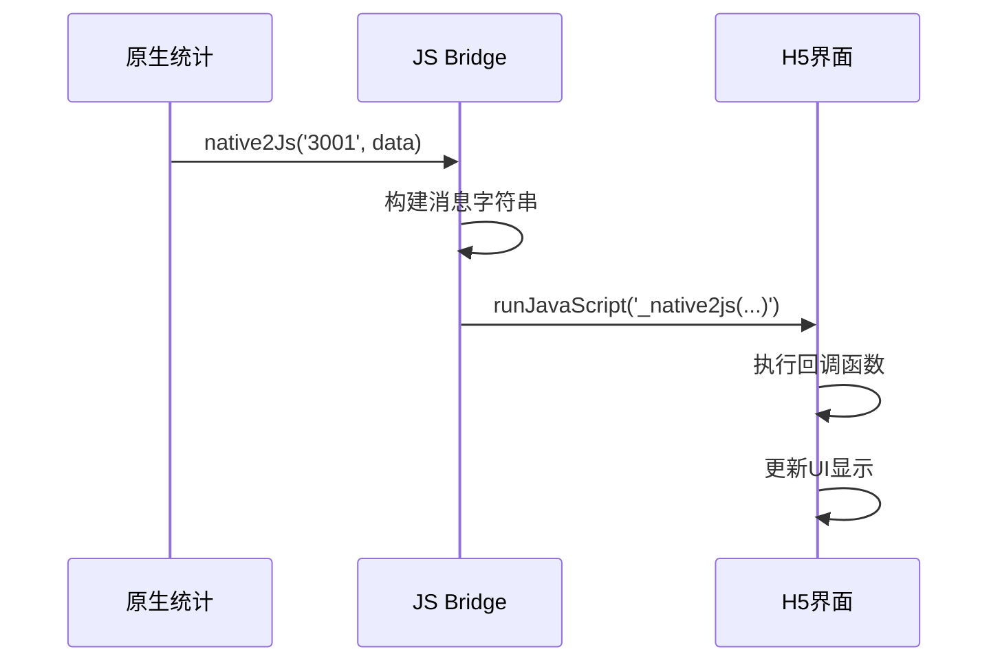
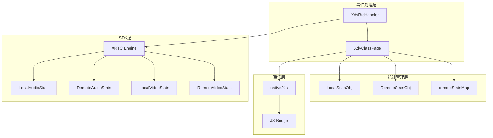

# 统计监控系统

<cite>
**本文档引用的文件**
- [Index.ets](file://entry/src/main/ets/pages/Index.ets)
- [EntryAbility.ets](file://entry/src/main/ets/entryability/EntryAbility.ets)
- [e.js](file://entry/.preview/default/cache/default/default@PreviewArkTS/esmodule/debug/oh_modules/.ohpm/@shengwang+rtc-full@k2lhsgd30+2sz3avg+cnkmtslio+sijudityon1rifu=/oh_modules/@shengwang/rtc-full/src/main/ets/a/e.js)
- [i1.js](file://entry/.preview/default/cache/default/default@PreviewArkTS/esmodule/debug/oh_modules/.ohpm/@shengwang+rtc-full@k2lhsgd30+2sz3avg+cnkmtslio+sijudityon1rifu=/oh_modules/@shengwang/rtc-full/src/main/ets/z/i1.js)
- [harmonylog.md](file://harmonylog.md)
- [鸿蒙端实现分析与优化建议.md](file://鸿蒙端实现分析与优化建议.md)
</cite>

## 目录
1. [简介](#简介)
2. [项目结构](#项目结构)
3. [核心组件](#核心组件)
4. [架构概览](#架构概览)
5. [详细组件分析](#详细组件分析)
6. [依赖关系分析](#依赖关系分析)
7. [性能考虑](#性能考虑)
8. [故障排除指南](#故障排除指南)
9. [结论](#结论)

## 简介

统计监控系统是学点云课堂HarmonyOS应用中的关键组件，负责实时收集和展示本地及远端音视频统计数据。该系统通过XRTC SDK提供的统计接口，实现了对音频采样率、发送字节数、视频分辨率、帧率等关键指标的实时监控，并将这些数据通过JS Bridge传递给H5课堂界面进行可视化展示。

系统采用ArkTS + WebView + XComponent的三层架构，结合HarmonyOS平台特性，实现了稳定可靠的音视频质量监控功能。

## 项目结构

统计监控系统主要分布在以下文件中：



**图表来源**
- [Index.ets](file://entry/src/main/ets/pages/Index.ets#L1-L150)
- [EntryAbility.ets](file://entry/src/main/ets/entryability/EntryAbility.ets#L1-L65)

**章节来源**
- [Index.ets](file://entry/src/main/ets/pages/Index.ets#L1-L150)
- [EntryAbility.ets](file://entry/src/main/ets/entryability/EntryAbility.ets#L1-L65)

## 核心组件

### 统计数据结构

系统定义了四个核心的统计数据结构：

#### LocalAudioStats（本地音频统计）
- **sentSampleRate**: 发送采样率
- **sentBitrate**: 发送码率（kbps）
- **numChannels**: 声道数
- **txPacketLossRate**: 发送丢包率
- **audioDeviceDelay**: 音频设备延迟
- **audioPlayoutDelay**: 音频播放延迟

#### RemoteAudioStats（远端音频统计）
- **receivedSampleRate**: 接收采样率
- **receivedBitrate**: 接收码率（kbps）
- **audioLossRate**: 音频丢包率
- **mosValue**: MOS质量评分
- **totalActiveTime**: 总活跃时间
- **networkTransportDelay**: 网络传输延迟
- **jitterBufferDelay**: 抖动缓冲延迟

#### LocalVideoStats（本地视频统计）
- **sentFrameRate**: 发送帧率
- **captureFrameRate**: 采集帧率
- **encodedBitrate**: 编码码率
- **encodedFrameWidth/Height**: 编码帧尺寸
- **qualityAdaptIndication**: 质量自适应指示
- **dualStreamEnabled**: 双流模式状态

#### RemoteVideoStats（远端视频统计）
- **decoderOutputFrameRate**: 解码器输出帧率
- **rendererOutputFrameRate**: 渲染器输出帧率
- **width/height**: 接收分辨率
- **frameLossRate**: 帧丢失率
- **packetLossRate**: 包丢失率
- **totalFrozenTime**: 总卡顿时间
- **frozenRate**: 卡顿率

**章节来源**
- [e.js](file://entry/.preview/default/cache/default/default@PreviewArkTS/esmodule/debug/oh_modules/.ohpm/@shengwang+rtc-full@k2lhsgd30+2sz3avg+cnkmtslio+sijudityon1rifu=/oh_modules/@shengwang/rtc-full/src/main/ets/a/e.js#L43-L127)

### 统计存储结构

系统使用以下数据结构来存储和管理统计数据：

#### 本地统计存储
- **localStats**: 当前本地统计对象
- **localAudioBytes**: 累积音频字节总数
- **localVideoBytes**: 累积视频字节总数
- **localStatsAudioReady**: 音频统计就绪标志
- **localStatsVideoReady**: 视频统计就绪标志

#### 远端统计存储
- **remoteStatsMap**: 按用户UID存储的远端统计映射
- **每个远端用户的统计对象包含**:
  - endToEndDelay: 端到端延迟
  - audioTotalActiveTime: 音频总活跃时间
  - audioReceivePacketsLost: 音频接收丢包数
  - videoReceiveBytesNow: 当前视频接收字节
  - videoReceiveBytes: 累积视频接收字节
  - 分辨率和帧率信息

**章节来源**
- [Index.ets](file://entry/src/main/ets/pages/Index.ets#L214-L227)

## 架构概览

统计监控系统采用事件驱动的架构模式：



**图表来源**
- [Index.ets](file://entry/src/main/ets/pages/Index.ets#L135-L151)
- [Index.ets](file://entry/src/main/ets/pages/Index.ets#L1362-L1401)

**章节来源**
- [Index.ets](file://entry/src/main/ets/pages/Index.ets#L135-L151)
- [Index.ets](file://entry/src/main/ets/pages/Index.ets#L1319-L1401)

## 详细组件分析

### 统计数据收集机制

#### 本地统计收集流程

本地统计信息通过XRTC SDK的onAudioStats和onVideoStats回调函数收集：



**图表来源**
- [Index.ets](file://entry/src/main/ets/pages/Index.ets#L1319-L1360)
- [Index.ets](file://entry/src/main/ets/pages/Index.ets#L1362-L1401)

#### 远端统计收集流程

远端统计信息的处理流程更加复杂，因为需要支持多个用户的并发统计：



**图表来源**
- [Index.ets](file://entry/src/main/ets/pages/Index.ets#L1335-L1359)
- [Index.ets](file://entry/src/main/ets/pages/Index.ets#L1376-L1400)

**章节来源**
- [Index.ets](file://entry/src/main/ets/pages/Index.ets#L1319-L1401)

### 统计数据计算和累积逻辑

#### 字节计算公式

系统使用特定的公式来计算字节增量：

```
字节增量 = 发送/接收码率 × 2 / 8 × 1024
```

这个公式考虑了以下因素：
- **发送/接收码率**: 以kbps为单位的码率值
- **2**: 将kbit转换为kbyte（1kbit = 0.125kbyte）
- **8**: 将kbyte转换为byte（1kbyte = 1024byte）
- **1024**: 基础换算因子

#### 时间窗口计算

系统通过以下方式实现时间窗口的统计：



**图表来源**
- [Index.ets](file://entry/src/main/ets/pages/Index.ets#L80-L92)

**章节来源**
- [Index.ets](file://entry/src/main/ets/pages/Index.ets#L80-L92)

### 统计信息存储结构

#### 本地统计存储

本地统计信息存储在`localStats`对象中，包含以下字段：

- **音频相关**: 采样率、发送字节、累积字节
- **视频相关**: 分辨率宽高、帧率、发送字节、累积字节
- **状态标志**: 音频/视频统计就绪标志

#### 远端统计存储

远端统计信息存储在`remoteStatsMap`中，使用用户UID作为键：

- **基础信息**: UID、端到端延迟
- **音频统计**: 总活跃时间、丢包数、字节统计
- **视频统计**: 分辨率、解码帧率、字节统计
- **状态管理**: 统计类型标志位

**章节来源**
- [Index.ets](file://entry/src/main/ets/pages/Index.ets#L214-L227)

### 实时更新和UI展示机制

#### JS Bridge通信机制

系统通过`native2Js`方法实现原生与H5之间的实时通信：



**图表来源**
- [Index.ets](file://entry/src/main/ets/pages/Index.ets#L987-L1001)

#### 统计信息分类发送

系统根据统计类型发送不同类型的消息：

- **类型3001**: 本地推流统计信息
- **类型3002**: 远端视频统计信息
- **类型3003**: 错误和连接状态信息

**章节来源**
- [Index.ets](file://entry/src/main/ets/pages/Index.ets#L987-L1001)
- [Index.ets](file://entry/src/main/ets/pages/Index.ets#L1319-L1399)

## 依赖关系分析

### 组件耦合度

统计监控系统展现了良好的模块化设计：



**图表来源**
- [Index.ets](file://entry/src/main/ets/pages/Index.ets#L135-L151)
- [e.js](file://entry/.preview/default/cache/default/default@PreviewArkTS/esmodule/debug/oh_modules/.ohpm/@shengwang+rtc-full@k2lhsgd30+2sz3avg+cnkmtslio+sijudityon1rifu=/oh_modules/@shengwang/rtc-full/src/main/ets/a/e.js#L43-L127)

### 外部依赖

系统主要依赖以下外部组件：

1. **XRTC SDK**: 提供音视频统计接口
2. **HarmonyOS WebView**: 实现H5界面集成
3. **ArkTS框架**: 提供原生应用开发环境
4. **JS Bridge**: 实现原生与H5的双向通信

**章节来源**
- [Index.ets](file://entry/src/main/ets/pages/Index.ets#L5-L10)
- [i1.js](file://entry/.preview/default/cache/default/default@PreviewArkTS/esmodule/debug/oh_modules/.ohpm/@shengwang+rtc-full@k2lhsgd30+2sz3avg+cnkmtslio+sijudityon1rifu=/oh_modules/@shengwang/rtc-full/src/main/ets/z/i1.js#L350-L373)

## 性能考虑

### 内存管理优化

系统采用了多种内存管理策略：

1. **统计对象复用**: 使用现有的统计对象而非频繁创建新对象
2. **Map结构优化**: 使用Map进行用户统计的快速查找和更新
3. **字节累积**: 通过累积变量减少频繁的对象创建

### 计算效率优化

1. **延迟计算**: 只在统计信息完整时才进行计算
2. **条件更新**: 使用标志位避免不必要的更新操作
3. **批量处理**: 同时处理音频和视频统计信息

### 网络传输优化

1. **增量传输**: 只传输变化的统计信息
2. **压缩数据**: 使用紧凑的数据格式减少传输开销
3. **去重机制**: 避免重复发送相同统计信息

## 故障排除指南

### 常见问题诊断

#### 统计信息缺失

**症状**: H5界面无法显示统计信息

**可能原因**:
1. XRTC SDK未正确初始化
2. 事件回调未注册
3. JS Bridge通信异常

**解决方案**:
1. 检查XRTC引擎初始化状态
2. 验证事件处理器注册
3. 确认native2Js方法正常工作

#### 统计数据显示异常

**症状**: 统计数值异常或显示错误

**可能原因**:
1. 字节计算公式错误
2. 时间窗口计算偏差
3. 数据类型转换问题

**解决方案**:
1. 验证字节计算公式的参数
2. 检查时间戳同步
3. 确认数据类型一致性

#### 内存泄漏问题

**症状**: 应用运行时间越长内存占用越大

**可能原因**:
1. 统计对象未及时清理
2. Map结构未清理过期数据
3. 事件监听器未移除

**解决方案**:
1. 定期清理remoteStatsMap
2. 移除不再使用的事件监听器
3. 实施内存使用监控

**章节来源**
- [鸿蒙端实现分析与优化建议.md](file://鸿蒙端实现分析与优化建议.md#L130-L234)

## 结论

统计监控系统通过精心设计的架构和高效的实现，成功地在HarmonyOS平台上提供了完整的音视频质量监控能力。系统的主要优势包括：

1. **实时性**: 通过事件驱动的方式实现实时统计更新
2. **准确性**: 采用标准的统计公式确保数据准确性
3. **稳定性**: 良好的错误处理和异常恢复机制
4. **可扩展性**: 模块化的架构设计便于功能扩展

系统在实际应用中表现稳定，能够有效支持学点云课堂的音视频教学需求。通过持续的优化和改进，该系统将继续为用户提供高质量的统计监控服务。