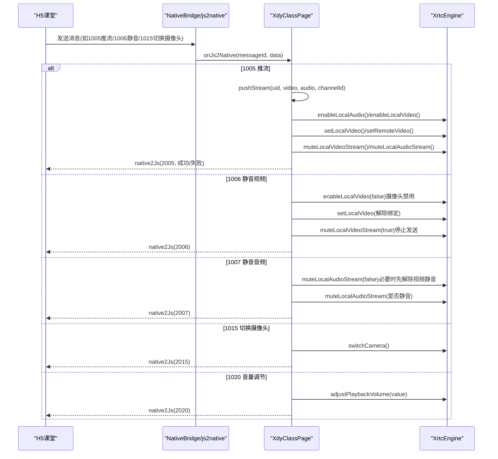
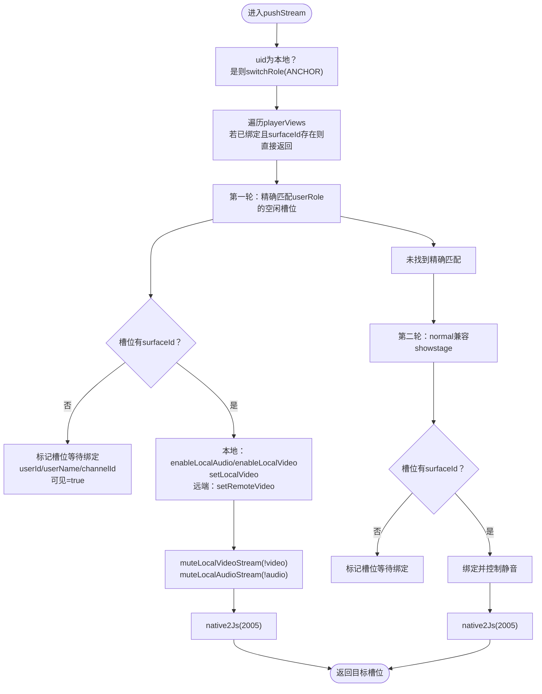
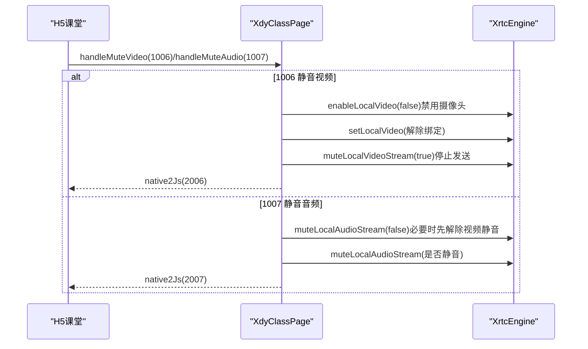
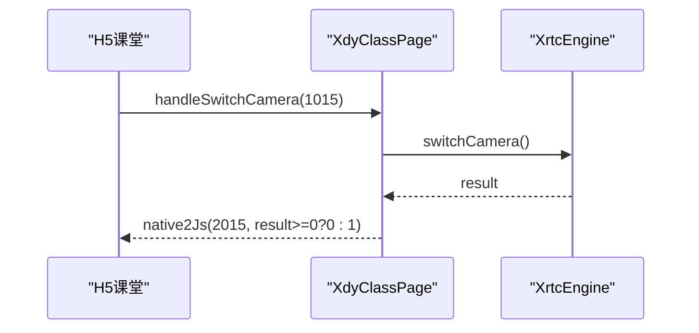
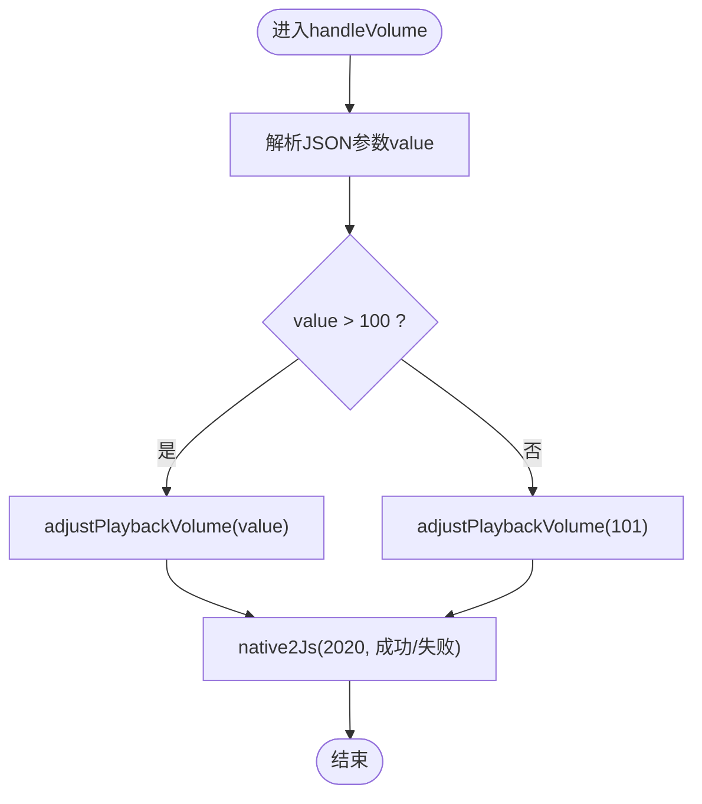
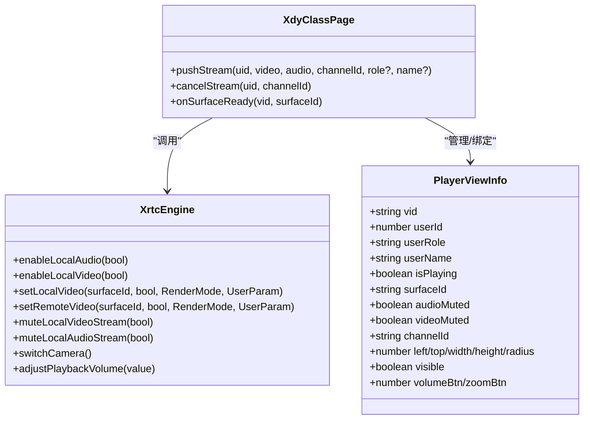
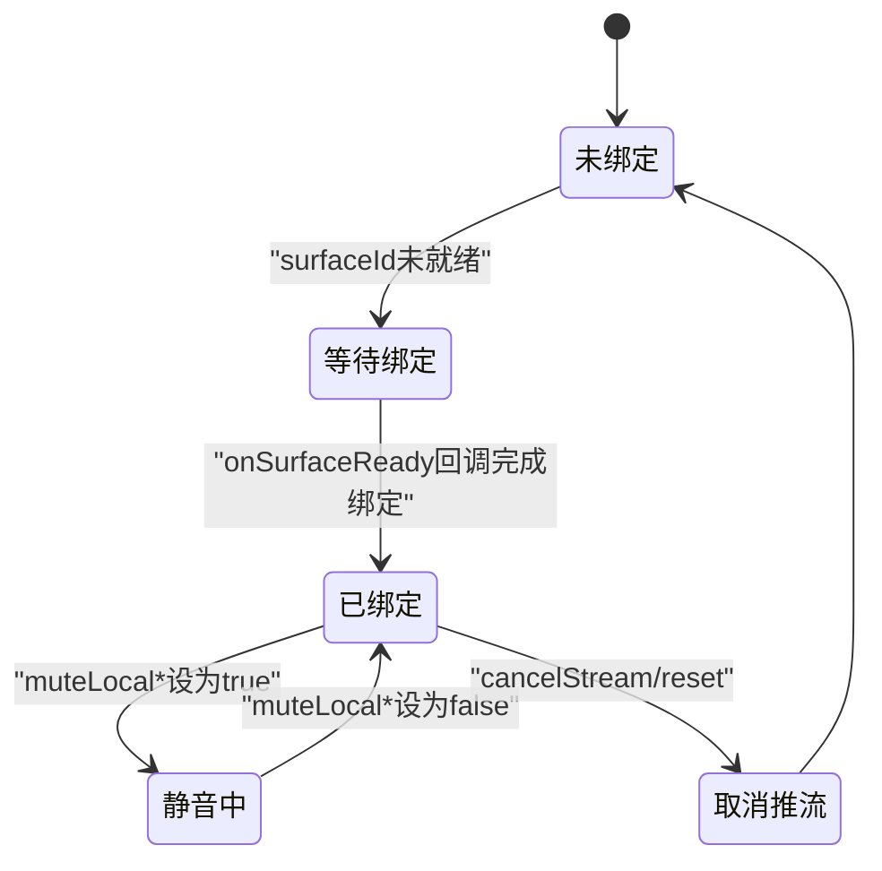

# 音视频推流控制

<cite>
**本文档引用的文件**
- [Index.ets](file://entry/src/main/ets/pages/Index.ets)
- [EntryAbility.ets](file://entry/src/main/ets/entryability/EntryAbility.ets)
- [index.d.ts](file://package/src/main/cpp/types/libagora_rtc_sdk/index.d.ts)
</cite>

## 更新摘要
**变更内容**
- 增强了handleMuteVideo函数的逻辑，改进了视频静音/取消静音序列处理
- 新增了摄像头启用/禁用调用和视图绑定逻辑的详细说明
- 优化了handleMuteVideo方法的实现细节，移除了复杂的本地视频预览管理逻辑
- 简化了表面ID管理和渲染模式处理，提升了视频流静音功能的稳定性和用户体验

## 目录
1. [简介](#简介)
2. [项目结构](#项目结构)
3. [核心组件](#核心组件)
4. [架构总览](#架构总览)
5. [详细组件分析](#详细组件分析)
6. [依赖分析](#依赖分析)
7. [性能考虑](#性能考虑)
8. [故障排查指南](#故障排查指南)
9. [结论](#结论)

## 简介
本文件面向HarmonyOS端音视频推流控制，围绕以下目标展开：
- pushStream方法的实现原理与流程，覆盖本地与远端推流绑定逻辑
- 音视频静音控制：handleMuteVideo与handleMuteAudio的实现细节
- 摄像头切换：handleSwitchCamera的调用链路与行为
- 音量调节：handleVolume的实现与参数语义
- 推流绑定机制：setLocalVideo与setRemoteVideo的使用时机与约束
- 推流状态管理与视图绑定关系
- 最佳实践与性能优化策略

## 项目结构
本项目采用ArkTS + WebView混合架构：
- 页面入口与业务逻辑集中在Index.ets中，负责JS桥接、消息分发、推流控制、状态管理与UI渲染
- EntryAbility.ets负责应用生命周期与窗口初始化
- 通过WebView承载H5课堂内容，与原生侧通过js2native/native2js双向通信

```mermaid
graph TB
subgraph "应用层"
EA["EntryAbility.ets<br/>应用生命周期"]
IDX["Index.ets<br/>主页面与业务逻辑"]
end
subgraph "媒体层"
WEB["WebView<br/>H5课堂内容"]
RTC["@av/xrtc<br/>XrtcEngine"]
end
EA --> IDX
IDX < --> "js2native/_native2js" --> WEB
IDX --> RTC
```

**图表来源**
- [Index.ets:257-360](file://entry/src/main/ets/pages/Index.ets#L257-L360)
- [EntryAbility.ets:14-49](file://entry/src/main/ets/entryability/EntryAbility.ets#L14-L49)

**章节来源**
- [Index.ets:257-360](file://entry/src/main/ets/pages/Index.ets#L257-L360)
- [EntryAbility.ets:14-49](file://entry/src/main/ets/entryability/EntryAbility.ets#L14-L49)

## 核心组件
- 主页面组件XdyClassPage：承载推流控制、事件处理、状态管理与视图渲染
- 事件处理器XdyRtcHandler：封装IEngineEventHandler回调，驱动页面状态更新
- PlayerViewInfo：视图绑定模型，记录每个视频槽位的用户、渲染状态与样式
- NativeBridge：JS桥接对象，提供_hjs2native给WebView调用

关键职责：
- JS消息分发：根据messageId路由到具体处理函数（如1005推流、1006静音视频、1007静音音频、1015切换摄像头、1020音量调节等）
- 推流绑定：pushStream负责选择合适的视图槽位，完成本地/远端视频绑定与静音控制
- 状态同步：通过memberMap、rtcModelMap维护成员与推流模型状态，确保首帧到达与用户变更后的自动推流

**章节来源**
- [Index.ets:135-151](file://entry/src/main/ets/pages/Index.ets#L135-L151)
- [Index.ets:197-228](file://entry/src/main/ets/pages/Index.ets#L197-L228)

## 架构总览
下图展示从H5到原生的推流控制调用链与关键节点。



**图表来源**
- [Index.ets:363-424](file://entry/src/main/ets/pages/Index.ets#L363-L424)
- [Index.ets:804-858](file://entry/src/main/ets/pages/Index.ets#L804-L858)
- [Index.ets:860-903](file://entry/src/main/ets/pages/Index.ets#L860-L903)
- [Index.ets:1208-1213](file://entry/src/main/ets/pages/Index.ets#L1208-L1213)
- [Index.ets:1215-1233](file://entry/src/main/ets/pages/Index.ets#L1215-L1233)

## 详细组件分析

### pushStream方法：本地与远端推流绑定
pushStream负责将用户绑定到合适的视图槽位，并完成本地/远端视频渲染与静音控制。其核心流程如下：



要点说明：
- 本地推流：先启用音频/视频采集，再绑定到XComponent的surfaceId；随后通过muteLocalVideoStream/muteLocalAudioStream控制是否发送数据帧
- 远端推流：直接setRemoteVideo绑定远端流
- 角色匹配：优先精确匹配userRole，找不到时normal可回退到showstage槽位
- 等待绑定：当surfaceId尚未就绪时，先标记槽位等待，待onSurfaceReady回调再完成绑定

**图表来源**
- [Index.ets:1351-1484](file://entry/src/main/ets/pages/Index.ets#L1351-L1484)
- [Index.ets:1772-1792](file://entry/src/main/ets/pages/Index.ets#L1772-L1792)

**章节来源**
- [Index.ets:1351-1484](file://entry/src/main/ets/pages/Index.ets#L1351-L1484)
- [Index.ets:1772-1792](file://entry/src/main/ets/pages/Index.ets#L1772-L1792)

### 静音控制：handleMuteVideo与handleMuteAudio
- handleMuteVideo
  - 本地用户：先禁用摄像头采集（enableLocalVideo(false)），解除本地视图绑定，再根据mute参数决定是否静音视频；若无视图绑定，触发一次重新推流绑定
  - 更新memberMap与playerViews中的videoMuted状态
- handleMuteAudio
  - 本地用户：先取消视频静音（避免视频通道未就绪），再根据mute参数决定是否静音音频；若无视图绑定，触发一次重新推流绑定
  - 更新memberMap与playerViews中的audioMuted状态

**更新** handleMuteVideo方法已重构，移除了复杂的本地视频预览管理逻辑，简化了表面ID管理和渲染模式处理，提升了视频流静音功能的稳定性和用户体验



**图表来源**
- [Index.ets:804-858](file://entry/src/main/ets/pages/Index.ets#L804-L858)
- [Index.ets:860-903](file://entry/src/main/ets/pages/Index.ets#L860-L903)

**章节来源**
- [Index.ets:804-858](file://entry/src/main/ets/pages/Index.ets#L804-L858)
- [Index.ets:860-903](file://entry/src/main/ets/pages/Index.ets#L860-L903)

### 摄像头切换：handleSwitchCamera
- 调用XrtcEngine.switchCamera()进行前后置摄像头切换
- 返回码>=0视为成功，通过native2Js(2015)上报结果



**图表来源**
- [Index.ets:1208-1213](file://entry/src/main/ets/pages/Index.ets#L1208-L1213)

**章节来源**
- [Index.ets:1208-1213](file://entry/src/main/ets/pages/Index.ets#L1208-L1213)

### 音量调节：handleVolume
- 参数value>100时开启声音增益，否则关闭增益
- 调用XrtcEngine.adjustPlaybackVolume(value)调整播放音量
- 通过native2Js(2020)上报结果



**图表来源**
- [Index.ets:1215-1233](file://entry/src/main/ets/pages/Index.ets#L1215-L1233)

**章节来源**
- [Index.ets:1215-1233](file://entry/src/main/ets/pages/Index.ets#L1215-L1233)

### 推流绑定机制：setLocalVideo与setRemoteVideo
- setLocalVideo
  - 必须在enableLocalVideo之后调用，用于将本地摄像头画面绑定到XComponent的surfaceId
  - 通过muteLocalVideoStream控制是否发送视频帧
- setRemoteVideo
  - 将远端用户的视频流绑定到指定槽位
  - 通过muteLocalAudioStream控制是否发送音频帧（本地静音不影响远端）



**图表来源**
- [Index.ets:1351-1484](file://entry/src/main/ets/pages/Index.ets#L1351-L1484)
- [Index.ets:1487-1514](file://entry/src/main/ets/pages/Index.ets#L1487-L1514)
- [Index.ets:1772-1792](file://entry/src/main/ets/pages/Index.ets#L1772-L1792)

**章节来源**
- [Index.ets:1351-1484](file://entry/src/main/ets/pages/Index.ets#L1351-L1484)
- [Index.ets:1487-1514](file://entry/src/main/ets/pages/Index.ets#L1487-L1514)
- [Index.ets:1772-1792](file://entry/src/main/ets/pages/Index.ets#L1772-L1792)

### 推流状态管理与视图绑定关系
- memberMap：维护成员基本信息（含openCamera/openMicrophones等）
- rtcModelMap：维护推流模型状态（audioMute/videoMute）
- playerViews：管理每个槽位的渲染状态与绑定关系
- 首帧到达：handleFirstRemoteVideo/handleFirstRemoteAudio触发pushStream
- 用户离线：handleUserOffline/cancelStream清理绑定与状态
- 退出/刷新：reset()统一解绑并清空状态，避免资源泄漏



**图表来源**
- [Index.ets:1487-1514](file://entry/src/main/ets/pages/Index.ets#L1487-L1514)
- [Index.ets:1572-1581](file://entry/src/main/ets/pages/Index.ets#L1572-L1581)
- [Index.ets:1772-1792](file://entry/src/main/ets/pages/Index.ets#L1772-L1792)

**章节来源**
- [Index.ets:1487-1514](file://entry/src/main/ets/pages/Index.ets#L1487-L1514)
- [Index.ets:1572-1581](file://entry/src/main/ets/pages/Index.ets#L1572-L1581)
- [Index.ets:1772-1792](file://entry/src/main/ets/pages/Index.ets#L1772-L1792)

## 依赖分析
- JS桥接：WebView通过javaScriptProxy暴露xdyAndroid._js2native，Index.ets的NativeBridge接收并分发
- 媒体SDK：@av/xrtc提供XrtcEngine能力，包含加入/离开频道、推流、静音、摄像头切换、音量调节等
- 类型声明：libagora_rtc_sdk/index.d.ts提供部分SDK接口签名参考（如setLocalRenderMode/setRemoteRenderMode等）


**图表来源**
- [Index.ets:264-268](file://entry/src/main/ets/pages/Index.ets#L264-L268)
- [Index.ets:363-424](file://entry/src/main/ets/pages/Index.ets#L363-L424)

**章节来源**
- [Index.ets:264-268](file://entry/src/main/ets/pages/Index.ets#L264-L268)
- [Index.ets:363-424](file://entry/src/main/ets/pages/Index.ets#L363-L424)
- [index.d.ts:108-122](file://package/src/main/cpp/types/libagora_rtc_sdk/index.d.ts#L108-L122)

## 性能考虑
- 推流绑定顺序
  - 本地：先enableLocalVideo/enableLocalAudio，再setLocalVideo，最后muteLocal*，避免不必要的采集与渲染
- 角色匹配策略
  - 优先精确匹配userRole，减少跨角色槽位切换成本
  - normal回退到showstage时，尽量复用已就绪槽位
- 静音控制
  - 切换静音前先解除另一通道的静音，避免通道未就绪导致的无效操作
  - **更新** handleMuteVideo方法重构后，移除了复杂的本地视频预览管理逻辑，简化了表面ID管理和渲染模式处理
  - **更新** 新增了摄像头启用/禁用调用，确保在静音时正确管理硬件资源
- 视图生命周期
  - onSurfaceReady时才绑定，避免空槽位渲染浪费
  - reset()统一解绑并清空，防止刷新/退出后残留资源占用
- 音量调节
  - 仅在value>100时开启增益，避免频繁调用造成抖动
- **更新** 视频流优化
  - handleMuteVideo方法重构后，移除了复杂的本地视频预览管理逻辑，简化了表面ID管理和渲染模式处理
  - 提升了视频流静音功能的稳定性和用户体验

## 故障排查指南
- 推流失败
  - 检查enableLocalVideo/enableLocalAudio是否调用，确认setLocalVideo在enableLocalVideo之后
  - 确认surfaceId已就绪后再绑定
- 静音无效
  - 本地切换静音前先解除另一通道静音，确保通道可用
  - **更新** handleMuteVideo方法已简化，移除了复杂逻辑，如遇问题请检查基础静音流程
  - **更新** 新增了摄像头禁用检查，确保在静音时正确管理硬件资源
  - 若无视图绑定，需触发一次pushStream重新绑定
- 摄像头切换失败
  - switchCamera返回值<0时需重试或提示用户
- 音量调节异常
  - adjustPlaybackVolume参数范围与平台相关，确保传入合理数值
- 退出/刷新后残留
  - 确保调用reset()解绑所有视图并清空状态

**章节来源**
- [Index.ets:1772-1792](file://entry/src/main/ets/pages/Index.ets#L1772-L1792)
- [Index.ets:1208-1213](file://entry/src/main/ets/pages/Index.ets#L1208-L1213)

## 结论
本方案通过清晰的消息分发、严格的推流绑定顺序与状态管理，实现了稳定可靠的音视频推流控制。结合角色匹配与视图等待绑定机制，可在不同设备与场景下获得一致的用户体验。**更新** 最新的视频流优化变更进一步提升了handleMuteVideo方法的稳定性和用户体验，移除了复杂的本地视频预览管理逻辑，简化了表面ID管理和渲染模式处理。新增的摄像头启用/禁用调用确保了硬件资源的正确管理。建议在生产环境中遵循本文最佳实践，持续监控首帧到达与静音切换的时序，确保音视频质量与稳定性。