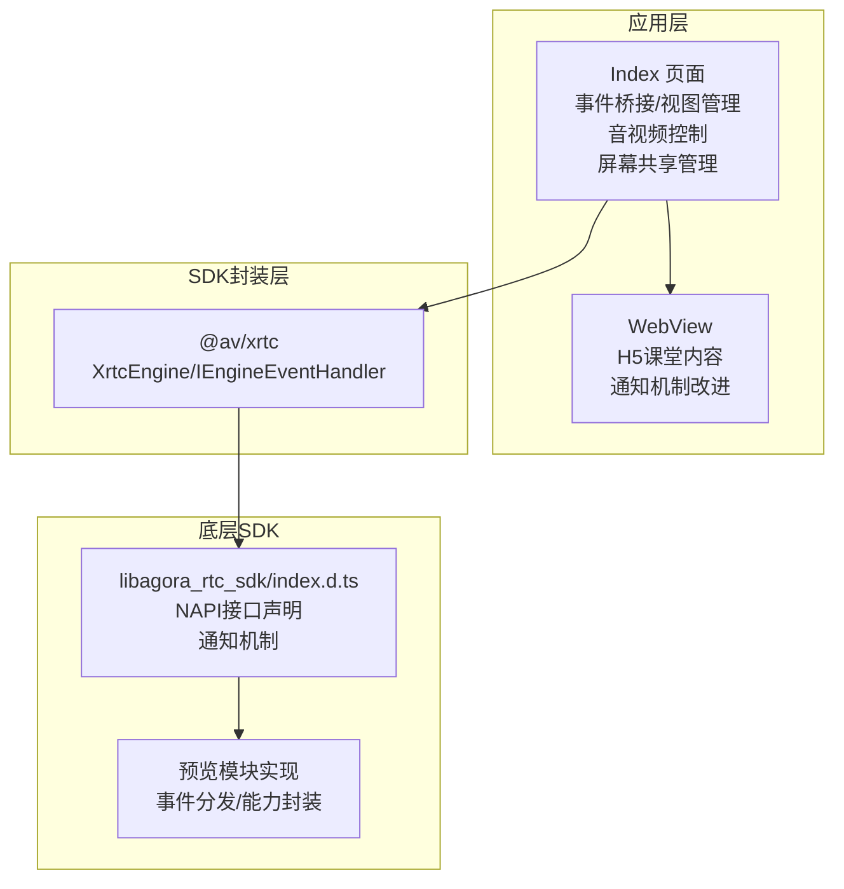
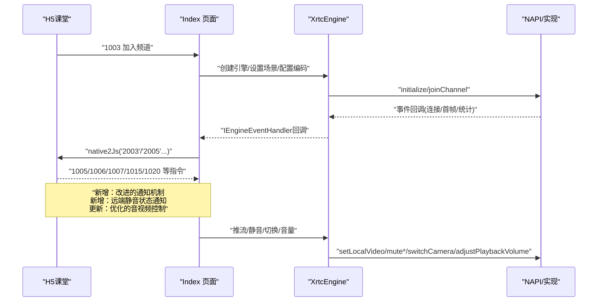
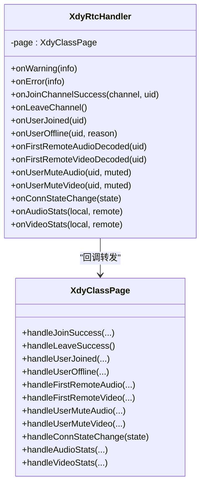
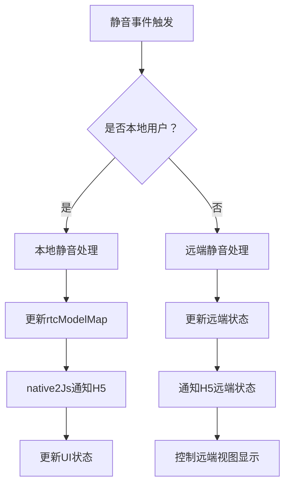
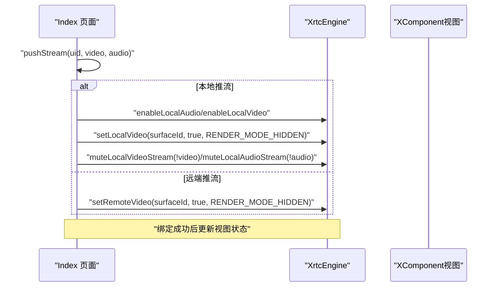
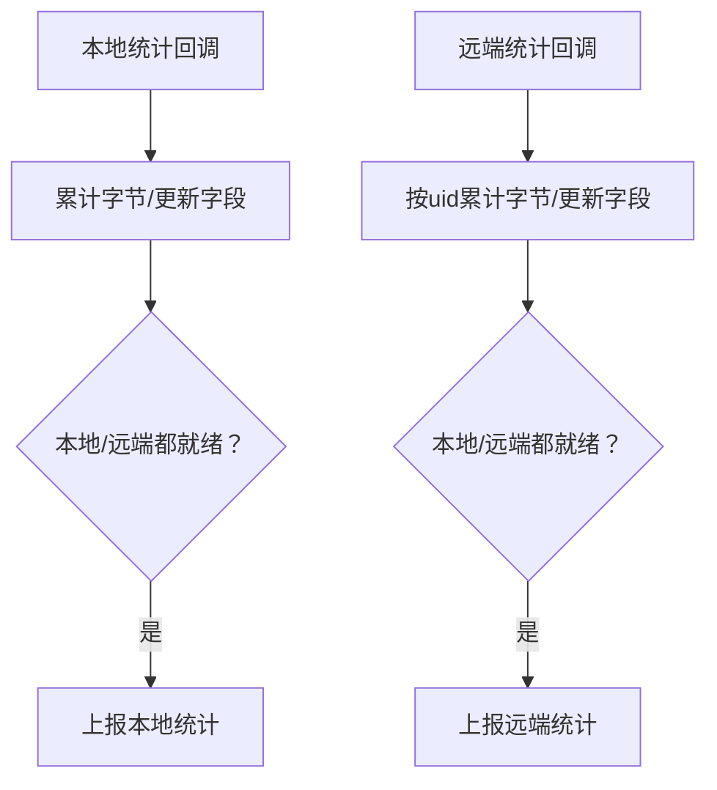
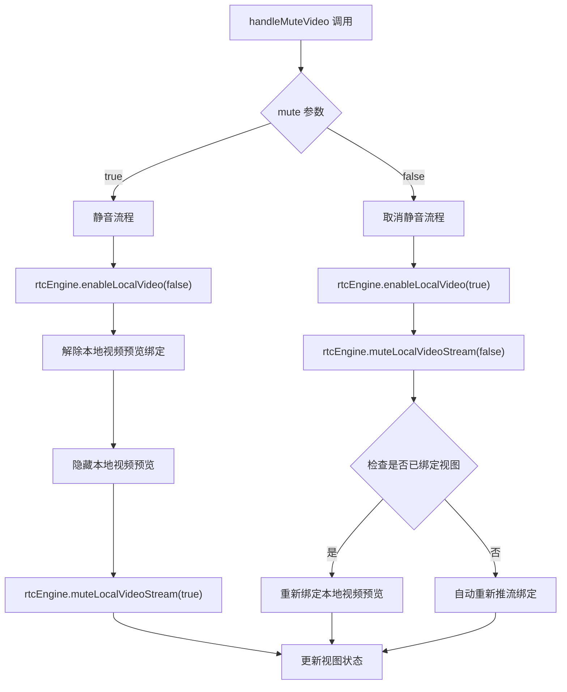
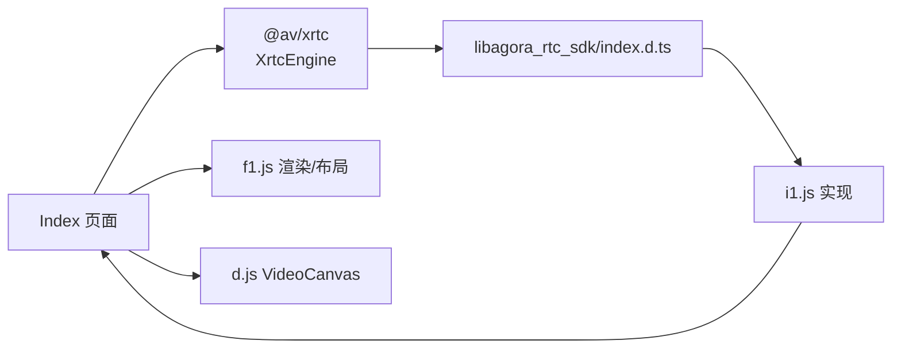

# 音视频通话系统

<cite>
**本文引用的文件**
- [Index.ets](file://entry/src/main/ets/pages/Index.ets)
- [EntryAbility.ets](file://entry/src/main/ets/entryability/EntryAbility.ets)
- [libagora_rtc_sdk/index.d.ts](file://package/src/main/cpp/types/libagora_rtc_sdk/index.d.ts)
- [i1.js](file://entry/.preview/default/cache/default/default@PreviewArkTS/esmodule/debug/oh_modules/.ohpm/@shengwang+rtc-full@k2lhsgd30+2sz3avg+cnkmtslio+sijudityon1rifu=/oh_modules/@shengwang/rtc-full/src/main/ets/z/i1.js)
- [f.js](file://entry/.preview/default/cache/default/default@PreviewArkTS/esmodule/debug/oh_modules/.ohpm/@shengwang+rtc-full@k2lhsgd30+2sz3avg+cnkmtslio+sijudityon1rifu=/oh_modules/@shengwang/rtc-full/src/main/ets/a/f.js)
- [d.js](file://entry/.preview/default/cache/default/default@PreviewArkTS/esmodule/debug/oh_modules/.ohpm/@shengwang+rtc-full@k2lhsgd30+2sz3avg+cnkmtslio+sijudityon1rifu=/oh_modules/@shengwang/rtc-full/src/main/ets/a/d.js)
</cite>

## 更新摘要
**变更内容**
- 修复了Index.ets中的音频/视频静音处理逻辑，确保rtcModelMap条目在屏幕分享订阅检查之前总是创建
- 改进了H5集成的通知机制，增加了对远端音频/视频静音状态变化的JSON载荷通知
- 优化了音视频控制开关的稳定性，提升了系统整体可靠性

## 目录
1. [简介](#简介)
2. [项目结构](#项目结构)
3. [核心组件](#核心组件)
4. [架构总览](#架构总览)
5. [详细组件分析](#详细组件分析)
6. [依赖关系分析](#依赖关系分析)
7. [性能考量](#性能考量)
8. [故障排查指南](#故障排查指南)
9. [结论](#结论)
10. [附录](#附录)

## 简介
本文件面向HarmonyOS平台的音视频通话系统，围绕RTC引擎初始化、频道连接管理、音视频推流控制、事件处理与统计上报、配置参数与渲染模式、静音控制、摄像头切换与音量调节、屏幕共享功能等关键能力进行系统化梳理。文档以Index页面为主要入口，结合底层SDK类型定义与事件派发机制，帮助开发者快速理解并扩展该系统。

**更新** 本次更新重点关注音视频控制开关问题的修复，包括修正Index.ets中的音频/视频静音处理逻辑，确保rtcModelMap条目在屏幕分享订阅检查之前总是创建，改进H5集成的通知机制，增加对远端音频/视频静音状态变化的JSON载荷通知，以及优化音视频控制开关的稳定性。

## 项目结构
系统采用ArkTS页面+WebView混合架构：
- 页面层：Index.ets负责业务编排、事件桥接、视图管理、推流绑定与统计上报。
- 能力层：通过@av/xrtc封装的XrtcEngine与IEngineEventHandler对接底层SDK。
- SDK层：libagora_rtc_sdk/index.d.ts声明底层NAPI接口；预览模块包含具体实现与常量定义。

**图表来源**
- [Index.ets:1-120](file://entry/src/main/ets/pages/Index.ets#L1-L120)
- [libagora_rtc_sdk/index.d.ts:1-120](file://package/src/main/cpp/types/libagora_rtc_sdk/index.d.ts#L1-L120)
- [i1.js:90-152](file://entry/.preview/default/cache/default/default@PreviewArkTS/esmodule/debug/oh_modules/.ohpm/@shengwang+rtc-full@k2lhsgd30+2sz3avg+cnkmtslio+sijudityon1rifu=/oh_modules/@shengwang/rtc-full/src/main/ets/z/i1.js#L90-L152)

**章节来源**
- [Index.ets:1-120](file://entry/src/main/ets/pages/Index.ets#L1-L120)
- [EntryAbility.ets:1-65](file://entry/src/main/ets/entryability/EntryAbility.ets#L1-L65)

## 核心组件
- RTC引擎与事件处理器
  - XrtcEngine：封装底层NAPI，提供初始化、加入/离开频道、本地/远端视频设置、静音控制、摄像头切换、音量调节、统计回调等能力。
  - IEngineEventHandler：事件回调接口，承载连接状态、用户加入/离线、首帧解码、音视频静音、统计等事件。
- 页面与桥接
  - Index 页面：统一接收H5消息，驱动引擎生命周期与推流控制；维护视图集合、成员信息、统计数据。
  - JS桥接：通过WebView向H5注入全局函数，实现双向通信。
- 视图与渲染
  - XComponent渲染容器，基于surfaceId绑定本地/远端视频；支持渲染模式与镜像模式配置。
- **新增** 改进的通知机制
  - native2Js方法：统一的H5通知接口，支持JSON载荷格式化和错误处理
  - 远端静音状态通知：增加对远端音频/视频静音状态变化的详细通知
- **更新** 优化的音视频控制
  - 静音处理逻辑：确保rtcModelMap条目在屏幕分享订阅检查之前总是创建
  - 稳定性提升：改进音视频控制开关的可靠性

**章节来源**
- [Index.ets:6-151](file://entry/src/main/ets/pages/Index.ets#L6-L151)
- [libagora_rtc_sdk/index.d.ts:1-120](file://package/src/main/cpp/types/libagora_rtc_sdk/index.d.ts#L1-L120)

## 架构总览
系统采用"页面驱动+NAPI封装"的双层架构：
- 页面层负责业务流程编排与UI交互；
- SDK封装层屏蔽平台差异，向上提供统一接口；
- 底层NAPI提供具体能力，事件通过回调回传至页面。

**图表来源**
- [Index.ets:924-985](file://entry/src/main/ets/pages/Index.ets#L924-L985)
- [libagora_rtc_sdk/index.d.ts:12-61](file://package/src/main/cpp/types/libagora_rtc_sdk/index.d.ts#L12-L61)
- [i1.js:90-152](file://entry/.preview/default/cache/default/default@PreviewArkTS/esmodule/debug/oh_modules/.ohpm/@shengwang+rtc-full@k2lhsgd30+2sz3avg+cnkmtslio+sijudityon1rifu=/oh_modules/@shengwang/rtc-full/src/main/ets/z/i1.js#L90-L152)

## 详细组件分析

### RTC引擎初始化与频道连接
- 初始化参数
  - 通过ChannelInitParams提供appId、rtcType、domain、secretKey与上下文。
  - 引擎创建后注册IEngineEventHandler，设置音频场景与视频编码配置。
- 加入频道
  - doJoinChannel根据H5消息解析参数，创建引擎并调用joinChannel。
  - 失败时清理引擎，等待下次重试。
- 离开频道
  - 退出场景下仅leaveChannel，不destroy，避免HarmonyOS平台destroy不稳定问题。
  - 刷新场景仅reset，保留引擎实例。

**图表来源**
- [Index.ets:924-985](file://entry/src/main/ets/pages/Index.ets#L924-L985)
- [Index.ets:1170-1196](file://entry/src/main/ets/pages/Index.ets#L1170-L1196)

**章节来源**
- [Index.ets:115-132](file://entry/src/main/ets/pages/Index.ets#L115-L132)
- [Index.ets:924-985](file://entry/src/main/ets/pages/Index.ets#L924-L985)

### IEngineEventHandler事件处理器
- 事件覆盖
  - 连接状态变化、用户加入/离线、首帧解码、音视频静音、统计回调等。
- 页面回调
  - XdyRtcHandler将事件转发给Index页面对应处理函数，驱动UI与业务逻辑更新。

**图表来源**
- [Index.ets:135-151](file://entry/src/main/ets/pages/Index.ets#L135-L151)
- [Index.ets:1169-1407](file://entry/src/main/ets/pages/Index.ets#L1169-L1407)

**章节来源**
- [Index.ets:135-151](file://entry/src/main/ets/pages/Index.ets#L135-L151)
- [i1.js:90-152](file://entry/.preview/default/cache/default/default@PreviewArkTS/esmodule/debug/oh_modules/.ohpm/@shengwang+rtc-full@k2lhsgd30+2sz3avg+cnkmtslio+sijudityon1rifu=/oh_modules/@shengwang/rtc-full/src/main/ets/z/i1.js#L90-L152)

### 改进的通知机制与静音状态管理
**更新** 新增了完善的H5集成通知机制，增强了音视频静音状态的跟踪与通知能力。

- native2Js方法
  - 统一的H5通知接口，支持JSON载荷格式化和错误处理
  - 通过_webviewCtrl.runJavaScript实现与H5的双向通信
- 远端静音状态通知
  - handleUserMuteAudio：通知H5远端音频静音状态变化
  - handleUserMuteVideo：通知H5远端视频静音状态变化
  - 包含详细的JSON载荷，包括uid和mute状态
- rtcModelMap管理优化
  - 确保rtcModelMap条目在屏幕分享订阅检查之前总是创建
  - 改进了音视频控制开关的稳定性

**图表来源**
- [Index.ets:1798-1836](file://entry/src/main/ets/pages/Index.ets#L1798-L1836)
- [Index.ets:1476-1489](file://entry/src/main/ets/pages/Index.ets#L1476-L1489)

**章节来源**
- [Index.ets:1798-1836](file://entry/src/main/ets/pages/Index.ets#L1798-L1836)
- [Index.ets:1476-1489](file://entry/src/main/ets/pages/Index.ets#L1476-L1489)

### 音视频推流控制与视图绑定
- 推流策略
  - pushStream按角色精确匹配优先，其次兼容匹配；若视图surfaceId未就绪，延迟绑定。
  - 本地推流：先enableLocalAudio/enableLocalVideo，再setLocalVideo，最后通过muteLocal*控制发送。
  - 远端推流：setRemoteVideo绑定远端渲染。
- 取消推流
  - 取消本地/远端绑定并重置视图状态；本地取消时同时静音发送。

**章节来源**
- [Index.ets : 1004-1137](file : //entry/src/main/ets/pages/Index.ets#L1004-L1137)
- [Index.ets : 1140-1167](file : //entry/src/main/ets/pages/Index.ets#L1140-L1167)

### 音视频统计信息收集
- 本地统计
- 累积发送字节、分辨率、帧率等，满足条件后一次性上报。
- 远端统计
- 按uid聚合接收字节、解码帧率、网络时延等，满足条件后上报。
- 上报机制
- native2Js统一格式化消息，通过WebView回调H5。

**图表来源**
- [Index.ets:1319-1401](file://entry/src/main/ets/pages/Index.ets#L1319-L1401)

**章节来源**
- [Index.ets:1319-1401](file://entry/src/main/ets/pages/Index.ets#L1319-L1401)

### 配置参数说明
- 视频编码类型
  - 通过getVideoConfig将H5传入的分辨率字符串映射为VideoEncodeType枚举，用于configVideoEncoder。
- 音频场景模式
  - 根据频道模式选择AudioScenarioType，默认/会议/聊天室/游戏等。
- 渲染模式
  - RENDER_MODE_HIDDEN/RENDER_MODE_FIT；镜像模式支持自动/开启/关闭。
- 其他常用配置
  - 视频编码器维度、帧率、码率、降级偏好、镜像模式、高级选项等。

**章节来源**
- [Index.ets:95-105](file://entry/src/main/ets/pages/Index.ets#L95-L105)
- [Index.ets:968-972](file://entry/src/main/ets/pages/Index.ets#L968-L972)
- [f.js:25-59](file://entry/.preview/default/cache/default/default@PreviewArkTS/esmodule/debug/oh_modules/.ohpm/@shengwang+rtc-full@k2lhsgd30+2sz3avg+cnkmtslio+sijudityon1rifu=/oh_modules/@shengwang/rtc-full/src/main/ets/a/f.js#L25-L59)
- [d.js:1-22](file://entry/.preview/default/cache/default/default@PreviewArkTS/esmodule/debug/oh_modules/.ohpm/@shengwang+rtc-full@k2lhsgd30+2sz3avg+cnkmtslio+sijudityon1rifu=/oh_modules/@shengwang/rtc-full/src/main/ets/a/d.js#L1-L22)

### 音视频静音控制、摄像头切换、音量调节
- 静音控制
  - handleMuteVideo/handleMuteAudio分别处理本地音视频静音；若未绑定视图，触发重新推流。
  - **更新** 改进了静音处理逻辑，确保rtcModelMap条目在屏幕分享订阅检查之前总是创建：
    - 静音时：停止本地摄像头采集，解除本地视频预览绑定，隐藏本地视频预览，仅解除绑定但不清除userId/surfaceId
    - 取消静音时：恢复本地摄像头采集，重新绑定本地视频预览，如果未绑定则自动重新推流绑定
- 摄像头切换
  - 调用switchCamera并上报结果。
- 音量调节
  - adjustPlaybackVolume设置播放音量；支持开启/关闭增益。

**更新** 改进了音视频控制开关的稳定性，确保rtcModelMap条目在屏幕分享订阅检查之前总是创建，提升了系统整体可靠性。

**图表来源**
- [Index.ets:805-858](file://entry/src/main/ets/pages/Index.ets#L805-L858)

**章节来源**
- [Index.ets:730-818](file://entry/src/main/ets/pages/Index.ets#L730-L818)
- [Index.ets:867-892](file://entry/src/main/ets/pages/Index.ets#L867-L892)
- [libagora_rtc_sdk/index.d.ts:83-87](file://package/src/main/cpp/types/libagora_rtc_sdk/index.d.ts#L83-L87)
- [libagora_rtc_sdk/index.d.ts:87-87](file://package/src/main/cpp/types/libagora_rtc_sdk/index.d.ts#L87-L87)

## 依赖关系分析
- 页面到SDK
  - Index页面通过XrtcEngine间接调用NAPI接口，事件通过IEngineEventHandler回传。
- SDK到实现
  - 预览模块i1.js等提供具体实现，包含事件分发、能力封装与常量定义。
- 渲染与布局
  - f1.js负责渲染模式与镜像模式下的坐标变换，d.js定义VideoCanvas渲染参数。

**图表来源**
- [Index.ets:1-120](file://entry/src/main/ets/pages/Index.ets#L1-L120)
- [libagora_rtc_sdk/index.d.ts:1-120](file://package/src/main/cpp/types/libagora_rtc_sdk/index.d.ts#L1-L120)
- [i1.js:90-152](file://entry/.preview/default/cache/default/default@PreviewArkTS/esmodule/debug/oh_modules/.ohpm/@shengwang+rtc-full@k2lhsgd30+2sz3avg+cnkmtslio+sijudityon1rifu=/oh_modules/@shengwang/rtc-full/src/main/ets/z/i1.js#L90-L152)
- [f.js:25-59](file://entry/.preview/default/cache/default/default@PreviewArkTS/esmodule/debug/oh_modules/.ohpm/@shengwang+rtc-full@k2lhsgd30+2sz3avg+cnkmtslio+sijudityon1rifu=/oh_modules/@shengwang/rtc-full/src/main/ets/a/f.js#L25-L59)
- [d.js:1-22](file://entry/.preview/default/cache/default/default@PreviewArkTS/esmodule/debug/oh_modules/.ohpm/@shengwang+rtc-full@k2lhsgd30+2sz3avg+cnkmtslio+sijudityon1rifu=/oh_modules/@shengwang/rtc-full/src/main/ets/a/d.js#L1-L22)

**章节来源**
- [Index.ets:1-120](file://entry/src/main/ets/pages/Index.ets#L1-L120)
- [libagora_rtc_sdk/index.d.ts:1-120](file://package/src/main/cpp/types/libagora_rtc_sdk/index.d.ts#L1-L120)

## 性能考量
- 引擎复用与销毁策略
  - 退出场景不销毁引擎，复用以避免HarmonyOS平台destroy不稳定导致初始化失败。
  - 保持引擎活跃状态，重进时直接joinChannel，提升用户体验。
- 统计上报合并
  - 本地/远端统计按就绪条件合并上报，降低消息频率。
- 渲染模式与镜像
  - RENDER_MODE_HIDDEN适合小窗/叠加渲染；镜像模式按设备特性适配，减少额外计算。
- **更新** 改进的通知机制优化
  - native2Js方法提供统一的H5通知接口，支持JSON载荷格式化和错误处理
  - 远端静音状态通知机制，减少H5端的轮询需求
  - 优化的rtcModelMap管理，提升音视频控制的响应速度
- **更新** 稳定性提升
  - 确保rtcModelMap条目在屏幕分享订阅检查之前总是创建
  - 改进了音视频控制开关的可靠性，减少状态不一致问题

## 故障排查指南
- 加入频道失败
  - 检查doJoinChannel返回值，失败时销毁引擎并等待重试。
- 断线与错误
  - onConnStateChange与onError统一上报native2Js，便于H5侧提示。
- 视图未显示
  - 确认onSurfaceReady回调已写入surfaceId并触发绑定；若未就绪，等待绑定。
- 音视频无声/无画面
  - 检查enableLocalAudio/enableLocalVideo与muteLocal*组合；确认setLocalVideo/setRemoteVideo调用顺序。
- **更新** 静音控制问题
  - 检查rtcModelMap条目是否正确创建和更新
  - 确认native2Js通知是否正确发送到H5
  - 验证远端静音状态的JSON载荷格式
- **更新** 通知机制问题
  - 检查native2Js方法的JSON载荷格式化是否正确
  - 确认_webviewCtrl.runJavaScript调用是否成功
  - 验证H5端的_js2native回调是否正确处理
- **更新** 屏幕共享订阅问题
  - 检查rtcModelMap中是否存在屏幕共享UID
  - 确认屏幕共享订阅检查逻辑是否在rtcModelMap创建之后执行
  - 验证subscribeScreenShare方法的调用时机

**章节来源**
- [Index.ets:978-984](file://entry/src/main/ets/pages/Index.ets#L978-L984)
- [Index.ets:1312-1317](file://entry/src/main/ets/pages/Index.ets#L1312-L1317)
- [Index.ets:1410-1430](file://entry/src/main/ets/pages/Index.ets#L1410-L1430)
- [Index.ets:1051-1077](file://entry/src/main/ets/pages/Index.ets#L1051-L1077)
- [Index.ets:1798-1836](file://entry/src/main/ets/pages/Index.ets#L1798-L1836)
- [Index.ets:1476-1489](file://entry/src/main/ets/pages/Index.ets#L1476-L1489)

## 结论
该系统以Index页面为核心，通过XrtcEngine与IEngineEventHandler实现对底层SDK的统一接入，结合WebView实现H5课堂内容与原生音视频能力的深度融合。其设计重点在于引擎复用、事件驱动、推流绑定策略与统计上报合并，兼顾HarmonyOS平台特性与跨端一致性。

**更新** 本次更新重点关注音视频控制开关问题的修复，包括修正Index.ets中的音频/视频静音处理逻辑，确保rtcModelMap条目在屏幕分享订阅检查之前总是创建，改进H5集成的通知机制，增加对远端音频/视频静音状态变化的JSON载荷通知，以及优化音视频控制开关的稳定性。这些改进显著提升了系统的可靠性和用户体验，为后续功能扩展奠定了更坚实的基础。

## 附录
- 常用NAPI接口路径参考
  - 初始化/销毁/加入/离开：[libagora_rtc_sdk/index.d.ts:3-13](file://package/src/main/cpp/types/libagora_rtc_sdk/index.d.ts#L3-L13)
  - 音视频开关/静音/摄像头切换/音量：[libagora_rtc_sdk/index.d.ts:26-28](file://package/src/main/cpp/types/libagora_rtc_sdk/index.d.ts#L26-L28), [libagora_rtc_sdk/index.d.ts](file://package/src/main/cpp/types/libagora_rtc_sdk/index.d.ts#L50), [libagora_rtc_sdk/index.d.ts:83-87](file://package/src/main/cpp/types/libagora_rtc_sdk/index.d.ts#L83-L87)
  - 编码器配置/场景设置：[libagora_rtc_sdk/index.d.ts](file://package/src/main/cpp/types/libagora_rtc_sdk/index.d.ts#L35), [libagora_rtc_sdk/index.d.ts](file://package/src/main/cpp/types/libagora_rtc_sdk/index.d.ts#L16)
  - 事件回调与常量定义：[i1.js:90-152](file://entry/.preview/default/cache/default/default@PreviewArkTS/esmodule/debug/oh_modules/.ohpm/@shengwang+rtc-full@k2lhsgd30+2sz3avg+cnkmtslio+sijudityon1rifu=/oh_modules/@shengwang/rtc-full/src/main/ets/z/i1.js#L90-L152)
- **更新** 改进的通知机制接口
  - native2Js方法：统一的H5通知接口，支持JSON载荷格式化和错误处理
  - 远端静音状态通知：handleUserMuteAudio和handleUserMuteVideo方法
  - JSON载荷格式：包含uid和mute状态的详细信息
- **更新** 优化的音视频控制接口
  - 静音处理逻辑：确保rtcModelMap条目在屏幕分享订阅检查之前总是创建
  - 稳定性提升：改进音视频控制开关的可靠性
  - 状态同步：实时更新rtcModelMap和UI状态