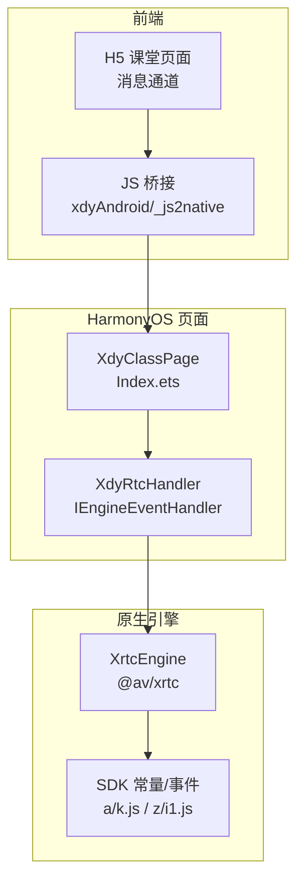
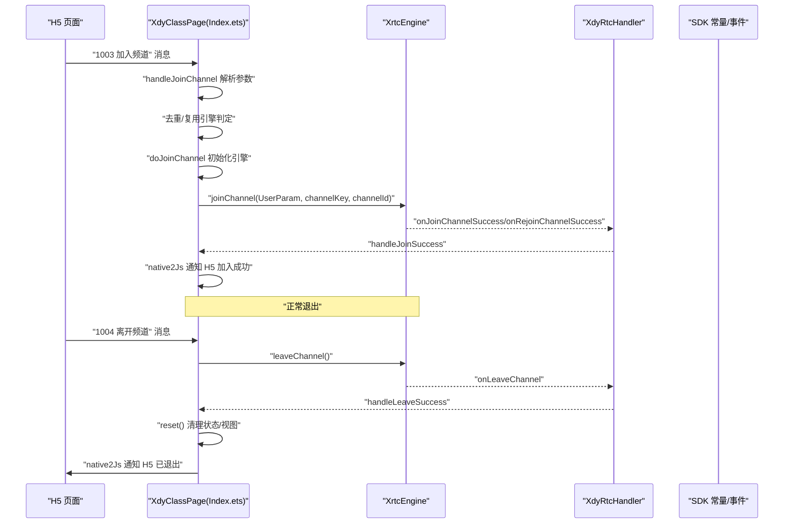
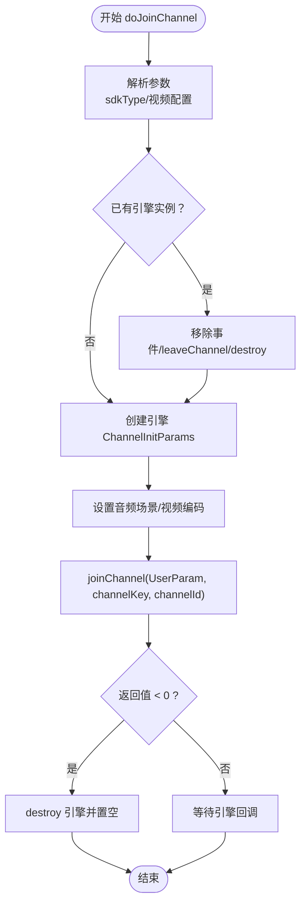
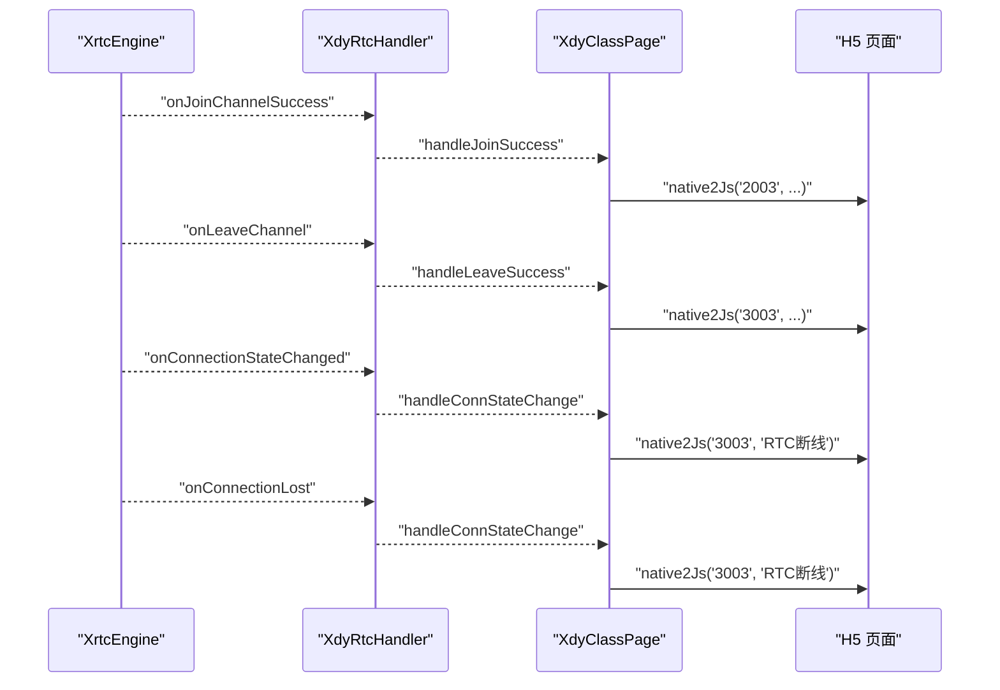
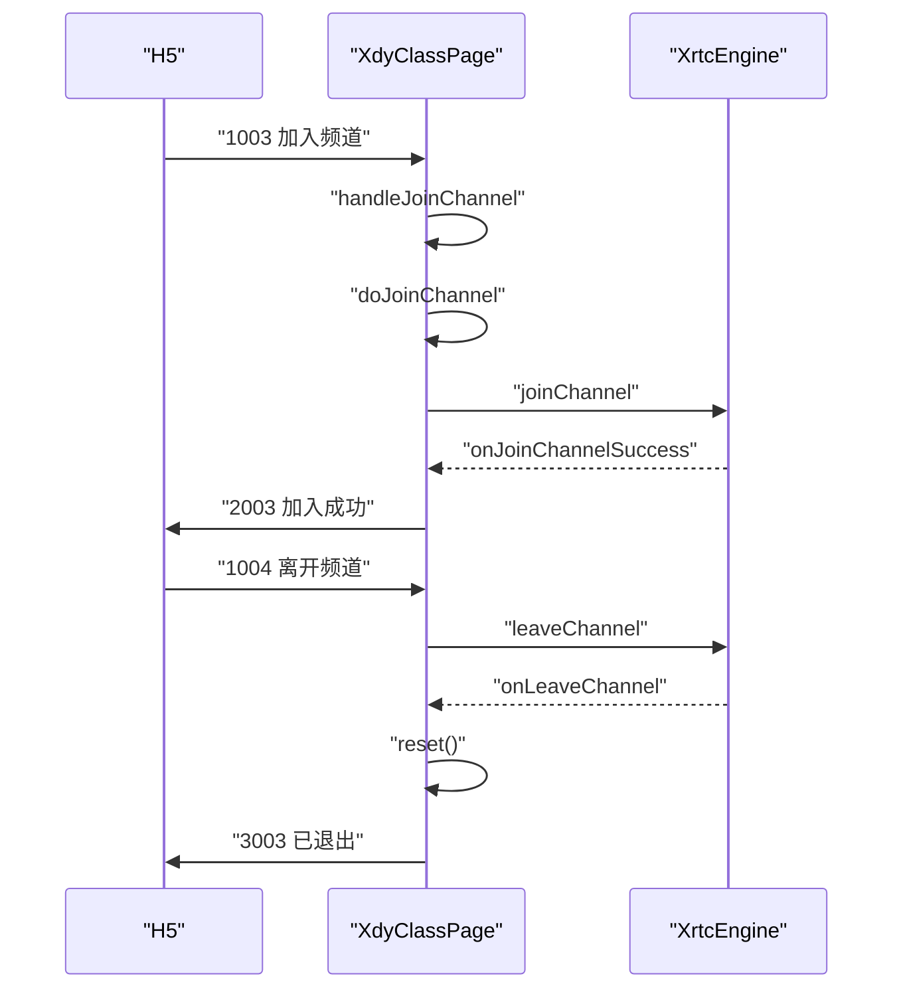
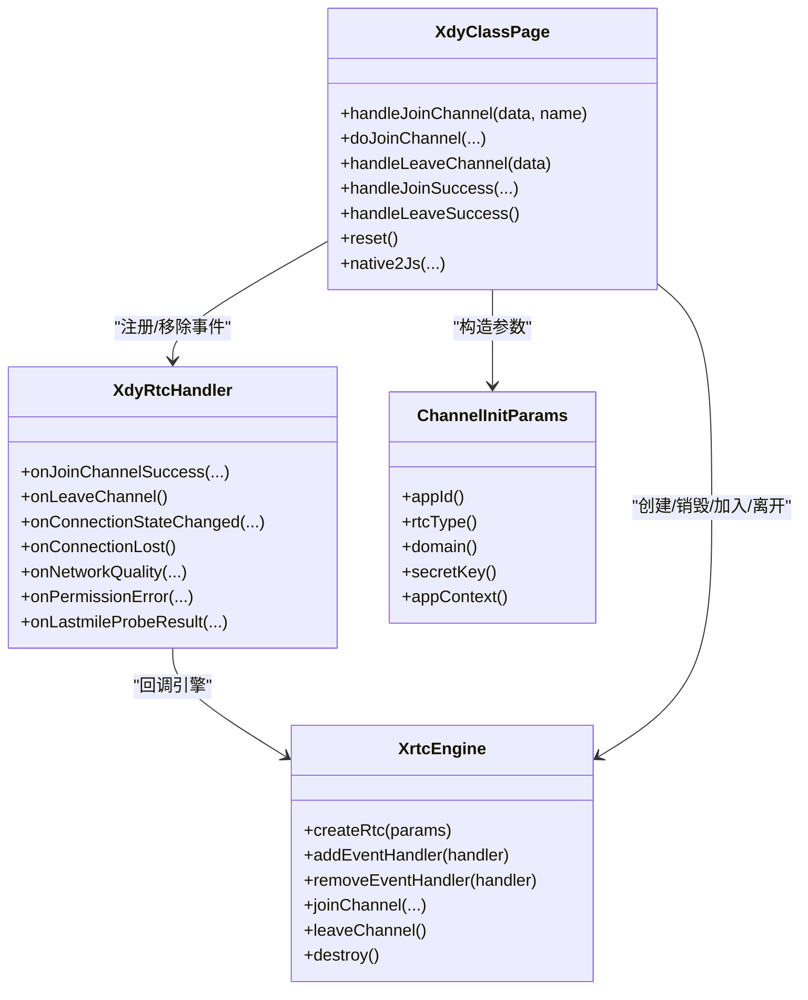

# 频道连接管理

<cite>
**本文档引用的文件**
- [Index.ets](file://entry/src/main/ets/pages/Index.ets)
- [a/k.js](file://entry/.preview/default/cache/default/default@PreviewArkTS/esmodule/debug/oh_modules/.ohpm/@shengwang+rtc-full@k2lhsgd30+2sz3avg+cnkmtslio+sijudityon1rifu=/oh_modules/@shengwang/rtc-full/src/main/ets/a/k.js)
- [z/i1.js](file://entry/.preview/default/cache/default/default@PreviewArkTS/esmodule/debug/oh_modules/.ohpm/@shengwang+rtc-full@k2lhsgd30+2sz3avg+cnkmtslio+sijudityon1rifu=/oh_modules/@shengwang/rtc-full/src/main/ets/z/i1.js)
- [a/b.js](file://entry/.preview/default/cache/default/default@PreviewArkTS/esmodule/debug/oh_modules/.ohpm/@shengwang+rtc-full@k2lhsgd30+2sz3avg+cnkmtslio+sijudityon1rifu=/oh_modules/@shengwang/rtc-full/src/main/ets/a/b.js)
- [a/r.js](file://entry/.preview/default/cache/default/default@PreviewArkTS/esmodule/debug/oh_modules/.ohpm/@shengwang+rtc-full@k2lhsgd30+2sz3avg+cnkmtslio+sijudityon1rifu=/oh_modules/@shengwang/rtc-full/src/main/ets/a/r.js)
- [a/j.js](file://entry/.preview/default/cache/default/default@PreviewArkTS/esmodule/debug/oh_modules/.ohpm/@shengwang+rtc-full@k2lhsgd30+2sz3avg+cnkmtslio+sijudityon1rifu=/oh_modules/@shengwang/rtc-full/src/main/ets/a/j.js)
</cite>

## 目录
1. [简介](#简介)
2. [项目结构](#项目结构)
3. [核心组件](#核心组件)
4. [架构总览](#架构总览)
5. [详细组件分析](#详细组件分析)
6. [依赖关系分析](#依赖关系分析)
7. [性能考虑](#性能考虑)
8. [故障排查指南](#故障排查指南)
9. [结论](#结论)
10. [附录](#附录)

## 简介
本文件系统性梳理该HarmonyOS应用中的“频道连接管理”能力，围绕以下目标展开：
- 完整说明加入/离开频道的流程与关键节点
- 深入解析 doJoinChannel 方法的实现细节
- 明确频道参数配置项（channelId、uid、appId、domain、secretKey、sdkType 等）
- 解释频道模式与密钥验证机制
- 描述连接状态变化处理（onJoinChannelSuccess、onLeaveChannel 等事件回调）
- 说明重连机制、异常处理与状态恢复策略
- 提供最佳实践与常见问题解决方案

## 项目结构
该频道连接管理主要集中在页面入口文件中，通过 WebView 与原生 SDK 引擎交互，形成“H5 消息桥接 → 页面处理 → 原生引擎”的闭环。

图表来源
- [Index.ets](file://entry/src/main/ets/pages/Index.ets#L108-L151)
- [a/k.js](file://entry/.preview/default/cache/default/default@PreviewArkTS/esmodule/debug/oh_modules/.ohpm/@shengwang+rtc-full@k2lhsgd30+2sz3avg+cnkmtslio+sijudityon1rifu=/oh_modules/@shengwang/rtc-full/src/main/ets/a/k.js#L1-L36)
- [z/i1.js](file://entry/.preview/default/cache/default/default@PreviewArkTS/esmodule/debug/oh_modules/.ohpm/@shengwang+rtc-full@k2lhsgd30+2sz3avg+cnkmtslio+sijudityon1rifu=/oh_modules/@shengwang/rtc-full/src/main/ets/z/i1.js#L60-L121)

章节来源
- [Index.ets](file://entry/src/main/ets/pages/Index.ets#L1-L120)

## 核心组件
- 页面控制器：负责接收 H5 消息、调度引擎初始化与加入/离开频道、维护 UI 状态与视图绑定
- 事件处理器：封装 IEngineEventHandler，统一处理引擎回调（加入成功、离开、远端上下线、统计等）
- 原生引擎：基于 @av/xrtc 的 XrtcEngine，承载实际的媒体通道建立与管理
- SDK 常量与事件：提供连接状态、错误码、事件类型等常量定义

章节来源
- [Index.ets](file://entry/src/main/ets/pages/Index.ets#L135-L151)
- [a/k.js](file://entry/.preview/default/cache/default/default@PreviewArkTS/esmodule/debug/oh_modules/.ohpm/@shengwang+rtc-full@k2lhsgd30+2sz3avg+cnkmtslio+sijudityon1rifu=/oh_modules/@shengwang/rtc-full/src/main/ets/a/k.js#L1-L750)

## 架构总览
下图展示从 H5 发起加入频道到引擎回调的完整链路，以及离开频道时的状态清理与重置。

图表来源
- [Index.ets](file://entry/src/main/ets/pages/Index.ets#L536-L581)
- [Index.ets](file://entry/src/main/ets/pages/Index.ets#L924-L985)
- [Index.ets](file://entry/src/main/ets/pages/Index.ets#L1169-L1219)
- [z/i1.js](file://entry/.preview/default/cache/default/default@PreviewArkTS/esmodule/debug/oh_modules/.ohpm/@shengwang+rtc-full@k2lhsgd30+2sz3avg+cnkmtslio+sijudityon1rifu=/oh_modules/@shengwang/rtc-full/src/main/ets/z/i1.js#L60-L121)

## 详细组件分析

### doJoinChannel 方法实现细节
- 参数解析与选择 SDK 类型：根据 sdkType 选择 RtcType（Agora/HRtc/TRtc/WRtc）
- 引擎生命周期管理：若已有引擎实例，先移除事件、leaveChannel、destroy，确保干净重建
- 初始化引擎：构造 ChannelInitParams（包含 appId、rtcType、domain、secretKey、context），调用 XrtcEngine.createRtc 创建引擎
- 设置音频场景与视频编码：依据 channelMode 设置音频场景；根据 videoProfile 配置视频编码器
- 用户参数与加入：设置 UserParam 的 uid，调用 joinChannel 并处理同步返回值（失败时销毁引擎，等待重试）

图表来源
- [Index.ets](file://entry/src/main/ets/pages/Index.ets#L924-L985)

章节来源
- [Index.ets](file://entry/src/main/ets/pages/Index.ets#L924-L985)

### 频道参数配置
- 必填参数
  - channelId：频道标识
  - uid：用户唯一标识
  - appId：应用标识
  - domain：服务域
  - secretKey：密钥
  - sdkType：SDK 类型（Agora/HRtc/TRtc/Yunxin）
- 可选参数
  - channelMode：频道模式（如 GameStreaming/ChatRoom），用于设置音频场景
  - channelKey：频道密钥（Token）
  - videoProfile：视频分辨率/质量配置
  - videoDynamicSubscribe：动态订阅开关

章节来源
- [Index.ets](file://entry/src/main/ets/pages/Index.ets#L68-L72)
- [Index.ets](file://entry/src/main/ets/pages/Index.ets#L924-L985)
- [a/r.js](file://entry/.preview/default/cache/default/default@PreviewArkTS/esmodule/debug/oh_modules/.ohpm/@shengwang+rtc-full@k2lhsgd30+2sz3avg+cnkmtslio+sijudityon1rifu=/oh_modules/@shengwang/rtc-full/src/main/ets/a/r.js#L1-L8)

### 频道模式与密钥验证机制
- 频道模式（channelMode）映射到音频场景：不同模式影响音频场景配置，从而影响音质与延迟策略
- 密钥与 Token：通过 ChannelMediaInfo/ChannelMediaOptions 传递 token 与 channelKey，SDK 在加入时进行鉴权与校验
- 错误码与原因：SDK 提供丰富的连接变更原因与错误码，便于定位鉴权失败、Token 过期等问题

章节来源
- [Index.ets](file://entry/src/main/ets/pages/Index.ets#L968-L972)
- [a/r.js](file://entry/.preview/default/cache/default/default@PreviewArkTS/esmodule/debug/oh_modules/.ohpm/@shengwang+rtc-full@k2lhsgd30+2sz3avg+cnkmtslio+sijudityon1rifu=/oh_modules/@shengwang/rtc-full/src/main/ets/a/r.js#L1-L8)
- [a/j.js](file://entry/.preview/default/cache/default/default@PreviewArkTS/esmodule/debug/oh_modules/.ohpm/@shengwang+rtc-full@k2lhsgd30+2sz3avg+cnkmtslio+sijudityon1rifu=/oh_modules/@shengwang/rtc-full/src/main/ets/a/j.js#L1-L4)
- [a/k.js](file://entry/.preview/default/cache/default/default@PreviewArkTS/esmodule/debug/oh_modules/.ohpm/@shengwang+rtc-full@k2lhsgd30+2sz3avg+cnkmtslio+sijudityon1rifu=/oh_modules/@shengwang/rtc-full/src/main/ets/a/k.js#L12-L36)

### 连接状态变化处理
- 引擎回调映射：XdyRtcHandler 将引擎回调映射到页面处理函数
- 关键回调
  - onJoinChannelSuccess：设置本地扬声器与音量，通知 H5 加入成功
  - onLeaveChannel：清理本地推流、UI 绑定、状态重置
  - onConnectionStateChanged：记录连接状态变化（用于诊断网络波动）
  - onConnectionLost：通知 H5 断线
  - onNetworkQuality：上报网络质量指标
  - onPermissionError：权限相关错误
  - onLastmileProbeResult：链路探测结果

图表来源
- [Index.ets](file://entry/src/main/ets/pages/Index.ets#L1169-L1219)
- [z/i1.js](file://entry/.preview/default/cache/default/default@PreviewArkTS/esmodule/debug/oh_modules/.ohpm/@shengwang+rtc-full@k2lhsgd30+2sz3avg+cnkmtslio+sijudityon1rifu=/oh_modules/@shengwang/rtc-full/src/main/ets/z/i1.js#L60-L121)
- [Index.ets](file://entry/src/main/ets/pages/Index.ets#L1312-L1317)

章节来源
- [Index.ets](file://entry/src/main/ets/pages/Index.ets#L1169-L1219)
- [z/i1.js](file://entry/.preview/default/cache/default/default@PreviewArkTS/esmodule/debug/oh_modules/.ohpm/@shengwang+rtc-full@k2lhsgd30+2sz3avg+cnkmtslio+sijudityon1rifu=/oh_modules/@shengwang/rtc-full/src/main/ets/z/i1.js#L60-L121)

### 加入/离开频道完整流程
- 加入频道
  - H5 发送 1003 消息，携带 JoinChannelData
  - 页面去重：若引擎已存在且已在频道，则补发 join 回调；否则调用 doJoinChannel
  - doJoinChannel 完成引擎初始化、参数配置、joinChannel
  - 引擎回调 onJoinChannelSuccess，页面通知 H5 成功
- 离开频道
  - H5 发送 1004 消息，携带 LeaveChannelData
  - 页面调用 leaveChannel，移除事件，销毁引擎（保留活跃状态以便复用）
  - 引擎回调 onLeaveChannel，页面 reset 清理状态与视图，通知 H5

图表来源
- [Index.ets](file://entry/src/main/ets/pages/Index.ets#L536-L581)
- [Index.ets](file://entry/src/main/ets/pages/Index.ets#L924-L985)
- [Index.ets](file://entry/src/main/ets/pages/Index.ets#L1169-L1219)

章节来源
- [Index.ets](file://entry/src/main/ets/pages/Index.ets#L536-L581)
- [Index.ets](file://entry/src/main/ets/pages/Index.ets#L1169-L1219)

### 重连机制、异常处理与状态恢复
- 引擎异常处理
  - joinChannel 同步返回失败时，销毁引擎并置空，等待下次 1003 重新创建
  - onLoadIntercept 场景下，若引擎残留，doJoinChannel 中再次销毁并重建
- 状态恢复策略
  - 退出课堂不 destroy 引擎，保持活跃，复用引擎直接 joinChannel
  - reset() 清理本地推流、解除视频绑定、清空数据结构，确保下次进入无残留
- 连接状态监控
  - onConnectionStateChanged/onConnectionLost 记录断线事件，通知 H5
  - SDK 提供丰富的连接变更原因与错误码，便于定位问题

章节来源
- [Index.ets](file://entry/src/main/ets/pages/Index.ets#L935-L951)
- [Index.ets](file://entry/src/main/ets/pages/Index.ets#L977-L984)
- [Index.ets](file://entry/src/main/ets/pages/Index.ets#L618-L632)
- [Index.ets](file://entry/src/main/ets/pages/Index.ets#L651-L693)
- [a/k.js](file://entry/.preview/default/cache/default/default@PreviewArkTS/esmodule/debug/oh_modules/.ohpm/@shengwang+rtc-full@k2lhsgd30+2sz3avg+cnkmtslio+sijudityon1rifu=/oh_modules/@shengwang/rtc-full/src/main/ets/a/k.js#L12-L36)

## 依赖关系分析
- 页面与引擎
  - XdyClassPage 通过 XrtcEngine 管理频道生命周期
  - XdyRtcHandler 实现 IEngineEventHandler，承接引擎回调
- 引擎与 SDK
  - 引擎初始化依赖 ChannelInitParams（appId、rtcType、domain、secretKey、context）
  - 引擎回调事件映射至 SDK 常量（连接状态、错误码、事件类型）
- H5 与页面
  - 通过 js2native/native2js 双向通信，H5 发送 1003/1004，页面回传 2003/3003

图表来源
- [Index.ets](file://entry/src/main/ets/pages/Index.ets#L135-L151)
- [Index.ets](file://entry/src/main/ets/pages/Index.ets#L1169-L1219)
- [Index.ets](file://entry/src/main/ets/pages/Index.ets#L924-L985)
- [Index.ets](file://entry/src/main/ets/pages/Index.ets#L119-L132)

章节来源
- [Index.ets](file://entry/src/main/ets/pages/Index.ets#L1169-L1219)
- [Index.ets](file://entry/src/main/ets/pages/Index.ets#L924-L985)

## 性能考虑
- 引擎复用：退出不销毁引擎，复用以减少初始化开销
- 动态订阅：videoDynamicSubscribe 可按需开启，降低带宽与 CPU 占用
- 视频编码配置：根据 videoProfile 精细控制分辨率与帧率，平衡画质与性能
- 统计上报：本地/远端音视频统计按需合并上报，避免频繁通信

## 故障排查指南
- 加入失败
  - 检查 appId/domain/secretKey/sdkType 是否正确
  - 检查 channelKey/token 是否有效且未过期
  - 查看 SDK 错误码与连接变更原因
- 断线与重连
  - 关注 onConnectionStateChanged/onConnectionLost 回调
  - 结合 lastmile 探测结果评估网络质量
- 视频/音频异常
  - 检查 enableLocalAudio/enableLocalVideo 与 muteLocal* 的状态一致性
  - 确认 surfaceId 就绪后再绑定视频
- 退出后残留
  - 确保 leaveChannel 后 reset() 清理视图与数据
  - 避免重复创建引擎导致资源泄漏

章节来源
- [a/k.js](file://entry/.preview/default/cache/default/default@PreviewArkTS/esmodule/debug/oh_modules/.ohpm/@shengwang+rtc-full@k2lhsgd30+2sz3avg+cnkmtslio+sijudityon1rifu=/oh_modules/@shengwang/rtc-full/src/main/ets/a/k.js#L79-L147)
- [z/i1.js](file://entry/.preview/default/cache/default/default@PreviewArkTS/esmodule/debug/oh_modules/.ohpm/@shengwang+rtc-full@k2lhsgd30+2sz3avg+cnkmtslio+sijudityon1rifu=/oh_modules/@shengwang/rtc-full/src/main/ets/z/i1.js#L493-L522)
- [Index.ets](file://entry/src/main/ets/pages/Index.ets#L1312-L1317)

## 结论
该频道连接管理方案通过“H5 消息桥接 + 页面状态机 + 原生引擎回调”的组合，实现了稳定、可控的加入/离开流程。其关键优势在于：
- 参数化配置清晰，支持多 SDK 类型与多种频道模式
- 引擎复用与状态清理策略有效降低了初始化成本与内存占用
- 事件驱动的回调体系覆盖了连接、统计、权限等关键场景
- 通过 SDK 常量与错误码，具备良好的可观测性与可诊断性

## 附录
- 最佳实践
  - 严格区分“刷新场景”与“退出场景”，避免重复销毁/重建
  - 在 joinChannel 前确保 surfaceId 就绪，避免绑定失败
  - 合理设置音频场景与视频配置，兼顾体验与性能
  - 对异常与断线进行分级处理，必要时引导用户重试
- 常见问题
  - “引擎残留导致重进失败”：保持引擎活跃，复用引擎直接 joinChannel
  - “Token 过期/无效”：结合 SDK 错误码与重试策略处理
  - “断线后无法自动恢复”：关注 onConnectionStateChanged/onConnectionLost，必要时触发重连