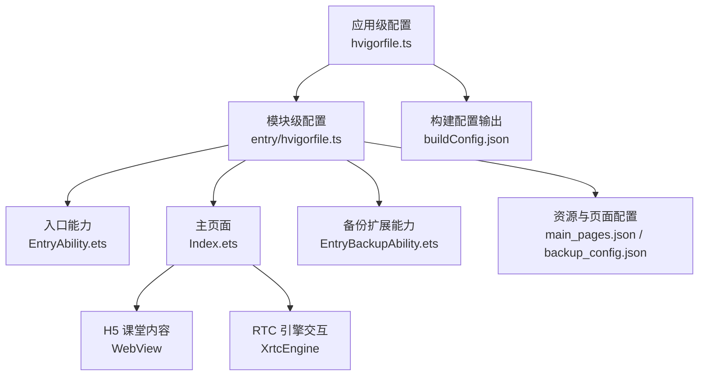
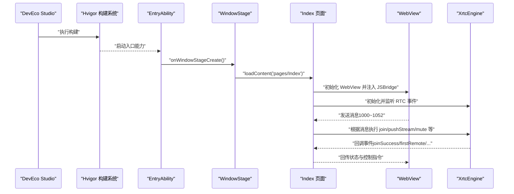
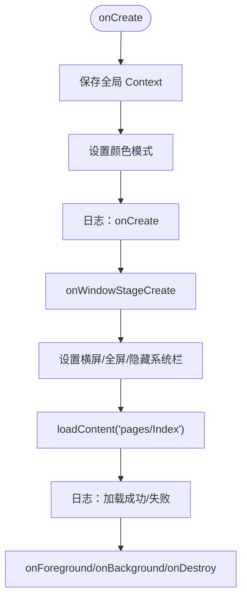
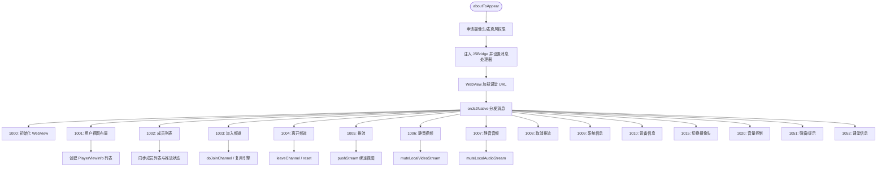
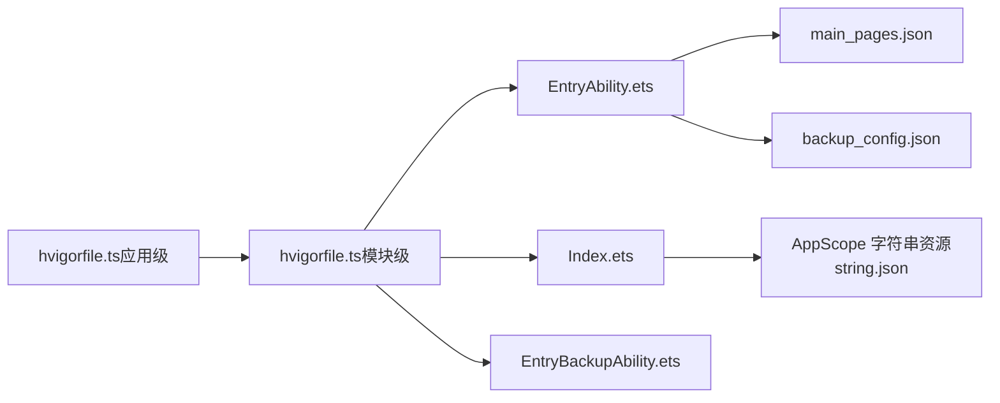

# 快速开始

<cite>
**本文引用的文件**
- [EntryAbility.ets](file://entry/src/main/ets/entryability/EntryAbility.ets)
- [Index.ets](file://entry/src/main/ets/pages/Index.ets)
- [EntryBackupAbility.ets](file://entry/src/main/ets/entrybackupability/EntryBackupAbility.ets)
- [main_pages.json](file://entry/src/main/resources/base/profile/main_pages.json)
- [backup_config.json](file://entry/src/main/resources/base/profile/backup_config.json)
- [string.json](file://AppScope/resources/base/element/string.json)
- [hvigorfile.ts（应用级）](file://hvigorfile.ts)
- [hvigorfile.ts（模块级）](file://entry/hvigorfile.ts)
- [buildConfig.json](file://entry/build/config/buildConfig.json)
- [Ability.test.ets](file://entry/src/ohosTest/ets/test/Ability.test.ets)
- [List.test.ets](file://entry/src/test/List.test.ets)
- [harmonylog.md](file://harmonylog.md)
</cite>

## 目录
1. [简介](#简介)
2. [项目结构](#项目结构)
3. [核心组件](#核心组件)
4. [架构总览](#架构总览)
5. [详细组件分析](#详细组件分析)
6. [依赖关系分析](#依赖关系分析)
7. [性能注意事项](#性能注意事项)
8. [故障排查指南](#故障排查指南)
9. [结论](#结论)
10. [附录](#附录)

## 简介
本指南面向首次接触 HarmonyOS 在线课堂应用的开发者，目标是在最短时间内完成开发环境搭建、项目克隆、编译与运行，并进行基础功能验证与问题排查。项目采用 ArkTS 语言与 HarmonyOS 原生能力，结合 WebView 承载 H5 课堂内容，并通过 RTC 引擎实现音视频互动。

## 项目结构
项目采用“应用级 + 模块级”双层构建配置，入口模块为 entry，应用级配置位于根目录，模块级配置位于 entry 目录。资源与页面集中在 entry/src/main 下，测试用例位于 entry/src/test 与 entry/src/ohosTest。

图表来源
- [hvigorfile.ts（应用级）](file://hvigorfile.ts#L1-L6)
- [hvigorfile.ts（模块级）](file://entry/hvigorfile.ts#L1-L6)
- [EntryAbility.ets](file://entry/src/main/ets/entryability/EntryAbility.ets#L1-L65)
- [Index.ets](file://entry/src/main/ets/pages/Index.ets#L1-L120)
- [EntryBackupAbility.ets](file://entry/src/main/ets/entrybackupability/EntryBackupAbility.ets#L1-L16)
- [main_pages.json](file://entry/src/main/resources/base/profile/main_pages.json#L1-L6)
- [backup_config.json](file://entry/src/main/resources/base/profile/backup_config.json#L1-L3)
- [buildConfig.json](file://entry/build/config/buildConfig.json#L1-L1)

章节来源
- [hvigorfile.ts（应用级）](file://hvigorfile.ts#L1-L6)
- [hvigorfile.ts（模块级）](file://entry/hvigorfile.ts#L1-L6)
- [EntryAbility.ets](file://entry/src/main/ets/entryability/EntryAbility.ets#L1-L65)
- [Index.ets](file://entry/src/main/ets/pages/Index.ets#L1-L120)
- [EntryBackupAbility.ets](file://entry/src/main/ets/entrybackupability/EntryBackupAbility.ets#L1-L16)
- [main_pages.json](file://entry/src/main/resources/base/profile/main_pages.json#L1-L6)
- [backup_config.json](file://entry/src/main/resources/base/profile/backup_config.json#L1-L3)
- [buildConfig.json](file://entry/build/config/buildConfig.json#L1-L1)

## 核心组件
- 应用级构建配置：定义应用级任务与插件，用于统一构建流程。
- 模块级构建配置：定义模块级任务与插件，承载入口能力、页面与备份扩展能力的编译与打包。
- 入口能力（EntryAbility）：负责窗口阶段创建、页面加载、生命周期日志与全局上下文保存。
- 主页面（Index）：承载 WebView 课堂内容，注入 JSBridge，处理 RTC 消息与视图布局，管理本地/远端音视频渲染。
- 备份扩展能力（EntryBackupAbility）：提供备份与恢复能力的占位实现。
- 资源与页面配置：声明首页路径与备份策略；应用名称由 AppScope 字符串资源提供。

章节来源
- [hvigorfile.ts（应用级）](file://hvigorfile.ts#L1-L6)
- [hvigorfile.ts（模块级）](file://entry/hvigorfile.ts#L1-L6)
- [EntryAbility.ets](file://entry/src/main/ets/entryability/EntryAbility.ets#L14-L65)
- [Index.ets](file://entry/src/main/ets/pages/Index.ets#L195-L365)
- [EntryBackupAbility.ets](file://entry/src/main/ets/entrybackupability/EntryBackupAbility.ets#L6-L16)
- [main_pages.json](file://entry/src/main/resources/base/profile/main_pages.json#L1-L6)
- [backup_config.json](file://entry/src/main/resources/base/profile/backup_config.json#L1-L3)
- [string.json](file://AppScope/resources/base/element/string.json#L1-L9)

## 架构总览
应用启动流程：DevEco Studio 触发构建 → hvigor 执行任务 → 加载 EntryAbility → 创建窗口并加载 Index 页面 → WebView 注入 JSBridge → 与 H5 课堂通信 → 通过 RTC 引擎建立音视频通道。

图表来源
- [EntryAbility.ets](file://entry/src/main/ets/entryability/EntryAbility.ets#L31-L49)
- [Index.ets](file://entry/src/main/ets/pages/Index.ets#L262-L365)
- [Index.ets](file://entry/src/main/ets/pages/Index.ets#L367-L429)

## 详细组件分析

### 入口能力（EntryAbility）
职责与行为
- 保存全局上下文，便于 SDK 使用
- 设置窗口首选方向为横屏、全屏、隐藏系统栏
- 加载主页面 Index
- 生命周期日志输出，便于调试

图表来源
- [EntryAbility.ets](file://entry/src/main/ets/entryability/EntryAbility.ets#L14-L65)

章节来源
- [EntryAbility.ets](file://entry/src/main/ets/entryability/EntryAbility.ets#L14-L65)

### 主页面（Index）
职责与行为
- WebView 加载 H5 课堂 URL，注入 JSBridge，代理 H5 与原生的消息
- 解析 H5 发送的 nativeWebRtcAction 消息（类型 1000~1052），驱动本地视图与 RTC 行为
- 管理 PlayerViewInfo 列表，动态创建/销毁视频视图
- 申请摄像头与麦克风权限
- 处理加入/离开频道、推流/取消推流、静音/取消静音、刷新/退出等业务流程

图表来源
- [Index.ets](file://entry/src/main/ets/pages/Index.ets#L229-L260)
- [Index.ets](file://entry/src/main/ets/pages/Index.ets#L367-L429)
- [Index.ets](file://entry/src/main/ets/pages/Index.ets#L541-L586)
- [Index.ets](file://entry/src/main/ets/pages/Index.ets#L588-L654)
- [Index.ets](file://entry/src/main/ets/pages/Index.ets#L722-L733)
- [Index.ets](file://entry/src/main/ets/pages/Index.ets#L735-L778)
- [Index.ets](file://entry/src/main/ets/pages/Index.ets#L780-L800)

章节来源
- [Index.ets](file://entry/src/main/ets/pages/Index.ets#L195-L365)
- [Index.ets](file://entry/src/main/ets/pages/Index.ets#L367-L429)
- [Index.ets](file://entry/src/main/ets/pages/Index.ets#L541-L654)
- [Index.ets](file://entry/src/main/ets/pages/Index.ets#L722-L800)

### 备份扩展能力（EntryBackupAbility）
职责与行为
- 提供备份与恢复的占位实现，便于后续扩展备份策略

章节来源
- [EntryBackupAbility.ets](file://entry/src/main/ets/entrybackupability/EntryBackupAbility.ets#L6-L16)

## 依赖关系分析
- 构建系统：应用级 hvigorfile.ts 与模块级 hvigorfile.ts 共同决定编译与打包流程
- 入口与页面：EntryAbility 负责窗口与页面加载；Index 负责 WebView 与 RTC 交互
- 资源与配置：main_pages.json 指定首页；backup_config.json 控制备份策略；string.json 提供应用名

图表来源
- [hvigorfile.ts（应用级）](file://hvigorfile.ts#L1-L6)
- [hvigorfile.ts（模块级）](file://entry/hvigorfile.ts#L1-L6)
- [EntryAbility.ets](file://entry/src/main/ets/entryability/EntryAbility.ets#L1-L65)
- [Index.ets](file://entry/src/main/ets/pages/Index.ets#L1-L120)
- [EntryBackupAbility.ets](file://entry/src/main/ets/entrybackupability/EntryBackupAbility.ets#L1-L16)
- [main_pages.json](file://entry/src/main/resources/base/profile/main_pages.json#L1-L6)
- [backup_config.json](file://entry/src/main/resources/base/profile/backup_config.json#L1-L3)
- [string.json](file://AppScope/resources/base/element/string.json#L1-L9)

章节来源
- [hvigorfile.ts（应用级）](file://hvigorfile.ts#L1-L6)
- [hvigorfile.ts（模块级）](file://entry/hvigorfile.ts#L1-L6)
- [EntryAbility.ets](file://entry/src/main/ets/entryability/EntryAbility.ets#L1-L65)
- [Index.ets](file://entry/src/main/ets/pages/Index.ets#L1-L120)
- [EntryBackupAbility.ets](file://entry/src/main/ets/entrybackupability/EntryBackupAbility.ets#L1-L16)
- [main_pages.json](file://entry/src/main/resources/base/profile/main_pages.json#L1-L6)
- [backup_config.json](file://entry/src/main/resources/base/profile/backup_config.json#L1-L3)
- [string.json](file://AppScope/resources/base/element/string.json#L1-L9)

## 性能注意事项
- 视图复用与销毁：离开频道时仅解除绑定并清空视图数组，不销毁 RTC 引擎，避免重复初始化带来的性能损耗
- 预设窗口参数：横屏、全屏、隐藏系统栏减少布局切换成本
- WebView 缓存与 Cookie：按需清理，避免历史状态影响新课堂体验
- 日志与调试：利用 hilog 输出关键节点日志，便于定位性能瓶颈

## 故障排查指南
- 权限申请失败或异常
  - 现象：摄像头/麦克风权限申请失败或抛出异常
  - 排查：确认 EntryAbility 中权限申请逻辑与设备支持情况
  - 参考
    - [EntryAbility.ets](file://entry/src/main/ets/entryability/EntryAbility.ets#L242-L251)
- WebView 加载失败
  - 现象：Index 页面无法加载或报错
  - 排查：检查 loadContent 调用与日志输出；确认 URL 正确性
  - 参考
    - [EntryAbility.ets](file://entry/src/main/ets/entryability/EntryAbility.ets#L42-L48)
- 加入频道异常或重复加入
  - 现象：重复 1003 或引擎未完成加入
  - 排查：检查引擎是否存在与频道 ID 是否一致；必要时复用引擎避免重复销毁
  - 参考
    - [Index.ets](file://entry/src/main/ets/pages/Index.ets#L552-L569)
- 音视频推流失败
  - 现象：本地/远端无法看到画面或听到声音
  - 排查：确认静音状态、推流绑定是否成功、成员列表是否完整
  - 参考
    - [Index.ets](file://entry/src/main/ets/pages/Index.ets#L740-L767)
    - [Index.ets](file://entry/src/main/ets/pages/Index.ets#L722-L733)
- 日志辅助
  - 使用 harmonylog.md 中的日志片段定位问题发生阶段
  - 参考
    - [harmonylog.md](file://harmonylog.md#L1-L243)

章节来源
- [EntryAbility.ets](file://entry/src/main/ets/entryability/EntryAbility.ets#L242-L251)
- [EntryAbility.ets](file://entry/src/main/ets/entryability/EntryAbility.ets#L42-L48)
- [Index.ets](file://entry/src/main/ets/pages/Index.ets#L552-L569)
- [Index.ets](file://entry/src/main/ets/pages/Index.ets#L740-L767)
- [Index.ets](file://entry/src/main/ets/pages/Index.ets#L722-L733)
- [harmonylog.md](file://harmonylog.md#L1-L243)

## 结论
通过本指南，您可以在 HarmonyOS 上快速搭建并运行在线课堂应用。建议先完成环境与工具准备，再按顺序执行克隆、编译与运行，并结合日志与测试用例进行基础功能验证。遇到问题时，可依据权限、WebView、加入频道与推流等关键路径进行排查。

## 附录

### 开发环境与工具准备
- DevEco Studio：HarmonyOS 官方 IDE，提供项目模板、模拟器与真机调试能力
- HarmonyOS SDK：随 DevEco Studio 安装，包含编译工具链与系统 API
- Node.js：用于构建脚本与依赖管理（由 hvigor 管理）
- 模拟器或真机：用于运行与调试

### 项目克隆、编译与运行
- 克隆仓库至本地
- 在 DevEco Studio 中打开项目根目录
- 点击“构建”生成产物
- 选择模拟器或连接真机，点击“运行”启动应用
- 若需查看构建配置，可参考
  - [buildConfig.json](file://entry/build/config/buildConfig.json#L1-L1)

章节来源
- [buildConfig.json](file://entry/build/config/buildConfig.json#L1-L1)

### 基础功能测试方法
- 自动化测试入口
  - [Ability.test.ets](file://entry/src/ohosTest/ets/test/Ability.test.ets#L1-L35)
  - [List.test.ets](file://entry/src/test/List.test.ets#L1-L5)
- 手动验证要点
  - 启动后检查窗口方向与全屏状态
  - 进入课堂后观察 WebView 加载与 JSBridge 注入
  - 申请权限后尝试加入频道并推流
  - 切换摄像头、静音/取消静音、离开频道并刷新

章节来源
- [Ability.test.ets](file://entry/src/ohosTest/ets/test/Ability.test.ets#L1-L35)
- [List.test.ets](file://entry/src/test/List.test.ets#L1-L5)