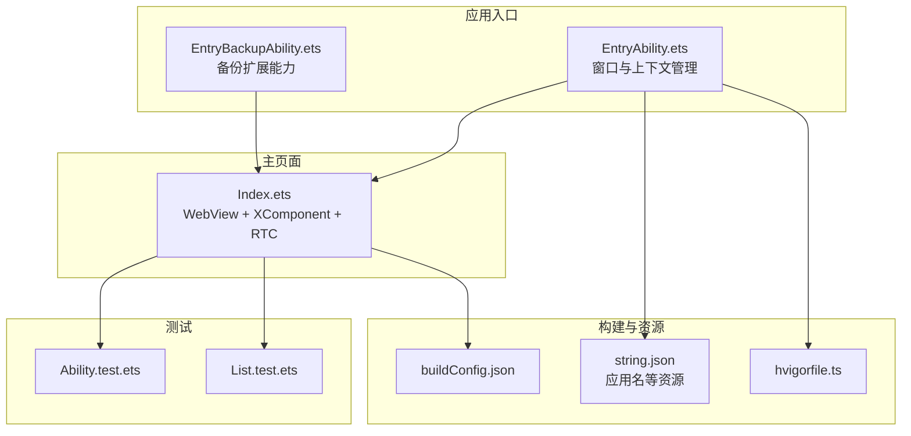
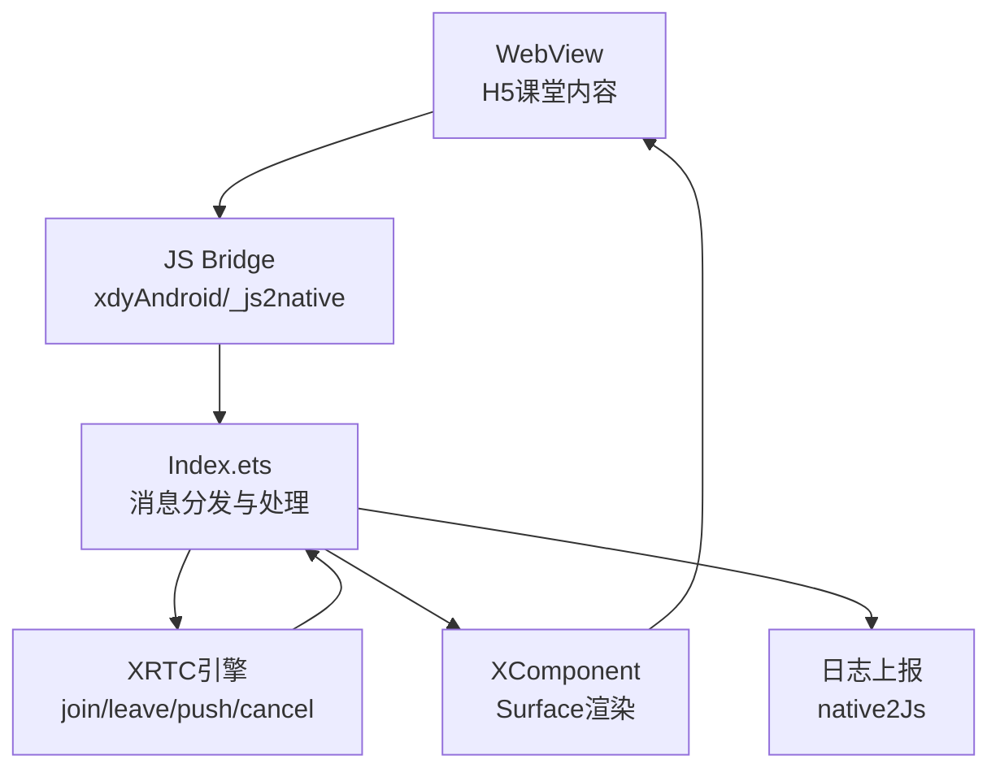
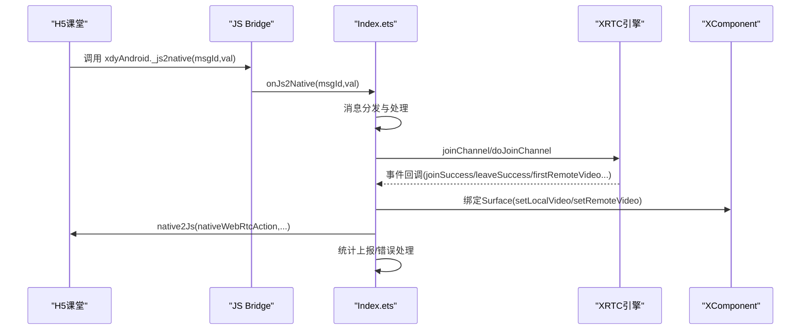
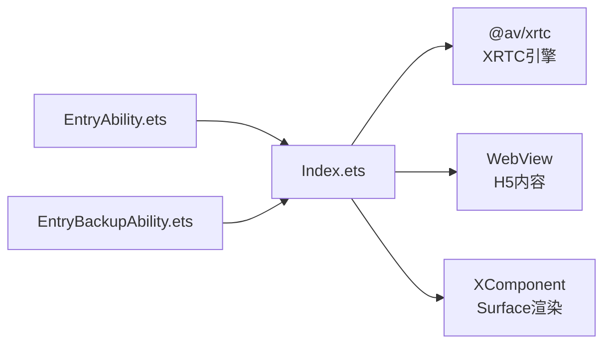
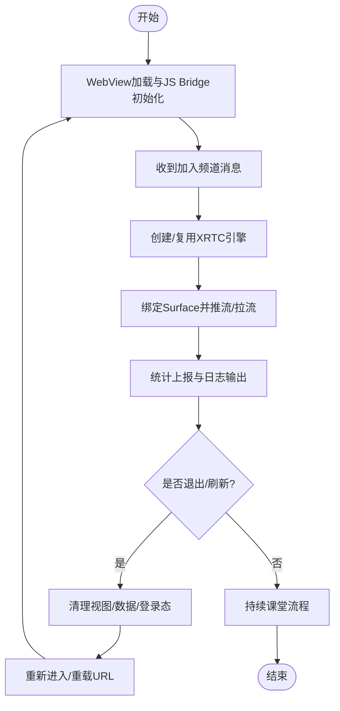

# 故障排除与优化

<cite>
**本文引用的文件**
- [Index.ets](file://entry/src/main/ets/pages/Index.ets)
- [EntryAbility.ets](file://entry/src/main/ets/entryability/EntryAbility.ets)
- [EntryBackupAbility.ets](file://entry/src/main/ets/entrybackupability/EntryBackupAbility.ets)
- [harmonylog.md](file://harmonylog.md)
- [鸿蒙端实现分析与优化建议.md](file://鸿蒙端实现分析与优化建议.md)
- [Ability.test.ets](file://entry/src/ohosTest/ets/test/Ability.test.ets)
- [List.test.ets](file://entry/src/ohosTest/ets/test/List.test.ets)
- [List.test.ets](file://entry/src/test/List.test.ets)
- [buildConfig.json](file://entry/build/config/buildConfig.json)
- [string.json](file://AppScope/resources/base/element/string.json)
- [hvigorfile.ts](file://hvigorfile.ts)
</cite>

## 目录
1. [简介](#简介)
2. [项目结构](#项目结构)
3. [核心组件](#核心组件)
4. [架构总览](#架构总览)
5. [详细组件分析](#详细组件分析)
6. [依赖关系分析](#依赖关系分析)
7. [性能考虑](#性能考虑)
8. [故障排除指南](#故障排除指南)
9. [结论](#结论)
10. [附录](#附录)

## 简介
本文件面向HarmonyOS在线课堂应用的故障排除与优化，围绕ArkTS + WebView + XComponent三层架构，系统梳理常见问题的识别、诊断与解决路径；提供性能优化策略（内存、网络、UI渲染）；解释日志分析方法与工具使用；给出系统兼容性处理方案；并总结最佳实践与监控预警机制建设思路。

## 项目结构
- 应用入口能力与窗口生命周期管理位于入口能力文件，承载全局上下文与窗口配置。
- 主页面采用ArkTS组件化开发，集成WebView与XComponent，负责课堂内容展示与音视频渲染。
- 测试用例覆盖基础能力验证，便于回归与边界条件测试。
- 构建配置与资源清单位于构建产物与资源目录，用于定位编译与打包参数。

图表来源
- [EntryAbility.ets](file://entry/src/main/ets/entryability/EntryAbility.ets#L1-L65)
- [EntryBackupAbility.ets](file://entry/src/main/ets/entrybackupability/EntryBackupAbility.ets#L1-L16)
- [Index.ets](file://entry/src/main/ets/pages/Index.ets#L1-L1436)
- [Ability.test.ets](file://entry/src/ohosTest/ets/test/Ability.test.ets#L1-L35)
- [List.test.ets](file://entry/src/ohosTest/ets/test/List.test.ets#L1-L5)
- [List.test.ets](file://entry/src/test/List.test.ets#L1-L5)
- [buildConfig.json](file://entry/build/config/buildConfig.json#L1-L1)
- [string.json](file://AppScope/resources/base/element/string.json#L1-L9)
- [hvigorfile.ts](file://hvigorfile.ts#L1-L6)

章节来源
- [EntryAbility.ets](file://entry/src/main/ets/entryability/EntryAbility.ets#L1-L65)
- [EntryBackupAbility.ets](file://entry/src/main/ets/entrybackupability/EntryBackupAbility.ets#L1-L16)
- [Index.ets](file://entry/src/main/ets/pages/Index.ets#L1-L1436)
- [Ability.test.ets](file://entry/src/ohosTest/ets/test/Ability.test.ets#L1-L35)
- [List.test.ets](file://entry/src/ohosTest/ets/test/List.test.ets#L1-L5)
- [List.test.ets](file://entry/src/test/List.test.ets#L1-L5)
- [buildConfig.json](file://entry/build/config/buildConfig.json#L1-L1)
- [string.json](file://AppScope/resources/base/element/string.json#L1-L9)
- [hvigorfile.ts](file://hvigorfile.ts#L1-L6)

## 核心组件
- 入口能力（EntryAbility）：负责窗口方向、全屏、系统栏隐藏、内容加载与生命周期日志。
- 主页面（Index.ets）：承载WebView课堂内容、XComponent视频浮层、JS Bridge通信、XRTC引擎管理、音视频控制、统计上报与错误处理。
- 备份扩展（EntryBackupAbility）：提供备份与恢复能力的占位实现。
- 测试用例：基础能力与断言示例，便于扩展更多单元/集成测试。

章节来源
- [EntryAbility.ets](file://entry/src/main/ets/entryability/EntryAbility.ets#L14-L64)
- [Index.ets](file://entry/src/main/ets/pages/Index.ets#L195-L360)
- [EntryBackupAbility.ets](file://entry/src/main/ets/entrybackupability/EntryBackupAbility.ets#L6-L15)
- [Ability.test.ets](file://entry/src/ohosTest/ets/test/Ability.test.ets#L25-L33)

## 架构总览
应用采用“WebView（H5课堂）+ XComponent（视频浮层）+ ArkTS原生层（XRTC引擎）”的三层架构，通过JS Bridge与H5交互，XComponent叠加在WebView之上进行视频渲染，ArkTS层负责引擎初始化、事件处理、统计上报与生命周期管理。

图表来源
- [Index.ets](file://entry/src/main/ets/pages/Index.ets#L200-L360)
- [Index.ets](file://entry/src/main/ets/pages/Index.ets#L363-L424)
- [Index.ets](file://entry/src/main/ets/pages/Index.ets#L988-L1001)

章节来源
- [Index.ets](file://entry/src/main/ets/pages/Index.ets#L200-L360)
- [Index.ets](file://entry/src/main/ets/pages/Index.ets#L363-L424)
- [Index.ets](file://entry/src/main/ets/pages/Index.ets#L988-L1001)

## 详细组件分析

### 主页面组件（Index.ets）
- WebView配置与拦截：支持UA伪装、缓存禁用、媒体手势、缩放控制、URL拦截与登录态清除。
- JS Bridge：提供双向通信，H5侧通过window.xdyAndroid调用原生，原生通过_window.js2native回推消息。
- XRTC引擎：创建、初始化、加入/离开频道、事件回调、统计上报、音视频控制与错误处理。
- 视频渲染：XComponent + Surface绑定，支持本地/远端视频渲染与静音控制。
- 生命周期：进入/消失时的资源释放与状态重置，避免引擎残留与内存泄漏。

图表来源
- [Index.ets](file://entry/src/main/ets/pages/Index.ets#L363-L424)
- [Index.ets](file://entry/src/main/ets/pages/Index.ets#L924-L985)
- [Index.ets](file://entry/src/main/ets/pages/Index.ets#L1169-L1219)
- [Index.ets](file://entry/src/main/ets/pages/Index.ets#L1410-L1430)
- [Index.ets](file://entry/src/main/ets/pages/Index.ets#L988-L1001)

章节来源
- [Index.ets](file://entry/src/main/ets/pages/Index.ets#L200-L360)
- [Index.ets](file://entry/src/main/ets/pages/Index.ets#L363-L424)
- [Index.ets](file://entry/src/main/ets/pages/Index.ets#L924-L985)
- [Index.ets](file://entry/src/main/ets/pages/Index.ets#L1169-L1219)
- [Index.ets](file://entry/src/main/ets/pages/Index.ets#L1410-L1430)
- [Index.ets](file://entry/src/main/ets/pages/Index.ets#L988-L1001)

### 入口能力（EntryAbility.ets）
- 设置窗口方向为横屏、全屏、隐藏系统栏。
- 加载主页面内容并记录生命周期日志。
- 提供全局上下文供SDK使用。

章节来源
- [EntryAbility.ets](file://entry/src/main/ets/entryability/EntryAbility.ets#L31-L49)
- [EntryAbility.ets](file://entry/src/main/ets/entryability/EntryAbility.ets#L14-L29)

### 备份扩展（EntryBackupAbility.ets）
- 提供备份与恢复的占位实现，便于后续扩展。

章节来源
- [EntryBackupAbility.ets](file://entry/src/main/ets/entrybackupability/EntryBackupAbility.ets#L6-L15)

### 测试用例（Ability.test.ets）
- 展示基础测试框架与断言用法，可用于扩展课堂核心流程的自动化测试。

章节来源
- [Ability.test.ets](file://entry/src/ohosTest/ets/test/Ability.test.ets#L25-L33)

## 依赖关系分析
- 主页面依赖XRTC SDK与ArkTS UI框架，通过@av/xrtc进行引擎管理。
- WebView与XComponent分别依赖系统组件能力，通过JS Bridge与Surface API进行交互。
- 入口能力提供全局上下文，供主页面获取应用上下文与权限管理。

图表来源
- [Index.ets](file://entry/src/main/ets/pages/Index.ets#L1-L12)
- [Index.ets](file://entry/src/main/ets/pages/Index.ets#L200-L360)
- [Index.ets](file://entry/src/main/ets/pages/Index.ets#L154-L192)
- [EntryAbility.ets](file://entry/src/main/ets/entryability/EntryAbility.ets#L1-L6)
- [EntryBackupAbility.ets](file://entry/src/main/ets/entrybackupability/EntryBackupAbility.ets#L1-L2)

章节来源
- [Index.ets](file://entry/src/main/ets/pages/Index.ets#L1-L12)
- [Index.ets](file://entry/src/main/ets/pages/Index.ets#L200-L360)
- [Index.ets](file://entry/src/main/ets/pages/Index.ets#L154-L192)
- [EntryAbility.ets](file://entry/src/main/ets/entryability/EntryAbility.ets#L1-L6)
- [EntryBackupAbility.ets](file://entry/src/main/ets/entrybackupability/EntryBackupAbility.ets#L1-L2)

## 性能考虑
- 内存管理
  - 避免频繁创建数组副本，减少不必要的状态更新与渲染。
  - 在长时间运行场景下，定期清理远端统计缓存，降低内存占用。
  - 生命周期结束时释放WebView缓存与Cookie，避免残留影响后续进入。
- 网络优化
  - WebView缓存禁用与UA伪装，确保H5正确识别移动端并加载合适资源。
  - 监听网络状态变化，在断网时提示并暂停音视频操作。
- UI渲染优化
  - 使用XComponent叠加在WebView之上，通过透明穿透避免遮挡。
  - 合理设置视频分辨率与渲染模式，平衡清晰度与性能。
  - 优先匹配角色的视图槽位，减少无效绑定与重绘。

章节来源
- [Index.ets](file://entry/src/main/ets/pages/Index.ets#L200-L360)
- [Index.ets](file://entry/src/main/ets/pages/Index.ets#L1004-L1137)
- [鸿蒙端实现分析与优化建议.md](file://鸿蒙端实现分析与优化建议.md#L130-L233)

## 故障排除指南

### 常见问题与排查步骤
- 无法进入课堂/黑屏
  - 检查WebView加载与JS Bridge初始化是否成功。
  - 查看日志中“initNativeApp sdk”“加入频道”等关键节点。
  - 确认UA伪装与缓存策略已生效。
- 音视频异常
  - 检查权限申请与设备信息上报。
  - 关注连接状态变化与首帧回调，确认推流/拉流绑定成功。
  - 查看统计上报中的码率、丢包与延迟指标。
- 退出课堂后无法回到登录页
  - 检查URL拦截逻辑与登录态清除（Cookie + localStorage + sessionStorage）。
  - 确认重载URL成功，避免H5自动跳转至管理页。
- 刷新/重进失败
  - 避免重复创建引擎，复用已存在的引擎实例。
  - 在刷新场景下，仅重置视图与数据，不销毁引擎。

图表来源
- [Index.ets](file://entry/src/main/ets/pages/Index.ets#L363-L424)
- [Index.ets](file://entry/src/main/ets/pages/Index.ets#L924-L985)
- [Index.ets](file://entry/src/main/ets/pages/Index.ets#L1004-L1137)
- [Index.ets](file://entry/src/main/ets/pages/Index.ets#L1169-L1219)
- [Index.ets](file://entry/src/main/ets/pages/Index.ets#L317-L337)

章节来源
- [Index.ets](file://entry/src/main/ets/pages/Index.ets#L363-L424)
- [Index.ets](file://entry/src/main/ets/pages/Index.ets#L924-L985)
- [Index.ets](file://entry/src/main/ets/pages/Index.ets#L1004-L1137)
- [Index.ets](file://entry/src/main/ets/pages/Index.ets#L1169-L1219)
- [Index.ets](file://entry/src/main/ets/pages/Index.ets#L317-L337)

### 日志分析方法与工具
- 日志来源
  - 原生侧通过控制台输出关键事件（加入/离开、首帧、错误、统计）。
  - H5侧通过JS Bridge回推消息，原生再通过native2Js转发。
- 分析要点
  - 关键消息类型：1000（WebView加载）、1003（加入频道）、1004（离开频道）、1005（推流）、1006/1007（静音）、1009/1010（系统/设备信息）、1051/1052（弹窗/课堂记录）。
  - 统计上报：3001（本地音视频统计）、3002（远端音视频统计）、3003（错误/断线）。
- 工具使用
  - 使用DevEco Studio查看日志面板，过滤关键词“[XDY]”。
  - 结合harmonylog.md中的日志片段定位问题节点。

章节来源
- [Index.ets](file://entry/src/main/ets/pages/Index.ets#L830-L865)
- [Index.ets](file://entry/src/main/ets/pages/Index.ets#L1319-L1401)
- [Index.ets](file://entry/src/main/ets/pages/Index.ets#L988-L1001)
- [harmonylog.md](file://harmonylog.md#L1-L243)

### 系统兼容性问题处理
- 页面生命周期差异
  - 鸿蒙端Page无法关闭，需通过重载WebView URL模拟退出。
  - 退出时清除Cookie与本地存储，避免H5自动跳转。
- 组件差异
  - XComponent替代SurfaceView，通过Stack叠加与透明穿透实现层级控制。
  - 坐标计算使用vp单位，需进行px到vp转换。
- H5适配
  - UA伪装与设备信息字段对齐，确保H5识别为移动端并加载学生端。

章节来源
- [Index.ets](file://entry/src/main/ets/pages/Index.ets#L317-L337)
- [Index.ets](file://entry/src/main/ets/pages/Index.ets#L232-L236)
- [鸿蒙端实现分析与优化建议.md](file://鸿蒙端实现分析与优化建议.md#L51-L86)
- [鸿蒙端实现分析与优化建议.md](file://鸿蒙端实现分析与优化建议.md#L96-L103)

### 最佳实践与经验总结
- 严格区分“刷新场景”“退出场景”“重新加入场景”，避免重复销毁/创建引擎。
- 在aboutToDisappear中释放WebView缓存与Cookie，并停止音视频推流。
- 增强异常处理与全局错误边界，将错误信息通过native2Js上报给H5。
- 建议引入网络状态监听，在断网时提示并暂停操作。
- 优化视图绑定策略，优先匹配角色槽位，减少无效绑定与重绘。

章节来源
- [Index.ets](file://entry/src/main/ets/pages/Index.ets#L248-L255)
- [Index.ets](file://entry/src/main/ets/pages/Index.ets#L1198-L1219)
- [鸿蒙端实现分析与优化建议.md](file://鸿蒙端实现分析与优化建议.md#L130-L183)
- [鸿蒙端实现分析与优化建议.md](file://鸿蒙端实现分析与优化建议.md#L185-L233)

### 监控与预警机制
- 建议在原生侧封装统一日志格式，包含时间戳、级别、标签、消息、数据、用户ID、频道ID等字段，便于后端分析。
- 对关键事件（加入/离开、首帧、错误、断线）建立阈值告警（如连续断线次数、首帧超时、统计异常）。
- 建立网络状态监听，断网时上报并暂停音视频操作，恢复后自动重试。
- 对统计上报进行采样与聚合，结合H5侧埋点，形成端到端的课堂质量监控。

章节来源
- [Index.ets](file://entry/src/main/ets/pages/Index.ets#L1319-L1401)
- [Index.ets](file://entry/src/main/ets/pages/Index.ets#L988-L1001)
- [鸿蒙端实现分析与优化建议.md](file://鸿蒙端实现分析与优化建议.md#L218-L233)
- [harmonylog.md](file://harmonylog.md#L1-L243)

## 结论
本应用在ArkTS + WebView + XComponent架构下实现了与Android端功能对等的在线课堂体验。通过严格的生命周期管理、完善的JS Bridge通信、稳健的XRTC引擎控制与日志统计体系，能够有效支撑课堂的正常运行。建议在现有基础上进一步完善异常处理、性能优化与监控预警机制，以提升稳定性与用户体验。

## 附录
- 测试建议
  - 核心流程：进入课堂、音视频推流、视图布局变化、静音/取消静音、切换摄像头、退出课堂。
  - 边界情况：后台切换前台、多任务切换、系统内存不足、长时间运行。
- 资源与构建
  - 应用名等基础资源位于AppScope资源目录。
  - 构建配置包含编译器类型、日志级别、缓存路径等关键参数。

章节来源
- [Ability.test.ets](file://entry/src/ohosTest/ets/test/Ability.test.ets#L25-L33)
- [string.json](file://AppScope/resources/base/element/string.json#L1-L9)
- [buildConfig.json](file://entry/build/config/buildConfig.json#L1-L1)