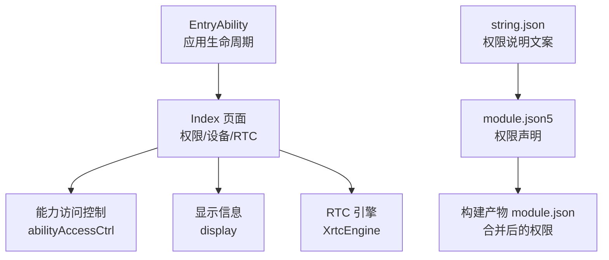
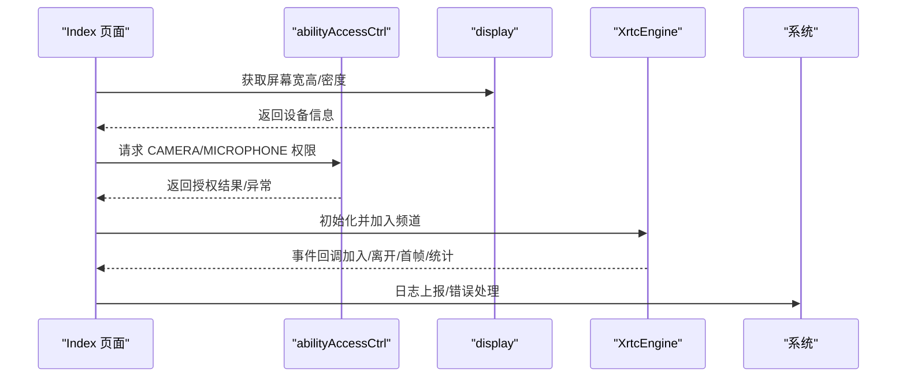
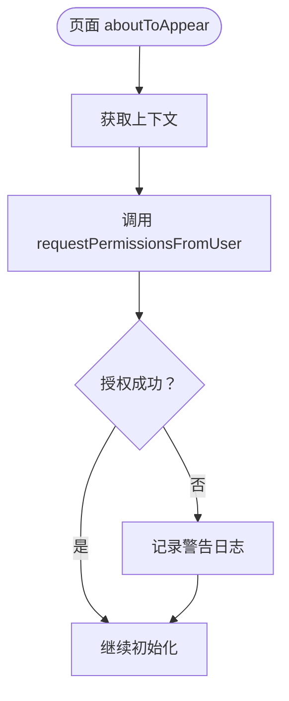
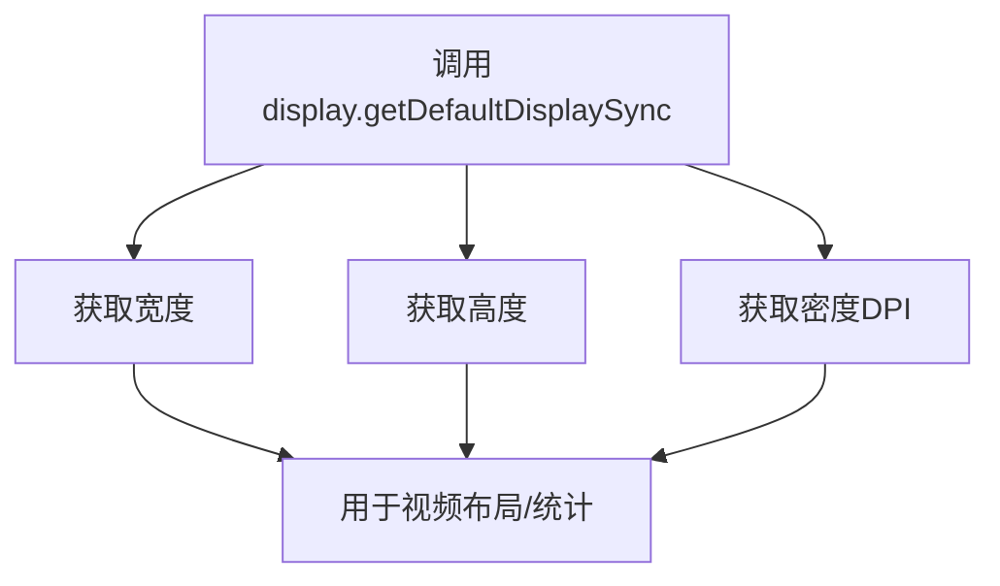
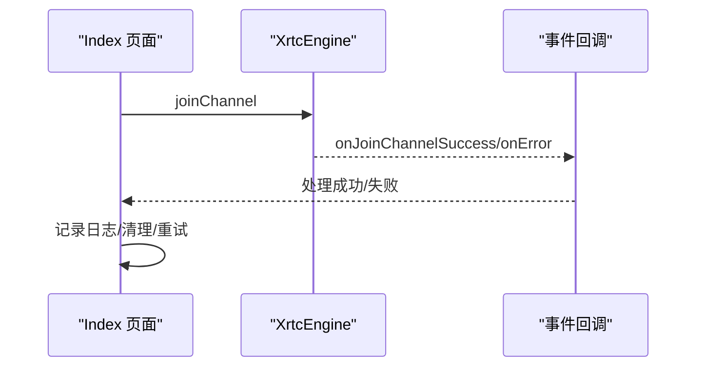
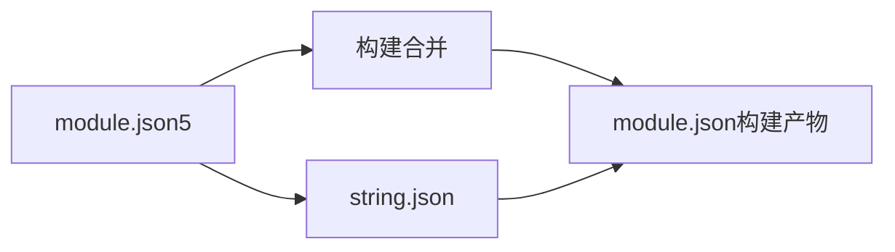
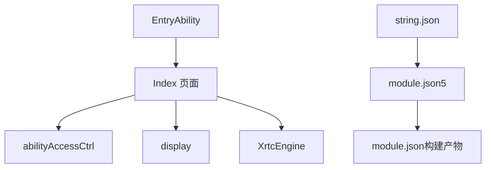

# 权限与安全管理

<cite>
**本文档引用的文件**
- [Index.ets](file://entry/src/main/ets/pages/Index.ets)
- [EntryAbility.ets](file://entry/src/main/ets/entryability/EntryAbility.ets)
- [module.json5](file://entry/src/main/module.json5)
- [string.json](file://entry/src/main/resources/base/element/string.json)
- [module.json（构建产物）](file://entry/build/default/intermediates/merge_profile/default/module.json)
- [buildConfig.json](file://entry/build/config/buildConfig.json)
</cite>

## 目录
1. [简介](#简介)
2. [项目结构](#项目结构)
3. [核心组件](#核心组件)
4. [架构总览](#架构总览)
5. [详细组件分析](#详细组件分析)
6. [依赖关系分析](#依赖关系分析)
7. [性能考量](#性能考量)
8. [故障排查指南](#故障排查指南)
9. [结论](#结论)
10. [附录](#附录)

## 简介
本文件面向HarmonyOS在线课堂应用，系统化阐述权限与安全管理体系，重点覆盖摄像头与麦克风权限的申请流程、设备信息获取与权限管理机制、安全与隐私保护策略、权限状态监控与异常处理、权限相关配置文件说明与最佳实践，以及常见问题排查与解决方案。目标是帮助开发者与测试人员准确理解并维护该应用在HarmonyOS平台上的权限与安全行为。

## 项目结构
围绕权限与安全主题，关键文件分布如下：
- 页面入口与业务逻辑：Index.ets（包含权限申请、设备信息查询、RTC事件处理等）
- 应用生命周期与窗口配置：EntryAbility.ets
- 权限声明与使用场景：module.json5（源文件）与构建产物module.json（合并后）
- 字符串资源（权限说明文案）：string.json
- 构建配置：buildConfig.json

**图表来源**
- [EntryAbility.ets](file://entry/src/main/ets/entryability/EntryAbility.ets#L14-L65)
- [Index.ets](file://entry/src/main/ets/pages/Index.ets#L1-L120)
- [module.json5](file://entry/src/main/module.json5#L14-L20)
- [module.json（构建产物）](file://entry/build/default/intermediates/merge_profile/default/module.json#L33-L77)
- [string.json](file://entry/src/main/resources/base/element/string.json#L16-L22)

**章节来源**
- [EntryAbility.ets](file://entry/src/main/ets/entryability/EntryAbility.ets#L14-L65)
- [Index.ets](file://entry/src/main/ets/pages/Index.ets#L1-L120)
- [module.json5](file://entry/src/main/module.json5#L14-L20)
- [module.json（构建产物）](file://entry/build/default/intermediates/merge_profile/default/module.json#L33-L77)
- [string.json](file://entry/src/main/resources/base/element/string.json#L16-L22)

## 核心组件
- 权限申请与管理
  - 在页面生命周期中发起摄像头与麦克风权限请求，并捕获异常。
  - 权限说明文案来源于字符串资源，便于国际化与合规展示。
- 设备信息获取
  - 通过显示服务获取屏幕宽高与密度，用于适配视频布局与统计。
- 安全与隐私
  - 严格限制仅在使用场景下申请权限；对敏感操作进行异常捕获与日志记录。
- 权限配置
  - 在模块清单中声明所需权限及使用场景，构建阶段合并生成最终清单。

**章节来源**
- [Index.ets](file://entry/src/main/ets/pages/Index.ets#L229-L247)
- [string.json](file://entry/src/main/resources/base/element/string.json#L16-L22)
- [module.json5](file://entry/src/main/module.json5#L14-L20)
- [module.json（构建产物）](file://entry/build/default/intermediates/merge_profile/default/module.json#L33-L77)

## 架构总览
下图展示了HarmonyOS在线课堂应用在权限与安全方面的整体交互路径：页面初始化时申请权限，随后根据设备信息渲染界面并建立RTC通道；权限状态与异常通过日志与回调反馈。

**图表来源**
- [Index.ets](file://entry/src/main/ets/pages/Index.ets#L229-L247)
- [Index.ets](file://entry/src/main/ets/pages/Index.ets#L837-L865)
- [Index.ets](file://entry/src/main/ets/pages/Index.ets#L924-L985)

## 详细组件分析

### 权限申请与管理
- 申请时机
  - 在页面出现时调用能力访问控制器发起权限请求，一次性申请摄像头与麦克风两项权限。
- 异常处理
  - 对权限申请过程与异常进行捕获，避免崩溃并记录日志。
- 文案与合规
  - 权限用途说明来自字符串资源，确保向用户清晰解释“用于视频通话/语音通话”。

**图表来源**
- [Index.ets](file://entry/src/main/ets/pages/Index.ets#L237-L246)

**章节来源**
- [Index.ets](file://entry/src/main/ets/pages/Index.ets#L237-L246)
- [string.json](file://entry/src/main/resources/base/element/string.json#L16-L22)

### 设备信息获取与权限管理机制
- 设备信息
  - 通过显示服务获取屏幕宽高与密度，用于视频布局计算与统计。
- 权限管理
  - 在模块清单中声明权限与使用场景，构建阶段合并为最终清单，确保权限最小化与透明化。

**图表来源**
- [Index.ets](file://entry/src/main/ets/pages/Index.ets#L837-L865)
- [module.json5](file://entry/src/main/module.json5#L14-L20)
- [module.json（构建产物）](file://entry/build/default/intermediates/merge_profile/default/module.json#L33-L77)

**章节来源**
- [Index.ets](file://entry/src/main/ets/pages/Index.ets#L837-L865)
- [module.json5](file://entry/src/main/module.json5#L14-L20)
- [module.json（构建产物）](file://entry/build/default/intermediates/merge_profile/default/module.json#L33-L77)

### 安全考虑与隐私保护
- 最小权限原则
  - 仅在使用场景（in-use）申请摄像头与麦克风权限，避免过度授权。
- 明确用途说明
  - 权限说明文案明确指出“视频通话/语音通话”用途，符合隐私合规要求。
- 异常与日志
  - 对权限申请与设备信息获取过程进行异常捕获与日志记录，便于审计与问题定位。

**章节来源**
- [module.json5](file://entry/src/main/module.json5#L14-L20)
- [string.json](file://entry/src/main/resources/base/element/string.json#L16-L22)
- [Index.ets](file://entry/src/main/ets/pages/Index.ets#L237-L246)

### 权限状态监控与异常处理策略
- 状态监控
  - 通过RTC事件回调监控加入/离开、首帧、静音状态等，间接反映权限影响。
- 异常处理
  - 对权限申请、设备信息获取、加入频道等关键步骤进行try-catch，避免崩溃并记录错误码与消息。
- 重试与容错
  - 当加入频道失败时，清理引擎并等待重试，减少状态不一致风险。

**图表来源**
- [Index.ets](file://entry/src/main/ets/pages/Index.ets#L924-L985)
- [Index.ets](file://entry/src/main/ets/pages/Index.ets#L1169-L1219)

**章节来源**
- [Index.ets](file://entry/src/main/ets/pages/Index.ets#L924-L985)
- [Index.ets](file://entry/src/main/ets/pages/Index.ets#L1169-L1219)

### 权限相关配置文件说明
- 模块清单（module.json5）
  - 声明所需权限（网络、摄像头、麦克风、媒体读写）及其使用场景与原因说明。
- 构建产物（module.json）
  - 构建阶段合并后的最终清单，包含权限、使用场景与原因ID。
- 字符串资源（string.json）
  - 提供权限用途说明文案，支持国际化与合规展示。

**图表来源**
- [module.json5](file://entry/src/main/module.json5#L14-L20)
- [module.json（构建产物）](file://entry/build/default/intermediates/merge_profile/default/module.json#L33-L77)
- [string.json](file://entry/src/main/resources/base/element/string.json#L16-L22)

**章节来源**
- [module.json5](file://entry/src/main/module.json5#L14-L20)
- [module.json（构建产物）](file://entry/build/default/intermediates/merge_profile/default/module.json#L33-L77)
- [string.json](file://entry/src/main/resources/base/element/string.json#L16-L22)

### 最佳实践
- 权限申请
  - 在页面首次出现时申请，避免在后台频繁请求；对拒绝授权进行友好提示与引导。
- 设备信息
  - 仅在必要时获取，避免频繁调用；对异常情况进行降级处理。
- 安全与隐私
  - 严格遵循最小权限与使用场景原则；对敏感操作进行日志记录与错误码归类。
- 配置管理
  - 权限与文案集中管理，确保一致性与可维护性；构建阶段校验清单完整性。

**章节来源**
- [Index.ets](file://entry/src/main/ets/pages/Index.ets#L229-L247)
- [module.json5](file://entry/src/main/module.json5#L14-L20)
- [string.json](file://entry/src/main/resources/base/element/string.json#L16-L22)

## 依赖关系分析
- 模块清单依赖
  - module.json5声明权限与使用场景，构建后生成module.json，供系统与用户确认。
- 代码依赖
  - Index页面依赖能力访问控制与显示服务；EntryAbility负责窗口与生命周期；字符串资源支撑权限说明。

**图表来源**
- [module.json5](file://entry/src/main/module.json5#L14-L20)
- [module.json（构建产物）](file://entry/build/default/intermediates/merge_profile/default/module.json#L33-L77)
- [Index.ets](file://entry/src/main/ets/pages/Index.ets#L1-L120)
- [EntryAbility.ets](file://entry/src/main/ets/entryability/EntryAbility.ets#L14-L65)
- [string.json](file://entry/src/main/resources/base/element/string.json#L16-L22)

**章节来源**
- [module.json5](file://entry/src/main/module.json5#L14-L20)
- [module.json（构建产物）](file://entry/build/default/intermediates/merge_profile/default/module.json#L33-L77)
- [Index.ets](file://entry/src/main/ets/pages/Index.ets#L1-L120)
- [EntryAbility.ets](file://entry/src/main/ets/entryability/EntryAbility.ets#L14-L65)
- [string.json](file://entry/src/main/resources/base/element/string.json#L16-L22)

## 性能考量
- 权限申请时机
  - 避免在高频事件中重复请求，降低系统交互成本。
- 设备信息获取
  - 缓存屏幕宽高与密度，减少重复调用；在布局变化时再更新。
- RTC初始化
  - 复用引擎避免频繁销毁/重建，提升加入频道成功率与稳定性。

**章节来源**
- [Index.ets](file://entry/src/main/ets/pages/Index.ets#L229-L247)
- [Index.ets](file://entry/src/main/ets/pages/Index.ets#L924-L985)

## 故障排查指南
- 权限申请失败
  - 现象：日志出现权限申请失败或异常。
  - 排查：确认模块清单中权限与使用场景是否正确；检查字符串资源文案是否存在；在页面生命周期中再次触发申请并观察日志。
- 设备信息异常
  - 现象：屏幕宽高或密度获取失败。
  - 排查：确认显示服务可用性；在异常分支提供默认值并记录日志。
- 加入频道失败
  - 现象：加入频道返回负值或抛出异常。
  - 排查：清理引擎并等待重试；检查网络与鉴权参数；关注RTC事件回调中的错误码与消息。
- 引擎残留导致重进异常
  - 现象：重进时初始化失败或状态异常。
  - 排查：遵循“保持引擎活跃”的策略，避免destroy；在退出时仅leaveChannel并清理本地状态。

**章节来源**
- [Index.ets](file://entry/src/main/ets/pages/Index.ets#L237-L246)
- [Index.ets](file://entry/src/main/ets/pages/Index.ets#L837-L865)
- [Index.ets](file://entry/src/main/ets/pages/Index.ets#L978-L985)
- [Index.ets](file://entry/src/main/ets/pages/Index.ets#L618-L632)

## 结论
本应用在HarmonyOS平台上采用“最小权限+使用场景+明确文案”的策略管理摄像头与麦克风权限，并通过页面生命周期与构建产物清单确保权限声明的准确性与合规性。结合设备信息获取、RTC事件回调与完善的异常处理，实现了较为稳健的权限与安全运行机制。建议持续关注权限状态与日志，完善用户引导与重试策略，以进一步提升用户体验与系统稳定性。

## 附录
- 构建配置参考
  - 构建配置文件包含编译器类型、日志级别、资源路径等，有助于定位构建与打包相关问题。

**章节来源**
- [buildConfig.json](file://entry/build/config/buildConfig.json#L1-L1)