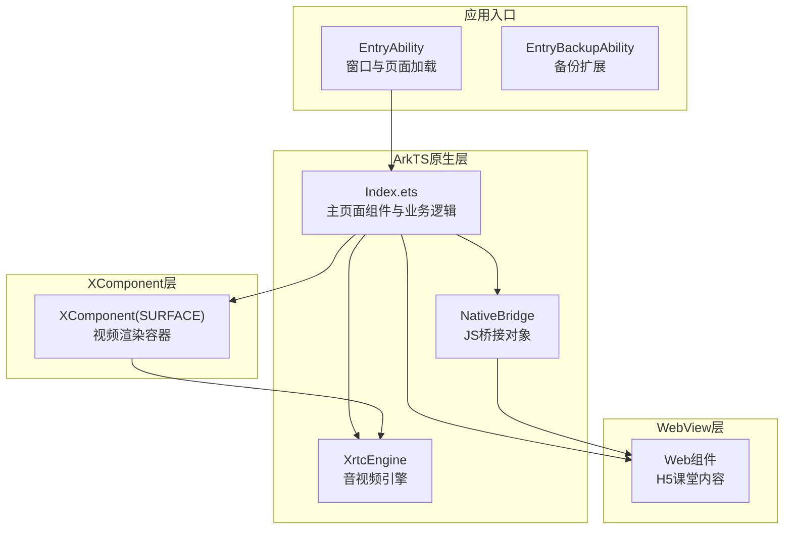
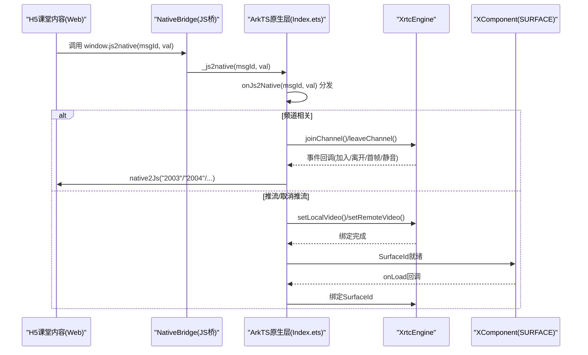
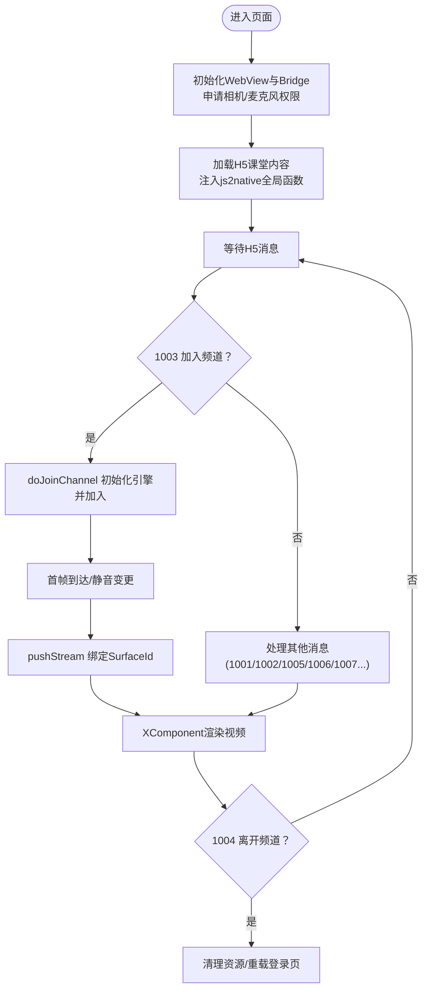
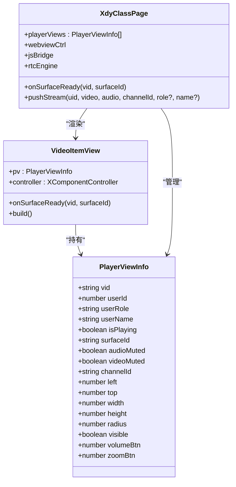
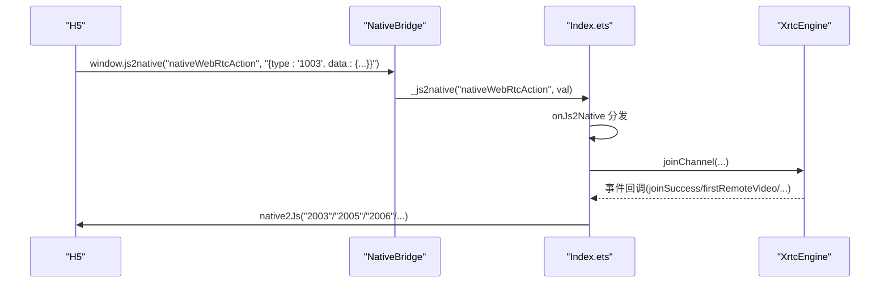
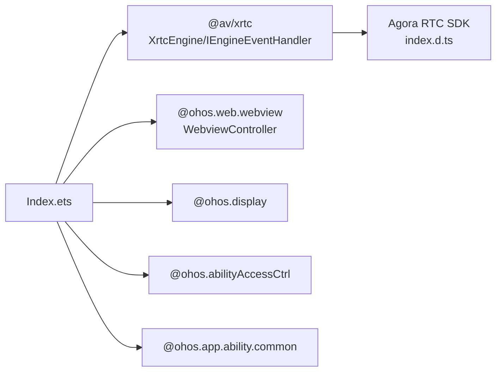

# 三层架构设计

<cite>
**本文引用的文件**
- [Index.ets](file://entry/src/main/ets/pages/Index.ets)
- [EntryAbility.ets](file://entry/src/main/ets/entryability/EntryAbility.ets)
- [EntryBackupAbility.ets](file://entry/src/main/ets/entrybackupability/EntryBackupAbility.ets)
- [index.d.ts](file://package/src/main/cpp/types/libagora_rtc_sdk/index.d.ts)
- [鸿蒙端实现分析与优化建议.md](file://鸿蒙端实现分析与优化建议.md)
- [buildConfig.json](file://entry/build/config/buildConfig.json)
- [string.json(AppScope)](file://AppScope/resources/base/element/string.json)
- [string.json(Entry)](file://entry/src/main/resources/base/element/string.json)
</cite>

## 目录
1. [引言](#引言)
2. [项目结构](#项目结构)
3. [核心组件](#核心组件)
4. [架构总览](#架构总览)
5. [详细组件分析](#详细组件分析)
6. [依赖分析](#依赖分析)
7. [性能考虑](#性能考虑)
8. [故障排查指南](#故障排查指南)
9. [结论](#结论)
10. [附录](#附录)

## 引言
本设计文档面向HarmonyOS在线课堂应用，基于仓库现有实现，系统化阐述三层架构：ArkTS原生层、WebView层、XComponent层的职责划分、实现方式与交互机制。重点解释ArkTS原生层如何处理业务逻辑与状态管理，WebView层如何承载H5课堂内容，XComponent层如何处理视频渲染；并给出JS Bridge通信协议、数据流向与交互流程图，以及技术权衡与优化建议。

## 项目结构
- 应用入口能力负责窗口初始化与页面加载，主页面组件承载三层架构的核心逻辑。
- 主页面组件通过ArkTS原生层协调WebView与XComponent，实现课堂业务闭环。
- 依赖Agora RTC SDK（通过类型声明文件体现）进行音视频编解码与渲染。

图表来源
- [EntryAbility.ets](file://entry/src/main/ets/entryability/EntryAbility.ets#L31-L49)
- [Index.ets](file://entry/src/main/ets/pages/Index.ets#L195-L360)
- [index.d.ts](file://package/src/main/cpp/types/libagora_rtc_sdk/index.d.ts#L1-L19)

章节来源
- [EntryAbility.ets](file://entry/src/main/ets/entryability/EntryAbility.ets#L14-L49)
- [Index.ets](file://entry/src/main/ets/pages/Index.ets#L195-L360)
- [buildConfig.json](file://entry/build/config/buildConfig.json#L1-L1)

## 核心组件
- ArkTS原生层（Index.ets）
  - 负责业务逻辑与状态管理：用户视图布局、成员列表、加入/离开频道、推流/取消推流、静音控制、设备信息、系统信息、音量增益、摄像头切换、统计上报等。
  - 管理WebView与XComponent：注入JS Bridge、拦截URL、注入全局函数、控制视频浮层可见性与层级。
  - 管理XrtcEngine：初始化、加入频道、事件回调、本地/远端音视频状态、统计上报。
- WebView层（Web组件）
  - 承载H5课堂内容，支持JavaScript代理、权限请求、UA定制、缓存策略、页面开始注入全局函数等。
- XComponent层（XComponent SURFACE）
  - 作为视频渲染容器，通过SurfaceId与XrtcEngine绑定，实现本地/远端视频渲染与遮罩层叠加。

章节来源
- [Index.ets](file://entry/src/main/ets/pages/Index.ets#L195-L360)
- [Index.ets](file://entry/src/main/ets/pages/Index.ets#L1004-L1167)
- [Index.ets](file://entry/src/main/ets/pages/Index.ets#L1169-L1407)

## 架构总览
三层架构的数据流与交互如下：
- H5通过window.js2native调用ArkTS原生层的NativeBridge，消息经onJs2Native分发到具体处理函数。
- ArkTS原生层根据消息类型调用XrtcEngine执行业务操作，并通过native2Js回传结果给H5。
- XComponent通过SurfaceId与XrtcEngine绑定，实现视频渲染；VideoItemView负责布局与可见性控制。

图表来源
- [Index.ets](file://entry/src/main/ets/pages/Index.ets#L257-L360)
- [Index.ets](file://entry/src/main/ets/pages/Index.ets#L362-L424)
- [Index.ets](file://entry/src/main/ets/pages/Index.ets#L987-L1001)
- [Index.ets](file://entry/src/main/ets/pages/Index.ets#L1410-L1430)

## 详细组件分析

### ArkTS原生层（Index.ets）
- 业务职责
  - 用户视图布局：解析1001消息，生成PlayerViewInfo列表，按屏幕宽度百分比计算绝对像素位置与尺寸。
  - 成员列表：维护成员Map与模型Map，处理首次音视频首帧、静音状态变更、刷新场景下的补推流。
  - 频道管理：1003加入频道、1004离开频道，支持刷新与退出场景，复用引擎避免重复销毁。
  - 推流/取消推流：pushStream/cancelStream，支持角色匹配与兼容绑定，本地/远端分别处理。
  - 音视频控制：静音视频/音频、切换摄像头、音量增益、设备信息、系统信息。
  - 统计上报：本地/远端音视频统计，按帧聚合后上报。
- 状态管理
  - 使用@Observed类与@State数组管理视图状态，通过对象浅拷贝更新视图列表，确保响应式渲染。
  - 使用Map维护成员、模型与远端统计，避免重复查询。
- 生命周期与资源释放
  - aboutToDisappear中移除事件处理器、离开频道、销毁引擎，避免资源泄漏。
  - 退出课堂时清理Cookie与缓存，重载登录页。

图表来源
- [Index.ets](file://entry/src/main/ets/pages/Index.ets#L229-L247)
- [Index.ets](file://entry/src/main/ets/pages/Index.ets#L257-L360)
- [Index.ets](file://entry/src/main/ets/pages/Index.ets#L362-L424)
- [Index.ets](file://entry/src/main/ets/pages/Index.ets#L924-L985)
- [Index.ets](file://entry/src/main/ets/pages/Index.ets#L1004-L1167)
- [Index.ets](file://entry/src/main/ets/pages/Index.ets#L1410-L1430)

章节来源
- [Index.ets](file://entry/src/main/ets/pages/Index.ets#L195-L360)
- [Index.ets](file://entry/src/main/ets/pages/Index.ets#L362-L424)
- [Index.ets](file://entry/src/main/ets/pages/Index.ets#L924-L985)
- [Index.ets](file://entry/src/main/ets/pages/Index.ets#L1004-L1167)
- [Index.ets](file://entry/src/main/ets/pages/Index.ets#L1169-L1407)

### WebView层（Web组件）
- 职责
  - 承载H5课堂内容，启用JavaScript代理，注入全局js2native函数，拦截特定域名跳转，清理会话与缓存。
- 配置要点
  - javaScriptAccess(true)、javaScriptProxy绑定NativeBridge、mixedMode(MixedMode.All)、userAgent定制、onPermissionRequest授权放行、onLoadIntercept拦截管理页跳转。
- 与ArkTS交互
  - 通过window.js2native调用xdyAndroid._js2native，ArkTS侧onJs2Native统一分发处理。

章节来源
- [Index.ets](file://entry/src/main/ets/pages/Index.ets#L257-L360)
- [Index.ets](file://entry/src/main/ets/pages/Index.ets#L284-L340)

### XComponent层（XComponent SURFACE）
- 职责
  - 作为视频渲染容器，通过SurfaceId与XrtcEngine绑定，实现本地/远端视频渲染。
- 实现细节
  - VideoItemView组件内创建XComponent(SURFACE)，onLoad回调中获取SurfaceId并存储至PlayerViewInfo。
  - onSurfaceReady中根据userId决定绑定本地或远端视频，设置可见性与层级。
- 与ArkTS协作
  - ArkTS在pushStream阶段将SurfaceId写入PlayerViewInfo，随后在onSurfaceReady中完成绑定。

图表来源
- [Index.ets](file://entry/src/main/ets/pages/Index.ets#L26-L66)
- [Index.ets](file://entry/src/main/ets/pages/Index.ets#L153-L192)
- [Index.ets](file://entry/src/main/ets/pages/Index.ets#L195-L360)
- [Index.ets](file://entry/src/main/ets/pages/Index.ets#L1410-L1430)
- [Index.ets](file://entry/src/main/ets/pages/Index.ets#L1004-L1167)

章节来源
- [Index.ets](file://entry/src/main/ets/pages/Index.ets#L153-L192)
- [Index.ets](file://entry/src/main/ets/pages/Index.ets#L195-L360)
- [Index.ets](file://entry/src/main/ets/pages/Index.ets#L1410-L1430)

### JS Bridge通信协议
- 协议定义
  - H5侧通过window.js2native(msgId, val)调用ArkTS侧xdyAndroid._js2native。
  - ArkTS侧onJs2Native接收消息，按type字段分发到具体处理函数。
  - ArkTS侧native2Js将结果以nativeWebRtcAction消息回传H5。
- 消息类型与处理
  - 1000：WebView加载完成，回传2000。
  - 1001：用户视图布局，回传2000。
  - 1002：用户列表，触发成员Map与模型Map更新。
  - 1003：加入频道，doJoinChannel初始化引擎并加入。
  - 1004：离开频道，支持refresh与quit两种动作。
  - 1005：推流，pushStream绑定SurfaceId。
  - 1006：静音视频，本地/远端处理。
  - 1007：静音音频，本地/远端处理。
  - 1008：取消推流，解除绑定。
  - 1009：系统信息，回传2009。
  - 1010：设备信息，回传2010。
  - 1015：切换摄像头，回传2015。
  - 1020：音量增益，回传2020。
  - 1051/1052：H5弹窗与课堂记录信息，回传对应动作。

图表来源
- [Index.ets](file://entry/src/main/ets/pages/Index.ets#L264-L269)
- [Index.ets](file://entry/src/main/ets/pages/Index.ets#L284-L293)
- [Index.ets](file://entry/src/main/ets/pages/Index.ets#L362-L424)
- [Index.ets](file://entry/src/main/ets/pages/Index.ets#L987-L1001)

章节来源
- [Index.ets](file://entry/src/main/ets/pages/Index.ets#L264-L269)
- [Index.ets](file://entry/src/main/ets/pages/Index.ets#L284-L293)
- [Index.ets](file://entry/src/main/ets/pages/Index.ets#L362-L424)
- [Index.ets](file://entry/src/main/ets/pages/Index.ets#L987-L1001)

## 依赖分析
- ArkTS原生层依赖
  - @av/xrtc：XrtcEngine、IEngineEventHandler、UserParam、RenderMode等。
  - @ohos.web.webview：WebviewController、WebCookieManager、runJavaScript等。
  - @ohos.display、@ohos.abilityAccessCtrl：屏幕信息、权限申请。
  - @ohos.app.ability.common：UIAbilityContext。
- 外部SDK
  - Agora RTC SDK：通过类型声明文件体现，提供initialize、joinChannel、leaveChannel、setupRemoteVideo等接口。
- 资源与配置
  - 字符串资源：AppScope与Entry模块的string.json。
  - 构建配置：buildConfig.json。

图表来源
- [Index.ets](file://entry/src/main/ets/pages/Index.ets#L1-L10)
- [index.d.ts](file://package/src/main/cpp/types/libagora_rtc_sdk/index.d.ts#L1-L19)

章节来源
- [Index.ets](file://entry/src/main/ets/pages/Index.ets#L1-L10)
- [index.d.ts](file://package/src/main/cpp/types/libagora_rtc_sdk/index.d.ts#L1-L19)
- [string.json(AppScope)](file://AppScope/resources/base/element/string.json#L1-L9)
- [string.json(Entry)](file://entry/src/main/resources/base/element/string.json#L1-L32)
- [buildConfig.json](file://entry/build/config/buildConfig.json#L1-L1)

## 性能考虑
- 引擎复用与销毁策略
  - 退出课堂不销毁引擎，复用引擎直接joinChannel，避免HarmonyOS上destroySync不可靠导致重进失败。
  - 刷新场景仅reset()，不清除引擎，减少初始化成本。
- 视图与状态管理
  - 使用Map维护成员与统计，避免重复遍历；通过对象浅拷贝更新视图列表，降低不必要的重渲染。
- WebView缓存与会话
  - onLoadIntercept拦截管理页跳转，清理Cookie与缓存，重载登录页，避免残留会话影响后续课堂。
- 统计上报
  - 本地/远端统计按帧聚合，满足条件后一次性上报，减少JS Bridge调用频率。

章节来源
- [Index.ets](file://entry/src/main/ets/pages/Index.ets#L618-L632)
- [Index.ets](file://entry/src/main/ets/pages/Index.ets#L695-L715)
- [Index.ets](file://entry/src/main/ets/pages/Index.ets#L294-L340)
- [Index.ets](file://entry/src/main/ets/pages/Index.ets#L1319-L1401)
- [鸿蒙端实现分析与优化建议.md](file://鸿蒙端实现分析与优化建议.md#L130-L197)

## 故障排查指南
- 常见问题
  - 引擎初始化失败：检查doJoinChannel中引擎创建与事件处理器注册，关注joinChannel同步返回值。
  - SurfaceId未就绪：确认VideoItemView的onLoad回调与onSurfaceReady绑定逻辑。
  - 频道加入后无视频：检查pushStream中角色匹配与兼容绑定，确认enableLocalVideo/enableLocalAudio与muteLocalVideoStream/muteLocalAudioStream的调用顺序。
  - H5无法调用js2native：确认Web组件的javaScriptProxy配置与onPageBegin注入脚本。
- 建议措施
  - 增加全局错误边界与日志规范化，便于定位问题。
  - 增加网络状态监听，在网络断开时上报RTC断线事件。
  - 增加定时清理机制，定期清理远端统计Map，避免内存膨胀。

章节来源
- [Index.ets](file://entry/src/main/ets/pages/Index.ets#L924-L985)
- [Index.ets](file://entry/src/main/ets/pages/Index.ets#L1410-L1430)
- [Index.ets](file://entry/src/main/ets/pages/Index.ets#L257-L360)
- [鸿蒙端实现分析与优化建议.md](file://鸿蒙端实现分析与优化建议.md#L130-L197)
- [鸿蒙端实现分析与优化建议.md](file://鸿蒙端实现分析与优化建议.md#L199-L257)

## 结论
该三层架构清晰地分离了业务逻辑（ArkTS原生层）、内容承载（WebView层）与视频渲染（XComponent层）。通过JS Bridge实现H5与原生层的双向通信，结合XrtcEngine完成音视频编解码与渲染。在HarmonyOS平台特性与SDK限制下，采用引擎复用、视图状态管理与WebView会话清理等策略，平衡了性能与稳定性。建议进一步细化目录结构、增强错误边界与网络监听，并引入定时清理与日志规范，持续提升用户体验与可维护性。

## 附录
- 最佳实践
  - 目录结构：将WebView封装、视频浮层、JS桥、消息处理、RTC管理、工具与模型拆分为独立模块，提升可维护性。
  - 生命周期：在aboutToDisappear中统一释放WebView与RTC资源，避免泄漏。
  - 错误处理：增加全局错误边界与日志规范化，统一上报格式。
  - 网络监听：监听网络可用/丢失事件，及时上报并提示用户。
  - 性能优化：使用@State与@Watch优化视图更新，必要时采用虚拟列表与定时清理机制。

章节来源
- [鸿蒙端实现分析与优化建议.md](file://鸿蒙端实现分析与优化建议.md#L130-L197)
- [鸿蒙端实现分析与优化建议.md](file://鸿蒙端实现分析与优化建议.md#L199-L257)