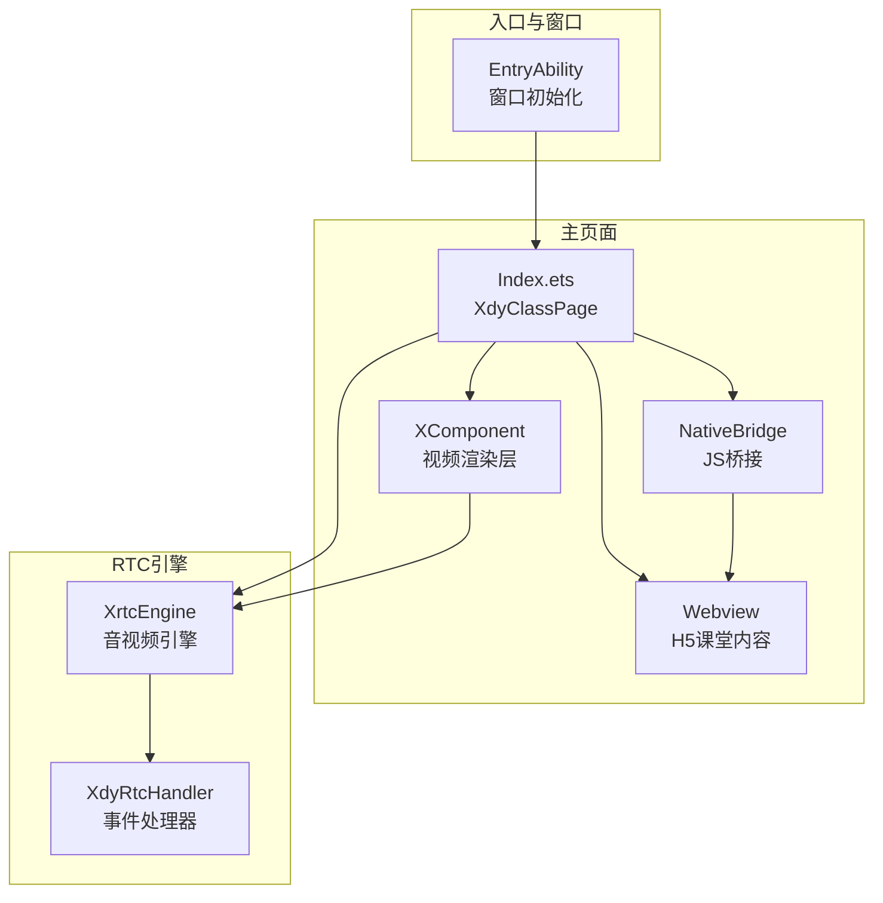
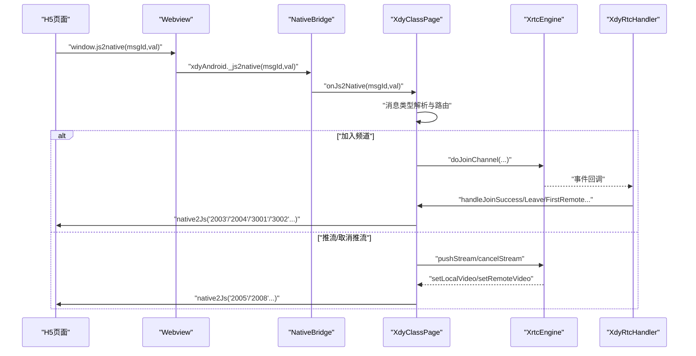
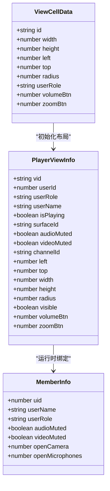
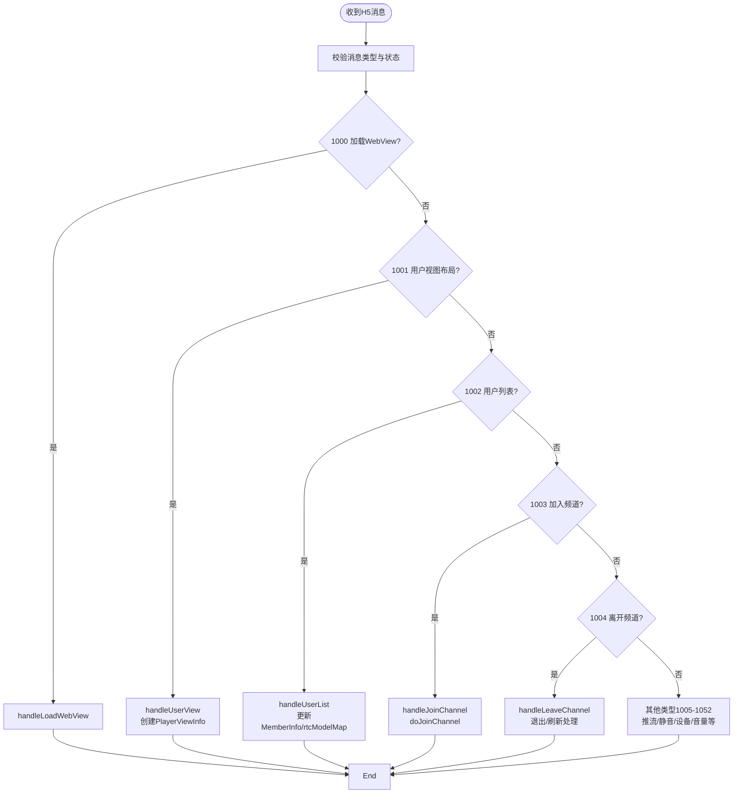
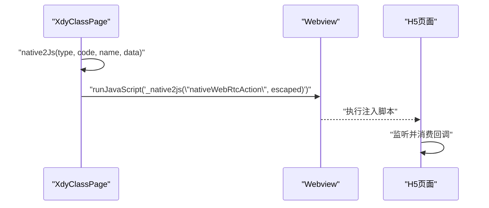
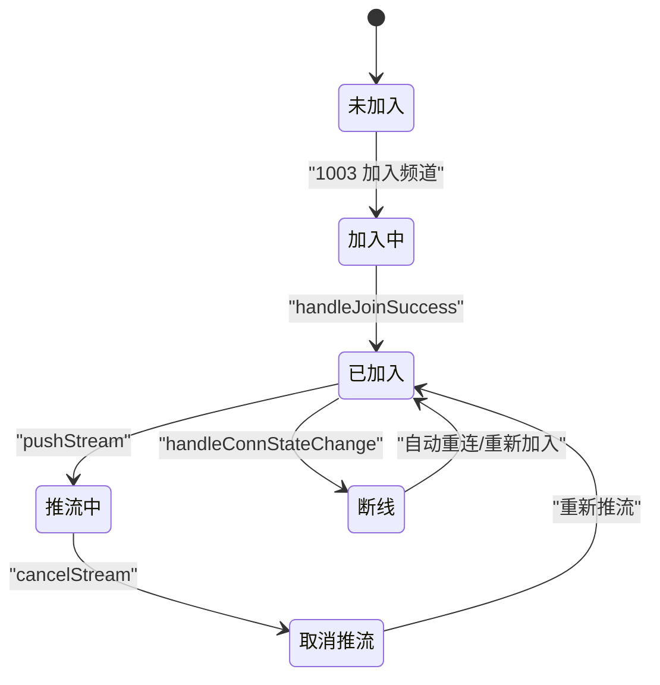
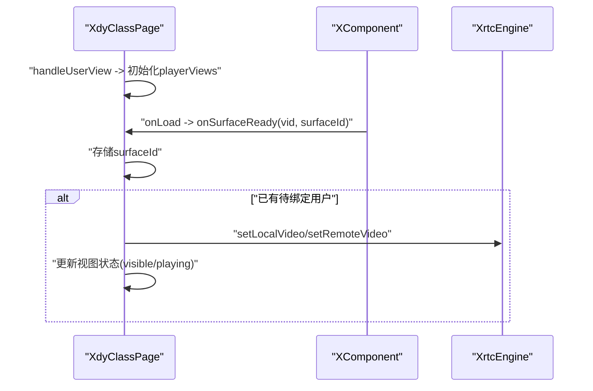
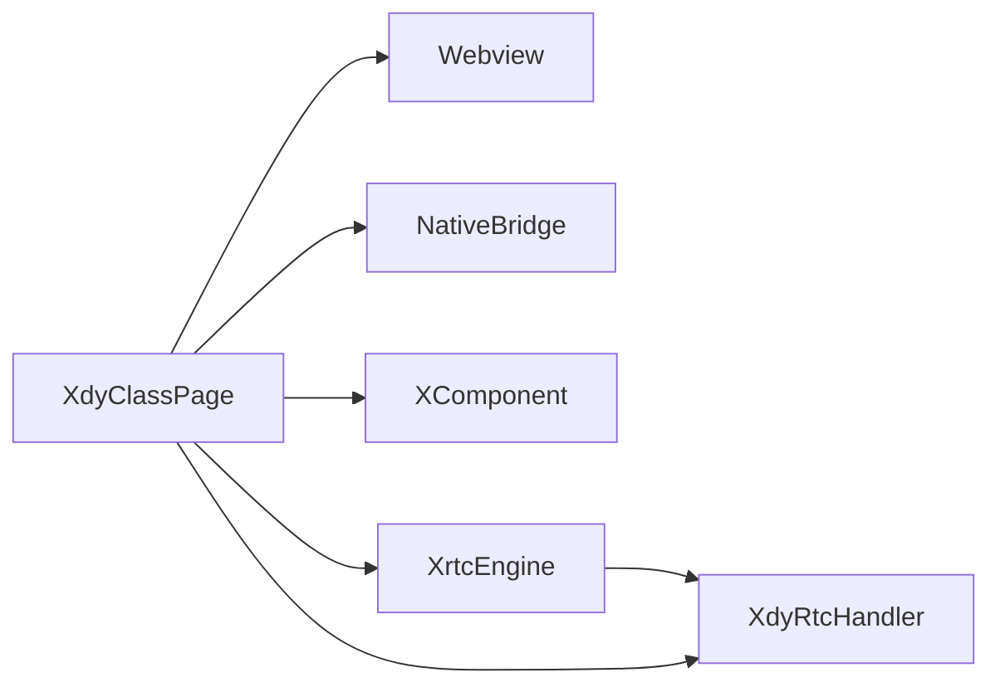

# 数据流设计

<cite>
**本文档引用的文件**
- [Index.ets](file://entry/src/main/ets/pages/Index.ets)
- [EntryAbility.ets](file://entry/src/main/ets/entryability/EntryAbility.ets)
</cite>

## 目录
1. [简介](#简介)
2. [项目结构](#项目结构)
3. [核心组件](#核心组件)
4. [架构总览](#架构总览)
5. [详细组件分析](#详细组件分析)
6. [依赖关系分析](#依赖关系分析)
7. [性能考虑](#性能考虑)
8. [故障排查指南](#故障排查指南)
9. [结论](#结论)

## 简介
本设计文档聚焦于HarmonyOS在线课堂应用的数据流设计，系统性阐述以下方面：
- H5→原生的消息传递机制与路由分发
- 原生→H5的回调机制与消息回传
- RTC引擎的数据流与状态变更
- UI更新与视图绑定的状态变更
- 关键数据模型之间的关系与生命周期管理
- 数据流图与状态转换图，帮助开发者理解复杂的异步数据处理逻辑

## 项目结构
该应用采用ArkTS + Webview + RTC引擎的混合架构：
- 入口能力负责窗口初始化与页面加载
- 主页面组件承载H5课堂内容与原生视频浮层
- 通过Webview的JavaScript代理实现H5与原生的双向通信
- 原生侧通过RTC引擎进行音视频编解码与渲染

图表来源
- [Index.ets](file://entry/src/main/ets/pages/Index.ets#L197-L360)
- [EntryAbility.ets](file://entry/src/main/ets/entryability/EntryAbility.ets#L14-L49)

章节来源
- [Index.ets](file://entry/src/main/ets/pages/Index.ets#L197-L360)
- [EntryAbility.ets](file://entry/src/main/ets/entryability/EntryAbility.ets#L14-L49)

## 核心组件
- 数据模型
  - PlayerViewInfo：视频视图实例的运行时状态，包含位置、尺寸、可见性、音视频静音状态、绑定的用户ID等
  - MemberInfo：成员信息，包含用户角色、音视频静音状态、摄像头/麦克风开启时间戳等
  - ViewCellData：H5下发的布局描述，用于构建PlayerViewInfo的初始布局
- 桥接与事件
  - NativeBridge：H5→原生的消息桥接对象
  - XdyRtcHandler：RTC事件回调适配器
  - XComponent：承载视频渲染的原生组件
- 页面与引擎
  - XdyClassPage：主页面，负责消息分发、视图管理、引擎生命周期控制
  - XrtcEngine：音视频引擎实例

章节来源
- [Index.ets](file://entry/src/main/ets/pages/Index.ets#L13-L105)
- [Index.ets](file://entry/src/main/ets/pages/Index.ets#L135-L151)
- [Index.ets](file://entry/src/main/ets/pages/Index.ets#L153-L192)

## 架构总览
整体数据流分为三条主线：
- H5→原生：通过Webview的JavaScript代理将H5消息转发至原生，原生根据消息类型分发到具体处理函数
- 原生→H5：原生通过native2Js构造统一格式消息，注入到H5环境，H5侧监听并消费
- RTC引擎：原生侧维护引擎生命周期与事件，结合视图状态进行推流/拉流与渲染绑定

图表来源
- [Index.ets](file://entry/src/main/ets/pages/Index.ets#L257-L360)
- [Index.ets](file://entry/src/main/ets/pages/Index.ets#L362-L424)
- [Index.ets](file://entry/src/main/ets/pages/Index.ets#L987-L1001)
- [Index.ets](file://entry/src/main/ets/pages/Index.ets#L1004-L1137)

## 详细组件分析

### 数据模型与关系
- PlayerViewInfo
  - 描述单个视频视图的运行时状态，包括位置、尺寸、圆角、可见性、音视频静音状态、绑定的用户ID与频道ID等
  - 生命周期：由H5布局消息创建，由surfaceId就绪后绑定用户，退出或取消推流后清空
- MemberInfo
  - 描述成员基本信息与状态，包含用户角色、音视频静音状态、摄像头/麦克风开启时间戳
  - 生命周期：由H5成员列表消息更新，首次首帧到达时与视图绑定
- ViewCellData
  - 描述H5下发的布局参数，用于构建PlayerViewInfo的初始布局
  - 生命周期：一次性使用，用于初始化playerViews数组

图表来源
- [Index.ets](file://entry/src/main/ets/pages/Index.ets#L13-L105)

章节来源
- [Index.ets](file://entry/src/main/ets/pages/Index.ets#L13-L105)

### H5→原生的消息传递与路由
- 消息注入：在Webview加载完成后注入全局js2native函数，桥接到xdyAndroid._js2native
- 消息分发：onJs2Native根据消息类型分发到对应处理函数，如1000-1052等
- 特殊处理：
  - refresh/openRefresh：触发页面刷新，仅重置视图与数据，不销毁引擎
  - quit：退出课堂，清理会话并重载登录页
  - 1003加入频道：若引擎已存在则复用，避免重复销毁/重建；否则创建并加入

图表来源
- [Index.ets](file://entry/src/main/ets/pages/Index.ets#L284-L340)
- [Index.ets](file://entry/src/main/ets/pages/Index.ets#L362-L424)
- [Index.ets](file://entry/src/main/ets/pages/Index.ets#L536-L581)

章节来源
- [Index.ets](file://entry/src/main/ets/pages/Index.ets#L284-L340)
- [Index.ets](file://entry/src/main/ets/pages/Index.ets#L362-L424)
- [Index.ets](file://entry/src/main/ets/pages/Index.ets#L536-L581)

### 原生→H5的回调机制
- 统一格式：native2Js构造统一格式消息，包含type/name/code/data
- 注入时机：在各业务处理完成后，通过Webview执行脚本注入到H5环境
- 典型回调：
  - 2000：加载webview
  - 2003/2004：加入/离开频道
  - 2005：推流开音视频
  - 2006/2007：推流开关视频/音频
  - 2008：取消推流
  - 3001/3002：本地/远端音视频统计数据
  - 3003：RTC错误/断线

图表来源
- [Index.ets](file://entry/src/main/ets/pages/Index.ets#L987-L1001)

章节来源
- [Index.ets](file://entry/src/main/ets/pages/Index.ets#L987-L1001)

### RTC引擎的数据流与状态变更
- 引擎创建与配置
  - doJoinChannel：根据H5下发的参数创建引擎、注册事件处理器、设置音频场景与视频编码配置
  - 引擎复用：若引擎已存在则复用，避免频繁销毁/重建
- 推流绑定
  - pushStream：优先精确匹配角色的空闲视图，若无则兼容到showstage；本地用户先启用本地音视频采集，再绑定surfaceId
  - 取消推流：解除绑定并恢复静音状态
- 事件驱动的状态变更
  - handleJoinSuccess：加入成功后设置扬声器与音量，并对已开音视频的成员进行补推流
  - handleUserMuteAudio/Video：更新rtcModelMap与MemberInfo的静音状态
  - handleFirstRemoteVideo/Audio：根据rtcModelMap与MemberInfo决定是否推流
  - handleConnStateChange：上报连接断线
  - handleAudioStats/VideoStats：聚合本地与远端统计数据，满足条件后上报

图表来源
- [Index.ets](file://entry/src/main/ets/pages/Index.ets#L924-L985)
- [Index.ets](file://entry/src/main/ets/pages/Index.ets#L1004-L1137)
- [Index.ets](file://entry/src/main/ets/pages/Index.ets#L1169-L1219)
- [Index.ets](file://entry/src/main/ets/pages/Index.ets#L1312-L1407)

章节来源
- [Index.ets](file://entry/src/main/ets/pages/Index.ets#L924-L985)
- [Index.ets](file://entry/src/main/ets/pages/Index.ets#L1004-L1137)
- [Index.ets](file://entry/src/main/ets/pages/Index.ets#L1169-L1219)
- [Index.ets](file://entry/src/main/ets/pages/Index.ets#L1312-L1407)

### UI更新与视图绑定
- 视图初始化：handleUserView根据ViewCellData创建PlayerViewInfo数组
- Surface绑定：onSurfaceReady在XComponent onLoad时获取surfaceId，若已有待绑定用户则立即绑定
- 视图状态：通过PlayerViewInfo的visible、playing、音视频静音状态驱动UI显示与文本标签

图表来源
- [Index.ets](file://entry/src/main/ets/pages/Index.ets#L434-L481)
- [Index.ets](file://entry/src/main/ets/pages/Index.ets#L1410-L1430)

章节来源
- [Index.ets](file://entry/src/main/ets/pages/Index.ets#L434-L481)
- [Index.ets](file://entry/src/main/ets/pages/Index.ets#L1410-L1430)

### 数据生命周期管理
- 创建
  - H5布局消息创建PlayerViewInfo
  - H5成员列表消息创建MemberInfo
  - 引擎创建与事件处理器注册
- 更新
  - 成员列表更新MemberInfo状态
  - 首帧到达时更新rtcModelMap并触发推流
  - 静音/取消静音更新视图与引擎状态
- 销毁
  - 退出课堂：leaveChannel，不清除引擎，保持活跃以避免重进失败
  - 刷新：reset()仅清空视图与数据，不销毁引擎
  - 取消推流：解除绑定并恢复静音

章节来源
- [Index.ets](file://entry/src/main/ets/pages/Index.ets#L651-L693)
- [Index.ets](file://entry/src/main/ets/pages/Index.ets#L1139-L1167)
- [Index.ets](file://entry/src/main/ets/pages/Index.ets#L612-L639)

## 依赖关系分析
- 组件耦合
  - XdyClassPage对Webview、NativeBridge、XComponent、XrtcEngine具有强依赖
  - XdyRtcHandler仅通过XdyClassPage暴露的回调接口与页面交互
- 外部依赖
  - @av/xrtc 提供XrtcEngine与IEngineEventHandler
  - @ohos.web.webview 提供Webview能力
  - @ohos.display、@ohos.abilityAccessCtrl等系统能力

图表来源
- [Index.ets](file://entry/src/main/ets/pages/Index.ets#L197-L360)
- [Index.ets](file://entry/src/main/ets/pages/Index.ets#L135-L151)

章节来源
- [Index.ets](file://entry/src/main/ets/pages/Index.ets#L197-L360)
- [Index.ets](file://entry/src/main/ets/pages/Index.ets#L135-L151)

## 性能考虑
- 引擎复用：避免频繁销毁/重建，减少初始化开销
- 视图复用：通过exact role匹配优先选择合适视图，减少无效绑定
- 统计聚合：本地/远端统计数据按帧累加，满足条件后再上报，降低回调频率
- 清理策略：退出课堂不清除引擎，刷新仅清空视图与数据，提升重进体验

## 故障排查指南
- 引擎初始化失败
  - 现象：joinChannel返回负值
  - 处理：清除引擎等待下次重试
- 退出课堂后重进失败
  - 现象：destroySync不可靠导致重进失败
  - 处理：保持引擎活跃，复用引擎直接joinChannel
- 首帧到达但未推流
  - 现象：rtcModelMap为空或未匹配到MemberInfo
  - 处理：在handleFirstRemoteVideo/Audio中补推流
- 静音后未绑定视图
  - 现象：本地用户开启摄像头/麦克风但未绑定视图
  - 处理：在handleMuteVideo/Audio中检测并重新推流

章节来源
- [Index.ets](file://entry/src/main/ets/pages/Index.ets#L978-L984)
- [Index.ets](file://entry/src/main/ets/pages/Index.ets#L618-L621)
- [Index.ets](file://entry/src/main/ets/pages/Index.ets#L1236-L1263)
- [Index.ets](file://entry/src/main/ets/pages/Index.ets#L744-L760)
- [Index.ets](file://entry/src/main/ets/pages/Index.ets#L789-L805)

## 结论
本设计文档梳理了HarmonyOS在线课堂应用的数据流与处理机制，明确了H5↔原生消息传递、原生回调、RTC引擎数据流与UI更新的关键路径。通过PlayerViewInfo、MemberInfo、ViewCellData等数据模型的生命周期管理与状态转换，系统实现了稳定的课堂体验与高效的视图绑定流程。建议在后续迭代中进一步细化错误上报与日志采样，以提升可观测性与问题定位效率。