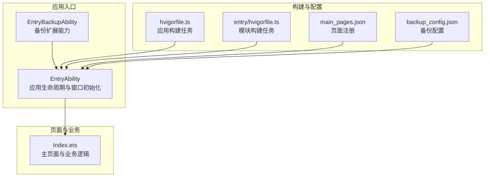
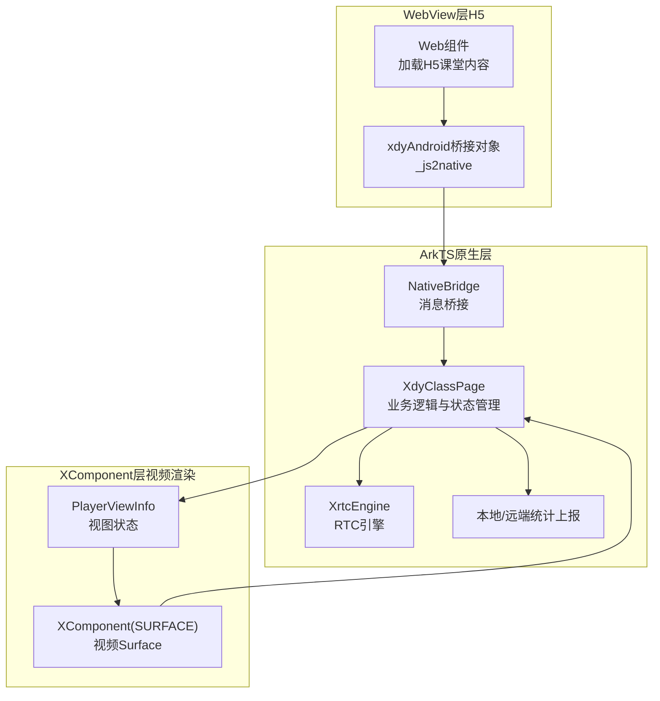
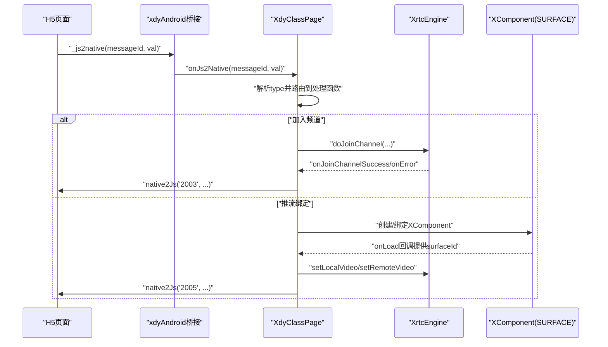
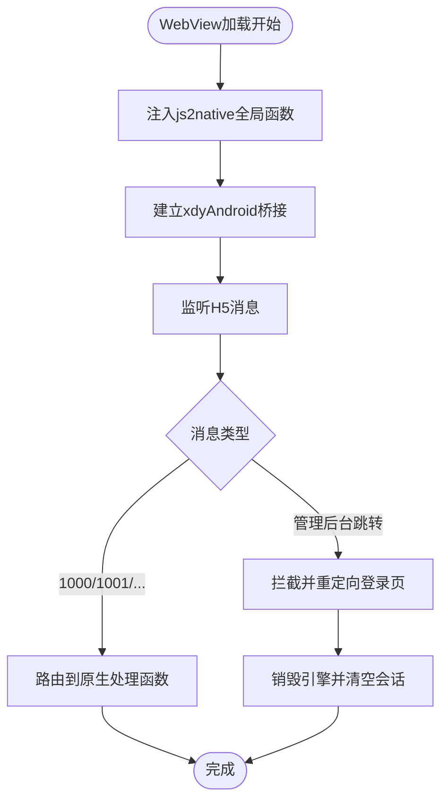
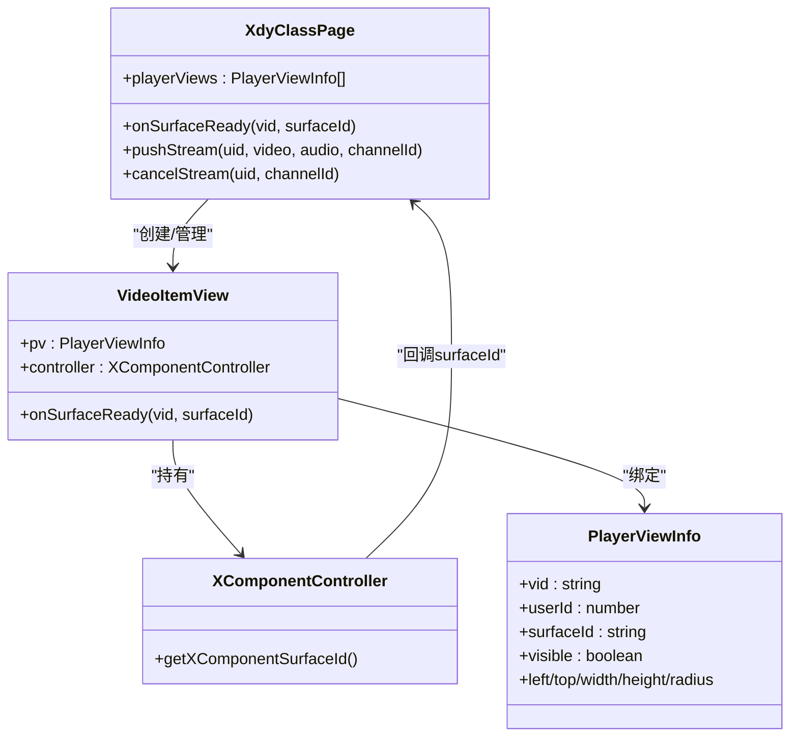
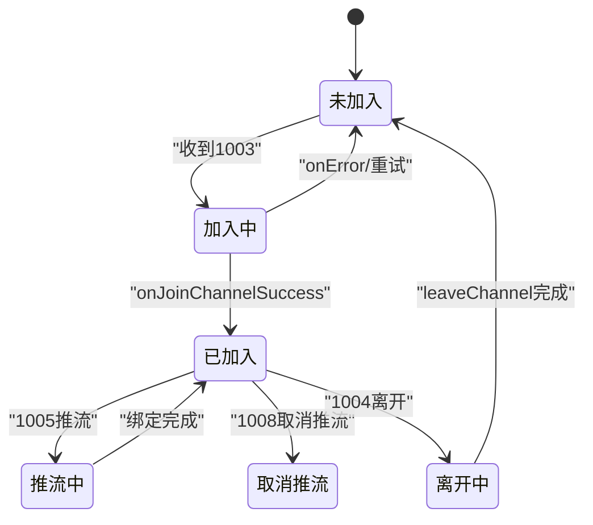
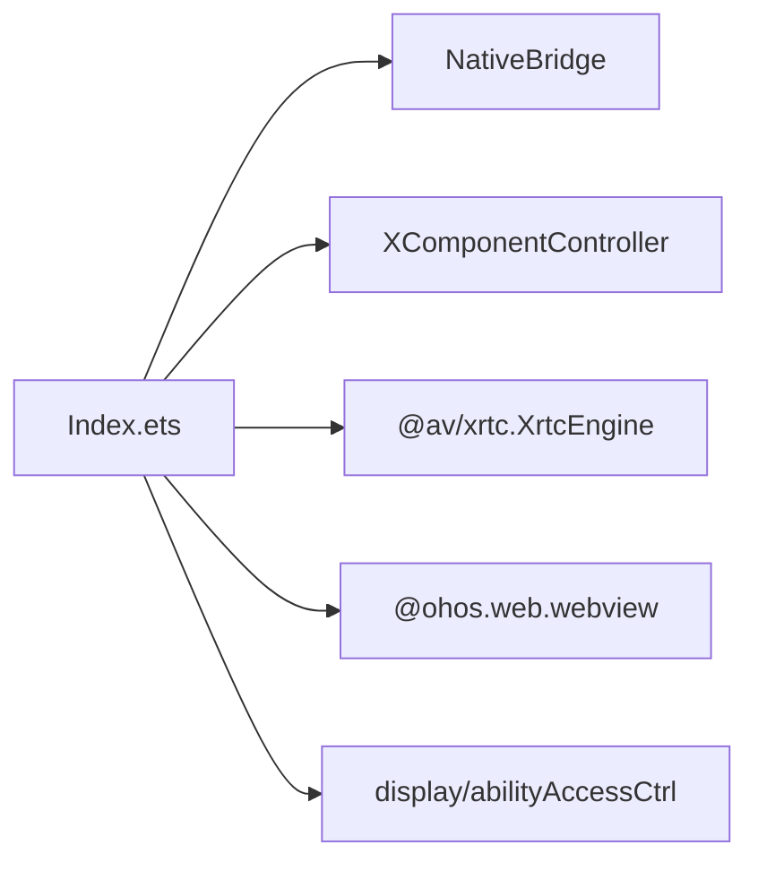

# 核心架构设计

<cite>
**本文引用的文件**   
- [Index.ets](file://entry/src/main/ets/pages/Index.ets)
- [EntryAbility.ets](file://entry/src/main/ets/entryability/EntryAbility.ets)
- [EntryBackupAbility.ets](file://entry/src/main/ets/entrybackupability/EntryBackupAbility.ets)
- [hvigorfile.ts](file://hvigorfile.ts)
- [entry_hvigorfile.ts](file://entry/hvigorfile.ts)
- [main_pages.json](file://entry/src/main/resources/base/profile/main_pages.json)
- [backup_config.json](file://entry/src/main/resources/base/profile/backup_config.json)
</cite>

## 目录
1. [引言](#引言)
2. [项目结构](#项目结构)
3. [核心组件](#核心组件)
4. [架构总览](#架构总览)
5. [详细组件分析](#详细组件分析)
6. [依赖分析](#依赖分析)
7. [性能考虑](#性能考虑)
8. [故障排查指南](#故障排查指南)
9. [结论](#结论)
10. [附录](#附录)

## 引言
本设计文档面向HarmonyOS在线课堂应用，阐述其三层架构设计：ArkTS原生层负责业务逻辑与状态管理、WebView层承载H5课堂内容、XComponent层处理视频渲染。文档详细说明各层之间的数据流向与交互机制，组件间的依赖关系与通信协议，以及架构决策的技术考量与权衡。同时给出系统边界定义与模块划分原则，并通过多种图示帮助开发者快速理解整体设计思路。

## 项目结构
项目采用HarmonyOS标准工程目录，入口能力通过EntryAbility加载主页面Index.ets，资源与页面配置位于entry模块内，构建工具由hvigor驱动。

图表来源
- [EntryAbility.ets](file://entry/src/main/ets/entryability/EntryAbility.ets#L14-L65)
- [EntryBackupAbility.ets](file://entry/src/main/ets/entrybackupability/EntryBackupAbility.ets#L1-L16)
- [hvigorfile.ts](file://hvigorfile.ts#L1-L6)
- [entry_hvigorfile.ts](file://entry/hvigorfile.ts#L1-L6)
- [main_pages.json](file://entry/src/main/resources/base/profile/main_pages.json#L1-L6)
- [backup_config.json](file://entry/src/main/resources/base/profile/backup_config.json#L1-L3)

章节来源
- [EntryAbility.ets](file://entry/src/main/ets/entryability/EntryAbility.ets#L14-L65)
- [hvigorfile.ts](file://hvigorfile.ts#L1-L6)
- [entry_hvigorfile.ts](file://entry/hvigorfile.ts#L1-L6)
- [main_pages.json](file://entry/src/main/resources/base/profile/main_pages.json#L1-L6)
- [backup_config.json](file://entry/src/main/resources/base/profile/backup_config.json#L1-L3)

## 核心组件
- ArkTS原生层（Index.ets）
  - 负责业务逻辑与状态管理，包括WebView桥接、RTC引擎初始化与事件处理、视频视图管理与绑定、用户列表与统计上报等。
  - 提供消息分发器onJs2Native，将H5消息路由至对应处理函数。
  - 管理PlayerViewInfo集合，驱动XComponent渲染。
- WebView层（H5课堂内容）
  - 通过Web组件加载H5课堂页面，启用JavaScript代理，建立xdyAndroid桥接对象，实现H5与原生的消息互通。
  - 支持URL拦截与重定向，确保退出流程一致性。
- XComponent层（视频渲染）
  - 使用XComponent(SURFACE)承载视频渲染Surface，通过onLoad回调获取surfaceId并绑定到对应用户。
  - 与ArkTS原生层通过PlayerViewInfo与XComponentController进行联动。

章节来源
- [Index.ets](file://entry/src/main/ets/pages/Index.ets#L195-L365)
- [Index.ets](file://entry/src/main/ets/pages/Index.ets#L108-L112)
- [Index.ets](file://entry/src/main/ets/pages/Index.ets#L153-L192)
- [Index.ets](file://entry/src/main/ets/pages/Index.ets#L200-L365)

## 架构总览
三层架构在运行时的交互如下：H5通过JavaScript Proxy向原生发送消息；原生解析消息类型并调用相应业务逻辑；业务逻辑根据状态与用户列表决定是否创建/绑定XComponent视频视图；XComponent在onLoad回调中提供surfaceId，原生将其绑定到对应用户并开始渲染。

图表来源
- [Index.ets](file://entry/src/main/ets/pages/Index.ets#L262-L365)
- [Index.ets](file://entry/src/main/ets/pages/Index.ets#L108-L112)
- [Index.ets](file://entry/src/main/ets/pages/Index.ets#L153-L192)
- [Index.ets](file://entry/src/main/ets/pages/Index.ets#L195-L365)

## 详细组件分析

### ArkTS原生层（业务逻辑与状态管理）
- 职责
  - WebView桥接与消息分发：onJs2Native统一接收H5消息，按type路由到具体处理函数。
  - 课堂控制：加入/离开频道、刷新、退出、推流/取消推流、静音/取消静音、切换摄像头、音量增益等。
  - 视图管理：维护PlayerViewInfo列表，驱动XComponent创建与绑定。
  - 统计上报：本地/远端音视频统计，周期性上报给H5。
  - 生命周期：aboutToAppear/Disappear中进行权限申请、上下文注入、引擎销毁与清理。
- 关键类与接口
  - XdyClassPage：主页面组件，承载业务逻辑与状态。
  - NativeBridge：H5↔原生消息桥接。
  - XdyRtcHandler：IEngineEventHandler实现，处理RTC事件回调。
  - PlayerViewInfo：视频视图状态模型。
  - ChannelInitParams：初始化参数封装。
- 通信协议
  - H5→原生：通过xdyAndroid._js2native(messageId, val)，原生onJs2Native解析type并执行对应处理。
  - 原生→H5：通过_webviewCtrl.runJavaScript执行_js2native(type, data)脚本。
- 数据流
  - H5消息→onJs2Native→业务处理→视图/引擎状态更新→XComponent绑定→渲染输出。
  - RTC事件→XdyRtcHandler回调→原生状态更新→native2Js上报→H5更新UI。

图表来源
- [Index.ets](file://entry/src/main/ets/pages/Index.ets#L368-L429)
- [Index.ets](file://entry/src/main/ets/pages/Index.ets#L929-L990)
- [Index.ets](file://entry/src/main/ets/pages/Index.ets#L1009-L1142)
- [Index.ets](file://entry/src/main/ets/pages/Index.ets#L1414-L1435)

章节来源
- [Index.ets](file://entry/src/main/ets/pages/Index.ets#L195-L365)
- [Index.ets](file://entry/src/main/ets/pages/Index.ets#L108-L112)
- [Index.ets](file://entry/src/main/ets/pages/Index.ets#L135-L151)
- [Index.ets](file://entry/src/main/ets/pages/Index.ets#L229-L260)
- [Index.ets](file://entry/src/main/ets/pages/Index.ets#L368-L429)
- [Index.ets](file://entry/src/main/ets/pages/Index.ets#L929-L990)
- [Index.ets](file://entry/src/main/ets/pages/Index.ets#L1009-L1142)
- [Index.ets](file://entry/src/main/ets/pages/Index.ets#L1174-L1440)

### WebView层（H5课堂内容）
- 职责
  - 加载H5课堂页面，启用JavaScript访问与代理，注入全局js2native函数，拦截特定URL并重定向。
  - 通过xdyAndroid桥接对象与原生通信，支持权限请求与缓存清理。
- 关键点
  - javaScriptProxy绑定NativeBridge对象，方法名为"_js2native"。
  - onPageBegin注入js2native，确保H5侧可调用window.js2native。
  - onLoadIntercept拦截管理后台跳转，触发原生销毁引擎与重置流程。

图表来源
- [Index.ets](file://entry/src/main/ets/pages/Index.ets#L262-L365)
- [Index.ets](file://entry/src/main/ets/pages/Index.ets#L289-L345)
- [Index.ets](file://entry/src/main/ets/pages/Index.ets#L368-L429)

章节来源
- [Index.ets](file://entry/src/main/ets/pages/Index.ets#L262-L365)
- [Index.ets](file://entry/src/main/ets/pages/Index.ets#L289-L345)

### XComponent层（视频渲染）
- 职责
  - 通过XComponent(SURFACE)创建视频渲染Surface，提供surfaceId给原生层绑定。
  - 与ArkTS原生层配合，实现多路视频的布局与显示。
- 关键点
  - VideoItemView组件持有XComponentController，onLoad回调中获取surfaceId并通知父组件。
  - 通过PlayerViewInfo控制视图位置、尺寸、圆角、可见性等属性。
  - 与WebView层叠加显示，zIndex高于WebView，hitTestBehavior设为Transparent以透传点击。

图表来源
- [Index.ets](file://entry/src/main/ets/pages/Index.ets#L153-L192)
- [Index.ets](file://entry/src/main/ets/pages/Index.ets#L195-L365)
- [Index.ets](file://entry/src/main/ets/pages/Index.ets#L1414-L1435)

章节来源
- [Index.ets](file://entry/src/main/ets/pages/Index.ets#L153-L192)
- [Index.ets](file://entry/src/main/ets/pages/Index.ets#L195-L365)
- [Index.ets](file://entry/src/main/ets/pages/Index.ets#L1414-L1435)

### 业务流程与状态机
- 加入/离开频道
  - H5发送1003加入频道消息，原生doJoinChannel创建/复用引擎并加入频道。
  - 1004离开频道时，原生仅leaveChannel而不destroy，保持引擎活跃以便重进。
- 推流/取消推流
  - 1005推流：原生pushStream在PlayerViewInfo中查找可用视图槽位，绑定surfaceId并调用setLocalVideo/setRemoteVideo。
  - 1008取消推流：解除绑定并清空视图状态。
- 静音/取消静音
  - 1006/1007：对本地用户先取消静音，必要时重新推流绑定；对远端用户更新静音状态。
- 统计上报
  - 本地/远端音视频统计在handleVideoStats/handleAudioStats中聚合，满足条件后通过native2Js上报。

图表来源
- [Index.ets](file://entry/src/main/ets/pages/Index.ets#L929-L990)
- [Index.ets](file://entry/src/main/ets/pages/Index.ets#L1174-L1224)
- [Index.ets](file://entry/src/main/ets/pages/Index.ets#L1009-L1142)
- [Index.ets](file://entry/src/main/ets/pages/Index.ets#L1144-L1172)

章节来源
- [Index.ets](file://entry/src/main/ets/pages/Index.ets#L929-L990)
- [Index.ets](file://entry/src/main/ets/pages/Index.ets#L1009-L1142)
- [Index.ets](file://entry/src/main/ets/pages/Index.ets#L1144-L1172)
- [Index.ets](file://entry/src/main/ets/pages/Index.ets#L1174-L1224)

## 依赖分析
- 组件耦合
  - XdyClassPage与NativeBridge强耦合，用于H5↔原生消息桥接。
  - XdyClassPage与XComponentController通过PlayerViewInfo间接耦合，实现视频渲染绑定。
  - XdyClassPage与XrtcEngine通过IEngineEventHandler耦合，处理RTC事件。
- 外部依赖
  - @av/xrtc：提供XrtcEngine、IEngineEventHandler、UserParam等SDK能力。
  - @ohos.web.webview：提供Web组件与WebviewController。
  - @ohos.display、@ohos.abilityAccessCtrl：系统能力与权限管理。
- 潜在风险
  - 引擎destroy可靠性问题：在HarmonyOS上destroy不可靠，采用leaveChannel+复用策略。
  - URL拦截与会话清理：需确保拦截后清除cookie与localStorage并重载登录页。

图表来源
- [Index.ets](file://entry/src/main/ets/pages/Index.ets#L1-L10)
- [Index.ets](file://entry/src/main/ets/pages/Index.ets#L195-L365)

章节来源
- [Index.ets](file://entry/src/main/ets/pages/Index.ets#L1-L10)
- [Index.ets](file://entry/src/main/ets/pages/Index.ets#L195-L365)

## 性能考虑
- 引擎复用策略
  - 离开时不destroy，复用引擎以避免重进initialize失败（-7）。
  - 刷新场景仅reset视图与数据，不销毁引擎。
- 视图绑定优化
  - pushStream优先精确匹配角色槽位，其次兼容槽位，减少无效绑定与重绑次数。
  - 通过surfaceId就绪后再绑定，避免空绑定导致的资源浪费。
- 统计上报节流
  - 本地/远端统计按帧聚合，满足条件后批量上报，降低JS桥接频率。
- WebView性能
  - 禁用混合内容与缓存模式，减少网络与存储开销；合理设置UA与文本缩放比例。

## 故障排查指南
- 引擎初始化失败
  - 现象：joinChannel返回负值，清除引擎等待重试。
  - 处理：检查appId/domain/secretKey与通道参数；确认Context注入成功。
- SurfaceId为空
  - 现象：XComponent onLoad未触发或返回空surfaceId。
  - 处理：确认XComponent创建成功且控制器有效；检查PlayerViewInfo槽位状态。
- URL拦截失效
  - 现象：H5直接跳转管理后台导致页面异常。
  - 处理：检查onLoadIntercept逻辑与拦截域名；确保清除cookie与localStorage并重载登录页。
- 音视频统计不上报
  - 现象：H5侧无推流/远端统计数据。
  - 处理：确认handleVideoStats/handleAudioStats中本地/远端ready标志；检查native2Js调用链。

章节来源
- [Index.ets](file://entry/src/main/ets/pages/Index.ets#L982-L990)
- [Index.ets](file://entry/src/main/ets/pages/Index.ets#L1414-L1435)
- [Index.ets](file://entry/src/main/ets/pages/Index.ets#L343-L345)
- [Index.ets](file://entry/src/main/ets/pages/Index.ets#L1324-L1406)

## 结论
该架构以ArkTS原生层为核心，承担业务逻辑与状态管理，WebView层承载H5课堂内容，XComponent层专注视频渲染，三者通过消息桥接与Surface绑定实现高效协作。通过引擎复用、视图绑定优化与统计上报节流等策略，在HarmonyOS平台上实现了稳定、低延迟的在线课堂体验。建议持续关注引擎destroy可靠性与WebView拦截策略的健壮性，以进一步提升稳定性与用户体验。

## 附录
- 系统边界定义
  - ArkTS原生层边界：业务逻辑、状态管理、消息路由、视图绑定、统计上报。
  - WebView层边界：H5内容加载、权限请求、URL拦截、JS桥接。
  - XComponent层边界：视频Surface创建与绑定、视图布局与透明点击。
- 模块划分原则
  - 单一职责：ArkTS负责业务，WebView负责内容，XComponent负责渲染。
  - 最小暴露：ArkTS通过NativeBridge对外暴露有限方法，避免过度耦合。
  - 可测试性：将业务逻辑与UI解耦，便于单元测试与集成测试。