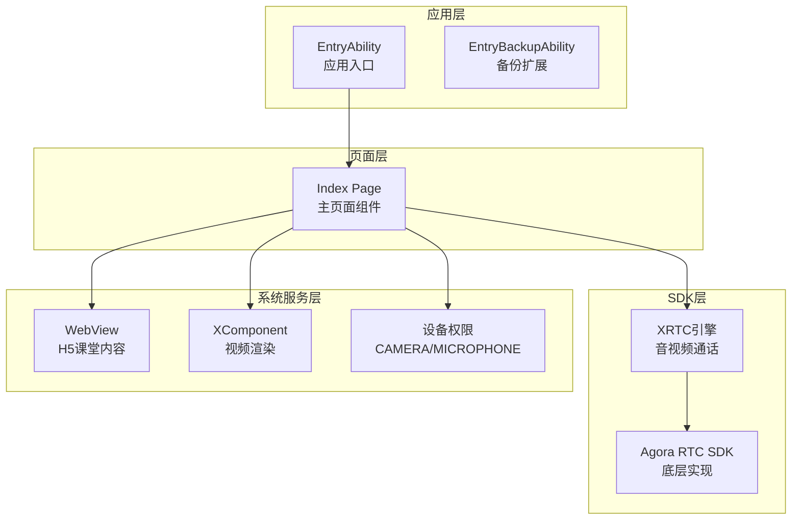
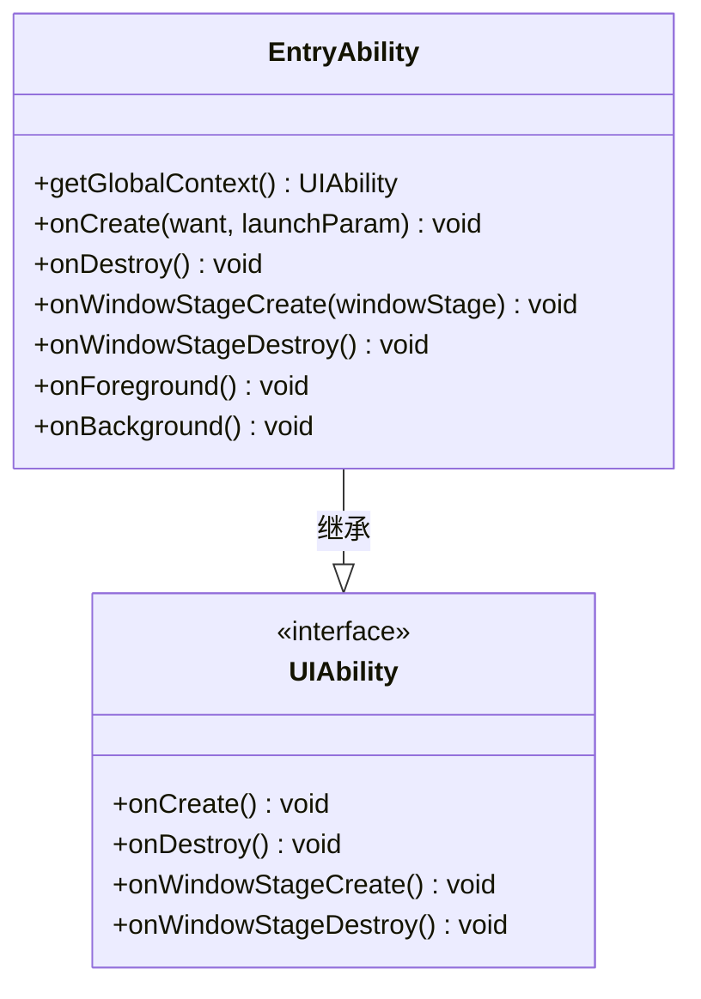
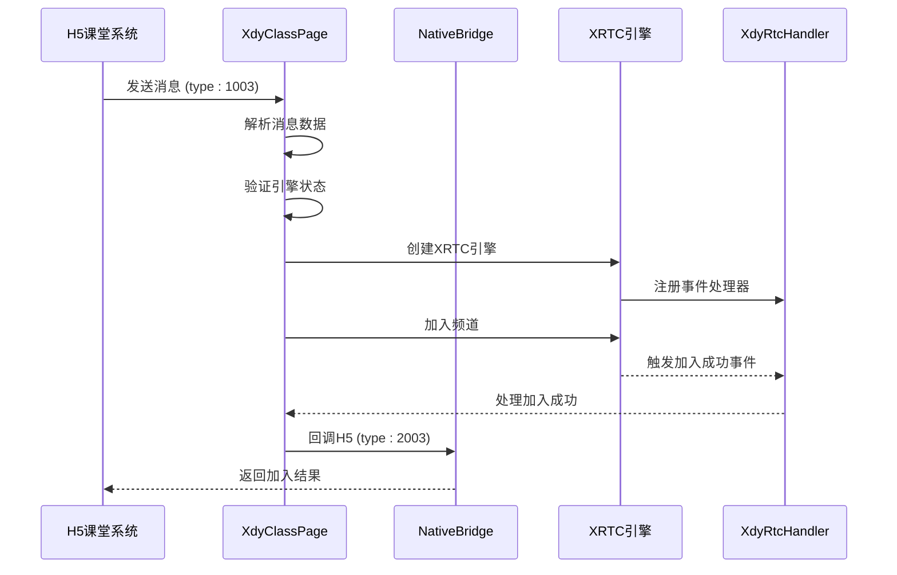
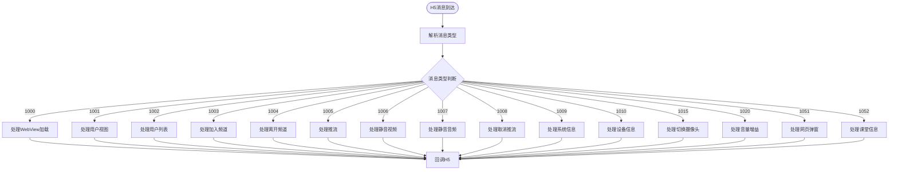
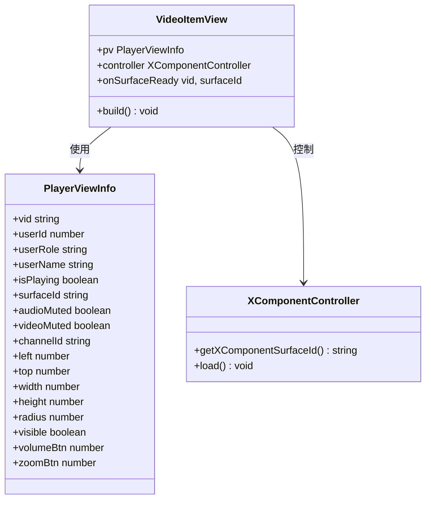

# 系统边界定义

<cite>
**本文档引用的文件**
- [EntryAbility.ets](file://entry/src/main/ets/entryability/EntryAbility.ets)
- [Index.ets](file://entry/src/main/ets/pages/Index.ets)
- [EntryBackupAbility.ets](file://entry/src/main/ets/entrybackupability/EntryBackupAbility.ets)
- [hvigorfile.ts](file://hvigorfile.ts)
- [libagora_rtc_sdk/index.d.ts](file://package/src/main/cpp/types/libagora_rtc_sdk/index.d.ts)
- [module.json](file://entry/build/default/intermediates/merge_profile/default/module.json)
- [main_pages.json](file://entry/src/main/resources/base/profile/main_pages.json)
- [string.json](file://AppScope/resources/base/element/string.json)
- [harmonylog.md](file://harmonylog.md)
- [鸿蒙端实现分析与优化建议.md](file://鸿蒙端实现分析与优化建议.md)
</cite>

## 目录
1. [引言](#引言)
2. [项目结构](#项目结构)
3. [核心组件](#核心组件)
4. [架构总览](#架构总览)
5. [详细组件分析](#详细组件分析)
6. [依赖关系分析](#依赖关系分析)
7. [性能考量](#性能考量)
8. [故障排除指南](#故障排除指南)
9. [结论](#结论)

## 引言

本文件为HarmonyOS在线课堂应用的系统边界定义文档，旨在明确应用的系统边界、模块划分原则以及与外部系统的接口定义。该应用采用ArkTS原生层、WebView层、XComponent层的三层架构设计，通过JS Bridge实现H5课堂系统与原生层的双向通信，集成声网RTC服务提供音视频通话能力，并通过设备权限系统管理摄像头和麦克风访问。

## 项目结构

HarmonyOS在线课堂应用采用标准的HarmonyOS项目结构，主要包含以下层次：



**图表来源**
- [EntryAbility.ets](file://entry/src/main/ets/entryability/EntryAbility.ets#L14-L65)
- [Index.ets](file://entry/src/main/ets/pages/Index.ets#L195-L360)
- [EntryBackupAbility.ets](file://entry/src/main/ets/entrybackupability/EntryBackupAbility.ets#L6-L16)

**章节来源**
- [EntryAbility.ets](file://entry/src/main/ets/entryability/EntryAbility.ets#L1-L65)
- [Index.ets](file://entry/src/main/ets/pages/Index.ets#L1-L1436)
- [module.json](file://entry/build/default/intermediates/merge_profile/default/module.json#L21-L116)

## 核心组件

### ArkTS原生层

ArkTS原生层是应用的核心控制层，负责业务逻辑处理、系统集成和资源管理。主要组件包括：

- **EntryAbility**: 应用入口能力，负责应用生命周期管理和窗口初始化
- **XdyClassPage**: 主页面组件，实现完整的课堂功能逻辑
- **XdyRtcHandler**: RTC事件处理器，管理音视频通话状态
- **NativeBridge**: JS桥接器，提供H5与原生层的通信接口

### WebView层

WebView层承载H5课堂内容，通过JavaScript代理与原生层进行双向通信：

- **Web组件**: 加载H5课堂系统，支持JavaScript访问和权限请求
- **JavaScript代理**: 通过`javaScriptProxy`建立`xdyAndroid`对象桥接
- **URL拦截**: 拦截管理后台跳转，实现退出课堂处理

### XComponent层

XComponent层专门用于视频渲染，提供高性能的视频画面显示：

- **VideoItemView**: 视频渲染组件，支持XComponent控制器
- **PlayerViewInfo**: 视频视图信息模型，管理视频渲染状态
- **Surface绑定**: 通过XComponent Surface实现视频画面渲染

**章节来源**
- [Index.ets](file://entry/src/main/ets/pages/Index.ets#L135-L151)
- [Index.ets](file://entry/src/main/ets/pages/Index.ets#L108-L112)
- [Index.ets](file://entry/src/main/ets/pages/Index.ets#L154-L192)

## 架构总览

应用采用三层架构设计，实现了清晰的职责分离和模块解耦：

```mermaid
graph TB
subgraph "系统边界"
subgraph "应用内部"
ArkTS[ArkTS原生层]
WebView[WebView层]
XComponent[XComponent层]
end
subgraph "外部系统"
H5System[H5课堂系统]
AgoraRTC[声网RTC服务]
DeviceSystem[设备权限系统]
end
end
ArkTS --> WebView
ArkTS --> XComponent
WebView <- --> H5System
XComponent --> AgoraRTC
ArkTS --> DeviceSystem
WebView -.->|JS Bridge| ArkTS
XComponent -.->|事件回调| ArkTS
```

**图表来源**
- [Index.ets](file://entry/src/main/ets/pages/Index.ets#L257-L360)
- [Index.ets](file://entry/src/main/ets/pages/Index.ets#L200-L280)
- [Index.ets](file://entry/src/main/ets/pages/Index.ets#L1410-L1430)

### 模块划分原则

1. **职责单一原则**: 每个模块专注于特定功能领域
2. **接口抽象原则**: 通过统一接口定义实现模块间解耦
3. **数据流向原则**: 明确的数据流向和事件传播机制
4. **错误隔离原则**: 各模块独立处理自身错误，避免级联故障

### 系统边界定义

应用的系统边界包括：

- **内部边界**: ArkTS原生层、WebView层、XComponent层之间的清晰分界
- **外部边界**: 与H5课堂系统、声网RTC服务、设备权限系统的交互边界
- **数据边界**: 通过JS Bridge传递的消息类型和数据格式边界

## 详细组件分析

### EntryAbility组件分析

EntryAbility作为应用入口，负责应用的基础配置和生命周期管理：



**图表来源**
- [EntryAbility.ets](file://entry/src/main/ets/entryability/EntryAbility.ets#L14-L65)

**章节来源**
- [EntryAbility.ets](file://entry/src/main/ets/entryability/EntryAbility.ets#L1-L65)

### 主页面组件分析

主页面组件XdyClassPage是应用的核心业务逻辑载体：



**图表来源**
- [Index.ets](file://entry/src/main/ets/pages/Index.ets#L536-L581)
- [Index.ets](file://entry/src/main/ets/pages/Index.ets#L924-L985)

**章节来源**
- [Index.ets](file://entry/src/main/ets/pages/Index.ets#L195-L360)
- [Index.ets](file://entry/src/main/ets/pages/Index.ets#L924-L1001)

### JS Bridge通信机制

JS Bridge实现了H5与原生层的双向通信，支持多种消息类型：



**图表来源**
- [Index.ets](file://entry/src/main/ets/pages/Index.ets#L363-L424)
- [Index.ets](file://entry/src/main/ets/pages/Index.ets#L426-L922)

**章节来源**
- [Index.ets](file://entry/src/main/ets/pages/Index.ets#L363-L424)
- [Index.ets](file://entry/src/main/ets/pages/Index.ets#L108-L112)

### 视频渲染组件分析

视频渲染组件通过XComponent实现高性能视频画面显示：



**图表来源**
- [Index.ets](file://entry/src/main/ets/pages/Index.ets#L154-L192)
- [Index.ets](file://entry/src/main/ets/pages/Index.ets#L26-L66)

**章节来源**
- [Index.ets](file://entry/src/main/ets/pages/Index.ets#L154-L192)
- [Index.ets](file://entry/src/main/ets/pages/Index.ets#L26-L66)

## 依赖关系分析

### 外部系统接口定义

应用与外部系统的接口关系如下：

```mermaid
graph LR
subgraph "应用内部"
ArkTS[ArkTS原生层]
WebView[WebView层]
XComponent[XComponent层]
end
subgraph "外部系统"
H5System[H5课堂系统]
AgoraRTC[声网RTC服务]
DeviceSystem[设备权限系统]
Network[网络服务]
end
ArkTS --> H5System
WebView <- --> H5System
XComponent --> AgoraRTC
ArkTS --> DeviceSystem
ArkTS --> Network
H5System -.->|HTTP/HTTPS| Network
AgoraRTC -.->|WebSocket/UDP| Network
```

**图表来源**
- [Index.ets](file://entry/src/main/ets/pages/Index.ets#L200-L280)
- [libagora_rtc_sdk/index.d.ts](file://package/src/main/cpp/types/libagora_rtc_sdk/index.d.ts#L1-L298)

### 模块间解耦设计

应用通过以下机制实现模块间解耦：

1. **接口抽象**: 通过统一的接口定义隐藏具体实现细节
2. **事件驱动**: 采用事件驱动模式实现松耦合通信
3. **数据模型**: 使用标准化的数据模型确保数据一致性
4. **错误处理**: 独立的错误处理机制避免错误传播

**章节来源**
- [Index.ets](file://entry/src/main/ets/pages/Index.ets#L135-L151)
- [Index.ets](file://entry/src/main/ets/pages/Index.ets#L100-L132)

## 性能考量

### 系统性能特性

应用在性能方面具有以下特点：

- **启动性能**: 应用启动时设置全局上下文，优化资源访问效率
- **渲染性能**: XComponent提供硬件加速的视频渲染能力
- **网络性能**: WebView配置优化，减少不必要的网络请求
- **内存管理**: 严格的生命周期管理，及时释放资源

### 优化建议

1. **资源预加载**: 提前加载必要的资源，减少首次使用延迟
2. **缓存策略**: 合理使用缓存机制，平衡内存占用和性能
3. **异步处理**: 将耗时操作异步化，避免阻塞主线程
4. **监控指标**: 建立性能监控体系，持续优化用户体验

## 故障排除指南

### 常见问题及解决方案

1. **权限申请失败**
   - 检查`module.json`中的权限声明
   - 确认用户授权流程正确执行
   - 验证权限请求时机和条件

2. **WebView加载异常**
   - 检查URL配置和网络连接
   - 验证JavaScript代理配置
   - 确认权限请求处理逻辑

3. **视频渲染问题**
   - 检查XComponent Surface绑定状态
   - 验证视频推流配置
   - 确认渲染模式设置

**章节来源**
- [Index.ets](file://entry/src/main/ets/pages/Index.ets#L237-L246)
- [Index.ets](file://entry/src/main/ets/pages/Index.ets#L317-L336)
- [Index.ets](file://entry/src/main/ets/pages/Index.ets#L1410-L1430)

## 结论

HarmonyOS在线课堂应用通过清晰的系统边界定义和模块化设计，实现了H5课堂系统、声网RTC服务、设备权限系统的有效集成。三层架构设计确保了各模块的职责清晰和相互解耦，JS Bridge通信机制提供了稳定的数据交换通道。通过合理的性能优化和故障排除策略，应用能够为用户提供流畅的在线课堂体验。

该系统边界定义为后续的功能扩展和维护提供了坚实的基础，开发者可以根据此框架进行功能增强和性能优化。