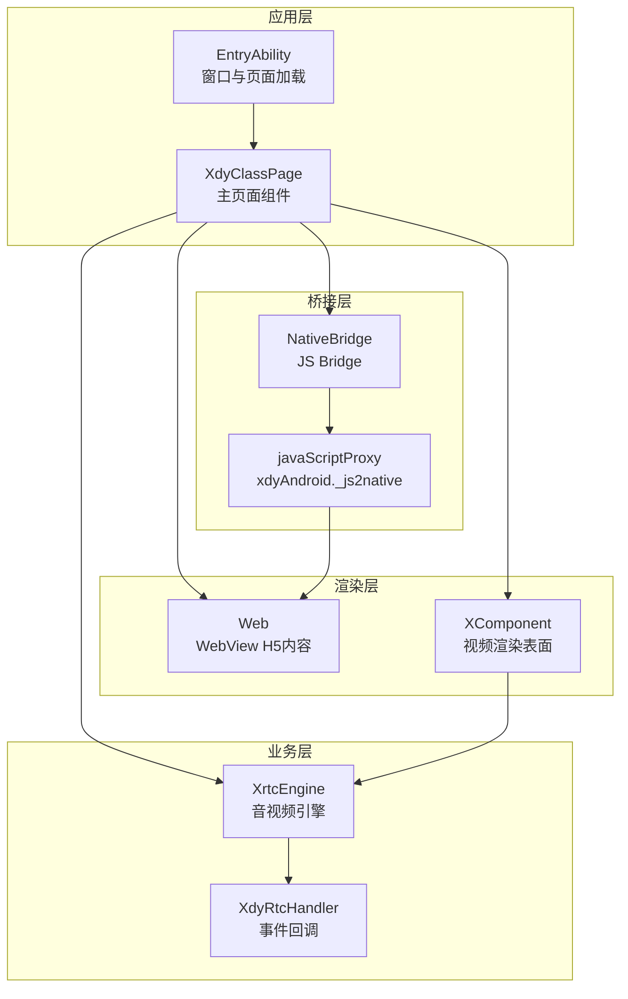
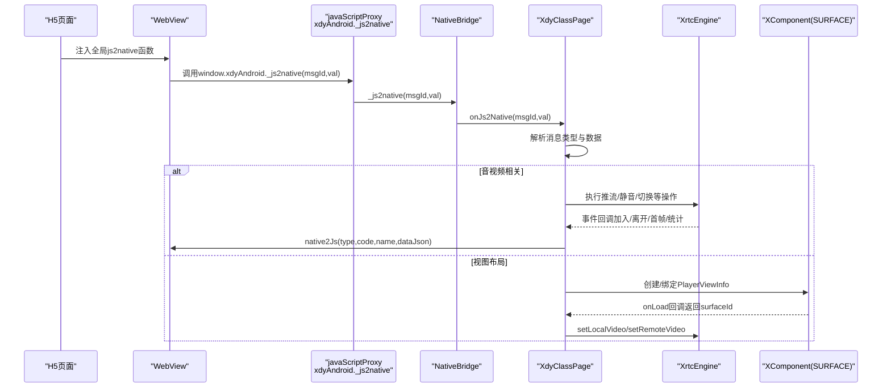
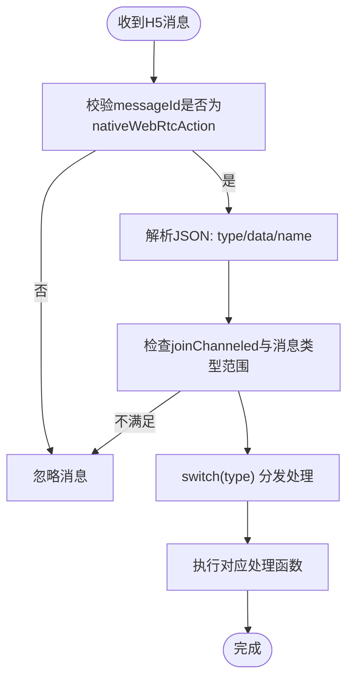
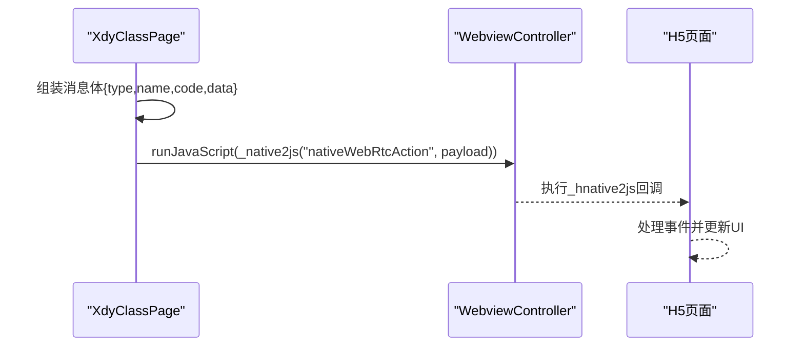
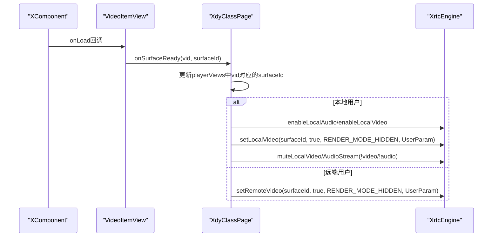
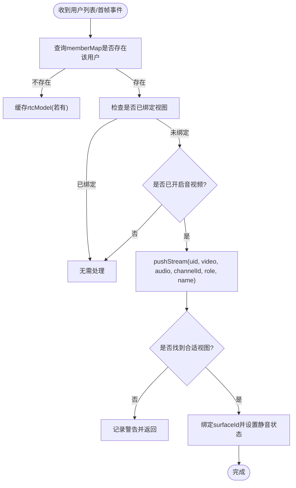
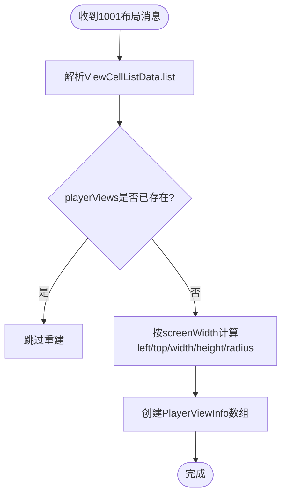
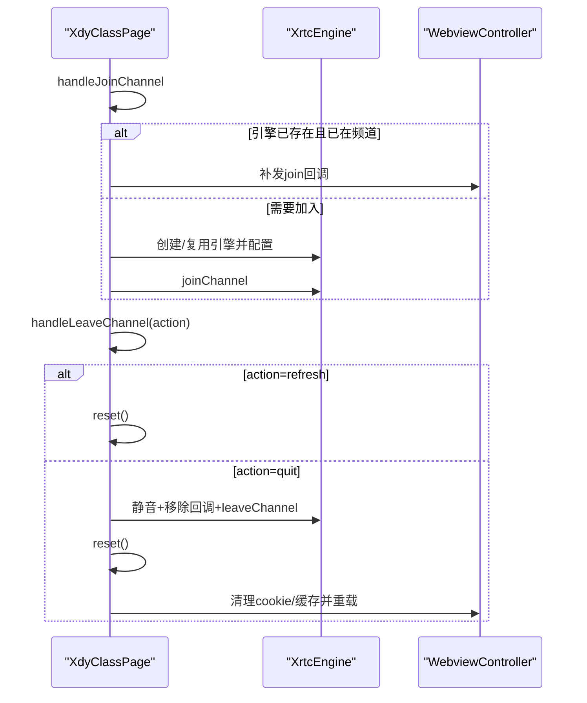
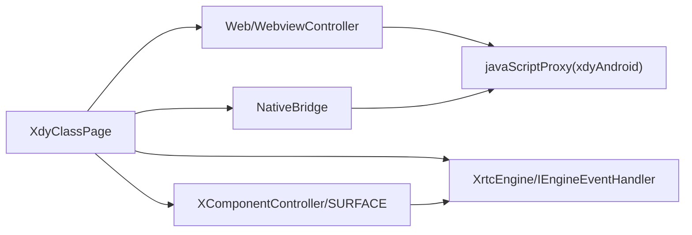

# 组件交互机制

<cite>
**本文引用的文件**
- [Index.ets](file://entry/src/main/ets/pages/Index.ets)
- [EntryAbility.ets](file://entry/src/main/ets/entryability/EntryAbility.ets)
- [module.json](file://entry/build/default/intermediates/res/default/module.json)
- [ark_module.json](file://entry/build/default/intermediates/res/default/ark_module.json)
</cite>

## 目录
1. [简介](#简介)
2. [项目结构](#项目结构)
3. [核心组件](#核心组件)
4. [架构总览](#架构总览)
5. [详细组件分析](#详细组件分析)
6. [依赖关系分析](#依赖关系分析)
7. [性能考量](#性能考量)
8. [故障排查指南](#故障排查指南)
9. [结论](#结论)

## 简介
本文件面向HarmonyOS在线课堂应用，系统化阐述WebView、XComponent与ArkTS组件之间的交互协议与通信机制，重点解析JS Bridge的实现原理（消息分发、native2Js回调、onJs2Native处理流程）、组件间依赖关系与生命周期管理，并提供音视频推流控制、用户列表更新、视图布局变化等具体交互示例，以及错误处理与异常恢复策略。

## 项目结构
应用采用ArkTS + Web混合架构：
- 主页面组件负责承载WebView与XComponent叠加层，协调JS Bridge与RTC引擎。
- EntryAbility负责窗口初始化与页面加载。
- 模块配置声明权限与能力，确保相机、麦克风、网络访问等能力可用。

图表来源
- [Index.ets](file://entry/src/main/ets/pages/Index.ets#L197-L360)
- [EntryAbility.ets](file://entry/src/main/ets/entryability/EntryAbility.ets#L14-L49)

章节来源
- [Index.ets](file://entry/src/main/ets/pages/Index.ets#L197-L360)
- [EntryAbility.ets](file://entry/src/main/ets/entryability/EntryAbility.ets#L14-L49)
- [module.json](file://entry/build/default/intermediates/res/default/module.json#L32-L66)

## 核心组件
- WebView与JavaScript代理：通过javaScriptProxy将NativeBridge对象暴露给H5，命名空间为xdyAndroid，方法列表包含_js2native，实现H5向原生的消息通道。
- JS Bridge：NativeBridge封装_onJs2Native入口，统一接收H5消息并分发至对应处理函数；同时提供native2Js用于向H5回推事件。
- XComponent视频层：每个PlayerViewInfo对应一个XComponent（SURFACE类型），在XComponent.onLoad回调中获取surfaceId并绑定到RTC引擎，实现视频渲染。
- RTC引擎与事件：XrtcEngine负责加入/离开频道、推流/取消推流、音视频静音、设备信息、系统信息等；XdyRtcHandler将引擎回调转换为主页面可感知的事件。

章节来源
- [Index.ets](file://entry/src/main/ets/pages/Index.ets#L108-L112)
- [Index.ets](file://entry/src/main/ets/pages/Index.ets#L200-L280)
- [Index.ets](file://entry/src/main/ets/pages/Index.ets#L135-L151)
- [Index.ets](file://entry/src/main/ets/pages/Index.ets#L153-L192)

## 架构总览
下图展示从H5到原生再到渲染层的完整交互链路，包括消息分发、事件回调与视图绑定。

图表来源
- [Index.ets](file://entry/src/main/ets/pages/Index.ets#L264-L289)
- [Index.ets](file://entry/src/main/ets/pages/Index.ets#L363-L424)
- [Index.ets](file://entry/src/main/ets/pages/Index.ets#L988-L1001)
- [Index.ets](file://entry/src/main/ets/pages/Index.ets#L1410-L1430)

## 详细组件分析

### JS Bridge与消息分发机制
- H5侧通过window.js2native(msgId,val)调用，最终桥接到xdyAndroid._js2native，由NativeBridge统一接收。
- onJs2Native根据消息类型（字符串型type）分发到具体处理函数，如1000加载、1001用户视图、1002用户列表、1003加入频道、1004离开频道、1005推流、1006静音视频、1007静音音频、1008取消推流、1009系统信息、1010设备信息、1015切换摄像头、1020音量增益、1051/1052等。
- 对于非nativeWebRtcAction的消息，直接忽略；对于refresh/quit特殊消息，分别执行刷新与退出流程。
- 为保证加入频道前的安全性，当joinChanneled为false且消息类型在1005-1008范围内时，直接返回，避免在未加入频道时执行推流/静音等操作。

图表来源
- [Index.ets](file://entry/src/main/ets/pages/Index.ets#L395-L424)

章节来源
- [Index.ets](file://entry/src/main/ets/pages/Index.ets#L264-L289)
- [Index.ets](file://entry/src/main/ets/pages/Index.ets#L363-L424)
- [Index.ets](file://entry/src/main/ets/pages/Index.ets#L403-L420)

### native2Js回调机制
- native2Js负责将原生事件封装为标准格式（type、name、code、data），并通过WebviewController.runJavaScript执行脚本调用_hnative2js("nativeWebRtcAction", payload)，将事件回推给H5。
- H5侧需预先注入_hnative2js函数以接收原生推送的事件，从而实现双向通信闭环。

图表来源
- [Index.ets](file://entry/src/main/ets/pages/Index.ets#L988-L1001)

章节来源
- [Index.ets](file://entry/src/main/ets/pages/Index.ets#L988-L1001)

### XComponent与视频渲染生命周期
- VideoItemView为每个PlayerViewInfo提供XComponent渲染容器，XComponent类型为SURFACE，控制器在VideoItemView内创建。
- XComponent.onLoad回调中，通过controller.getXComponentSurfaceId()获取surfaceId，并调用onSurfaceReady(vid, surfaceId)。
- onSurfaceReady将surfaceId写入对应的PlayerViewInfo，并根据userId决定绑定本地或远端视频；若用户为本地用户，则启用本地音视频采集并设置静音状态。

图表来源
- [Index.ets](file://entry/src/main/ets/pages/Index.ets#L153-L192)
- [Index.ets](file://entry/src/main/ets/pages/Index.ets#L1410-L1430)
- [Index.ets](file://entry/src/main/ets/pages/Index.ets#L1054-L1070)

章节来源
- [Index.ets](file://entry/src/main/ets/pages/Index.ets#L153-L192)
- [Index.ets](file://entry/src/main/ets/pages/Index.ets#L1410-L1430)

### 音视频推流控制与用户列表更新
- 推流绑定策略：pushStream优先匹配精确角色的空闲视图；若无精确匹配，对normal角色可兼容绑定到showstage视图；若仍未找到，返回null。
- 用户列表更新：handleUserList维护memberMap，当成员已开启摄像头/麦克风且未绑定视图时，主动调用pushStream进行推流绑定；同时处理刷新场景下的缓存rtcModel回扫。
- 静音控制：handleMuteVideo/handleMuteAudio分别处理本地/远端静音；本地用户开启摄像头/麦克风时，若未绑定视图则重新推流绑定。
- 取消推流：cancelStream遍历playerViews，解除对应用户的视频绑定并重置状态。

图表来源
- [Index.ets](file://entry/src/main/ets/pages/Index.ets#L484-L534)
- [Index.ets](file://entry/src/main/ets/pages/Index.ets#L1004-L1137)

章节来源
- [Index.ets](file://entry/src/main/ets/pages/Index.ets#L717-L728)
- [Index.ets](file://entry/src/main/ets/pages/Index.ets#L730-L818)
- [Index.ets](file://entry/src/main/ets/pages/Index.ets#L820-L828)
- [Index.ets](file://entry/src/main/ets/pages/Index.ets#L1004-L1137)

### 视图布局变化与屏幕适配
- handleUserView根据H5提供的百分比布局参数计算像素坐标与圆角半径，创建PlayerViewInfo数组；若已有视图则直接返回，避免重复重建。
- 屏幕宽度通过display.getDefaultDisplaySync获取，用于将百分比转换为像素值，确保不同设备的一致性。

图表来源
- [Index.ets](file://entry/src/main/ets/pages/Index.ets#L434-L481)

章节来源
- [Index.ets](file://entry/src/main/ets/pages/Index.ets#L434-L481)

### 加入/离开频道与引擎生命周期
- handleJoinChannel：若引擎已存在且已在当前频道，补发join回调；否则创建/复用XrtcEngine，设置音频场景、视频编码配置，调用joinChannel。
- handleLeaveChannel：根据action区分刷新与退出；刷新仅reset()不清空引擎；退出时静音本地音视频、移除事件回调、leaveChannel并reset()，随后清除cookie与缓存并重载登录页。
- doJoinChannel：在引擎已存在时先销毁再重建，确保状态一致性；join失败时清除引擎等待重试。

图表来源
- [Index.ets](file://entry/src/main/ets/pages/Index.ets#L536-L581)
- [Index.ets](file://entry/src/main/ets/pages/Index.ets#L583-L649)
- [Index.ets](file://entry/src/main/ets/pages/Index.ets#L924-L985)

章节来源
- [Index.ets](file://entry/src/main/ets/pages/Index.ets#L536-L581)
- [Index.ets](file://entry/src/main/ets/pages/Index.ets#L583-L649)
- [Index.ets](file://entry/src/main/ets/pages/Index.ets#L924-L985)

### 权限申请与异常恢复
- 权限申请：aboutToAppear中请求CAMERA与MICROPHONE权限，失败时记录告警日志。
- 异常恢复：doJoinChannel对销毁步骤逐一try-catch，避免单步失败影响整体清理；退出场景不destroy引擎，复用引擎可避免重进时初始化失败（返回码-7）。

章节来源
- [Index.ets](file://entry/src/main/ets/pages/Index.ets#L229-L247)
- [Index.ets](file://entry/src/main/ets/pages/Index.ets#L938-L951)
- [Index.ets](file://entry/src/main/ets/pages/Index.ets#L618-L632)

## 依赖关系分析
- 组件耦合与内聚：XdyClassPage聚合WebView、XComponent、NativeBridge、XrtcEngine与事件处理器，形成高内聚的课堂页面控制中心。
- 直接依赖：WebView依赖javaScriptProxy与WebviewController；XComponent依赖XComponentController与surfaceId；NativeBridge依赖onJs2Native与native2Js；XrtcEngine依赖IEngineEventHandler。
- 外部依赖：@av/xrtc提供XrtcEngine与相关枚举；@ohos.web.webview提供Web与WebviewController；@ohos.display提供屏幕信息；@ohos.abilityAccessCtrl提供权限管理。

图表来源
- [Index.ets](file://entry/src/main/ets/pages/Index.ets#L200-L280)
- [Index.ets](file://entry/src/main/ets/pages/Index.ets#L108-L112)
- [Index.ets](file://entry/src/main/ets/pages/Index.ets#L153-L192)
- [Index.ets](file://entry/src/main/ets/pages/Index.ets#L135-L151)

章节来源
- [Index.ets](file://entry/src/main/ets/pages/Index.ets#L200-L280)
- [Index.ets](file://entry/src/main/ets/pages/Index.ets#L108-L112)
- [Index.ets](file://entry/src/main/ets/pages/Index.ets#L153-L192)
- [Index.ets](file://entry/src/main/ets/pages/Index.ets#L135-L151)

## 性能考量
- 视图重建控制：handleUserView在已有视图时直接返回，避免重复创建与绑定，降低渲染成本。
- 推流绑定策略：优先精确匹配角色，减少跨角色绑定带来的额外判断与切换。
- 统计上报：本地/远端音视频统计按帧累加，双数据就绪后一次性上报，减少频繁回调。
- 缓存与清理：退出场景不清除引擎，复用引擎避免初始化失败；刷新场景仅reset()，保留引擎提升响应速度。

## 故障排查指南
- H5无法调用_js2native：确认WebView已启用javaScriptAccess并正确配置javaScriptProxy；确认H5已注入window.js2native函数。
- 视图不显示或黑屏：检查XComponent.onLoad是否触发、surfaceId是否正确获取、是否调用setLocalVideo/setRemoteVideo；确认PlayerViewInfo的visible与playing状态。
- 推流失败或无画面：检查本地音视频采集权限、enableLocalAudio/enableLocalVideo调用顺序、muteLocalVideoStream/muteLocalAudioStream状态；确认用户角色与视图角色匹配。
- 加入频道失败：查看doJoinChannel返回码，必要时销毁引擎后重试；确认权限与网络环境。
- 退出后重进异常：遵循“不destroy引擎”的策略，确保复用引擎；若仍失败，清理缓存与cookie后重试。

章节来源
- [Index.ets](file://entry/src/main/ets/pages/Index.ets#L264-L289)
- [Index.ets](file://entry/src/main/ets/pages/Index.ets#L1410-L1430)
- [Index.ets](file://entry/src/main/ets/pages/Index.ets#L1054-L1070)
- [Index.ets](file://entry/src/main/ets/pages/Index.ets#L978-L985)
- [Index.ets](file://entry/src/main/ets/pages/Index.ets#L618-L632)

## 结论
本方案通过WebView与ArkTS的深度集成，借助JS Bridge实现了H5与原生的双向通信；XComponent与XrtcEngine协同完成视频渲染与推流控制；完善的生命周期管理与异常恢复策略保障了课堂场景的稳定性与流畅性。建议在后续迭代中持续优化消息路由与统计上报的实时性，并完善H5侧的错误提示与重试机制。