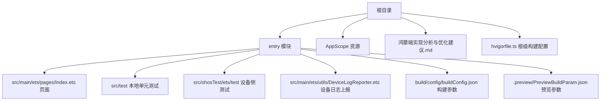
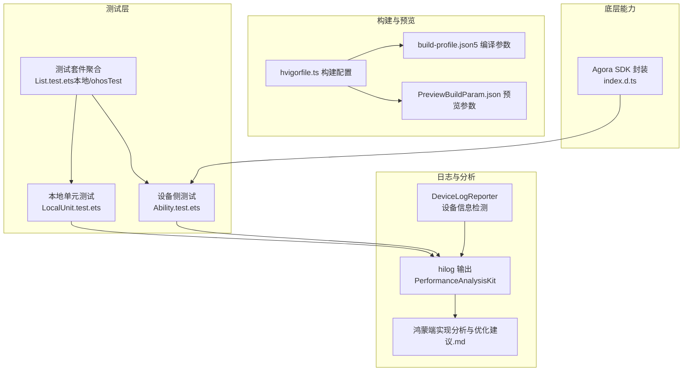
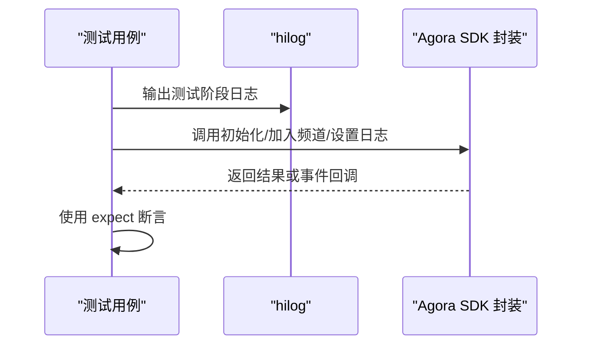
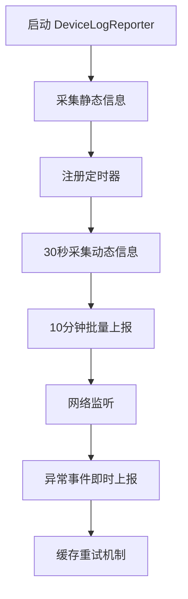
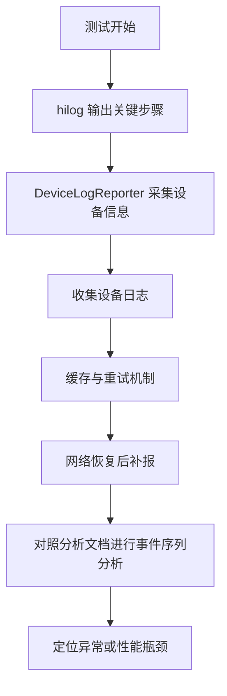
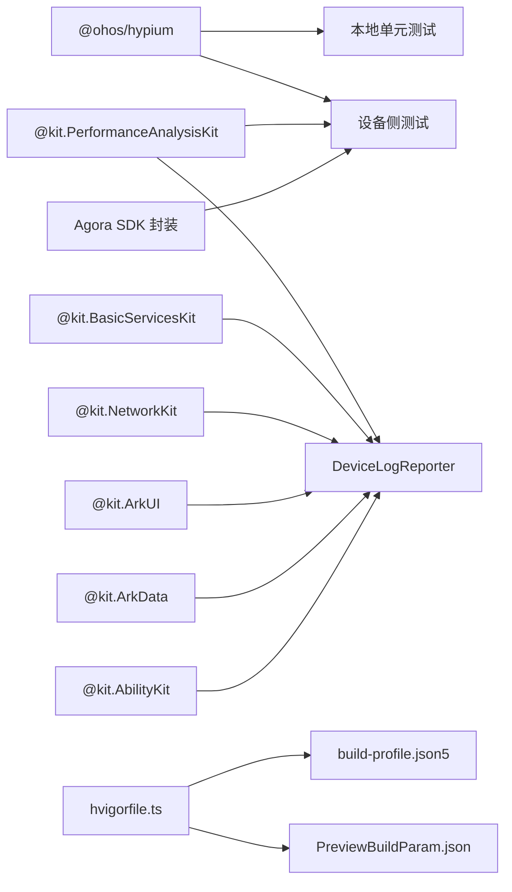

# 测试与调试

<cite>
**本文引用的文件**
- [DeviceLogReporter.ets](file://entry/src/main/ets/utils/DeviceLogReporter.ets)
- [Ability.test.ets](file://entry/src/ohosTest/ets/test/Ability.test.ets)
- [List.test.ets（ohosTest）](file://entry/src/ohosTest/ets/test/List.test.ets)
- [LocalUnit.test.ets](file://entry/src/test/LocalUnit.test.ets)
- [List.test.ets（test）](file://entry/src/test/List.test.ets)
- [鸿蒙端实现分析与优化建议.md](file://鸿蒙端实现分析与优化建议.md)
- [hvigorfile.ts（根）](file://hvigorfile.ts)
- [hvigorfile.ts（entry）](file://entry/hvigorfile.ts)
- [build-profile.json5（根）](file://build-profile.json5)
- [build-profile.json5（entry）](file://entry/build-profile.json5)
- [index.d.ts（Agora SDK 封装）](file://package/src/main/cpp/types/libagora_rtc_sdk/index.d.ts)
- [main_pages.json](file://entry/src/main/resources/base/profile/main_pages.json)
</cite>

## 更新摘要
**变更内容**
- 新增设备信息检测功能的测试方法和实现细节
- 增强日志系统使用与分析的完整指南
- 添加版本管理最佳实践和构建配置标准化
- 更新测试覆盖率要求和质量保证标准
- 完善自动化测试实施策略

## 目录
1. [引言](#引言)
2. [项目结构](#项目结构)
3. [核心组件](#核心组件)
4. [架构总览](#架构总览)
5. [详细组件分析](#详细组件分析)
6. [依赖分析](#依赖分析)
7. [性能考量](#性能考量)
8. [故障排查指南](#故障排查指南)
9. [结论](#结论)
10. [附录](#附录)

## 引言
本文件面向HarmonyOS在线课堂应用，提供系统化的测试与调试指南。内容覆盖单元测试与集成测试的编写与执行、日志系统的使用与分析、调试工具配置与使用、常见问题排查流程、性能分析方法、测试覆盖率与质量标准，以及自动化测试实施策略。特别新增了设备信息检测功能的测试方法和版本管理的最佳实践，帮助开发者快速建立可维护、可验证、可观测的测试体系。

## 项目结构
该工程采用HarmonyOS标准模块化结构，入口模块为entry，测试分为本地测试与ohosTest两类目录，分别用于本地单元测试与设备侧能力测试；同时提供日志分析文档与构建配置文件，便于定位问题与执行测试。新增的DeviceLogReporter工具提供了完整的设备信息检测和日志上报功能。

**图表来源**
- [hvigorfile.ts（根）:1-6](file://hvigorfile.ts#L1-L6)
- [hvigorfile.ts（entry）:1-6](file://entry/hvigorfile.ts#L1-L6)
- [build-profile.json5（根）:1-69](file://build-profile.json5#L1-L69)
- [build-profile.json5（entry）:1-33](file://entry/build-profile.json5#L1-L33)
- [DeviceLogReporter.ets:1-488](file://entry/src/main/ets/utils/DeviceLogReporter.ets#L1-L488)

**章节来源**
- [hvigorfile.ts（根）:1-6](file://hvigorfile.ts#L1-L6)
- [hvigorfile.ts（entry）:1-6](file://entry/hvigorfile.ts#L1-L6)
- [build-profile.json5（根）:1-69](file://build-profile.json5#L1-L69)
- [build-profile.json5（entry）:1-33](file://entry/build-profile.json5#L1-L33)
- [DeviceLogReporter.ets:1-488](file://entry/src/main/ets/utils/DeviceLogReporter.ets#L1-L488)

## 核心组件
- **测试框架与断言**：基于@ohos/hypium提供的describe、beforeAll、beforeEach、afterEach、afterAll、it、expect等API组织测试用例。
- **性能分析日志**：通过@kit.PerformanceAnalysisKit的hilog接口输出测试阶段日志，便于定位执行路径与性能热点。
- **设备信息检测**：DeviceLogReporter提供静态信息和动态信息的采集、缓存、上报功能，支持电池状态、网络类型、内存使用等监控。
- **Agora RTC SDK封装**：通过index.d.ts暴露初始化、加入/离开频道、设置日志级别、销毁等接口，支持测试中对底层媒体能力进行注入与校验。
- **构建与预览配置**：hvigorfile.ts定义构建任务，build-profile.json5提供编译与预览参数，保障测试环境一致性。

**章节来源**
- [Ability.test.ets:1-35](file://entry/src/ohosTest/ets/test/Ability.test.ets#L1-L35)
- [LocalUnit.test.ets:1-33](file://entry/src/test/LocalUnit.test.ets#L1-L33)
- [DeviceLogReporter.ets:1-488](file://entry/src/main/ets/utils/DeviceLogReporter.ets#L1-L488)
- [index.d.ts（Agora SDK 封装）:1-19](file://package/src/main/cpp/types/libagora_rtc_sdk/index.d.ts#L1-L19)

## 架构总览
下图展示测试与调试在系统中的位置与交互关系：测试由本地与设备侧两部分组成，日志贯穿测试执行过程，构建配置确保测试运行环境稳定，设备信息检测提供完整的运行时监控。

**图表来源**
- [Ability.test.ets:1-35](file://entry/src/ohosTest/ets/test/Ability.test.ets#L1-L35)
- [LocalUnit.test.ets:1-33](file://entry/src/test/LocalUnit.test.ets#L1-L33)
- [List.test.ets（ohosTest）:1-5](file://entry/src/ohosTest/ets/test/List.test.ets#L1-L5)
- [List.test.ets（test）:1-5](file://entry/src/test/List.test.ets#L1-L5)
- [DeviceLogReporter.ets:1-488](file://entry/src/main/ets/utils/DeviceLogReporter.ets#L1-L488)
- [hvigorfile.ts（根）:1-6](file://hvigorfile.ts#L1-L6)
- [hvigorfile.ts（entry）:1-6](file://entry/hvigorfile.ts#L1-L6)
- [build-profile.json5（根）:1-69](file://build-profile.json5#L1-L69)
- [build-profile.json5（entry）:1-33](file://entry/build-profile.json5#L1-L33)
- [index.d.ts（Agora SDK 封装）:1-19](file://package/src/main/cpp/types/libagora_rtc_sdk/index.d.ts#L1-L19)

## 详细组件分析

### 单元测试与断言（本地）
- **测试组织**：使用describe定义测试套件，it定义单个测试用例，配合beforeAll/beforeEach/afterEach/afterAll进行生命周期管理。
- **断言方法**：expect提供多种断言，如assertContain、assertEqual等，满足字符串与相等性校验。
- **执行入口**：List.test.ets聚合多个测试套件，便于统一执行。

**图表来源**
- [LocalUnit.test.ets:1-33](file://entry/src/test/LocalUnit.test.ets#L1-L33)
- [List.test.ets（test）:1-5](file://entry/src/test/List.test.ets#L1-L5)

**章节来源**
- [LocalUnit.test.ets:1-33](file://entry/src/test/LocalUnit.test.ets#L1-L33)
- [List.test.ets（test）:1-5](file://entry/src/test/List.test.ets#L1-L5)

### 设备侧能力测试（ohosTest）
- **性能分析日志**：在测试用例中通过hilog.info输出关键节点日志，便于定位执行路径与耗时点。
- **测试组织**：Ability.test.ets定义测试套件与用例，List.test.ets聚合至统一入口。
- **与底层SDK结合**：通过index.d.ts提供的接口，可在测试中调用底层能力（如初始化、加入/离开频道、设置日志等），以验证端到端行为。

**图表来源**
- [Ability.test.ets:1-35](file://entry/src/ohosTest/ets/test/Ability.test.ets#L1-L35)
- [index.d.ts（Agora SDK 封装）:1-19](file://package/src/main/cpp/types/libagora_rtc_sdk/index.d.ts#L1-L19)

**章节来源**
- [Ability.test.ets:1-35](file://entry/src/ohosTest/ets/test/Ability.test.ets#L1-L35)
- [List.test.ets（ohosTest）:1-5](file://entry/src/ohosTest/ets/test/List.test.ets#L1-L5)
- [index.d.ts（Agora SDK 封装）:1-19](file://package/src/main/cpp/types/libagora_rtc_sdk/index.d.ts#L1-L19)

### 设备信息检测功能测试
- **静态信息采集**：DeviceLogReporter负责设备基本信息的首次上报，包括系统版本、设备型号、屏幕分辨率、应用版本等。
- **动态信息监控**：定时采集电池状态、网络类型、内存使用率等动态指标，支持异常事件的即时上报。
- **缓存与重试机制**：在网络不佳时自动缓存日志，网络恢复后自动重试上传。
- **生命周期管理**：支持启动、停止、会话更新、前后台状态通知等功能。

**图表来源**
- [DeviceLogReporter.ets:85-124](file://entry/src/main/ets/utils/DeviceLogReporter.ets#L85-L124)
- [DeviceLogReporter.ets:231-249](file://entry/src/main/ets/utils/DeviceLogReporter.ets#L231-L249)
- [DeviceLogReporter.ets:337-354](file://entry/src/main/ets/utils/DeviceLogReporter.ets#L337-L354)

**章节来源**
- [DeviceLogReporter.ets:1-488](file://entry/src/main/ets/utils/DeviceLogReporter.ets#L1-L488)

### 日志系统使用与分析
- **hilog输出**：在设备侧测试中使用hilog.info输出测试阶段信息，便于在设备日志中检索与定位。
- **设备日志上报**：DeviceLogReporter提供完整的日志采集、缓存、上报功能，支持静态信息和动态信息的分类管理。
- **日志分析**：鸿蒙端实现分析与优化建议.md提供了大量实际运行日志示例，可用于对照分析课堂页面加载、加入频道、推流、成员列表更新等关键事件的时间线与状态变化。
- **建议**：在测试中增加关键步骤的日志标记，结合日志上报功能，形成统一的可观测性规范。

**图表来源**
- [Ability.test.ets:27-28](file://entry/src/ohosTest/ets/test/Ability.test.ets#L27-L28)
- [DeviceLogReporter.ets:357-409](file://entry/src/main/ets/utils/DeviceLogReporter.ets#L357-L409)
- [鸿蒙端实现分析与优化建议.md:1-334](file://鸿蒙端实现分析与优化建议.md#L1-L334)

**章节来源**
- [Ability.test.ets:27-28](file://entry/src/ohosTest/ets/test/Ability.test.ets#L27-L28)
- [DeviceLogReporter.ets:1-488](file://entry/src/main/ets/utils/DeviceLogReporter.ets#L1-L488)
- [鸿蒙端实现分析与优化建议.md:1-334](file://鸿蒙端实现分析与优化建议.md#L1-L334)

### 调试工具配置与使用
- **构建配置**：hvigorfile.ts定义了系统任务与插件扩展点，确保测试构建流程一致。
- **编译参数**：build-profile.json5提供设备类型、构建模式、日志等级、资源路径等关键参数，影响测试执行环境。
- **预览参数**：PreviewBuildParam.json控制资源目录映射与生成源目录，有助于在预览环境中复现问题。
- **版本管理**：通过build-profile.json5中的signingConfigs和buildModeSet管理不同环境的签名和构建模式。
- **建议**：在CI/CD中固定上述参数，避免因环境差异导致测试不稳定。

**章节来源**
- [hvigorfile.ts（根）:1-6](file://hvigorfile.ts#L1-L6)
- [hvigorfile.ts（entry）:1-6](file://entry/hvigorfile.ts#L1-L6)
- [build-profile.json5（根）:1-69](file://build-profile.json5#L1-L69)
- [build-profile.json5（entry）:1-33](file://entry/build-profile.json5#L1-L33)

### 集成测试策略
- **端到端场景**：结合Agora SDK封装接口，在设备侧测试中模拟"加载页面—加入频道—推流—播放—离开频道"的完整链路。
- **设备信息验证**：通过DeviceLogReporter验证设备信息采集的准确性，包括静态信息和动态信息的上报时机。
- **异常场景测试**：测试网络中断、电池电量低、前后台切换等异常场景下的日志上报行为。
- **关键事件断言**：依据日志分析文档中的事件名称与字段，对关键消息进行断言。
- **并发与边界**：在测试中加入多用户、网络波动、设备权限变更等边界条件，确保鲁棒性。

**章节来源**
- [Ability.test.ets:1-35](file://entry/src/ohosTest/ets/test/Ability.test.ets#L1-L35)
- [DeviceLogReporter.ets:1-488](file://entry/src/main/ets/utils/DeviceLogReporter.ets#L1-L488)
- [index.d.ts（Agora SDK 封装）:1-19](file://package/src/main/cpp/types/libagora_rtc_sdk/index.d.ts#L1-L19)
- [鸿蒙端实现分析与优化建议.md:1-334](file://鸿蒙端实现分析与优化建议.md#L1-L334)

### 版本管理最佳实践
- **构建模式管理**：通过build-profile.json5的buildModeSet定义debug和release两种构建模式，确保开发和发布环境的一致性。
- **签名配置**：使用signingConfigs管理不同环境的证书配置，支持默认和发布两种签名模式。
- **API版本兼容**：通过targetSdkVersion和compatibleSdkVersion确保与目标设备的API版本兼容。
- **严格模式**：启用caseSensitiveCheck和useNormalizedOHMUrl等严格模式选项，提高代码质量。
- **自动化测试**：在CI/CD中固定版本配置，确保测试环境的可重复性和稳定性。

**章节来源**
- [build-profile.json5（根）:1-69](file://build-profile.json5#L1-L69)
- [build-profile.json5（entry）:1-33](file://entry/build-profile.json5#L1-L33)

## 依赖分析
- **测试框架依赖**：@ohos/hypium提供测试组织与断言能力。
- **性能分析依赖**：@kit.PerformanceAnalysisKit提供hilog接口。
- **设备信息依赖**：@kit.BasicServicesKit、@kit.ArkUI、@kit.NetworkKit、@kit.ArkData、@kit.AbilityKit提供设备信息采集能力。
- **底层能力依赖**：Agora SDK封装通过index.d.ts暴露接口，供测试调用。
- **构建与资源依赖**：hvigorfile.ts、build-profile.json5、PreviewBuildParam.json共同决定测试执行环境。

**图表来源**
- [Ability.test.ets:1-2](file://entry/src/ohosTest/ets/test/Ability.test.ets#L1-L2)
- [LocalUnit.test.ets:1-1](file://entry/src/test/LocalUnit.test.ets#L1-L1)
- [DeviceLogReporter.ets:1-7](file://entry/src/main/ets/utils/DeviceLogReporter.ets#L1-L7)
- [hvigorfile.ts（根）:1-6](file://hvigorfile.ts#L1-L6)
- [hvigorfile.ts（entry）:1-6](file://entry/hvigorfile.ts#L1-L6)
- [build-profile.json5（根）:1-69](file://build-profile.json5#L1-L69)
- [build-profile.json5（entry）:1-33](file://entry/build-profile.json5#L1-L33)
- [index.d.ts（Agora SDK 封装）:1-19](file://package/src/main/cpp/types/libagora_rtc_sdk/index.d.ts#L1-L19)

**章节来源**
- [Ability.test.ets:1-2](file://entry/src/ohosTest/ets/test/Ability.test.ets#L1-L2)
- [LocalUnit.test.ets:1-1](file://entry/src/test/LocalUnit.test.ets#L1-L1)
- [DeviceLogReporter.ets:1-7](file://entry/src/main/ets/utils/DeviceLogReporter.ets#L1-L7)
- [hvigorfile.ts（根）:1-6](file://hvigorfile.ts#L1-L6)
- [hvigorfile.ts（entry）:1-6](file://entry/hvigorfile.ts#L1-L6)
- [build-profile.json5（根）:1-69](file://build-profile.json5#L1-L69)
- [build-profile.json5（entry）:1-33](file://entry/build-profile.json5#L1-L33)
- [index.d.ts（Agora SDK 封装）:1-19](file://package/src/main/cpp/types/libagora_rtc_sdk/index.d.ts#L1-L19)

## 性能考量
- **日志等级与过滤**：通过setLogFilter与setLogFile控制日志输出，避免在测试中产生过多I/O开销。
- **设备信息采集频率**：30秒采集一次动态信息，10分钟批量上报，平衡监控精度和性能开销。
- **缓存策略**：最大缓存100条日志，超过上限自动删除最旧记录，避免内存占用过大。
- **网络重试机制**：网络恢复后自动重试缓存的日志，确保数据完整性。
- **关键路径观测**：在hilog中标注关键步骤，结合设备日志上报功能，形成完整的性能监控体系。
- **资源与缓存**：利用build-profile.json5与PreviewBuildParam.json优化资源加载与缓存策略，减少重复编译与预览时间。

**章节来源**
- [Ability.test.ets:27-28](file://entry/src/ohosTest/ets/test/Ability.test.ets#L27-L28)
- [DeviceLogReporter.ets:52-54](file://entry/src/main/ets/utils/DeviceLogReporter.ets#L52-L54)
- [DeviceLogReporter.ets:418-446](file://entry/src/main/ets/utils/DeviceLogReporter.ets#L418-L446)
- [index.d.ts（Agora SDK 封装）:1-19](file://package/src/main/cpp/types/libagora_rtc_sdk/index.d.ts#L1-L19)
- [build-profile.json5（根）:1-69](file://build-profile.json5#L1-L69)
- [build-profile.json5（entry）:1-33](file://entry/build-profile.json5#L1-L33)

## 故障排查指南
- **日志定位**：使用hilog输出的关键节点与设备日志上报功能进行比对，快速定位异常发生阶段。
- **设备信息验证**：检查DeviceLogReporter的静态信息和动态信息采集是否正常，验证设备信息的准确性。
- **环境一致性**：核对hvigorfile.ts、build-profile.json5、PreviewBuildParam.json是否与测试环境一致，避免因参数不一致导致失败。
- **底层能力验证**：通过Agora SDK封装接口检查初始化、加入/离开频道、日志设置等是否正常返回，排除底层异常。
- **缓存问题排查**：检查缓存队列是否正常工作，验证缓存日志的存储和重试机制。
- **网络状态监控**：验证网络监听器是否正常工作，检查网络变化时的日志上报行为。
- **常见问题线索**：
  - 无法加入频道：检查nativeWebRtcAction中的错误提示与音频模块提示。
  - 推流失败：关注video_publish_result与web_rtc_publish_success消息。
  - 成员列表异常：核对nativeWebRtcAction中的成员列表更新事件。
  - 设备信息缺失：检查设备信息采集API的可用性和权限配置。

**章节来源**
- [Ability.test.ets:27-28](file://entry/src/ohosTest/ets/test/Ability.test.ets#L27-L28)
- [DeviceLogReporter.ets:166-195](file://entry/src/main/ets/utils/DeviceLogReporter.ets#L166-L195)
- [DeviceLogReporter.ets:448-478](file://entry/src/main/ets/utils/DeviceLogReporter.ets#L448-L478)
- [index.d.ts（Agora SDK 封装）:1-19](file://package/src/main/cpp/types/libagora_rtc_sdk/index.d.ts#L1-L19)
- [hvigorfile.ts（根）:1-6](file://hvigorfile.ts#L1-L6)
- [hvigorfile.ts（entry）:1-6](file://entry/hvigorfile.ts#L1-L6)
- [build-profile.json5（根）:1-69](file://build-profile.json5#L1-L69)
- [build-profile.json5（entry）:1-33](file://entry/build-profile.json5#L1-L33)

## 结论
通过本地与设备侧双轨测试、统一的日志规范与构建配置、设备信息检测功能的完整实现，以及对Agora SDK封装接口的合理使用，可以有效提升HarmonyOS在线课堂应用的稳定性与可维护性。新增的DeviceLogReporter提供了完整的设备信息检测和日志上报能力，结合严格的版本管理和自动化测试策略，能够实现问题早发现、早定位、早修复。建议在持续集成中固化测试环境参数，并将日志分析纳入常规回归流程，以实现全面的质量保证。

## 附录
- **测试执行入口**
  - 本地测试：List.test.ets（test）
  - 设备侧测试：List.test.ets（ohosTest）
- **设备信息检测**
  - DeviceLogReporter类提供完整的设备信息采集和日志上报功能
  - 支持静态信息首次上报和动态信息定时采集
  - 具备缓存和重试机制，确保日志数据完整性
- **页面入口**
  - main_pages.json中定义的首页路径为pages/Index
- **自动化测试实施建议**
  - 在CI中固定hvigorfile.ts、build-profile.json5、PreviewBuildParam.json参数
  - 将hilog输出标准化，结合日志上报功能建立事件映射表
  - 对关键端到端场景编写设备侧测试，覆盖加入/离开频道、推流/拉流、成员列表更新等
  - 利用DeviceLogReporter进行设备信息验证和性能监控
  - 实施版本管理最佳实践，确保构建环境的一致性
  - 建立缓存和重试机制的测试用例，验证异常场景下的可靠性

**章节来源**
- [List.test.ets（test）:1-5](file://entry/src/test/List.test.ets#L1-L5)
- [List.test.ets（ohosTest）:1-5](file://entry/src/ohosTest/ets/test/List.test.ets#L1-L5)
- [DeviceLogReporter.ets:1-488](file://entry/src/main/ets/utils/DeviceLogReporter.ets#L1-L488)
- [main_pages.json:1-6](file://entry/src/main/resources/base/profile/main_pages.json#L1-L6)
- [hvigorfile.ts（根）:1-6](file://hvigorfile.ts#L1-L6)
- [hvigorfile.ts（entry）:1-6](file://entry/hvigorfile.ts#L1-L6)
- [build-profile.json5（根）:1-69](file://build-profile.json5#L1-L69)
- [build-profile.json5（entry）:1-33](file://entry/build-profile.json5#L1-L33)