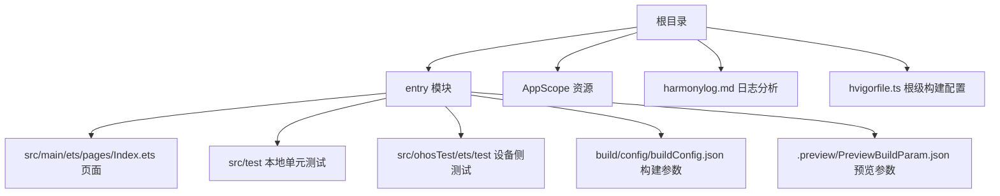
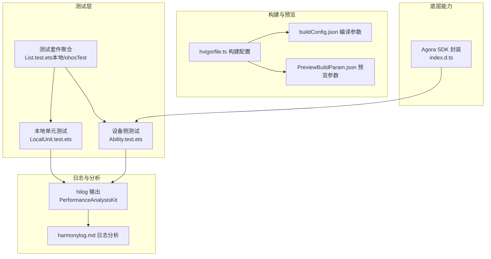
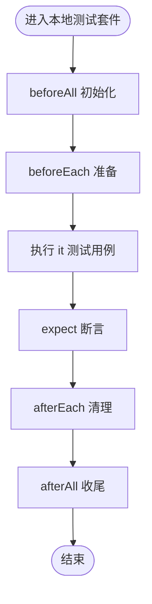
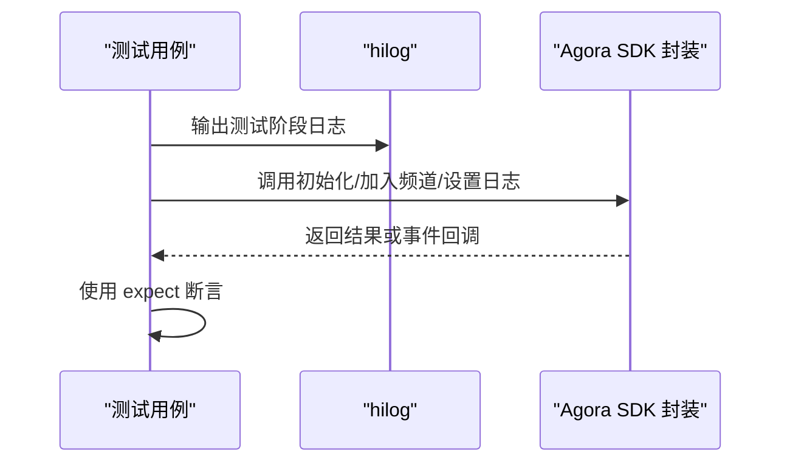
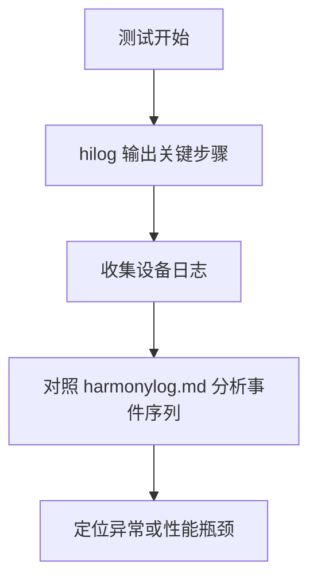
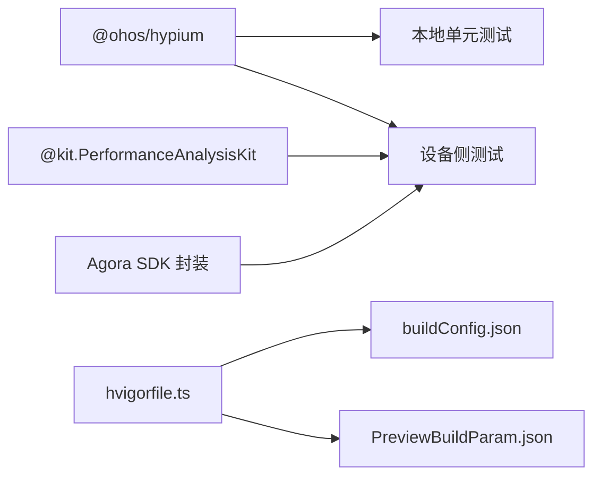

# 测试与调试

<cite>
**本文引用的文件**
- [Ability.test.ets](file://entry/src/ohosTest/ets/test/Ability.test.ets)
- [List.test.ets（ohosTest）](file://entry/src/ohosTest/ets/test/List.test.ets)
- [LocalUnit.test.ets](file://entry/src/test/LocalUnit.test.ets)
- [List.test.ets（test）](file://entry/src/test/List.test.ets)
- [harmonylog.md](file://harmonylog.md)
- [hvigorfile.ts（根）](file://hvigorfile.ts)
- [hvigorfile.ts（entry）](file://entry/hvigorfile.ts)
- [buildConfig.json](file://entry/build/config/buildConfig.json)
- [PreviewBuildParam.json](file://entry/.preview/PreviewBuildParam.json)
- [index.d.ts（Agora SDK 封装）](file://package/src/main/cpp/types/libagora_rtc_sdk/index.d.ts)
- [main_pages.json](file://entry/src/main/resources/base/profile/main_pages.json)
</cite>

## 目录
1. [引言](#引言)
2. [项目结构](#项目结构)
3. [核心组件](#核心组件)
4. [架构总览](#架构总览)
5. [详细组件分析](#详细组件分析)
6. [依赖分析](#依赖分析)
7. [性能考量](#性能考量)
8. [故障排查指南](#故障排查指南)
9. [结论](#结论)
10. [附录](#附录)

## 引言
本文件面向HarmonyOS在线课堂应用，提供系统化的测试与调试指南。内容覆盖单元测试与集成测试的编写与执行、日志系统的使用与分析、调试工具配置与使用、常见问题排查流程、性能分析方法、测试覆盖率与质量标准，以及自动化测试实施策略。目标是帮助开发者快速建立可维护、可验证、可观测的测试体系。

## 项目结构
该工程采用HarmonyOS标准模块化结构，入口模块为entry，测试分为本地测试与ohosTest两类目录，分别用于本地单元测试与设备侧能力测试；同时提供日志分析文档与构建配置文件，便于定位问题与执行测试。

图表来源
- [hvigorfile.ts（根）](file://hvigorfile.ts#L1-L6)
- [hvigorfile.ts（entry）](file://entry/hvigorfile.ts#L1-L6)
- [buildConfig.json](file://entry/build/config/buildConfig.json#L1-L1)
- [PreviewBuildParam.json](file://entry/.preview/PreviewBuildParam.json#L1-L2)
- [main_pages.json](file://entry/src/main/resources/base/profile/main_pages.json#L1-L6)

章节来源
- [hvigorfile.ts（根）](file://hvigorfile.ts#L1-L6)
- [hvigorfile.ts（entry）](file://entry/hvigorfile.ts#L1-L6)
- [buildConfig.json](file://entry/build/config/buildConfig.json#L1-L1)
- [PreviewBuildParam.json](file://entry/.preview/PreviewBuildParam.json#L1-L2)
- [main_pages.json](file://entry/src/main/resources/base/profile/main_pages.json#L1-L6)

## 核心组件
- 测试框架与断言：基于@ohos/hypium提供的describe、beforeAll、beforeEach、afterEach、afterAll、it、expect等API组织测试用例。
- 性能分析日志：通过@kit.PerformanceAnalysisKit的hilog接口输出测试阶段日志，便于定位执行路径与性能热点。
- Agora RTC SDK封装：通过index.d.ts暴露初始化、加入/离开频道、设置日志级别、销毁等接口，支持测试中对底层媒体能力进行注入与校验。
- 构建与预览配置：hvigorfile.ts定义构建任务，buildConfig.json与PreviewBuildParam.json提供编译与预览参数，保障测试环境一致性。

章节来源
- [Ability.test.ets](file://entry/src/ohosTest/ets/test/Ability.test.ets#L1-L35)
- [LocalUnit.test.ets](file://entry/src/test/LocalUnit.test.ets#L1-L33)
- [index.d.ts（Agora SDK 封装）](file://package/src/main/cpp/types/libagora_rtc_sdk/index.d.ts#L1-L19)

## 架构总览
下图展示测试与调试在系统中的位置与交互关系：测试由本地与设备侧两部分组成，日志贯穿测试执行过程，构建配置确保测试运行环境稳定。

图表来源
- [Ability.test.ets](file://entry/src/ohosTest/ets/test/Ability.test.ets#L1-L35)
- [LocalUnit.test.ets](file://entry/src/test/LocalUnit.test.ets#L1-L33)
- [List.test.ets（ohosTest）](file://entry/src/ohosTest/ets/test/List.test.ets#L1-L5)
- [List.test.ets（test）](file://entry/src/test/List.test.ets#L1-L5)
- [harmonylog.md](file://harmonylog.md#L1-L243)
- [hvigorfile.ts（根）](file://hvigorfile.ts#L1-L6)
- [hvigorfile.ts（entry）](file://entry/hvigorfile.ts#L1-L6)
- [buildConfig.json](file://entry/build/config/buildConfig.json#L1-L1)
- [PreviewBuildParam.json](file://entry/.preview/PreviewBuildParam.json#L1-L2)
- [index.d.ts（Agora SDK 封装）](file://package/src/main/cpp/types/libagora_rtc_sdk/index.d.ts#L1-L19)

## 详细组件分析

### 单元测试与断言（本地）
- 测试组织：使用describe定义测试套件，it定义单个测试用例，配合beforeAll/beforeEach/afterEach/afterAll进行生命周期管理。
- 断言方法：expect提供多种断言，如assertContain、assertEqual等，满足字符串与相等性校验。
- 执行入口：List.test.ets聚合多个测试套件，便于统一执行。

图表来源
- [LocalUnit.test.ets](file://entry/src/test/LocalUnit.test.ets#L1-L33)
- [List.test.ets（test）](file://entry/src/test/List.test.ets#L1-L5)

章节来源
- [LocalUnit.test.ets](file://entry/src/test/LocalUnit.test.ets#L1-L33)
- [List.test.ets（test）](file://entry/src/test/List.test.ets#L1-L5)

### 设备侧能力测试（ohosTest）
- 性能分析日志：在测试用例中通过hilog.info输出关键节点日志，便于定位执行路径与耗时点。
- 测试组织：Ability.test.ets定义测试套件与用例，List.test.ets聚合至统一入口。
- 与底层SDK结合：通过index.d.ts提供的接口，可在测试中调用底层能力（如初始化、加入/离开频道、设置日志等），以验证端到端行为。

图表来源
- [Ability.test.ets](file://entry/src/ohosTest/ets/test/Ability.test.ets#L1-L35)
- [index.d.ts（Agora SDK 封装）](file://package/src/main/cpp/types/libagora_rtc_sdk/index.d.ts#L1-L19)

章节来源
- [Ability.test.ets](file://entry/src/ohosTest/ets/test/Ability.test.ets#L1-L35)
- [List.test.ets（ohosTest）](file://entry/src/ohosTest/ets/test/List.test.ets#L1-L5)
- [index.d.ts（Agora SDK 封装）](file://package/src/main/cpp/types/libagora_rtc_sdk/index.d.ts#L1-L19)

### 日志系统使用与分析
- hilog输出：在设备侧测试中使用hilog.info输出测试阶段信息，便于在设备日志中检索与定位。
- 日志分析：harmonylog.md提供了大量实际运行日志示例，可用于对照分析课堂页面加载、加入频道、推流、成员列表更新等关键事件的时间线与状态变化。
- 建议：在测试中增加关键步骤的日志标记，结合harmonylog.md的格式，形成统一的可观测性规范。

图表来源
- [Ability.test.ets](file://entry/src/ohosTest/ets/test/Ability.test.ets#L27-L28)
- [harmonylog.md](file://harmonylog.md#L1-L243)

章节来源
- [Ability.test.ets](file://entry/src/ohosTest/ets/test/Ability.test.ets#L27-L28)
- [harmonylog.md](file://harmonylog.md#L1-L243)

### 调试工具配置与使用
- 构建配置：hvigorfile.ts定义了系统任务与插件扩展点，确保测试构建流程一致。
- 编译参数：buildConfig.json提供设备类型、构建模式、日志等级、资源路径等关键参数，影响测试执行环境。
- 预览参数：PreviewBuildParam.json控制资源目录映射与生成源目录，有助于在预览环境中复现问题。
- 建议：在CI/CD中固定上述参数，避免因环境差异导致测试不稳定。

章节来源
- [hvigorfile.ts（根）](file://hvigorfile.ts#L1-L6)
- [hvigorfile.ts（entry）](file://entry/hvigorfile.ts#L1-L6)
- [buildConfig.json](file://entry/build/config/buildConfig.json#L1-L1)
- [PreviewBuildParam.json](file://entry/.preview/PreviewBuildParam.json#L1-L2)

### 集成测试策略
- 端到端场景：结合Agora SDK封装接口，在设备侧测试中模拟“加载页面—加入频道—推流—播放—离开频道”的完整链路。
- 关键事件断言：依据harmonylog.md中的事件名称与字段，对关键消息（如class_init_success、nativeWebRtcAction、video_publish_result等）进行断言。
- 并发与边界：在测试中加入多用户、网络波动、设备权限变更等边界条件，确保鲁棒性。

章节来源
- [Ability.test.ets](file://entry/src/ohosTest/ets/test/Ability.test.ets#L1-L35)
- [index.d.ts（Agora SDK 封装）](file://package/src/main/cpp/types/libagora_rtc_sdk/index.d.ts#L1-L19)
- [harmonylog.md](file://harmonylog.md#L1-L243)

## 依赖分析
- 测试框架依赖：@ohos/hypium提供测试组织与断言能力。
- 性能分析依赖：@kit.PerformanceAnalysisKit提供hilog接口。
- 底层能力依赖：Agora SDK封装通过index.d.ts暴露接口，供测试调用。
- 构建与资源依赖：hvigorfile.ts、buildConfig.json、PreviewBuildParam.json共同决定测试执行环境。

图表来源
- [Ability.test.ets](file://entry/src/ohosTest/ets/test/Ability.test.ets#L1-L2)
- [LocalUnit.test.ets](file://entry/src/test/LocalUnit.test.ets#L1-L1)
- [hvigorfile.ts（根）](file://hvigorfile.ts#L1-L6)
- [hvigorfile.ts（entry）](file://entry/hvigorfile.ts#L1-L6)
- [buildConfig.json](file://entry/build/config/buildConfig.json#L1-L1)
- [PreviewBuildParam.json](file://entry/.preview/PreviewBuildParam.json#L1-L2)
- [index.d.ts（Agora SDK 封装）](file://package/src/main/cpp/types/libagora_rtc_sdk/index.d.ts#L1-L19)

章节来源
- [Ability.test.ets](file://entry/src/ohosTest/ets/test/Ability.test.ets#L1-L2)
- [LocalUnit.test.ets](file://entry/src/test/LocalUnit.test.ets#L1-L1)
- [hvigorfile.ts（根）](file://hvigorfile.ts#L1-L6)
- [hvigorfile.ts（entry）](file://entry/hvigorfile.ts#L1-L6)
- [buildConfig.json](file://entry/build/config/buildConfig.json#L1-L1)
- [PreviewBuildParam.json](file://entry/.preview/PreviewBuildParam.json#L1-L2)
- [index.d.ts（Agora SDK 封装）](file://package/src/main/cpp/types/libagora_rtc_sdk/index.d.ts#L1-L19)

## 性能考量
- 日志等级与过滤：通过setLogFilter与setLogFile控制日志输出，避免在测试中产生过多I/O开销。
- 关键路径观测：在hilog中标注关键步骤（如加入频道、推流成功、远端首帧等），结合harmonylog.md的时间戳分析端到端延迟。
- 资源与缓存：利用buildConfig.json与PreviewBuildParam.json优化资源加载与缓存策略，减少重复编译与预览时间。

章节来源
- [Ability.test.ets](file://entry/src/ohosTest/ets/test/Ability.test.ets#L27-L28)
- [index.d.ts（Agora SDK 封装）](file://package/src/main/cpp/types/libagora_rtc_sdk/index.d.ts#L1-L19)
- [harmonylog.md](file://harmonylog.md#L1-L243)
- [buildConfig.json](file://entry/build/config/buildConfig.json#L1-L1)
- [PreviewBuildParam.json](file://entry/.preview/PreviewBuildParam.json#L1-L2)

## 故障排查指南
- 日志定位：使用hilog输出的关键节点与harmonylog.md中的事件名称进行比对，快速定位异常发生阶段。
- 环境一致性：核对hvigorfile.ts、buildConfig.json、PreviewBuildParam.json是否与测试环境一致，避免因参数不一致导致失败。
- 底层能力验证：通过Agora SDK封装接口检查初始化、加入/离开频道、日志设置等是否正常返回，排除底层异常。
- 常见问题线索：
  - 无法加入频道：检查nativeWebRtcAction中的错误提示与音频模块提示。
  - 推流失败：关注video_publish_result与web_rtc_publish_success消息。
  - 成员列表异常：核对nativeWebRtcAction中的成员列表更新事件。

章节来源
- [Ability.test.ets](file://entry/src/ohosTest/ets/test/Ability.test.ets#L27-L28)
- [harmonylog.md](file://harmonylog.md#L1-L243)
- [index.d.ts（Agora SDK 封装）](file://package/src/main/cpp/types/libagora_rtc_sdk/index.d.ts#L1-L19)
- [hvigorfile.ts（根）](file://hvigorfile.ts#L1-L6)
- [hvigorfile.ts（entry）](file://entry/hvigorfile.ts#L1-L6)
- [buildConfig.json](file://entry/build/config/buildConfig.json#L1-L1)
- [PreviewBuildParam.json](file://entry/.preview/PreviewBuildParam.json#L1-L2)

## 结论
通过本地与设备侧双轨测试、统一的日志规范与构建配置、以及对Agora SDK封装接口的合理使用，可以有效提升HarmonyOS在线课堂应用的稳定性与可维护性。建议在持续集成中固化测试环境参数，并将日志分析纳入常规回归流程，以实现问题早发现、早定位、早修复。

## 附录
- 测试执行入口
  - 本地测试：List.test.ets（test）
  - 设备侧测试：List.test.ets（ohosTest）
- 页面入口
  - main_pages.json中定义的首页路径为pages/Index
- 自动化测试实施建议
  - 在CI中固定hvigorfile.ts、buildConfig.json、PreviewBuildParam.json参数。
  - 将hilog输出标准化，结合harmonylog.md建立事件映射表。
  - 对关键端到端场景编写设备侧测试，覆盖加入/离开频道、推流/拉流、成员列表更新等。

章节来源
- [List.test.ets（test）](file://entry/src/test/List.test.ets#L1-L5)
- [List.test.ets（ohosTest）](file://entry/src/ohosTest/ets/test/List.test.ets#L1-L5)
- [main_pages.json](file://entry/src/main/resources/base/profile/main_pages.json#L1-L6)
- [hvigorfile.ts（根）](file://hvigorfile.ts#L1-L6)
- [hvigorfile.ts（entry）](file://entry/hvigorfile.ts#L1-L6)
- [buildConfig.json](file://entry/build/config/buildConfig.json#L1-L1)
- [PreviewBuildParam.json](file://entry/.preview/PreviewBuildParam.json#L1-L2)