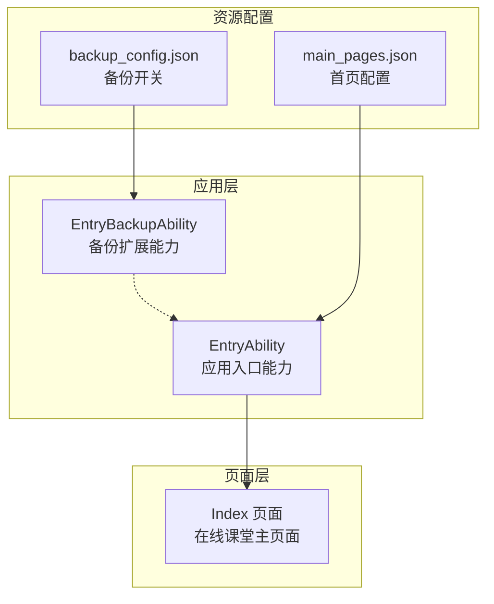
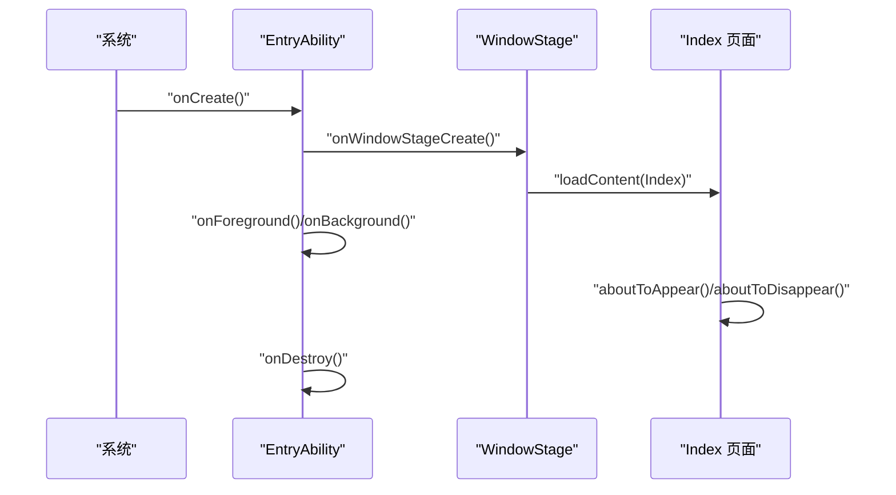
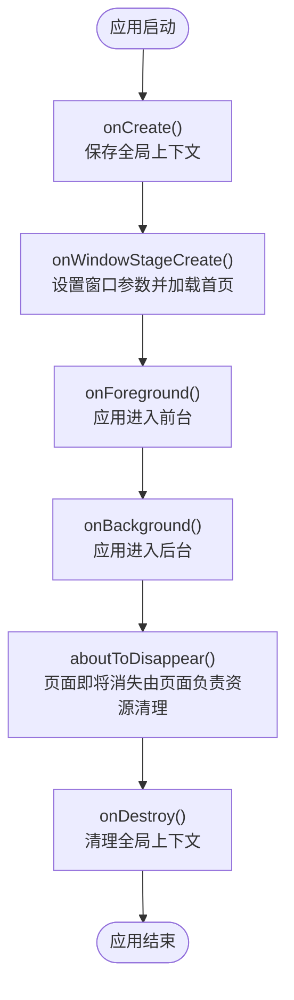
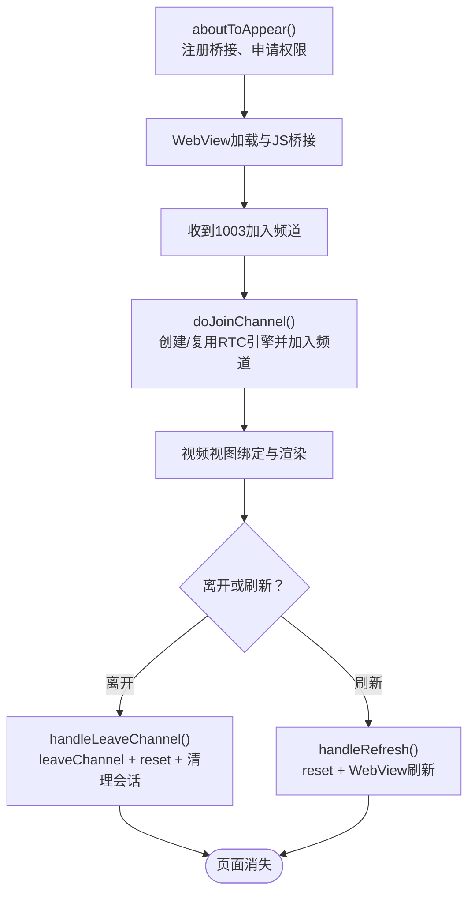
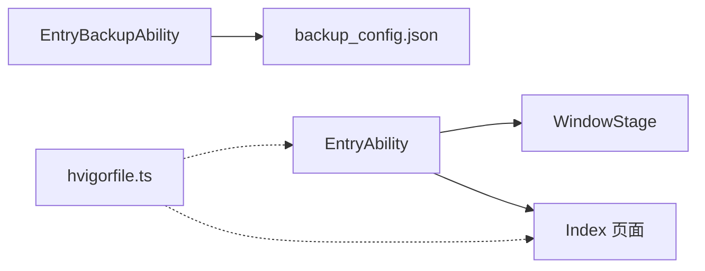

# 生命周期管理

<cite>
**本文引用的文件**
- [EntryAbility.ets](file://entry/src/main/ets/entryability/EntryAbility.ets)
- [EntryBackupAbility.ets](file://entry/src/main/ets/entrybackupability/EntryBackupAbility.ets)
- [Index.ets](file://entry/src/main/ets/pages/Index.ets)
- [main_pages.json](file://entry/src/main/resources/base/profile/main_pages.json)
- [backup_config.json](file://entry/src/main/resources/base/profile/backup_config.json)
- [hvigorfile.ts](file://hvigorfile.ts)
</cite>

## 目录
1. [简介](#简介)
2. [项目结构](#项目结构)
3. [核心组件](#核心组件)
4. [架构总览](#架构总览)
5. [详细组件分析](#详细组件分析)
6. [依赖关系分析](#依赖关系分析)
7. [性能考量](#性能考量)
8. [故障排查指南](#故障排查指南)
9. [结论](#结论)
10. [附录](#附录)

## 简介
本文件面向HarmonyOS在线课堂应用，系统化阐述应用生命周期与页面生命周期的管理策略，覆盖前后台切换处理、页面销毁与资源清理、生命周期钩子函数的使用与状态保存机制，并给出异常状态恢复与资源释放的最佳实践及常见问题的诊断与解决路径。

## 项目结构
该工程采用“应用能力（Ability）+ 页面（Page）”的典型HarmonyOS ArkTS结构：
- 应用入口能力：EntryAbility 负责应用启动、窗口阶段创建、前后台状态切换等。
- 页面：Index 页面承载在线课堂的主功能，包括WebView课堂内容与XComponent视频浮层叠加渲染。
- 备份扩展能力：EntryBackupAbility 提供备份与恢复能力开关。
- 资源配置：main_pages.json 指定首页；backup_config.json 控制备份/恢复开关。

图表来源
- [EntryAbility.ets](file://entry/src/main/ets/entryability/EntryAbility.ets#L14-L65)
- [EntryBackupAbility.ets](file://entry/src/main/ets/entrybackupability/EntryBackupAbility.ets#L6-L16)
- [Index.ets](file://entry/src/main/ets/pages/Index.ets#L197-L360)
- [main_pages.json](file://entry/src/main/resources/base/profile/main_pages.json#L1-L6)
- [backup_config.json](file://entry/src/main/resources/base/profile/backup_config.json#L1-L3)

章节来源
- [EntryAbility.ets](file://entry/src/main/ets/entryability/EntryAbility.ets#L14-L65)
- [Index.ets](file://entry/src/main/ets/pages/Index.ets#L197-L360)
- [main_pages.json](file://entry/src/main/resources/base/profile/main_pages.json#L1-L6)
- [backup_config.json](file://entry/src/main/resources/base/profile/backup_config.json#L1-L3)

## 核心组件
- 应用入口能力（EntryAbility）
  - 负责保存全局上下文、设置颜色模式、窗口阶段创建与销毁、前后台状态回调。
  - 生命周期钩子：onCreate、onDestroy、onWindowStageCreate、onWindowStageDestroy、onForeground、onBackground。
- 页面（Index）
  - 负责WebView课堂内容加载、JS桥接、RTC引擎初始化/加入/离开/销毁、视频视图管理与绑定、统计数据上报。
  - 页面生命周期钩子：aboutToAppear、aboutToDisappear。
- 备份扩展能力（EntryBackupAbility）
  - 提供备份与恢复回调，便于在系统备份/恢复流程中进行状态同步。

章节来源
- [EntryAbility.ets](file://entry/src/main/ets/entryability/EntryAbility.ets#L14-L65)
- [Index.ets](file://entry/src/main/ets/pages/Index.ets#L229-L255)
- [EntryBackupAbility.ets](file://entry/src/main/ets/entrybackupability/EntryBackupAbility.ets#L6-L16)

## 架构总览
应用生命周期与页面生命周期协同工作：
- EntryAbility 负责应用级生命周期与窗口阶段控制，确保页面内容加载与系统栏配置。
- Index 页面负责业务生命周期：在出现时申请权限、初始化WebView与RTC；在消失时清理RTC与WebView资源。
- EntryBackupAbility 提供备份/恢复能力，保障数据一致性。

图表来源
- [EntryAbility.ets](file://entry/src/main/ets/entryability/EntryAbility.ets#L15-L64)
- [Index.ets](file://entry/src/main/ets/pages/Index.ets#L229-L255)

## 详细组件分析

### 应用入口能力（EntryAbility）生命周期
- onCreate
  - 保存全局上下文，设置颜色模式，打印日志。
- onWindowStageCreate
  - 设置窗口方向、全屏、隐藏系统栏，加载首页 Index。
- onWindowStageDestroy
  - 主窗口销毁时的日志提示（资源释放由页面负责）。
- onForeground/onBackground
  - 应用前后台切换的日志记录，可用于外部监控与统计。
- onDestroy
  - 清理全局上下文，确保无泄漏。

图表来源
- [EntryAbility.ets](file://entry/src/main/ets/entryability/EntryAbility.ets#L15-L64)
- [Index.ets](file://entry/src/main/ets/pages/Index.ets#L248-L255)

章节来源
- [EntryAbility.ets](file://entry/src/main/ets/entryability/EntryAbility.ets#L15-L64)

### 页面（Index）生命周期与资源管理
- aboutToAppear
  - 注册JS桥接回调，获取屏幕尺寸，申请相机/麦克风权限。
- aboutToDisappear
  - 释放RTC资源：移除事件处理器、离开频道、销毁引擎，避免残留导致重进异常。
- 页面内资源清理策略
  - reset()：停止本地音视频推流、解除所有视频绑定、清空视图数组与数据集合，确保下一次进入干净状态。
  - handleLeaveChannel/handleRefresh：分别处理退出课堂与刷新场景，均遵循“不清除引擎”的策略，以复用引擎提升重进稳定性。
  - onLoadIntercept：拦截H5管理页跳转，销毁RTC并清空视图，防止引擎残留影响后续进入。

图表来源
- [Index.ets](file://entry/src/main/ets/pages/Index.ets#L229-L255)
- [Index.ets](file://entry/src/main/ets/pages/Index.ets#L536-L649)
- [Index.ets](file://entry/src/main/ets/pages/Index.ets#L695-L715)
- [Index.ets](file://entry/src/main/ets/pages/Index.ets#L924-L985)

章节来源
- [Index.ets](file://entry/src/main/ets/pages/Index.ets#L229-L255)
- [Index.ets](file://entry/src/main/ets/pages/Index.ets#L536-L649)
- [Index.ets](file://entry/src/main/ets/pages/Index.ets#L651-L693)
- [Index.ets](file://entry/src/main/ets/pages/Index.ets#L695-L715)
- [Index.ets](file://entry/src/main/ets/pages/Index.ets#L924-L985)

### 备份扩展能力（EntryBackupAbility）
- onBackup/onRestore
  - 提供备份与恢复回调，便于在系统备份/恢复流程中进行状态同步与数据恢复。

章节来源
- [EntryBackupAbility.ets](file://entry/src/main/ets/entrybackupability/EntryBackupAbility.ets#L6-L16)
- [backup_config.json](file://entry/src/main/resources/base/profile/backup_config.json#L1-L3)

## 依赖关系分析
- EntryAbility 依赖窗口阶段（WindowStage）进行页面内容加载与系统栏配置。
- Index 页面依赖 WebView 控制器与 RTC 引擎，通过 JS 桥接与H5交互。
- EntryBackupAbility 与应用打包配置（backup_config.json）协作，控制备份/恢复行为。
- hvigorfile.ts 为构建脚本，不涉及运行时生命周期逻辑。

图表来源
- [EntryAbility.ets](file://entry/src/main/ets/entryability/EntryAbility.ets#L31-L49)
- [Index.ets](file://entry/src/main/ets/pages/Index.ets#L200-L201)
- [EntryBackupAbility.ets](file://entry/src/main/ets/entrybackupability/EntryBackupAbility.ets#L6-L16)
- [backup_config.json](file://entry/src/main/resources/base/profile/backup_config.json#L1-L3)
- [hvigorfile.ts](file://hvigorfile.ts#L3-L6)

章节来源
- [EntryAbility.ets](file://entry/src/main/ets/entryability/EntryAbility.ets#L31-L49)
- [Index.ets](file://entry/src/main/ets/pages/Index.ets#L200-L201)
- [EntryBackupAbility.ets](file://entry/src/main/ets/entrybackupability/EntryBackupAbility.ets#L6-L16)
- [backup_config.json](file://entry/src/main/resources/base/profile/backup_config.json#L1-L3)
- [hvigorfile.ts](file://hvigorfile.ts#L3-L6)

## 性能考量
- 复用RTC引擎：在退出/刷新场景避免销毁引擎，减少初始化开销，提升重进稳定性。
- 视图重建优化：reset() 清空视图数组，促使ForEach重新创建VideoItemView，确保XComponent重新获取surfaceId，避免旧资源残留。
- 统计上报：本地/远端音视频统计数据按帧聚合，降低上报频率与计算成本。
- WebView资源：在页面消失时清理缓存与Cookie，减少内存占用与I/O压力。

## 故障排查指南
- 重进失败或返回特定错误码
  - 现象：重进时初始化失败或返回特定错误码。
  - 排查：确认是否在退出/刷新场景调用了销毁引擎；若销毁，请改为复用引擎策略。
  - 参考：退出场景仅leaveChannel，不清除引擎；刷新场景仅reset，不清除引擎。
- 页面无法正常退出或残留界面
  - 现象：H5管理页跳转后界面未清理。
  - 排查：检查onLoadIntercept拦截逻辑是否生效，确认是否调用reset与清理会话。
- 音视频异常或无声
  - 现象：本地/远端音视频异常。
  - 排查：检查pushStream绑定流程、静音状态切换与surfaceId就绪时机；确认aboutToDisappear中已停止本地推流。
- WebView白屏或资源未释放
  - 现象：页面退出后WebView仍占用资源。
  - 排查：确认aboutToDisappear中是否调用reset与清理缓存/会话；必要时在退出场景补充removeCache与clearAllCookiesSync。

章节来源
- [Index.ets](file://entry/src/main/ets/pages/Index.ets#L300-L338)
- [Index.ets](file://entry/src/main/ets/pages/Index.ets#L618-L649)
- [Index.ets](file://entry/src/main/ets/pages/Index.ets#L651-L693)
- [Index.ets](file://entry/src/main/ets/pages/Index.ets#L1004-L1137)

## 结论
本应用通过EntryAbility统一管理应用生命周期与窗口阶段，通过Index页面精细化控制业务生命周期与资源清理，结合备份扩展能力保障数据一致性。在前后台切换、页面销毁与资源释放方面，采用“复用引擎+页面级清理”的策略，既保证稳定性又兼顾性能。建议持续关注异常状态恢复与资源释放的边界条件，确保在极端场景下的健壮性。

## 附录
- 首页配置：main_pages.json 指定首页为 pages/Index。
- 备份开关：backup_config.json 控制是否允许备份/恢复。

章节来源
- [main_pages.json](file://entry/src/main/resources/base/profile/main_pages.json#L1-L6)
- [backup_config.json](file://entry/src/main/resources/base/profile/backup_config.json#L1-L3)