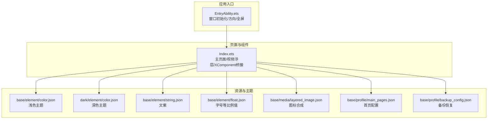
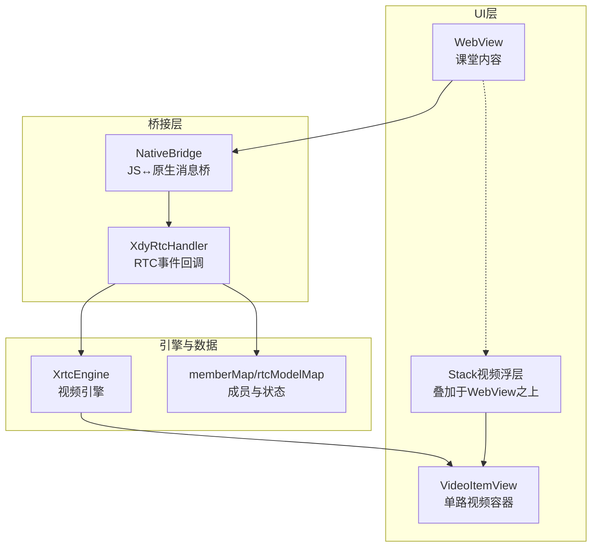
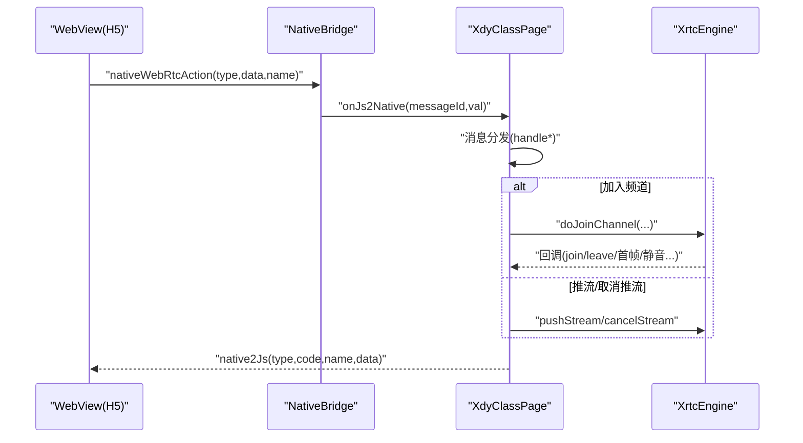
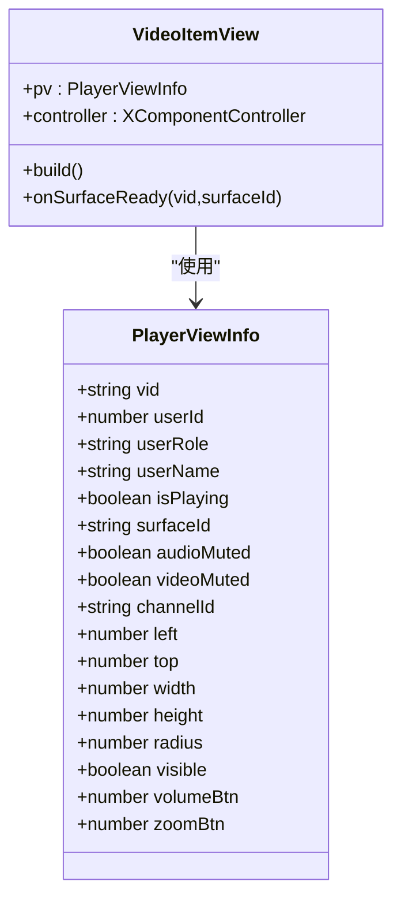
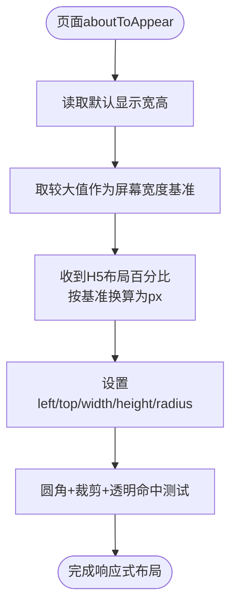
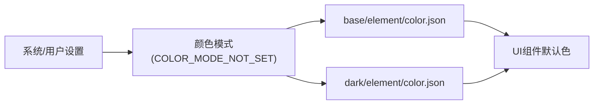
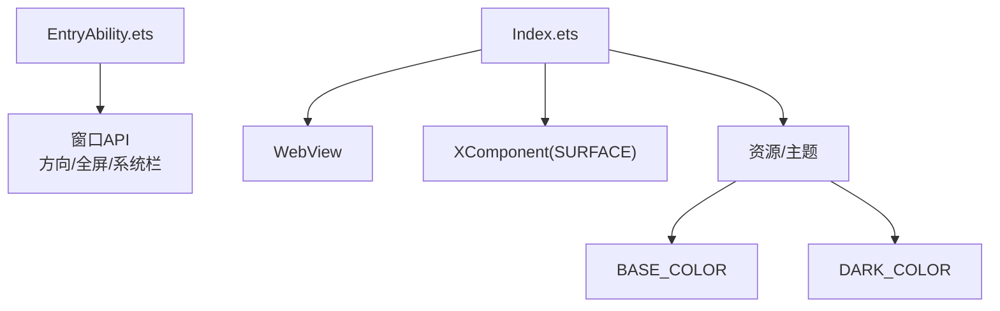

# 用户界面设计

<cite>
**本文引用的文件**
- [Index.ets](file://entry/src/main/ets/pages/Index.ets)
- [EntryAbility.ets](file://entry/src/main/ets/entryability/EntryAbility.ets)
- [color.json（浅色）](file://entry/src/main/resources/base/element/color.json)
- [color.json（深色）](file://entry/src/main/resources/dark/element/color.json)
- [string.json（基础）](file://entry/src/main/resources/base/element/string.json)
- [float.json（基础）](file://entry/src/main/resources/base/element/float.json)
- [main_pages.json（基础）](file://entry/src/main/resources/base/profile/main_pages.json)
- [layered_image.json（基础媒体）](file://entry/src/main/resources/base/media/layered_image.json)
- [backup_config.json（基础）](file://entry/src/main/resources/base/profile/backup_config.json)
</cite>

## 目录
1. [引言](#引言)
2. [项目结构](#项目结构)
3. [核心组件](#核心组件)
4. [架构总览](#架构总览)
5. [详细组件分析](#详细组件分析)
6. [依赖关系分析](#依赖关系分析)
7. [性能考量](#性能考量)
8. [故障排查指南](#故障排查指南)
9. [结论](#结论)
10. [附录](#附录)

## 引言
本文件面向HarmonyOS在线课堂应用，聚焦用户界面设计与实现，覆盖视图布局系统、响应式设计、交互处理、颜色主题与暗色模式、组件自适应策略、界面状态管理与动画效果、UI属性配置与事件处理、样式定制方法，并提供最佳实践与用户体验优化建议。文档基于仓库中的ArkTS页面与资源配置进行分析，确保内容可追溯至具体源文件。

## 项目结构
HarmonyOS应用采用标准模块化组织：入口能力负责窗口初始化与页面加载；页面组件承载UI与业务逻辑；资源目录提供多套主题元素（浅色/深色）、字符串与媒体资源；预览构建产物包含中间态资源与生成代码。

图表来源
- [EntryAbility.ets](file://entry/src/main/ets/entryability/EntryAbility.ets#L1-L65)
- [Index.ets](file://entry/src/main/ets/pages/Index.ets#L1-L1436)
- [color.json（浅色）](file://entry/src/main/resources/base/element/color.json#L1-L8)
- [color.json（深色）](file://entry/src/main/resources/dark/element/color.json#L1-L8)
- [string.json（基础）](file://entry/src/main/resources/base/element/string.json#L1-L32)
- [float.json（基础）](file://entry/src/main/resources/base/element/float.json#L1-L9)
- [layered_image.json（基础媒体）](file://entry/src/main/resources/base/media/layered_image.json#L1-L7)
- [main_pages.json（基础）](file://entry/src/main/resources/base/profile/main_pages.json#L1-L6)
- [backup_config.json（基础）](file://entry/src/main/resources/base/profile/backup_config.json#L1-L3)

章节来源
- [EntryAbility.ets](file://entry/src/main/ets/entryability/EntryAbility.ets#L1-L65)
- [Index.ets](file://entry/src/main/ets/pages/Index.ets#L1-L1436)
- [color.json（浅色）](file://entry/src/main/resources/base/element/color.json#L1-L8)
- [color.json（深色）](file://entry/src/main/resources/dark/element/color.json#L1-L8)
- [string.json（基础）](file://entry/src/main/resources/base/element/string.json#L1-L32)
- [float.json（基础）](file://entry/src/main/resources/base/element/float.json#L1-L9)
- [layered_image.json（基础媒体）](file://entry/src/main/resources/base/media/layered_image.json#L1-L7)
- [main_pages.json（基础）](file://entry/src/main/resources/base/profile/main_pages.json#L1-L6)
- [backup_config.json（基础）](file://entry/src/main/resources/base/profile/backup_config.json#L1-L3)

## 核心组件
- 主页面组件：承载WebView课堂内容与视频浮层，统一管理视频渲染、用户交互与生命周期。
- 视频项组件：封装单路视频渲染容器，支持动态定位、圆角裁剪、遮罩与可见性控制。
- 事件桥接：提供JS与原生之间的消息通道，驱动UI状态变更与业务流程。
- 主题与资源：通过浅色/深色两套color.json实现暗色模式支持；通过string.json与float.json提供文案与字号规范。

章节来源
- [Index.ets](file://entry/src/main/ets/pages/Index.ets#L153-L192)
- [Index.ets](file://entry/src/main/ets/pages/Index.ets#L195-L360)
- [Index.ets](file://entry/src/main/ets/pages/Index.ets#L362-L424)
- [color.json（浅色）](file://entry/src/main/resources/base/element/color.json#L1-L8)
- [color.json（深色）](file://entry/src/main/resources/dark/element/color.json#L1-L8)
- [string.json（基础）](file://entry/src/main/resources/base/element/string.json#L1-L32)
- [float.json（基础）](file://entry/src/main/resources/base/element/float.json#L1-L9)

## 架构总览
应用采用“WebView承载课堂内容 + XComponent视频浮层叠加”的混合架构。WebView负责H5课堂交互，XComponent负责视频渲染与叠加定位。页面通过JS桥接接收来自H5的消息，驱动UI状态与视频绑定。

图表来源
- [Index.ets](file://entry/src/main/ets/pages/Index.ets#L107-L112)
- [Index.ets](file://entry/src/main/ets/pages/Index.ets#L134-L151)
- [Index.ets](file://entry/src/main/ets/pages/Index.ets#L195-L360)
- [Index.ets](file://entry/src/main/ets/pages/Index.ets#L1004-L1137)

## 详细组件分析

### 主页面组件（XdyClassPage）
- 负责WebView加载、JS桥接、视频浮层管理、生命周期与权限申请。
- 通过屏幕宽度计算与百分比布局，实现响应式视频区域定位。
- 提供刷新、退出、加入/离开频道、推流/取消推流等核心流程。

图表来源
- [Index.ets](file://entry/src/main/ets/pages/Index.ets#L362-L424)
- [Index.ets](file://entry/src/main/ets/pages/Index.ets#L924-L985)
- [Index.ets](file://entry/src/main/ets/pages/Index.ets#L1004-L1137)
- [Index.ets](file://entry/src/main/ets/pages/Index.ets#L1169-L1407)

章节来源
- [Index.ets](file://entry/src/main/ets/pages/Index.ets#L195-L360)
- [Index.ets](file://entry/src/main/ets/pages/Index.ets#L229-L247)
- [Index.ets](file://entry/src/main/ets/pages/Index.ets#L426-L715)
- [Index.ets](file://entry/src/main/ets/pages/Index.ets#L924-L985)

### 视频项组件（VideoItemView）
- 以Stack容器承载XComponent（SURFACE类型）视频画布，支持位置、尺寸、圆角、裁剪与透明度。
- 当存在用户名时显示叠加标签，提升识别度。
- 通过父组件传递的PlayerViewInfo驱动渲染参数。

图表来源
- [Index.ets](file://entry/src/main/ets/pages/Index.ets#L26-L66)
- [Index.ets](file://entry/src/main/ets/pages/Index.ets#L153-L192)

章节来源
- [Index.ets](file://entry/src/main/ets/pages/Index.ets#L153-L192)
- [Index.ets](file://entry/src/main/ets/pages/Index.ets#L26-L66)

### 响应式布局与自适应策略
- 屏幕宽度获取：在页面出现时读取默认显示的宽高，取较大值作为虚拟像素基准，用于百分比转绝对像素。
- 百分比布局：H5下发的视频区域坐标与尺寸以百分比形式给出，页面按屏幕宽度线性换算为px，确保不同设备尺寸下布局一致。
- 圆角与裁剪：视频容器统一设置圆角与clip，增强视觉边界与沉浸感。
- 透明命中测试：视频浮层层级使用透明命中测试，避免遮挡WebView交互。

图表来源
- [Index.ets](file://entry/src/main/ets/pages/Index.ets#L229-L247)
- [Index.ets](file://entry/src/main/ets/pages/Index.ets#L434-L481)
- [Index.ets](file://entry/src/main/ets/pages/Index.ets#L344-L355)

章节来源
- [Index.ets](file://entry/src/main/ets/pages/Index.ets#L229-L247)
- [Index.ets](file://entry/src/main/ets/pages/Index.ets#L434-L481)
- [Index.ets](file://entry/src/main/ets/pages/Index.ets#L344-L355)

### 颜色主题系统与暗色模式支持
- 浅色主题：基础元素color.json定义起始窗口背景色。
- 深色主题：dark/element/color.json覆盖相同键名，实现暗色模式自动切换。
- 应用入口：入口能力在创建时设置颜色模式为“未指定”，交由系统根据环境选择浅/深色主题。

图表来源
- [color.json（浅色）](file://entry/src/main/resources/base/element/color.json#L1-L8)
- [color.json（深色）](file://entry/src/main/resources/dark/element/color.json#L1-L8)
- [EntryAbility.ets](file://entry/src/main/ets/entryability/EntryAbility.ets#L18-L22)

章节来源
- [color.json（浅色）](file://entry/src/main/resources/base/element/color.json#L1-L8)
- [color.json（深色）](file://entry/src/main/resources/dark/element/color.json#L1-L8)
- [EntryAbility.ets](file://entry/src/main/ets/entryability/EntryAbility.ets#L18-L22)

### 字体与文案规范
- 文案：通过base/element/string.json集中管理，便于国际化与统一维护。
- 字号：通过base/element/float.json定义字号等比例值，结合组件字体属性使用，保证一致性与可扩展性。

章节来源
- [string.json（基础）](file://entry/src/main/resources/base/element/string.json#L1-L32)
- [float.json（基础）](file://entry/src/main/resources/base/element/float.json#L1-L9)

### 媒体与图标资源
- 图标合成：base/media/layered_image.json定义背景与前景层，用于统一图标风格。
- 应用入口：预览构建产物中也包含对应的媒体映射，确保资源路径一致。

章节来源
- [layered_image.json（基础媒体）](file://entry/src/main/resources/base/media/layered_image.json#L1-L7)

### 页面与导航配置
- 首页配置：base/profile/main_pages.json声明首页路径，确保应用启动加载正确页面。
- 备份恢复：base/profile/backup_config.json开启备份/恢复能力，保障用户数据连续性。

章节来源
- [main_pages.json（基础）](file://entry/src/main/resources/base/profile/main_pages.json#L1-L6)
- [backup_config.json（基础）](file://entry/src/main/resources/base/profile/backup_config.json#L1-L3)

### 交互处理与事件流
- WebView与原生交互：通过javaScriptProxy注入全局函数，桥接到原生方法；onLoadIntercept拦截特定URL，实现安全退出与状态重置。
- JS桥接：NativeBridge统一接收H5消息，分发到对应处理函数（加入/离开频道、推流/取消推流、静音、音量等）。
- RTC事件：XdyRtcHandler接收引擎回调，更新成员状态与UI，再回传给H5。

章节来源
- [Index.ets](file://entry/src/main/ets/pages/Index.ets#L260-L340)
- [Index.ets](file://entry/src/main/ets/pages/Index.ets#L362-L424)
- [Index.ets](file://entry/src/main/ets/pages/Index.ets#L134-L151)

### 状态管理与动画效果
- 状态模型：PlayerViewInfo承载视频实例的状态字段（位置、尺寸、可见性、静音等），作为UI渲染依据。
- 推流绑定：pushStream按角色精确匹配或兼容匹配空闲视图，绑定成功后更新UI状态并触发渲染。
- 动画建议：当前实现以状态切换为主，未见显式动画API使用。可在视图可见性切换、位置/尺寸变更时引入过渡动画，提升体验。

章节来源
- [Index.ets](file://entry/src/main/ets/pages/Index.ets#L26-L66)
- [Index.ets](file://entry/src/main/ets/pages/Index.ets#L1004-L1137)

## 依赖关系分析
- 入口能力依赖ArkUI窗口API，设置方向、全屏与系统栏可见性。
- 页面组件依赖WebView与XComponent渲染能力，以及资源与主题配置。
- 主题资源通过浅色/深色两套color.json实现模式切换，入口能力设置颜色模式为“未指定”。

图表来源
- [EntryAbility.ets](file://entry/src/main/ets/entryability/EntryAbility.ets#L31-L48)
- [Index.ets](file://entry/src/main/ets/pages/Index.ets#L195-L360)
- [color.json（浅色）](file://entry/src/main/resources/base/element/color.json#L1-L8)
- [color.json（深色）](file://entry/src/main/resources/dark/element/color.json#L1-L8)

章节来源
- [EntryAbility.ets](file://entry/src/main/ets/entryability/EntryAbility.ets#L31-L48)
- [Index.ets](file://entry/src/main/ets/pages/Index.ets#L195-L360)

## 性能考量
- 渲染路径：XComponent使用SURFACE类型渲染，避免频繁重绘；通过透明命中测试减少不必要的事件消耗。
- 状态更新：使用@Observed与@State驱动局部更新，避免全量重绘。
- 生命周期：在页面消失时清理引擎与事件监听，防止资源泄漏。
- 网络与脚本：WebView加载时注入脚本与权限请求，尽量减少阻塞与重试。

## 故障排查指南
- WebView拦截与重载：当检测到管理域跳转时，销毁引擎状态并重载登录页，确保后续进入不受残留状态影响。
- 引擎复用与重建：在加入频道前检查引擎状态，必要时销毁并重建，避免状态异常导致加入失败。
- 音视频静音与推流：本地静音/开启时需同步解除/建立绑定，若未绑定视图，需主动推流绑定。
- 统计上报：本地与远端音视频统计数据按帧聚合，满足实时监控需求。

章节来源
- [Index.ets](file://entry/src/main/ets/pages/Index.ets#L294-L340)
- [Index.ets](file://entry/src/main/ets/pages/Index.ets#L935-L951)
- [Index.ets](file://entry/src/main/ets/pages/Index.ets#L730-L818)
- [Index.ets](file://entry/src/main/ets/pages/Index.ets#L1319-L1401)

## 结论
该应用采用“WebView + XComponent”混合架构，通过JS桥接与RTC事件驱动UI状态，实现了课堂场景下的视频叠加与交互。响应式布局以屏幕宽度为基准，结合百分比布局实现跨设备适配；浅色/深色主题通过资源覆盖实现无缝切换。建议在现有基础上补充过渡动画与更细粒度的状态反馈，进一步提升用户体验。

## 附录
- 最佳实践
  - 使用统一的主题资源与文案资源，避免硬编码。
  - 在页面生命周期内严格管理引擎与事件监听，防止泄漏。
  - 对关键UI状态变更引入过渡动画，提升交互流畅度。
- 用户体验优化
  - 在视频区域增加占位提示与加载反馈。
  - 对静音/摄像头等关键操作提供即时状态反馈与可逆操作。
  - 在横屏全屏模式下确保系统栏隐藏与方向锁定的一致性。