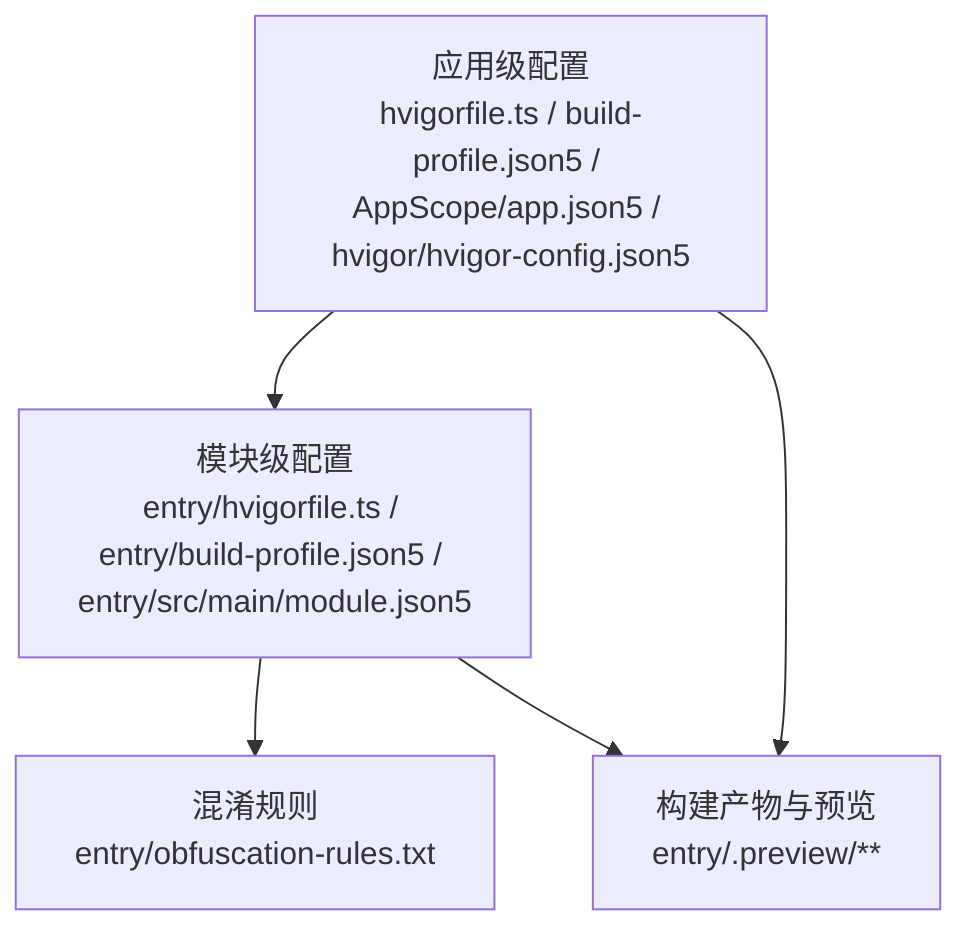
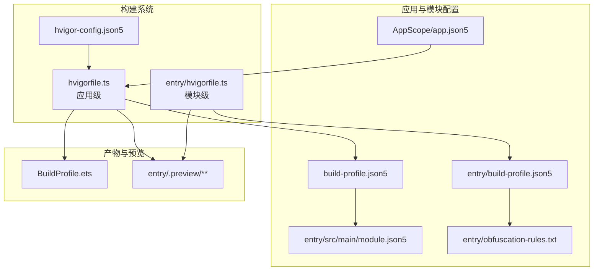
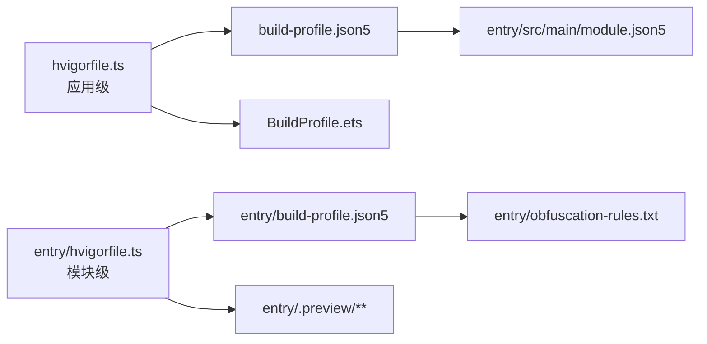

# 部署与发布

<cite>
**本文引用的文件**
- [hvigorfile.ts](file://hvigorfile.ts)
- [entry/hvigorfile.ts](file://entry/hvigorfile.ts)
- [build-profile.json5](file://build-profile.json5)
- [entry/build-profile.json5](file://entry/build-profile.json5)
- [AppScope/app.json5](file://AppScope/app.json5)
- [entry/src/main/module.json5](file://entry/src/main/module.json5)
- [entry/obfuscation-rules.txt](file://entry/obfuscation-rules.txt)
- [hvigor/hvigor-config.json5](file://hvigor/hvigor-config.json5)
- [entry/.preview/default/generated/profile/default/BuildProfile.ets](file://entry/.preview/default/generated/profile/default/BuildProfile.ets)
- [entry/src/main/resources/base/profile/backup_config.json](file://entry/src/main/resources/base/profile/backup_config.json)
- [entry/.preview/default/intermediates/res/default/resources/base/profile/backup_config.json](file://entry/.preview/default/intermediates/res/default/resources/base/profile/backup_config.json)
- [entry/src/test/LocalUnit.test.ets](file://entry/src/test/LocalUnit.test.ets)
- [entry/src/test/List.test.ets](file://entry/src/test/List.test.ets)
</cite>

## 目录
1. [简介](#简介)
2. [项目结构](#项目结构)
3. [核心组件](#核心组件)
4. [架构总览](#架构总览)
5. [详细组件分析](#详细组件分析)
6. [依赖分析](#依赖分析)
7. [性能考虑](#性能考虑)
8. [故障排查指南](#故障排查指南)
9. [结论](#结论)
10. [附录](#附录)

## 简介
本文件面向HarmonyOS在线课堂应用的部署与发布，覆盖构建配置、包管理、hvigor工具使用、代码混淆与优化策略、多环境部署方法、版本管理与更新发布最佳实践，以及发布前质量检查清单与验证流程。内容基于仓库中现有配置文件与构建产物进行整理，帮助开发者在不同环境下稳定地完成构建、打包与发布。

## 项目结构
该工程采用“应用级 + 模块级”的分层组织方式：
- 应用级配置：hvigorfile.ts、build-profile.json5、AppScope/app.json5、hvigor/hvigor-config.json5
- 模块级配置：entry/hvigorfile.ts、entry/build-profile.json5、entry/src/main/module.json5、entry/obfuscation-rules.txt
- 构建产物与预览：entry/.preview 下的生成物与中间产物，包含编译上下文、资源映射、模块元数据等

图表来源
- [hvigorfile.ts](file://hvigorfile.ts#L1-L6)
- [entry/hvigorfile.ts](file://entry/hvigorfile.ts#L1-L6)
- [build-profile.json5](file://build-profile.json5#L1-L56)
- [entry/build-profile.json5](file://entry/build-profile.json5#L1-L33)
- [AppScope/app.json5](file://AppScope/app.json5#L1-L11)
- [entry/src/main/module.json5](file://entry/src/main/module.json5#L1-L59)
- [entry/obfuscation-rules.txt](file://entry/obfuscation-rules.txt#L1-L23)

章节来源
- [hvigorfile.ts](file://hvigorfile.ts#L1-L6)
- [entry/hvigorfile.ts](file://entry/hvigorfile.ts#L1-L6)
- [build-profile.json5](file://build-profile.json5#L1-L56)
- [entry/build-profile.json5](file://entry/build-profile.json5#L1-L33)
- [AppScope/app.json5](file://AppScope/app.json5#L1-L11)
- [entry/src/main/module.json5](file://entry/src/main/module.json5#L1-L59)
- [hvigor/hvigor-config.json5](file://hvigor/hvigor-config.json5#L1-L24)

## 核心组件
- hvigor 构建系统
  - 应用级与模块级 hvigorfile.ts 分别定义了系统任务与插件扩展点
  - hvigor-config.json5 提供执行、日志、调试与Node参数的可选配置
- 构建配置
  - build-profile.json5 定义签名配置、产品配置、构建模式集合与模块映射
  - entry/build-profile.json5 控制模块的资源处理、构建模式集与ArkTS混淆规则文件路径
- 包与权限
  - AppScope/app.json5 定义应用级包名、版本号、图标与标签
  - entry/src/main/module.json5 定义模块类型、主入口、设备类型、页面与权限声明
- 混淆与优化
  - entry/obfuscation-rules.txt 定义属性名、全局名、文件名与导出的混淆开关
- 预览与构建变量
  - entry/.preview/default/generated/profile/default/BuildProfile.ets 提供构建期常量（如Bundle名称、版本号、构建模式等）

章节来源
- [hvigorfile.ts](file://hvigorfile.ts#L1-L6)
- [entry/hvigorfile.ts](file://entry/hvigorfile.ts#L1-L6)
- [hvigor/hvigor-config.json5](file://hvigor/hvigor-config.json5#L1-L24)
- [build-profile.json5](file://build-profile.json5#L1-L56)
- [entry/build-profile.json5](file://entry/build-profile.json5#L1-L33)
- [AppScope/app.json5](file://AppScope/app.json5#L1-L11)
- [entry/src/main/module.json5](file://entry/src/main/module.json5#L1-L59)
- [entry/obfuscation-rules.txt](file://entry/obfuscation-rules.txt#L1-L23)
- [entry/.preview/default/generated/profile/default/BuildProfile.ets](file://entry/.preview/default/generated/profile/default/BuildProfile.ets#L1-L25)

## 架构总览
下图展示从配置到构建产物的关键交互关系，包括hvigor任务、签名与产品配置、模块构建与混淆策略、以及预览与产物生成。

图表来源
- [hvigorfile.ts](file://hvigorfile.ts#L1-L6)
- [entry/hvigorfile.ts](file://entry/hvigorfile.ts#L1-L6)
- [hvigor/hvigor-config.json5](file://hvigor/hvigor-config.json5#L1-L24)
- [build-profile.json5](file://build-profile.json5#L1-L56)
- [AppScope/app.json5](file://AppScope/app.json5#L1-L11)
- [entry/build-profile.json5](file://entry/build-profile.json5#L1-L33)
- [entry/src/main/module.json5](file://entry/src/main/module.json5#L1-L59)
- [entry/obfuscation-rules.txt](file://entry/obfuscation-rules.txt#L1-L23)
- [entry/.preview/default/generated/profile/default/BuildProfile.ets](file://entry/.preview/default/generated/profile/default/BuildProfile.ets#L1-L25)

## 详细组件分析

### hvigor 构建工具与配置
- 应用级与模块级任务
  - 应用级 hvigorfile.ts 使用 appTasks，模块级 hvigorfile.ts 使用 hapTasks，分别驱动应用与模块的构建生命周期
- 可选执行参数
  - hvigor-config.json5 提供分析模式、守护进程、增量编译、并行编译、类型检查、优化策略、日志级别、调试栈、Node内存与GC暴露等开关，便于按需启用以提升构建效率或定位问题
- 产物与缓存
  - .preview 目录包含编译上下文、loader映射、资源合并与中间产物，有助于定位资源与模块加载问题

章节来源
- [hvigorfile.ts](file://hvigorfile.ts#L1-L6)
- [entry/hvigorfile.ts](file://entry/hvigorfile.ts#L1-L6)
- [hvigor/hvigor-config.json5](file://hvigor/hvigor-config.json5#L1-L24)
- [entry/.preview/default/intermediates/loader/default/loader.json](file://entry/.preview/default/intermediates/loader/default/loader.json#L1-L24)

### 构建配置与签名
- 签名配置
  - build-profile.json5 中定义了默认签名材料（证书、密钥别名、算法、存储路径与密码），以及产品配置（目标SDK、兼容SDK、运行时OS、严格模式等）
- 构建模式
  - 支持 debug 与 release 两种构建模式；release 模式下可启用ArkTS混淆规则
- 模块映射
  - modules 数组将模块 entry 映射到 default 产品，确保构建目标正确

章节来源
- [build-profile.json5](file://build-profile.json5#L1-L56)
- [entry/build-profile.json5](file://entry/build-profile.json5#L1-L33)

### 包与权限管理
- 应用包信息
  - AppScope/app.json5 定义 bundleName、版本号、图标与标签，作为安装包标识与UI显示的基础
- 模块能力与权限
  - entry/src/main/module.json5 定义模块类型、主入口、设备类型、页面与能力（含技能实体与动作）、扩展能力（备份）及运行所需权限（网络、相机、麦克风、读写媒体等），并提供权限用途说明字符串键

章节来源
- [AppScope/app.json5](file://AppScope/app.json5#L1-L11)
- [entry/src/main/module.json5](file://entry/src/main/module.json5#L1-L59)

### 代码混淆与优化策略
- 规则文件
  - entry/obfuscation-rules.txt 定义属性名混淆、全局名混淆、文件名混淆与导出混淆等选项，支持通过 ArkTS 构建配置启用
- 启用位置
  - entry/build-profile.json5 的 release 构建模式中，通过 ruleOptions.enable 与 files 指向 obfuscation-rules.txt 来启用混淆
- 注意事项
  - 在启用混淆前，应确保不破坏运行时反射、动态调用与资源键值；必要时配合 keep 选项保留关键符号

章节来源
- [entry/obfuscation-rules.txt](file://entry/obfuscation-rules.txt#L1-L23)
- [entry/build-profile.json5](file://entry/build-profile.json5#L10-L24)

### 多环境部署方法与注意事项
- 开发环境（debug）
  - 使用 debug 构建模式，便于快速迭代与调试；DEBUG 标志在构建变量中可见
- 生产环境（release）
  - 使用 release 构建模式，并启用签名与混淆；确保签名材料完整且安全
- 资源与备份
  - backup_config.json 控制是否允许备份与恢复；模块与预览目录中的备份配置保持一致，避免安装后行为不一致

章节来源
- [entry/.preview/default/generated/profile/default/BuildProfile.ets](file://entry/.preview/default/generated/profile/default/BuildProfile.ets#L1-L25)
- [entry/src/main/resources/base/profile/backup_config.json](file://entry/src/main/resources/base/profile/backup_config.json#L1-L3)
- [entry/.preview/default/intermediates/res/default/resources/base/profile/backup_config.json](file://entry/.preview/default/intermediates/res/default/resources/base/profile/backup_config.json#L1-L3)

### 版本管理与更新发布最佳实践
- 版本号策略
  - 使用 AppScope/app.json5 中的 versionCode 与 versionName 表示应用版本；建议遵循递增规则并在发布前统一校验
- 构建变量一致性
  - BuildProfile.ets 中的版本号与构建模式应与发布计划一致，避免预览与正式包不一致
- 更新策略
  - 发布新版本时，同步更新模块与应用级版本号，确保升级路径清晰

章节来源
- [AppScope/app.json5](file://AppScope/app.json5#L1-L11)
- [entry/.preview/default/generated/profile/default/BuildProfile.ets](file://entry/.preview/default/generated/profile/default/BuildProfile.ets#L1-L25)

### 测试与质量检查
- 单元测试
  - entry/src/test/LocalUnit.test.ets 与 entry/src/test/List.test.ets 提供测试套件与用例模板，建议在发布前执行全量测试
- 质量基线
  - 建议在CI中集成测试执行与静态检查，确保变更不会引入回归

章节来源
- [entry/src/test/LocalUnit.test.ets](file://entry/src/test/LocalUnit.test.ets#L1-L33)
- [entry/src/test/List.test.ets](file://entry/src/test/List.test.ets#L1-L5)

## 依赖分析
hvigor 任务与配置之间的依赖关系如下：

图表来源
- [hvigorfile.ts](file://hvigorfile.ts#L1-L6)
- [entry/hvigorfile.ts](file://entry/hvigorfile.ts#L1-L6)
- [build-profile.json5](file://build-profile.json5#L1-L56)
- [entry/build-profile.json5](file://entry/build-profile.json5#L1-L33)
- [entry/src/main/module.json5](file://entry/src/main/module.json5#L1-L59)
- [entry/obfuscation-rules.txt](file://entry/obfuscation-rules.txt#L1-L23)
- [entry/.preview/default/generated/profile/default/BuildProfile.ets](file://entry/.preview/default/generated/profile/default/BuildProfile.ets#L1-L25)

章节来源
- [hvigorfile.ts](file://hvigorfile.ts#L1-L6)
- [entry/hvigorfile.ts](file://entry/hvigorfile.ts#L1-L6)
- [build-profile.json5](file://build-profile.json5#L1-L56)
- [entry/build-profile.json5](file://entry/build-profile.json5#L1-L33)
- [entry/src/main/module.json5](file://entry/src/main/module.json5#L1-L59)
- [entry/obfuscation-rules.txt](file://entry/obfuscation-rules.txt#L1-L23)
- [entry/.preview/default/generated/profile/default/BuildProfile.ets](file://entry/.preview/default/generated/profile/default/BuildProfile.ets#L1-L25)

## 性能考虑
- 并行与增量编译
  - hvigor-config.json5 提供并行与增量编译开关，建议在CI与本地开发中根据机器性能合理开启
- 类型检查与优化策略
  - 可按需开启类型检查与优化策略（内存/性能），平衡构建速度与诊断能力
- 日志与调试
  - 通过日志级别与调试栈配置，定位构建异常与性能瓶颈

章节来源
- [hvigor/hvigor-config.json5](file://hvigor/hvigor-config.json5#L1-L24)

## 故障排查指南
- 构建失败
  - 检查 hvigorfile.ts 任务类型与插件配置是否匹配模块类型
  - 校验 build-profile.json5 的签名材料与产品配置是否正确
- 资源或权限问题
  - 对照 AppScope/app.json5 与 entry/src/main/module.json5 的包名、版本与权限声明
  - 确认 backup_config.json 与预览目录中的配置一致
- 混淆相关问题
  - 若出现运行时反射或动态调用异常，检查 entry/obfuscation-rules.txt 的 keep 选项与 ArkTS 构建配置中的启用状态
- 预览与产物不一致
  - 对比 BuildProfile.ets 与实际发布配置，确保版本号与构建模式一致

章节来源
- [hvigorfile.ts](file://hvigorfile.ts#L1-L6)
- [entry/hvigorfile.ts](file://entry/hvigorfile.ts#L1-L6)
- [build-profile.json5](file://build-profile.json5#L1-L56)
- [AppScope/app.json5](file://AppScope/app.json5#L1-L11)
- [entry/src/main/module.json5](file://entry/src/main/module.json5#L1-L59)
- [entry/src/main/resources/base/profile/backup_config.json](file://entry/src/main/resources/base/profile/backup_config.json#L1-L3)
- [entry/.preview/default/intermediates/res/default/resources/base/profile/backup_config.json](file://entry/.preview/default/intermediates/res/default/resources/base/profile/backup_config.json#L1-L3)
- [entry/obfuscation-rules.txt](file://entry/obfuscation-rules.txt#L1-L23)
- [entry/.preview/default/generated/profile/default/BuildProfile.ets](file://entry/.preview/default/generated/profile/default/BuildProfile.ets#L1-L25)

## 结论
本文件基于仓库现有配置梳理了HarmonyOS在线课堂应用的部署与发布要点：hvigor任务与配置、签名与产品设置、模块与权限、混淆策略、多环境部署、版本管理与测试质量保障。建议在CI中固化上述流程，并在每次发布前执行质量检查与回归测试，确保构建稳定性与用户体验。

## 附录
- 发布前质量检查清单
  - 构建模式确认：debug/release 是否符合预期
  - 签名材料：证书、密钥、存储路径与密码是否有效
  - 版本号：AppScope/app.json5 与 BuildProfile.ets 是否一致
  - 权限与页面：module.json5 的权限与页面配置是否完整
  - 混淆策略：release 模式下混淆已启用且未破坏关键功能
  - 备份配置：backup_config.json 与预览产物一致
  - 测试执行：单元测试通过，无新增回归
- 验证流程
  - 本地预览：检查UI、权限弹窗与核心功能
  - 多设备验证：手机/平板设备上验证页面与能力
  - 回归测试：在CI中执行全量测试用例