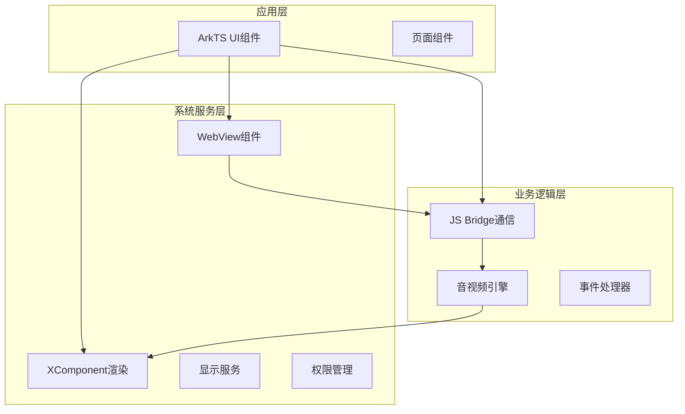
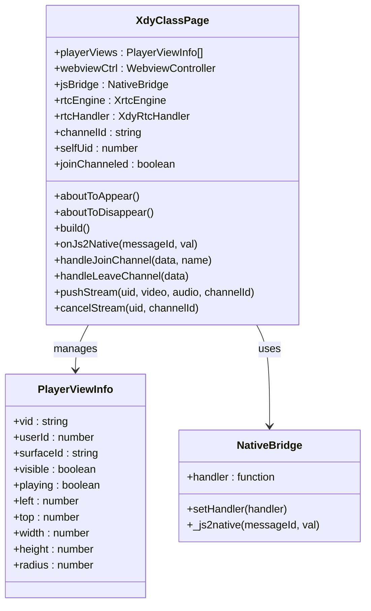
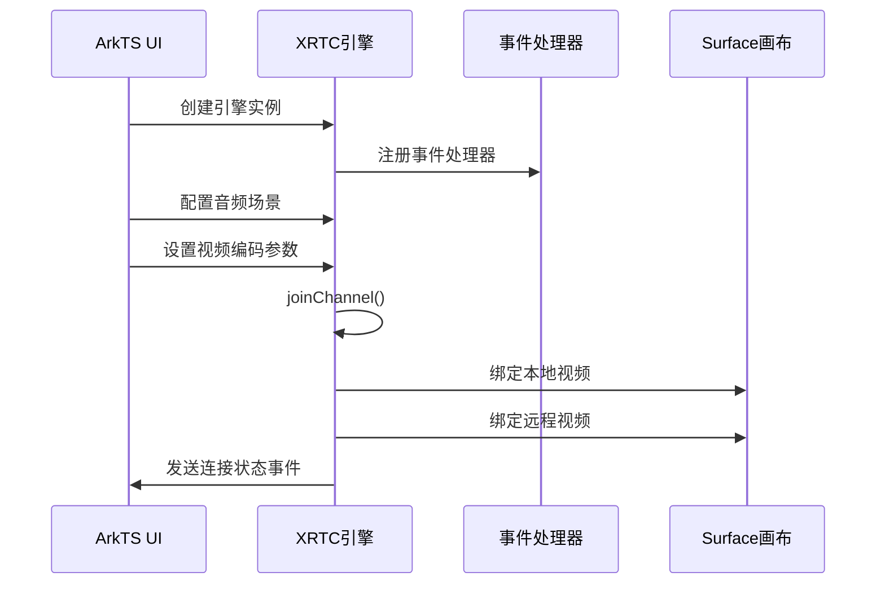
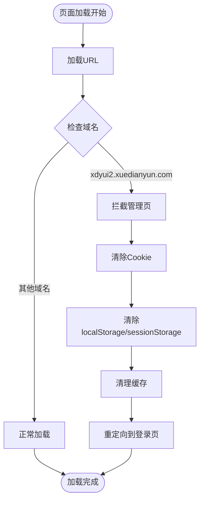
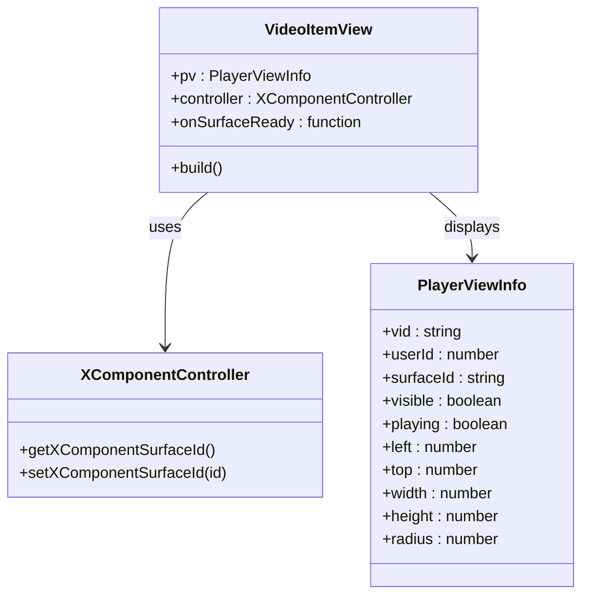
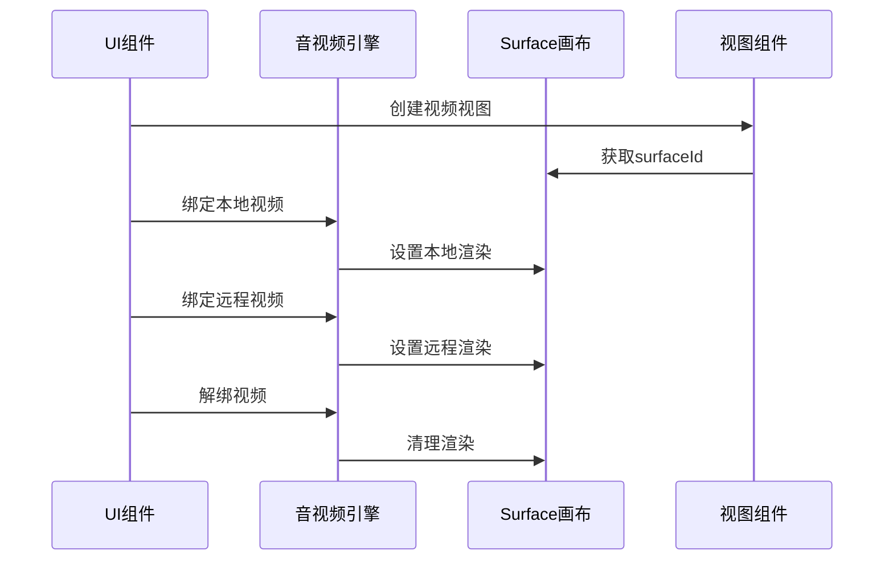
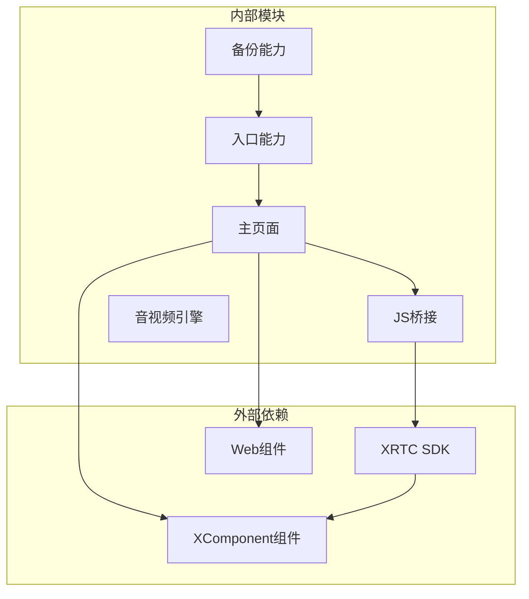
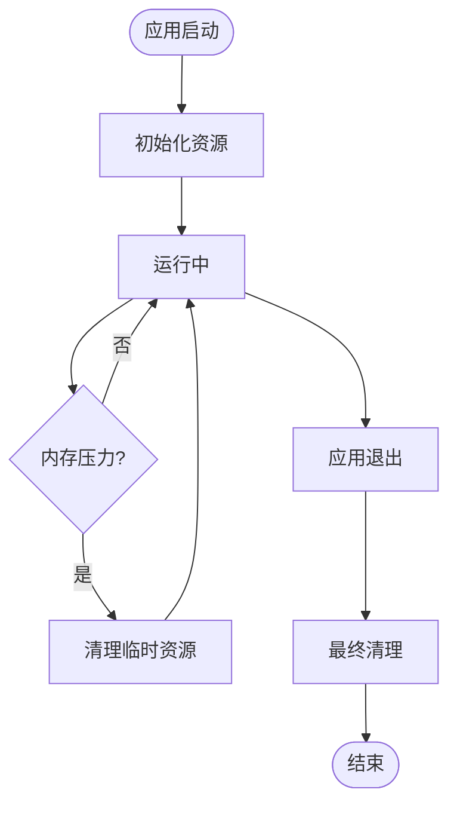

# 技术架构

<cite>
**本文档引用的文件**
- [Index.ets](file://entry/src/main/ets/pages/Index.ets)
- [EntryAbility.ets](file://entry/src/main/ets/entryability/EntryAbility.ets)
- [EntryBackupAbility.ets](file://entry/src/main/ets/entrybackupability/EntryBackupAbility.ets)
- [index.d.ts](file://package/src/main/cpp/types/libagora_rtc_sdk/index.d.ts)
- [harmonylog.md](file://harmonylog.md)
- [鸿蒙端实现分析与优化建议.md](file://鸿蒙端实现分析与优化建议.md)
- [hvigorfile.ts](file://entry/hvigorfile.ts)
</cite>

## 目录
1. [引言](#引言)
2. [项目结构](#项目结构)
3. [核心组件](#核心组件)
4. [架构总览](#架构总览)
5. [详细组件分析](#详细组件分析)
6. [依赖关系分析](#依赖关系分析)
7. [性能考虑](#性能考虑)
8. [故障排除指南](#故障排除指南)
9. [结论](#结论)

## 引言

HarmonyOS在线课堂应用采用三层架构设计，通过ArkTS原生层、WebView层和XComponent视频渲染层的协同工作，实现了完整的音视频实时通信解决方案。该架构旨在支持H5内容集成、跨平台兼容性和高性能的视频渲染，为用户提供流畅的在线课堂体验。

## 项目结构

项目采用标准的HarmonyOS应用结构，主要包含以下层次：



**图表来源**
- [Index.ets](file://entry/src/main/ets/pages/Index.ets#L1-L100)
- [EntryAbility.ets](file://entry/src/main/ets/entryability/EntryAbility.ets#L1-L65)

**章节来源**
- [Index.ets](file://entry/src/main/ets/pages/Index.ets#L1-L150)
- [EntryAbility.ets](file://entry/src/main/ets/entryability/EntryAbility.ets#L1-L65)

## 核心组件

### 三层架构设计

系统采用清晰的三层架构分离：

1. **ArkTS原生层**：负责业务逻辑处理、音视频引擎管理和状态维护
2. **WebView层**：承载H5课堂内容，提供富文本和交互功能
3. **XComponent视频渲染层**：专门处理音视频渲染和显示

### 主要职责分配

| 层次 | 主要职责 | 关键技术 |
|------|----------|----------|
| ArkTS原生层 | 业务逻辑、状态管理、引擎控制 | XRTC引擎、事件处理、数据模型 |
| WebView层 | H5内容展示、用户交互 | Web组件、JavaScript桥接 |
| XComponent层 | 视频渲染、画面合成 | Surface渲染、视频绑定 |

**章节来源**
- [Index.ets](file://entry/src/main/ets/pages/Index.ets#L153-L198)
- [Index.ets](file://entry/src/main/ets/pages/Index.ets#L257-L360)

## 架构总览

系统采用"内容层+渲染层+控制层"的架构模式，通过JavaScript Bridge实现三层间的无缝通信。

```mermaid
graph TB
subgraph "用户界面层"
H5[WebView H5课堂]
UI[ArkTS UI组件]
end
subgraph "通信层"
Bridge[JS Bridge]
Events[事件分发器]
end
subgraph "业务逻辑层"
Engine[XRTC引擎]
Handler[事件处理器]
Model[数据模型]
end
subgraph "渲染层"
XComp[XComponent视频渲染]
Surface[Surface画布]
end
H5 < --> Bridge
UI < --> Bridge
Bridge < --> Engine
Engine < --> XComp
XComp --> Surface
Handler --> Engine
Model --> Handler
```

**图表来源**
- [Index.ets](file://entry/src/main/ets/pages/Index.ets#L108-L132)
- [Index.ets](file://entry/src/main/ets/pages/Index.ets#L135-L151)

## 详细组件分析

### ArkTS原生层组件

ArkTS原生层是整个系统的控制中心，主要包含以下核心组件：

#### 主页面组件 (XdyClassPage)

主页面组件负责协调各个子系统的工作，包括音视频引擎管理、WebView控制和XComponent视频渲染。



**图表来源**
- [Index.ets](file://entry/src/main/ets/pages/Index.ets#L26-L66)
- [Index.ets](file://entry/src/main/ets/pages/Index.ets#L108-L112)

#### 音视频引擎管理

音视频引擎通过XRTC SDK进行管理，支持多种音视频场景和配置。



**图表来源**
- [Index.ets](file://entry/src/main/ets/pages/Index.ets#L925-L985)
- [Index.ets](file://entry/src/main/ets/pages/Index.ets#L1004-L1137)

**章节来源**
- [Index.ets](file://entry/src/main/ets/pages/Index.ets#L197-L1436)

### WebView层组件

WebView层负责承载H5课堂内容，提供丰富的交互功能和动态内容展示。

#### WebView配置与控制

WebView组件通过多种配置选项确保最佳的用户体验：

| 配置项 | HarmonyOS实现 | 功能说明 |
|--------|---------------|----------|
| JavaScript访问 | `javaScriptAccess(true)` | 启用JavaScript执行 |
| DOM存储访问 | `domStorageAccess(true)` | 支持localStorage/sessionStorage |
| 文件访问 | `fileAccess(true)` | 允许本地文件访问 |
| 混合模式 | `MixedMode.All` | 支持HTTP/HTTPS混合内容 |
| 用户代理 | 硬编码Android UA | 伪装为Android设备 |

#### URL拦截与重定向

WebView实现了智能的URL拦截机制，用于处理特定场景的页面跳转：



**图表来源**
- [Index.ets](file://entry/src/main/ets/pages/Index.ets#L294-L340)

**章节来源**
- [Index.ets](file://entry/src/main/ets/pages/Index.ets#L257-L360)

### XComponent视频渲染层

XComponent层专门负责音视频的渲染和显示，通过Surface技术实现高效的视频播放。

#### 视频视图组件 (VideoItemView)

每个视频视图都是独立的XComponent组件，支持动态创建和销毁：



**图表来源**
- [Index.ets](file://entry/src/main/ets/pages/Index.ets#L154-L192)

#### 视频绑定与解绑

视频渲染层实现了灵活的视频绑定机制，支持动态添加和移除视频源：



**图表来源**
- [Index.ets](file://entry/src/main/ets/pages/Index.ets#L1410-L1430)
- [Index.ets](file://entry/src/main/ets/pages/Index.ets#L1140-L1167)

**章节来源**
- [Index.ets](file://entry/src/main/ets/pages/Index.ets#L153-L198)

## 依赖关系分析

系统各组件之间存在清晰的依赖关系，形成了稳定的架构体系。



**图表来源**
- [EntryAbility.ets](file://entry/src/main/ets/entryability/EntryAbility.ets#L14-L65)
- [EntryBackupAbility.ets](file://entry/src/main/ets/entrybackupability/EntryBackupAbility.ets#L6-L16)

### 外部SDK依赖

系统主要依赖以下外部SDK：

| SDK | 版本 | 用途 | 依赖关系 |
|-----|------|------|----------|
| @av/xrtc | 4.3.2.17 | 音视频引擎 | 核心依赖 |
| @ohos.web.webview | 系统API | WebView组件 | UI依赖 |
| @ohos.display | 系统API | 显示信息 | 系统服务 |
| @ohos.abilityAccessCtrl | 系统API | 权限管理 | 安全依赖 |

**章节来源**
- [index.d.ts](file://package/src/main/cpp/types/libagora_rtc_sdk/index.d.ts#L1-L298)
- [Index.ets](file://entry/src/main/ets/pages/Index.ets#L1-L12)

## 性能考虑

### 渲染性能优化

系统在视频渲染方面采用了多项优化措施：

1. **Surface渲染优化**：使用XComponent的Surface模式，减少渲染开销
2. **视图懒加载**：仅在需要时创建和销毁视频视图
3. **内存管理**：及时清理不再使用的视频资源

### 网络性能优化

音视频传输通过XRTC SDK优化，支持多种网络环境：

1. **自适应码率**：根据网络状况动态调整视频质量
2. **缓冲策略**：合理的缓冲机制减少卡顿
3. **错误恢复**：网络中断后的自动重连机制

### 内存管理策略

系统实现了完善的内存管理机制：



## 故障排除指南

### 常见问题及解决方案

#### 音视频问题

| 问题 | 症状 | 解决方案 |
|------|------|----------|
| 无法加入频道 | 连接状态显示DISCONNECTED | 检查网络连接和权限 |
| 视频不显示 | 视频区域黑屏 | 确认摄像头权限和Surface绑定 |
| 音频无声 | 有画面无声音 | 检查麦克风权限和音频设置 |

#### WebView问题

| 问题 | 症状 | 解决方案 |
|------|------|----------|
| 页面无法加载 | 白屏或加载失败 | 检查网络连接和URL配置 |
| JavaScript执行错误 | 功能异常 | 确认JS Bridge配置正确 |
| Cookie问题 | 登录状态异常 | 清除浏览器缓存和Cookie |

#### XComponent问题

| 问题 | 症状 | 解决方案 |
|------|------|----------|
| 视频渲染异常 | 画面扭曲或闪烁 | 检查Surface ID和渲染模式 |
| 层级问题 | 视频遮挡UI | 调整Stack层级和透明度 |

**章节来源**
- [harmonylog.md](file://harmonylog.md#L1-L243)
- [鸿蒙端实现分析与优化建议.md](file://鸿蒙端实现分析与优化建议.md#L130-L334)

## 结论

HarmonyOS在线课堂应用的三层架构设计充分体现了现代移动应用的最佳实践。通过ArkTS原生层的强大控制能力、WebView层的丰富内容承载能力和XComponent层的专业视频渲染能力，系统实现了功能完整、性能优异的在线课堂解决方案。

### 架构优势

1. **清晰的职责分离**：三层架构确保了各层职责明确，便于维护和扩展
2. **良好的跨平台兼容性**：通过WebView和XComponent的组合，实现了H5内容和原生渲染的完美结合
3. **强大的音视频能力**：基于XRTC SDK的专业音视频引擎，提供了高质量的实时通信体验
4. **完善的错误处理**：多层次的异常处理机制确保了系统的稳定性

### 技术决策与权衡

系统在设计过程中做出了多项重要技术决策：

1. **选择XRTC SDK**：相比其他音视频方案，XRTC提供了更好的性能和稳定性
2. **采用WebView+XComponent模式**：平衡了H5灵活性和原生渲染性能
3. **实现JS Bridge通信**：建立了三层间高效的数据交换通道
4. **优化内存管理**：通过及时清理资源避免内存泄漏

### 未来发展方向

基于当前架构，建议重点关注以下方面的优化：

1. **性能监控**：建立完善的应用性能监控体系
2. **异常处理增强**：增加更细粒度的错误处理和恢复机制
3. **代码结构优化**：按照建议的目录结构调整代码组织
4. **配置外部化**：将URL等配置项抽取到独立的配置文件中

该架构为HarmonyOS在线课堂应用提供了坚实的技术基础，能够满足当前和未来的业务需求。