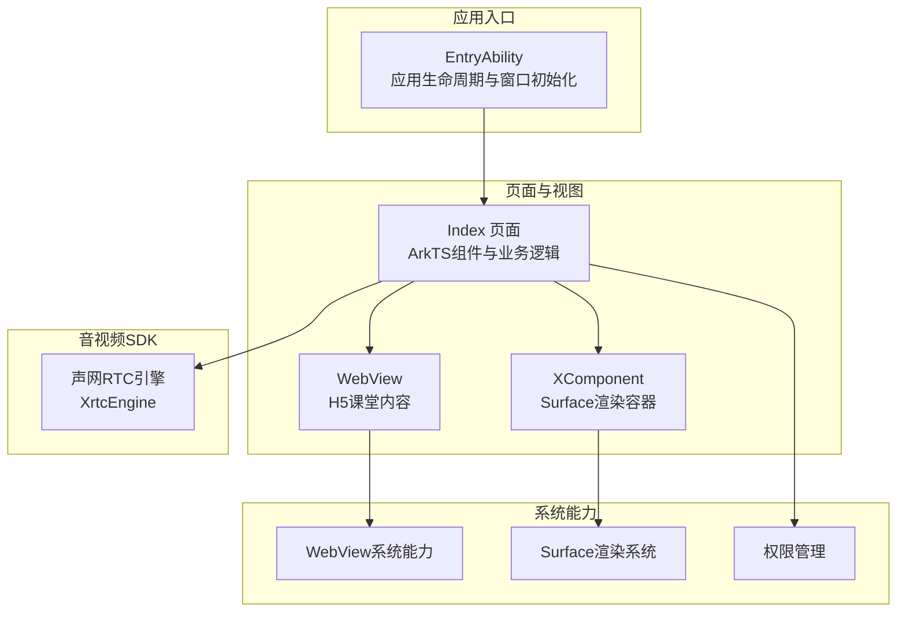
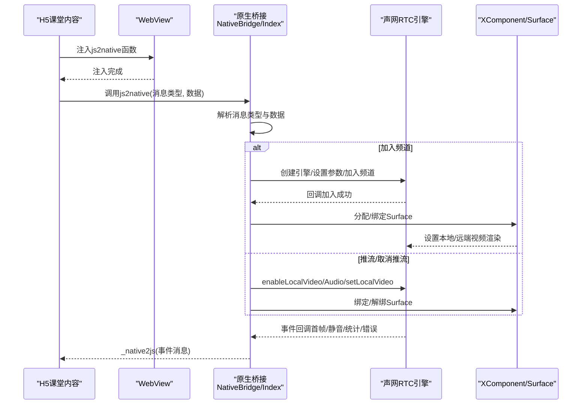
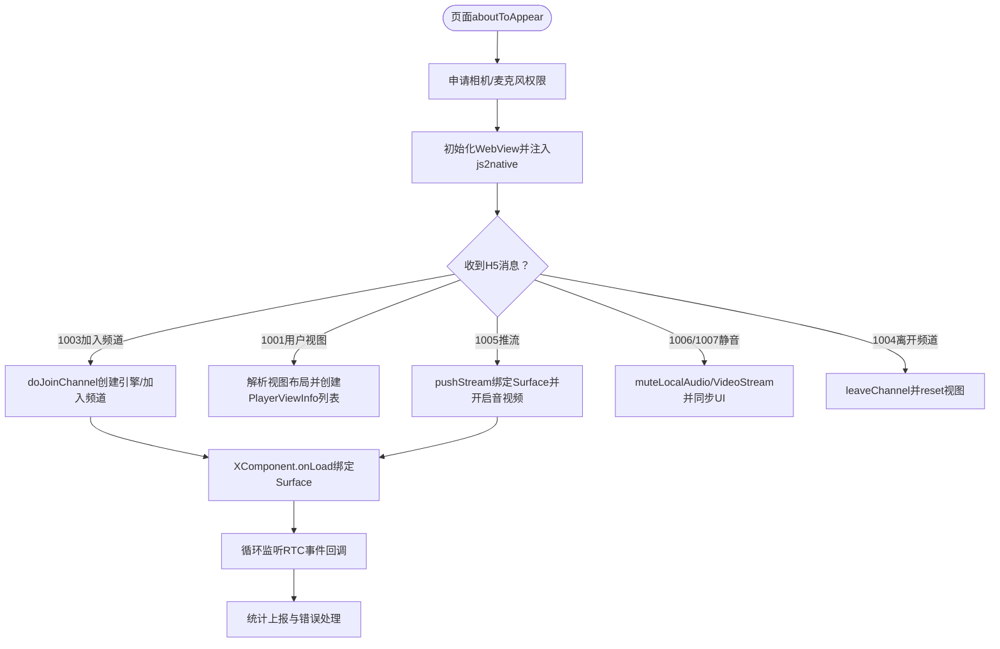
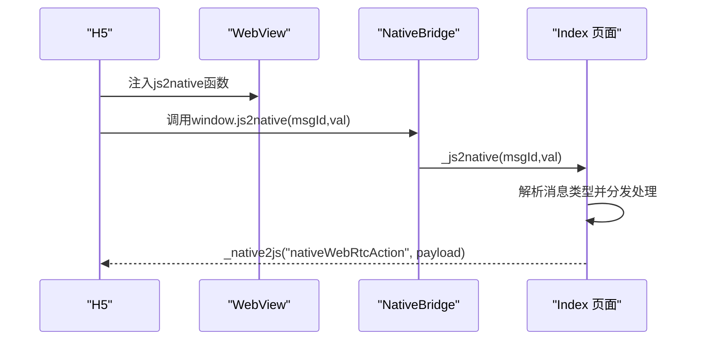
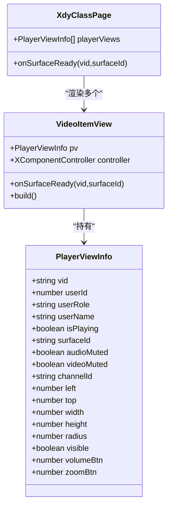
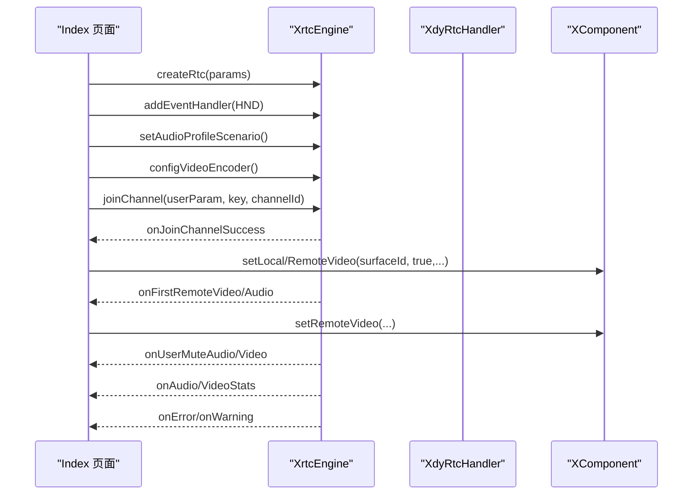
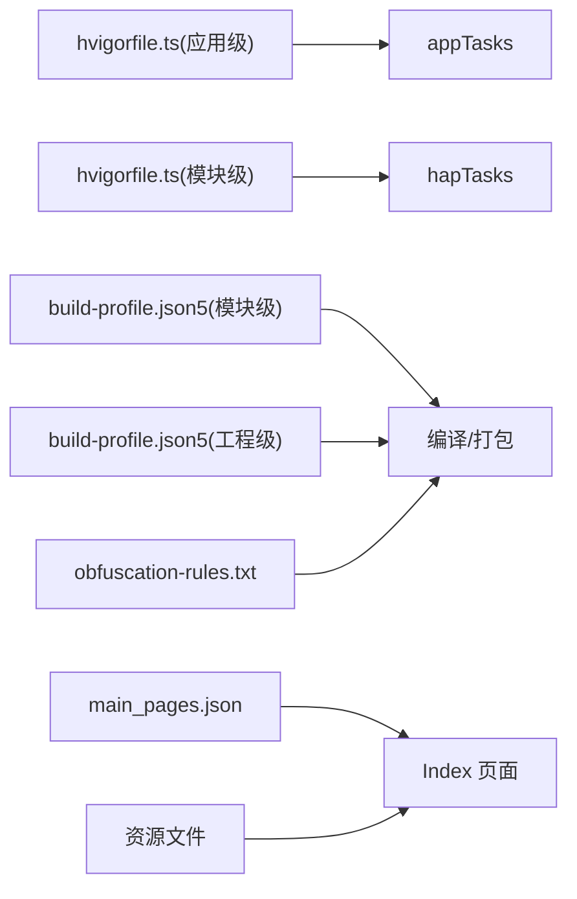

# 技术栈

<cite>
**本文引用的文件**
- [Index.ets](file://entry/src/main/ets/pages/Index.ets)
- [EntryAbility.ets](file://entry/src/main/ets/entryability/EntryAbility.ets)
- [hvigorfile.ts（应用级）](file://hvigorfile.ts)
- [hvigorfile.ts（模块级）](file://entry/hvigorfile.ts)
- [build-profile.json5（模块级）](file://entry/build-profile.json5)
- [build-profile.json5（工程级）](file://build-profile.json5)
- [main_pages.json](file://entry/src/main/resources/base/profile/main_pages.json)
- [backup_config.json](file://entry/src/main/resources/base/profile/backup_config.json)
- [string.json（字符串资源）](file://entry/src/main/resources/base/element/string.json)
- [color.json（颜色资源）](file://entry/src/main/resources/base/element/color.json)
- [layered_image.json（媒体资源）](file://entry/src/main/resources/base/media/layered_image.json)
- [obfuscation-rules.txt](file://entry/obfuscation-rules.txt)
- [module.json（模块元数据）](file://entry/build/default/intermediates/res/default/module.json)
</cite>

## 目录
1. [简介](#简介)
2. [项目结构](#项目结构)
3. [核心组件](#核心组件)
4. [架构总览](#架构总览)
5. [组件详解](#组件详解)
6. [依赖关系分析](#依赖关系分析)
7. [性能考量](#性能考量)
8. [故障排查指南](#故障排查指南)
9. [结论](#结论)
10. [附录](#附录)

## 简介
本文件面向HarmonyOS在线课堂应用，系统化梳理并解释项目采用的技术栈与框架，包括ArkTS、WebView、XComponent、声网RTC SDK等核心技术，说明技术选型原因、版本与兼容性、第三方依赖与使用方式、开发工具链与构建系统、以及各组件间的集成协作关系，并提供学习路径与参考资料，帮助开发者高效理解与维护该应用。

## 项目结构
项目采用HarmonyOS标准模块化组织方式，入口能力通过EntryAbility加载主页面Index，页面内组合WebView承载H5课堂内容，同时通过XComponent叠加渲染远端/本地视频流，底层使用声网RTC SDK进行音视频通信。

图表来源
- [EntryAbility.ets](file://entry/src/main/ets/entryability/EntryAbility.ets#L14-L49)
- [Index.ets](file://entry/src/main/ets/pages/Index.ets#L197-L360)

章节来源
- [EntryAbility.ets](file://entry/src/main/ets/entryability/EntryAbility.ets#L14-L49)
- [Index.ets](file://entry/src/main/ets/pages/Index.ets#L197-L360)
- [main_pages.json](file://entry/src/main/resources/base/profile/main_pages.json#L1-L6)

## 核心组件
- ArkTS：HarmonyOS前端开发语言，用于声明式UI与业务逻辑，承担页面渲染、事件处理、权限申请、生命周期管理等职责。
- WebView：承载H5课堂内容，提供JavaScript访问桥接，支持跨域、缓存、UA定制、权限请求拦截等。
- XComponent：基于Surface的视频渲染容器，与ArkTS组件叠加，实现视频画中画式叠加显示。
- 声网RTC SDK（XrtcEngine）：负责音视频加入/离开频道、本地/远端视频绑定、静音控制、统计上报、错误处理等。
- 系统能力：权限管理（相机/麦克风）、显示信息（屏幕宽高/密度）、窗口方向与全屏设置。

章节来源
- [Index.ets](file://entry/src/main/ets/pages/Index.ets#L1-L120)
- [Index.ets](file://entry/src/main/ets/pages/Index.ets#L197-L360)
- [EntryAbility.ets](file://entry/src/main/ets/entryability/EntryAbility.ets#L14-L49)

## 架构总览
HarmonyOS在线课堂采用“H5内容 + 原生桥接 + 声网音视频”的混合架构。H5侧通过js2native与原生建立双向通信；原生侧通过WebView注入脚本、设置代理对象，实现消息路由；音视频部分由声网SDK统一调度，XComponent承载视频渲染，ArkTS协调视图布局与状态。

图表来源
- [Index.ets](file://entry/src/main/ets/pages/Index.ets#L257-L360)
- [Index.ets](file://entry/src/main/ets/pages/Index.ets#L363-L424)
- [Index.ets](file://entry/src/main/ets/pages/Index.ets#L924-L985)
- [Index.ets](file://entry/src/main/ets/pages/Index.ets#L1004-L1137)

## 组件详解

### ArkTS页面与业务逻辑（Index）
- 负责WebView初始化、JS桥接、消息分发、权限申请、视图布局与XComponent绑定、加入/离开频道、推流/取消推流、静音控制、统计上报、错误处理等。
- 关键点：
  - WebView注入js2native函数，建立H5↔原生通信通道。
  - 通过XComponent的onLoad回调获取surfaceId，完成本地/远端视频绑定。
  - 使用XdyRtcHandler实现RTC事件回调，驱动UI状态更新。
  - 采用百分比布局适配不同屏幕尺寸。

图表来源
- [Index.ets](file://entry/src/main/ets/pages/Index.ets#L229-L247)
- [Index.ets](file://entry/src/main/ets/pages/Index.ets#L257-L360)
- [Index.ets](file://entry/src/main/ets/pages/Index.ets#L363-L424)
- [Index.ets](file://entry/src/main/ets/pages/Index.ets#L924-L985)
- [Index.ets](file://entry/src/main/ets/pages/Index.ets#L1004-L1137)
- [Index.ets](file://entry/src/main/ets/pages/Index.ets#L1169-L1401)

章节来源
- [Index.ets](file://entry/src/main/ets/pages/Index.ets#L197-L360)
- [Index.ets](file://entry/src/main/ets/pages/Index.ets#L363-L424)
- [Index.ets](file://entry/src/main/ets/pages/Index.ets#L924-L985)
- [Index.ets](file://entry/src/main/ets/pages/Index.ets#L1004-L1137)
- [Index.ets](file://entry/src/main/ets/pages/Index.ets#L1169-L1401)

### WebView与JS桥接
- WebView配置：启用JavaScript、DOM存储、文件访问、混合内容、UA定制、缓存策略、缩放与手势控制等。
- 桥接机制：通过javaScriptProxy暴露NativeBridge对象至H5命名空间，H5侧通过window.js2native调用原生方法；原生侧通过_webnative2js回调H5。
- URL拦截：拦截特定域名跳转，触发退出/刷新流程，清理Cookie与缓存并重载登录页。

图表来源
- [Index.ets](file://entry/src/main/ets/pages/Index.ets#L260-L294)
- [Index.ets](file://entry/src/main/ets/pages/Index.ets#L264-L269)
- [Index.ets](file://entry/src/main/ets/pages/Index.ets#L363-L424)
- [Index.ets](file://entry/src/main/ets/pages/Index.ets#L987-L1001)

章节来源
- [Index.ets](file://entry/src/main/ets/pages/Index.ets#L260-L294)
- [Index.ets](file://entry/src/main/ets/pages/Index.ets#L264-L269)
- [Index.ets](file://entry/src/main/ets/pages/Index.ets#L363-L424)
- [Index.ets](file://entry/src/main/ets/pages/Index.ets#L987-L1001)

### XComponent与视频渲染
- XComponent以SURFACE类型承载视频渲染，通过onLoad回调获取surfaceId，随后在pushStream中绑定到本地或远端视频。
- 视图采用百分比布局，根据屏幕宽度动态计算位置与尺寸，支持圆角裁剪与透明命中测试，叠加在WebView之上。
- 通过RenderMode.RENDER_MODE_HIDDEN隐藏Surface绘制，仅用于接收渲染数据，避免闪烁。

图表来源
- [Index.ets](file://entry/src/main/ets/pages/Index.ets#L26-L66)
- [Index.ets](file://entry/src/main/ets/pages/Index.ets#L154-L192)
- [Index.ets](file://entry/src/main/ets/pages/Index.ets#L1410-L1430)

章节来源
- [Index.ets](file://entry/src/main/ets/pages/Index.ets#L154-L192)
- [Index.ets](file://entry/src/main/ets/pages/Index.ets#L1410-L1430)

### 声网RTC SDK（XrtcEngine）
- 引擎创建：通过InitParams携带appId、rtcType、domain、secretKey与上下文，创建XrtcEngine实例。
- 参数配置：设置音频场景（默认/音乐/聊天室）、视频编码配置（分辨率档位映射）、开关本地音视频、静音控制、切换摄像头、音量增益等。
- 事件处理：IEngineEventHandler回调包括警告、错误、加入/离开频道、远端首帧、静音状态、连接状态、音视频统计等。
- 推流绑定：优先精确匹配角色的空闲视图，否则兼容到showstage视图；本地用户需先enableLocalVideo/Audio再setLocalVideo，静音通过muteLocalAudio/VideoStream控制。

图表来源
- [Index.ets](file://entry/src/main/ets/pages/Index.ets#L115-L132)
- [Index.ets](file://entry/src/main/ets/pages/Index.ets#L924-L985)
- [Index.ets](file://entry/src/main/ets/pages/Index.ets#L1004-L1137)
- [Index.ets](file://entry/src/main/ets/pages/Index.ets#L1169-L1401)

章节来源
- [Index.ets](file://entry/src/main/ets/pages/Index.ets#L115-L132)
- [Index.ets](file://entry/src/main/ets/pages/Index.ets#L924-L985)
- [Index.ets](file://entry/src/main/ets/pages/Index.ets#L1004-L1137)
- [Index.ets](file://entry/src/main/ets/pages/Index.ets#L1169-L1401)

### 应用入口与窗口初始化（EntryAbility）
- 保存全局Context供SDK使用；设置窗口横屏、全屏、系统栏禁用；加载Index页面。
- 生命周期回调输出日志，便于调试与性能分析。

章节来源
- [EntryAbility.ets](file://entry/src/main/ets/entryability/EntryAbility.ets#L14-L49)

## 依赖关系分析
- 模块级任务：entry/hvigorfile.ts使用hapTasks，负责HAP打包与构建。
- 应用级任务：hvigorfile.ts使用appTasks，提供应用级构建插件扩展点。
- 构建配置：build-profile.json5控制编译、混淆、资源处理等；obfuscation-rules.txt定义代码混淆规则。
- 资源与页面：main_pages.json声明入口页面；backup_config.json允许备份恢复；资源文件定义字符串、颜色、媒体等。

图表来源
- [hvigorfile.ts（应用级）](file://hvigorfile.ts#L3-L6)
- [hvigorfile.ts（模块级）](file://entry/hvigorfile.ts#L3-L6)
- [build-profile.json5（模块级）](file://entry/build-profile.json5)
- [build-profile.json5（工程级）](file://build-profile.json5)
- [obfuscation-rules.txt](file://entry/obfuscation-rules.txt#L1-L23)
- [main_pages.json](file://entry/src/main/resources/base/profile/main_pages.json#L1-L6)

章节来源
- [hvigorfile.ts（应用级）](file://hvigorfile.ts#L3-L6)
- [hvigorfile.ts（模块级）](file://entry/hvigorfile.ts#L3-L6)
- [build-profile.json5（模块级）](file://entry/build-profile.json5)
- [build-profile.json5（工程级）](file://build-profile.json5)
- [obfuscation-rules.txt](file://entry/obfuscation-rules.txt#L1-L23)
- [main_pages.json](file://entry/src/main/resources/base/profile/main_pages.json#L1-L6)

## 性能考量
- 视频渲染：使用Surface隐藏模式减少绘制开销；按需绑定/解绑视频，避免无效渲染。
- 统计上报：本地与远端音视频统计按帧聚合，降低上报频率带来的主线程压力。
- 缓存与网络：WebView禁用缓存模式以保证H5内容一致性；URL拦截清理Cookie与缓存，避免会话污染。
- 屏幕适配：基于屏幕宽度的百分比布局，减少复杂计算与重绘。
- 权限与异常：集中处理权限申请与异常捕获，避免崩溃影响主流程。

## 故障排查指南
- 加入频道失败：检查joinChannel返回码与引擎状态，必要时销毁引擎后重试。
- 视频无画面：确认XComponent.onLoad回调已获取surfaceId，且已调用setLocal/RemoteVideo绑定。
- 音频无声：检查setEnableSpeakerphone与adjustPlaybackVolume设置，确认静音状态与设备音量。
- H5无法调用js2native：确认WebView已注入js2native函数，且javaScriptProxy已正确配置。
- 退出/刷新异常：检查isOut/isRefreshing标志位，确保reset流程正确执行并清理视图与数据。

章节来源
- [Index.ets](file://entry/src/main/ets/pages/Index.ets#L978-L984)
- [Index.ets](file://entry/src/main/ets/pages/Index.ets#L1410-L1430)
- [Index.ets](file://entry/src/main/ets/pages/Index.ets#L1174-L1176)
- [Index.ets](file://entry/src/main/ets/pages/Index.ets#L284-L293)
- [Index.ets](file://entry/src/main/ets/pages/Index.ets#L618-L632)

## 结论
本项目通过ArkTS、WebView、XComponent与声网RTC SDK的协同，实现了HarmonyOS平台下的在线课堂解决方案。ArkTS负责业务编排与UI交互，WebView承载H5内容并与原生桥接，XComponent提供高性能视频渲染，声网SDK保障音视频质量与稳定性。结合完善的构建与资源体系，整体架构清晰、职责明确、易于扩展与维护。

## 附录

### 技术选型与版本兼容性
- ArkTS：HarmonyOS标准前端语言，具备声明式UI与响应式数据绑定能力，适用于复杂交互页面。
- WebView：提供H5内容承载与JS桥接能力，支持权限请求拦截与UA定制，满足课堂内容生态。
- XComponent：基于Surface的视频渲染容器，适合与ArkTS叠加显示，满足多路视频画中画需求。
- 声网RTC SDK：提供丰富的音视频能力与事件回调，支持多厂商SDK类型切换（Agora/HRtc/TRtc/WRtc）。

章节来源
- [Index.ets](file://entry/src/main/ets/pages/Index.ets#L930-L934)
- [Index.ets](file://entry/src/main/ets/pages/Index.ets#L845-L864)

### 第三方依赖与使用指南
- 声网RTC SDK（@av/xrtc）：通过XrtcEngine创建引擎、配置参数、加入频道、绑定视频、处理事件与统计。
- WebView系统能力：通过webview.WebviewController与相关API进行内容加载、脚本注入、权限请求与缓存管理。
- 权限管理：通过abilityAccessCtrl申请相机与麦克风权限，提升用户体验并满足音视频功能需求。

章节来源
- [Index.ets](file://entry/src/main/ets/pages/Index.ets#L5-L10)
- [Index.ets](file://entry/src/main/ets/pages/Index.ets#L238-L246)
- [Index.ets](file://entry/src/main/ets/pages/Index.ets#L200-L201)

### 开发工具链与构建系统
- Hvigor：应用级与模块级任务分别由appTasks与hapTasks提供，支持自定义插件扩展。
- 构建配置：build-profile.json5控制编译选项、资源处理与打包策略；obfuscation-rules.txt定义混淆规则。
- 资源与页面：main_pages.json声明入口页面；backup_config.json允许备份恢复；资源文件定义字符串、颜色、媒体等。

章节来源
- [hvigorfile.ts（应用级）](file://hvigorfile.ts#L3-L6)
- [hvigorfile.ts（模块级）](file://entry/hvigorfile.ts#L3-L6)
- [build-profile.json5（模块级）](file://entry/build-profile.json5)
- [build-profile.json5（工程级）](file://build-profile.json5)
- [obfuscation-rules.txt](file://entry/obfuscation-rules.txt#L1-L23)
- [main_pages.json](file://entry/src/main/resources/base/profile/main_pages.json#L1-L6)
- [backup_config.json](file://entry/src/main/resources/base/profile/backup_config.json#L1-L3)
- [string.json（字符串资源）](file://entry/src/main/resources/base/element/string.json#L1-L32)
- [color.json（颜色资源）](file://entry/src/main/resources/base/element/color.json#L1-L8)
- [layered_image.json（媒体资源）](file://entry/src/main/resources/base/media/layered_image.json#L1-L7)

### 集成方式与协作关系
- H5与原生：通过js2native/_native2js双向通信，消息类型覆盖加入/离开频道、推流/取消推流、静音、设备信息、系统信息等。
- 原生与RTC：Index页面通过XdyRtcHandler接收事件回调，驱动UI状态与视频绑定；通过pushStream/cancelStream管理视频流。
- 视图与渲染：XComponent在ArkTS中声明式渲染，通过onLoad回调与RTC引擎联动，实现Surface绑定与视频显示。

章节来源
- [Index.ets](file://entry/src/main/ets/pages/Index.ets#L363-L424)
- [Index.ets](file://entry/src/main/ets/pages/Index.ets#L987-L1001)
- [Index.ets](file://entry/src/main/ets/pages/Index.ets#L1004-L1137)
- [Index.ets](file://entry/src/main/ets/pages/Index.ets#L1410-L1430)

### 学习路径与参考资料
- ArkTS基础与声明式UI：掌握组件声明、状态管理、事件处理与生命周期。
- WebView与JS桥接：理解H5与原生通信机制、脚本注入与权限拦截。
- XComponent与Surface：学习视频渲染容器的使用与性能优化。
- 声网RTC SDK：熟悉引擎创建、参数配置、事件回调与统计上报。
- HarmonyOS构建与资源：了解hvigor任务、build-profile配置与资源管理。

章节来源
- [Index.ets](file://entry/src/main/ets/pages/Index.ets#L197-L360)
- [Index.ets](file://entry/src/main/ets/pages/Index.ets#L257-L360)
- [Index.ets](file://entry/src/main/ets/pages/Index.ets#L924-L985)
- [Index.ets](file://entry/src/main/ets/pages/Index.ets#L1004-L1137)