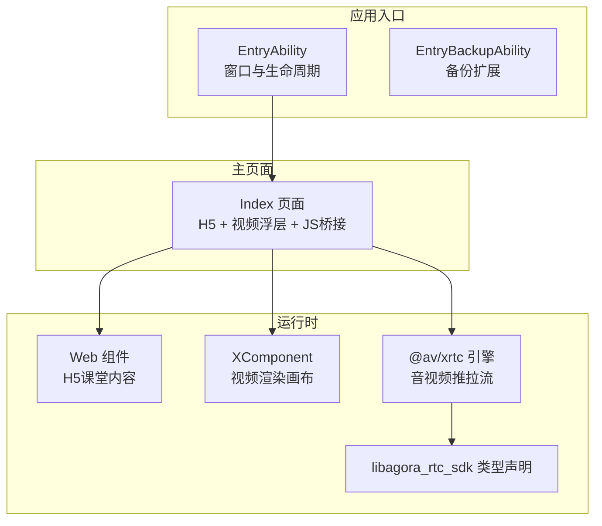
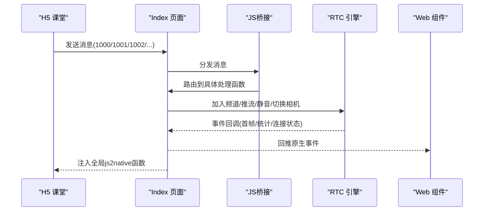
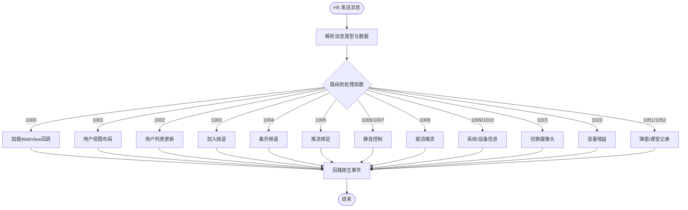
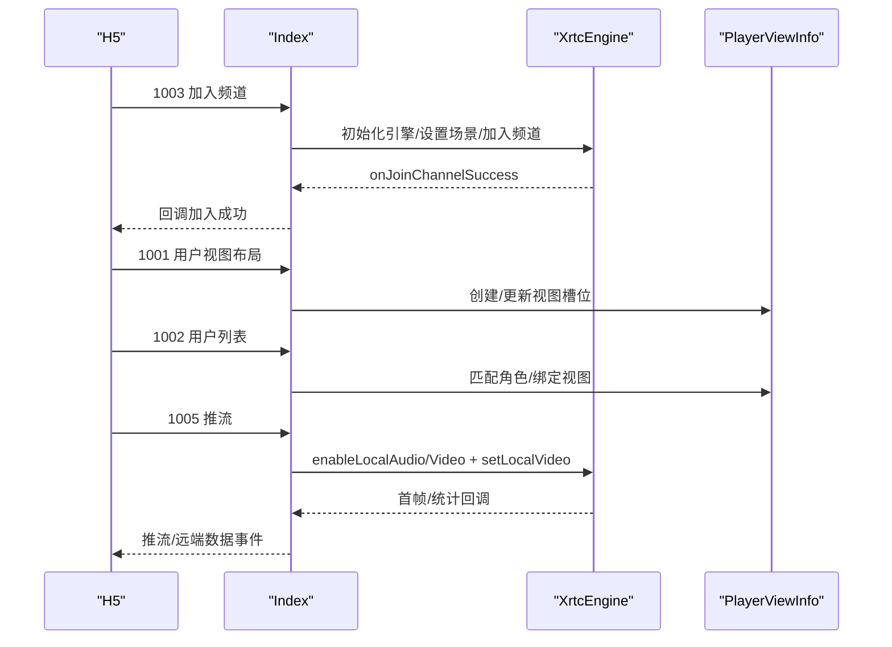
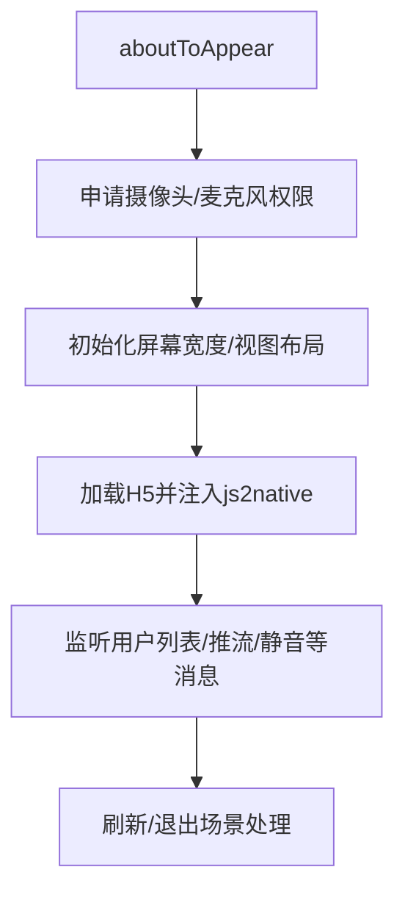
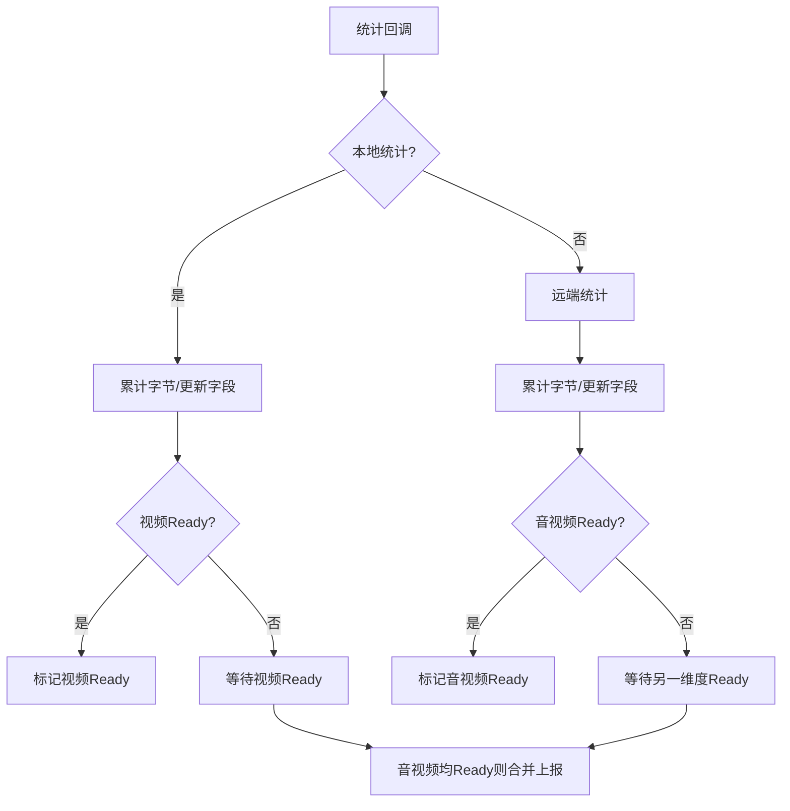
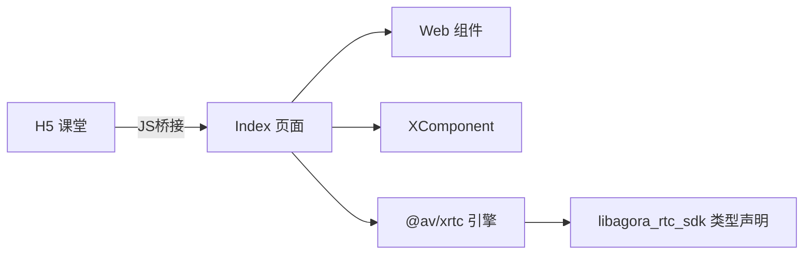

# 核心功能

<cite>
**本文引用的文件**
- [Index.ets](file://entry/src/main/ets/pages/Index.ets)
- [EntryAbility.ets](file://entry/src/main/ets/entryability/EntryAbility.ets)
- [EntryBackupAbility.ets](file://entry/src/main/ets/entrybackupability/EntryBackupAbility.ets)
- [index.d.ts](file://package/src/main/cpp/types/libagora_rtc_sdk/index.d.ts)
- [main_pages.json](file://entry/src/main/resources/base/profile/main_pages.json)
- [string.json](file://entry/src/main/resources/base/element/string.json)
- [hvigorfile.ts](file://hvigorfile.ts)
- [鸿蒙端实现分析与优化建议.md](file://鸿蒙端实现分析与优化建议.md)
</cite>

## 目录
1. [简介](#简介)
2. [项目结构](#项目结构)
3. [核心组件](#核心组件)
4. [架构总览](#架构总览)
5. [详细组件分析](#详细组件分析)
6. [依赖分析](#依赖分析)
7. [性能考虑](#性能考虑)
8. [故障排查指南](#故障排查指南)
9. [结论](#结论)
10. [附录](#附录)

## 简介
本文件面向HarmonyOS在线课堂应用，聚焦核心功能模块与实现要点，涵盖音视频课堂、H5内容集成、用户管理与权限控制等能力。文档以“功能—技术—体验”为主线，解释各模块的设计思路、实现原理、关键算法与交互流程，并给出依赖关系、协作方式、使用场景与优化建议，帮助开发者与产品人员快速理解应用的核心能力与价值。

## 项目结构
应用采用ArkTS + Web组件 + RTC SDK的混合架构：
- 应用入口与窗口生命周期由EntryAbility负责，加载主页面Index。
- 主页面Index承载H5课堂内容与视频浮层，通过JS桥接与H5通信，同时驱动RTC引擎进行音视频推拉流。
- RTC SDK通过类型声明文件暴露底层能力，支持多厂商引擎选择与参数配置。
- 资源与页面清单位于entry目录，构建脚本由hvigorfile.ts提供。

**图表来源**
- [EntryAbility.ets](file://entry/src/main/ets/entryability/EntryAbility.ets#L14-L65)
- [EntryBackupAbility.ets](file://entry/src/main/ets/entrybackupability/EntryBackupAbility.ets#L1-L16)
- [Index.ets](file://entry/src/main/ets/pages/Index.ets#L257-L360)
- [index.d.ts](file://package/src/main/cpp/types/libagora_rtc_sdk/index.d.ts#L1-L38)

**章节来源**
- [EntryAbility.ets](file://entry/src/main/ets/entryability/EntryAbility.ets#L14-L65)
- [main_pages.json](file://entry/src/main/resources/base/profile/main_pages.json#L1-L6)
- [hvigorfile.ts](file://hvigorfile.ts#L1-L6)

## 核心组件
- H5课堂内容层：承载教学页面、互动与课堂状态，通过Web组件加载，支持JS桥接与URL拦截。
- 视频浮层：基于XComponent的视频渲染容器，叠加在H5之上，支持多路视频布局与动态绑定。
- RTC引擎与事件处理：封装引擎初始化、加入/离开频道、推流/取消推流、音视频静音、设备切换、统计上报等。
- JS桥接与消息分发：统一接收H5消息，按类型路由到具体处理函数，同时向H5回推原生事件。
- 权限与窗口：在应用启动阶段请求摄像头/麦克风权限；窗口设置横屏、全屏与系统栏隐藏。

**章节来源**
- [Index.ets](file://entry/src/main/ets/pages/Index.ets#L197-L360)
- [Index.ets](file://entry/src/main/ets/pages/Index.ets#L363-L424)
- [Index.ets](file://entry/src/main/ets/pages/Index.ets#L924-L985)
- [EntryAbility.ets](file://entry/src/main/ets/entryability/EntryAbility.ets#L31-L49)

## 架构总览
整体采用“H5承载业务 + 原生音视频渲染”的混合架构。H5负责课程内容与交互，原生负责音视频通道与视频画布管理。两者通过JS桥接实现消息互通，形成闭环。

**图表来源**
- [Index.ets](file://entry/src/main/ets/pages/Index.ets#L257-L360)
- [Index.ets](file://entry/src/main/ets/pages/Index.ets#L363-L424)
- [Index.ets](file://entry/src/main/ets/pages/Index.ets#L988-L1001)

## 详细组件分析

### H5内容集成与JS桥接
- H5加载与代理：通过Web组件加载课堂地址，启用JS代理将window.xdyAndroid._js2native映射到原生桥接对象，实现双向通信。
- URL拦截：拦截管理后台跳转链接，清除会话并重载登录页，避免H5直接退出导致的引擎残留。
- 页面注入：在页面开始时注入全局js2native函数，确保H5侧能调用原生方法。
- 消息类型：支持1000~1052等消息类型，分别处理WebView加载、用户视图布局、用户列表、加入/离开频道、推流/取消推流、静音、系统/设备信息、摄像头切换、音量增益、弹窗与课堂记录等。

**图表来源**
- [Index.ets](file://entry/src/main/ets/pages/Index.ets#L363-L424)
- [Index.ets](file://entry/src/main/ets/pages/Index.ets#L426-L922)

**章节来源**
- [Index.ets](file://entry/src/main/ets/pages/Index.ets#L257-L360)
- [Index.ets](file://entry/src/main/ets/pages/Index.ets#L363-L424)
- [鸿蒙端实现分析与优化建议.md](file://鸿蒙端实现分析与优化建议.md#L38-L81)

### 音视频课堂（推拉流与布局）
- 引擎初始化：根据H5传递的SDK类型选择引擎，设置音频场景、视频编码配置，并注册事件处理器。
- 加入/离开频道：支持刷新场景下的复用引擎策略，避免destroy导致的重进失败；离开时仅退订不销毁，重进时直接joinChannel。
- 推流绑定：按用户角色优先匹配精确视图槽位，若无则兼容到showstage；本地用户需先enableLocalAudio/Video再setLocalVideo，静音通过muteLocal控制。
- 取消推流：解除视频绑定并恢复静音状态，清空视图属性。
- 首帧与状态：远端首帧到达时自动补推流；统计回调聚合本地与远端音视频数据，满足质量监控需求。

**图表来源**
- [Index.ets](file://entry/src/main/ets/pages/Index.ets#L924-L985)
- [Index.ets](file://entry/src/main/ets/pages/Index.ets#L1004-L1137)
- [Index.ets](file://entry/src/main/ets/pages/Index.ets#L1169-L1292)

**章节来源**
- [Index.ets](file://entry/src/main/ets/pages/Index.ets#L924-L985)
- [Index.ets](file://entry/src/main/ets/pages/Index.ets#L1004-L1137)
- [Index.ets](file://entry/src/main/ets/pages/Index.ets#L1169-L1292)

### 用户管理与权限控制
- 用户管理：维护成员列表与RTC模型映射，记录音频/视频静音状态、摄像头/麦克风开启时间戳，用于刷新后补推流。
- 权限控制：应用启动时请求摄像头与麦克风权限，提示用途，避免运行时异常。
- 窗口与显示：设置横屏、全屏与系统栏隐藏，提升课堂沉浸感。

**图表来源**
- [Index.ets](file://entry/src/main/ets/pages/Index.ets#L229-L247)
- [Index.ets](file://entry/src/main/ets/pages/Index.ets#L483-L534)
- [EntryAbility.ets](file://entry/src/main/ets/entryability/EntryAbility.ets#L31-L49)

**章节来源**
- [Index.ets](file://entry/src/main/ets/pages/Index.ets#L229-L247)
- [Index.ets](file://entry/src/main/ets/pages/Index.ets#L483-L534)
- [string.json](file://entry/src/main/resources/base/element/string.json#L16-L30)
- [EntryAbility.ets](file://entry/src/main/ets/entryability/EntryAbility.ets#L31-L49)

### 统计与质量监控
- 本地统计：聚合发送码率、帧率、字节增量，按音视频分别标记Ready后合并上报。
- 远端统计：聚合接收分辨率、解码帧率、丢包率、端到端延迟等，按音视频分别标记Ready后合并上报。
- 事件回调：在首帧到达、连接状态变化、错误事件时同步上报，支撑课堂质量观测。

**图表来源**
- [Index.ets](file://entry/src/main/ets/pages/Index.ets#L1319-L1401)

**章节来源**
- [Index.ets](file://entry/src/main/ets/pages/Index.ets#L1319-L1401)

## 依赖分析
- 组件耦合：Index页面对Web组件、XComponent、RTC引擎存在直接依赖；JS桥接作为消息中枢，降低H5与原生模块间的耦合。
- 外部依赖：RTC SDK通过类型声明文件暴露底层API，支持多厂商引擎；H5通过JS桥接与原生通信。
- 循环依赖：当前结构未见循环依赖，消息分发通过桥接集中处理，避免跨模块直接耦合。

**图表来源**
- [Index.ets](file://entry/src/main/ets/pages/Index.ets#L257-L360)
- [index.d.ts](file://package/src/main/cpp/types/libagora_rtc_sdk/index.d.ts#L1-L38)

**章节来源**
- [Index.ets](file://entry/src/main/ets/pages/Index.ets#L257-L360)
- [index.d.ts](file://package/src/main/cpp/types/libagora_rtc_sdk/index.d.ts#L1-L38)

## 性能考虑
- 引擎复用：离开课堂不销毁引擎，重进时直接joinChannel，避免destroy在HarmonyOS上的不可靠性导致初始化失败。
- 视图复用：首次创建视图后复用槽位，减少重建成本；未绑定视图时延迟绑定，避免无效渲染。
- 统计聚合：本地与远端统计按Ready标记合并上报，降低频繁小包上报带来的开销。
- WebView配置：禁用缩放、关闭缓存、设置UA与权限白名单，减少H5侧资源消耗与安全风险。

**章节来源**
- [Index.ets](file://entry/src/main/ets/pages/Index.ets#L618-L632)
- [Index.ets](file://entry/src/main/ets/pages/Index.ets#L434-L481)
- [鸿蒙端实现分析与优化建议.md](file://鸿蒙端实现分析与优化建议.md#L38-L81)

## 故障排查指南
- 引擎初始化失败：检查doJoinChannel中引擎状态与异常分支，必要时清理旧回调并重建引擎。
- 首帧未绑定：确认onSurfaceReady触发后及时绑定；若视图未就绪，等待surfaceId后再绑定。
- 音视频静音异常：本地用户开启摄像头/麦克风时需先取消静音，再检查是否需要重新推流绑定。
- 退出/刷新异常：确保handleLeaveChannel与handleRefresh正确区分场景，避免重复执行；退出时清除会话并重载登录页。
- 权限问题：若摄像头/麦克风权限被拒绝，H5侧相关功能不可用，需引导用户授权。

**章节来源**
- [Index.ets](file://entry/src/main/ets/pages/Index.ets#L924-L985)
- [Index.ets](file://entry/src/main/ets/pages/Index.ets#L1410-L1430)
- [Index.ets](file://entry/src/main/ets/pages/Index.ets#L730-L818)
- [Index.ets](file://entry/src/main/ets/pages/Index.ets#L583-L649)
- [Index.ets](file://entry/src/main/ets/pages/Index.ets#L237-L246)

## 结论
该应用通过H5与原生的深度协同，实现了稳定的在线课堂体验：H5承载教学内容与交互，原生提供高性能音视频通道与灵活的视频布局。通过严格的权限管理、消息路由与统计上报，保障了课堂的可用性与可观测性。建议在后续版本中进一步完善错误恢复与日志采集，持续优化引擎复用与视图绑定策略，提升课堂稳定性与用户体验。

## 附录
- 关键实现路径参考
  - H5加载与桥接：[Index.ets](file://entry/src/main/ets/pages/Index.ets#L257-L360)
  - 消息分发与路由：[Index.ets](file://entry/src/main/ets/pages/Index.ets#L363-L424)
  - 加入/离开频道与引擎复用：[Index.ets](file://entry/src/main/ets/pages/Index.ets#L536-L649)
  - 推流绑定与取消：[Index.ets](file://entry/src/main/ets/pages/Index.ets#L1004-L1167)
  - 统计上报与事件回调：[Index.ets](file://entry/src/main/ets/pages/Index.ets#L1319-L1401)
  - 权限与窗口配置：[Index.ets](file://entry/src/main/ets/pages/Index.ets#L229-L247)、[EntryAbility.ets](file://entry/src/main/ets/entryability/EntryAbility.ets#L31-L49)
  - RTC SDK类型声明：[index.d.ts](file://package/src/main/cpp/types/libagora_rtc_sdk/index.d.ts#L1-L38)