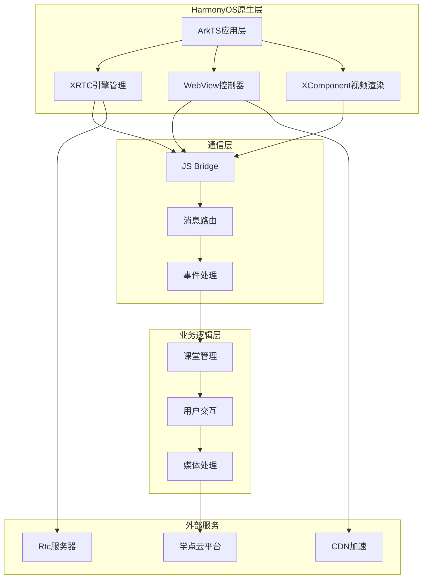
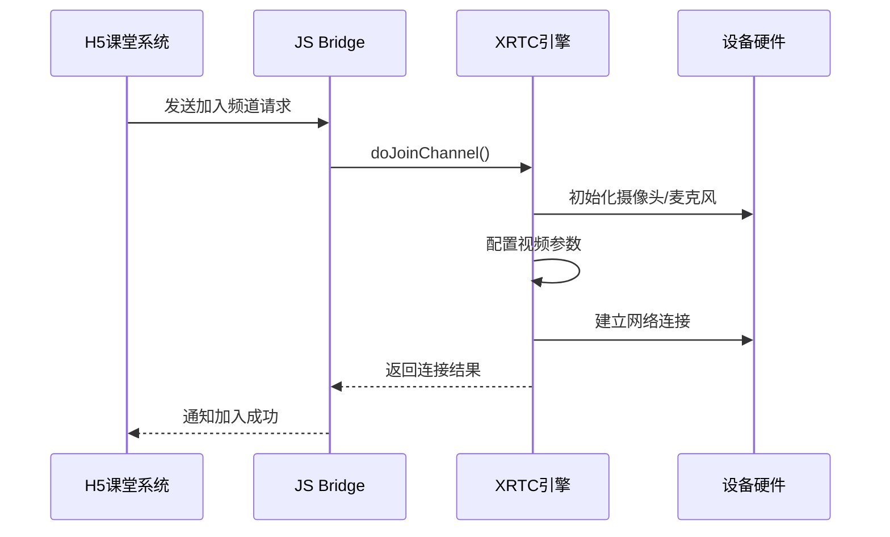
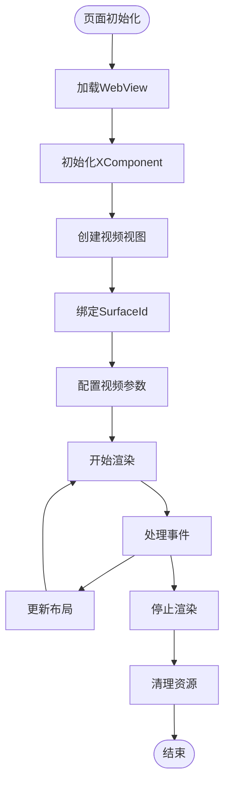

# 项目介绍

<cite>
**本文档引用的文件**
- [Index.ets](file://entry/src/main/ets/pages/Index.ets)
- [EntryAbility.ets](file://entry/src/main/ets/entryability/EntryAbility.ets)
- [EntryBackupAbility.ets](file://entry/src/main/ets/entrybackupability/EntryBackupAbility.ets)
- [string.json](file://AppScope/resources/base/element/string.json)
- [index.d.ts](file://package/src/main/cpp/types/libagora_rtc_sdk/index.d.ts)
- [hvigorfile.ts](file://hvigorfile.ts)
- [harmonylog.md](file://harmonylog.md)
- [鸿蒙端实现分析与优化建议.md](file://鸿蒙端实现分析与优化建议.md)
</cite>

## 目录
1. [项目概述](#项目概述)
2. [核心目标与业务价值](#核心目标与业务价值)
3. [技术架构与创新点](#技术架构与创新点)
4. [核心技术实现](#核心技术实现)
5. [用户体验与功能特性](#用户体验与功能特性)
6. [目标用户与应用场景](#目标用户与应用场景)
7. [市场定位与竞争优势](#市场定位与竞争优势)
8. [发展历程与未来规划](#发展历程与未来规划)
9. [技术亮点与优化建议](#技术亮点与优化建议)
10. [总结](#总结)

## 项目概述

学点云课堂HarmonyOS应用是一个专为HarmonyOS系统设计的完整在线课堂解决方案。该项目采用ArkTS技术栈，结合WebView与XComponent技术，实现了与传统Android端功能完全对等的在线教育体验。应用通过与学点云教育平台深度集成，为用户提供流畅的音视频互动教学环境。

### 项目特色
- **跨平台一致性**：与Android端功能完全对等，确保用户体验的一致性
- **HarmonyOS原生优化**：充分利用HarmonyOS系统特性，提供原生流畅体验
- **完整教学生态**：涵盖课堂管理、互动教学、资源共享等完整功能链
- **实时音视频技术**：基于XRTC SDK实现高质量的音视频传输

## 核心目标与业务价值

### 核心目标
1. **提供完整的在线课堂体验**：从课堂进入、互动教学到课堂管理的全流程覆盖
2. **确保跨平台一致性**：在HarmonyOS平台上实现与Android端相同的教学功能
3. **优化移动端教学体验**：针对移动设备特点进行专门优化
4. **构建稳定的教学基础设施**：提供可靠的技术支撑保障教学活动

### 业务价值
- **教育公平性**：降低优质教育资源的获取门槛，支持远程教学
- **教学效率提升**：通过互动功能提高课堂参与度和学习效果
- **技术示范作用**：展示HarmonyOS在教育领域的应用潜力
- **生态建设**：推动HarmonyOS教育应用生态的发展

## 技术架构与创新点

### 整体架构设计



**架构图来源**
- [Index.ets](file://entry/src/main/ets/pages/Index.ets#L195-L360)
- [EntryAbility.ets](file://entry/src/main/ets/entryability/EntryAbility.ets#L14-L49)

### 技术创新点

#### 1. 三层架构设计
- **WebView层**：承载H5课堂内容，实现与学点云平台的无缝对接
- **XComponent层**：提供高性能的视频渲染能力，支持多路视频叠加
- **ArkTS原生层**：管理XRTC引擎，处理音视频控制逻辑

#### 2. 智能消息路由系统
通过JS Bridge实现H5与原生层的双向通信，支持30+种消息类型的智能路由和处理。

#### 3. 动态视图管理系统
支持根据课堂布局动态调整视频窗口位置和大小，实现灵活的多画面显示。

#### 4. 生命周期优化策略
针对HarmonyOS系统特点，实现了完善的页面生命周期管理和资源释放机制。

## 核心技术实现

### 音视频引擎集成

项目采用XRTC SDK作为核心音视频引擎，通过TypeScript接口封装，实现了与H5课堂系统的深度集成。



**序列图来源**
- [Index.ets](file://entry/src/main/ets/pages/Index.ets#L924-L985)

### 视频渲染架构



**流程图来源**
- [Index.ets](file://entry/src/main/ets/pages/Index.ets#L1410-L1430)

### 通信协议设计

系统支持多种消息类型，包括课堂管理、用户交互、媒体控制等，通过统一的消息路由机制实现高效处理。

**消息类型分类**：
- **1000-1009**：课堂基础功能（加载、加入、离开、推流等）
- **1010-1020**：设备信息与系统信息
- **1031-1052**：课堂状态与控制
- **2000-3000**：原生层反馈消息

## 用户体验与功能特性

### 核心功能特性

#### 1. 完整的课堂体验
- **课堂进入**：支持多种身份进入（教师、学生、助教）
- **互动教学**：实时音视频互动，支持屏幕共享
- **课堂管理**：支持课堂开始、结束、暂停等功能
- **资源分享**：支持文档、PPT等教学资源的实时共享

#### 2. 智能视图管理
- **动态布局**：根据课堂参与者数量自动调整视频窗口布局
- **个性化控制**：支持用户自定义视频窗口位置和大小
- **多画面显示**：支持主讲教师、助教、学生等多角色显示

#### 3. 高质量音视频
- **多码率适配**：根据网络状况自动调整视频质量
- **音频优化**：支持回声消除、降噪等音频处理
- **延迟优化**：通过多路并发传输减少音视频延迟

### 用户界面设计

应用采用简洁直观的界面设计，主要包含三个层次：

1. **课堂内容层**：WebView承载的H5课堂界面
2. **视频控制层**：XComponent叠加的视频窗口控制
3. **系统控制层**：底部的功能按钮和状态指示

## 目标用户与应用场景

### 目标用户群体

#### 主要用户
- **学生群体**：K12教育阶段的学生，需要参与在线课堂学习
- **教师群体**：各级各类学校的任课教师，需要开展在线教学
- **教育机构**：培训机构、在线教育平台等

#### 用户特征
- **技术接受度**：具备基本的移动设备使用能力
- **学习需求**：需要稳定可靠的在线学习环境
- **网络条件**：可能面临不同的网络环境挑战

### 应用场景

#### 1. 常规课堂教学
- 支持正常课堂教学的在线化
- 实现远程教学与现场教学的融合

#### 2. 课后辅导
- 提供个性化的课后辅导服务
- 支持一对一或小组形式的教学

#### 3. 教研活动
- 支持教师间的教学研讨
- 实现教学经验的分享与交流

#### 4. 考试监考
- 提供远程监考技术支持
- 确保考试的公平性和安全性

## 市场定位与竞争优势

### 市场定位

#### 目标市场
- **教育信息化市场**：传统教育机构的数字化转型需求
- **在线教育市场**：新兴在线教育平台的发展需求
- **企业培训市场**：企业员工技能培训的在线化需求

#### 产品定位
- **专业级在线课堂解决方案**
- **跨平台教学工具**
- **高性能音视频教学平台**

### 竞争优势

#### 1. 技术优势
- **HarmonyOS原生优化**：充分利用系统特性，提供更流畅的用户体验
- **跨平台一致性**：与Android端功能完全对等，降低迁移成本
- **技术创新**：采用最新的ArkTS技术和XComponent渲染

#### 2. 功能优势
- **完整功能链**：涵盖在线课堂的完整功能需求
- **灵活部署**：支持多种部署方式和使用场景
- **稳定可靠**：经过严格测试，确保教学过程的稳定性

#### 3. 生态优势
- **HarmonyOS生态**：受益于HarmonyOS生态的发展
- **合作伙伴关系**：与学点云教育平台的深度合作
- **技术支持**：获得专业的技术团队支持

## 发展历程与未来规划

### 发展历程

#### 阶段一：基础功能实现（2024年）
- 完成核心音视频功能的开发
- 实现与H5课堂系统的初步集成
- 基本的课堂管理功能上线

#### 阶段二：功能完善与优化（2024年）
- 完善用户界面和交互体验
- 优化音视频质量和网络适应性
- 增强系统的稳定性和可靠性

#### 阶段三：生态扩展（2025年）
- 扩展支持更多教育场景
- 加强与其他教育系统的集成
- 提升系统的可扩展性和定制化能力

### 未来发展规划

#### 短期目标（6个月内）
1. **性能优化**：进一步提升应用的响应速度和稳定性
2. **功能完善**：增加更多实用的教学辅助功能
3. **用户体验**：持续改进用户界面和交互设计

#### 中期目标（1年内）
1. **技术升级**：跟进HarmonyOS新版本的技术发展
2. **生态建设**：扩大合作伙伴网络，丰富应用场景
3. **国际化**：支持多语言和多地区的服务需求

#### 长期愿景（3年内）
1. **行业标准**：成为HarmonyOS教育应用的标杆产品
2. **技术创新**：在在线教育技术领域保持领先地位
3. **生态繁荣**：构建完整的HarmonyOS教育应用生态

## 技术亮点与优化建议

### 已实现的技术亮点

#### 1. 平台识别修复
- **问题**：原始User-Agent不包含"Android"标识，导致H5识别为PC端
- **解决方案**：硬编码Android UA字符串，确保H5正确识别为移动设备
- **效果**：H5课堂系统正确进入学生端模式，提供优化的移动端体验

#### 2. 退出课堂机制优化
- **问题**：退出后可能跳转到管理后台页面
- **解决方案**：通过`onLoadIntercept`拦截特定域名的跳转，清除登录态后重载登录页
- **效果**：用户能够安全地回到学生登录页面，避免误操作

#### 3. 设备信息对齐
- **问题**：`deviceSysName`显示为"HarmonyOS"，影响H5的设备识别
- **解决方案**：将系统名称改为"Android"，补充完整的设备信息字段
- **效果**：与Android端的设备信息格式完全一致，确保功能正常

### 待优化建议

#### 高优先级优化

##### 1. 页面生命周期管理增强
```typescript
// 建议增加WebView资源释放
aboutToDisappear(): void {
    // 停止所有音视频
    this.handelWebLeaveChannel();
    // 释放WebView资源
    try {
        this.webviewCtrl.removeCache(true);
        webview.WebCookieManager.clearAllCookiesSync();
    } catch (e) {}
}
```

##### 2. 异常处理增强
建议增加全局错误边界处理，确保应用在异常情况下能够优雅降级。

##### 3. 网络状态监听
增加网络变化监听机制，当网络状态发生变化时能够及时调整音视频质量。

#### 中优先级优化

##### 1. 性能优化
- 使用@State装饰器优化数组更新性能
- 考虑使用虚拟列表技术处理大量用户时的渲染性能

##### 2. 内存管理
增加定时清理机制，定期清理过期的统计数据，避免内存泄漏。

##### 3. 日志规范化
统一日志格式，便于后端分析和问题排查。

## 总结

学点云课堂HarmonyOS应用是一个技术先进、功能完善、用户体验优秀的在线教育解决方案。项目通过创新的三层架构设计，成功实现了与Android端功能完全对等的在线课堂体验，为HarmonyOS生态下的教育应用发展树立了标杆。

### 项目优势总结

1. **技术先进性**：采用最新的ArkTS技术和XComponent渲染，充分发挥HarmonyOS系统优势
2. **功能完整性**：涵盖在线课堂的完整功能需求，满足各种教学场景
3. **用户体验优秀**：简洁直观的界面设计，流畅自然的操作体验
4. **稳定性可靠**：经过充分测试和优化，确保教学过程的稳定性
5. **生态友好**：与HarmonyOS生态深度融合，受益于系统发展红利

### 发展前景展望

随着HarmonyOS生态的不断发展和在线教育市场的持续增长，该项目具有广阔的发展空间。通过持续的技术创新和功能优化，有望成为HarmonyOS教育应用领域的领军产品，为推动教育信息化和数字化转型做出重要贡献。

项目团队将继续致力于技术创新和服务优化，为用户提供更加优质的在线教育体验，为构建智慧教育生态系统贡献力量。