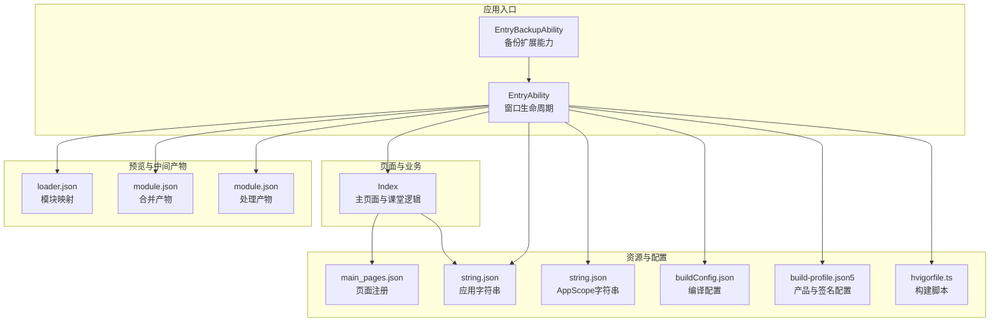
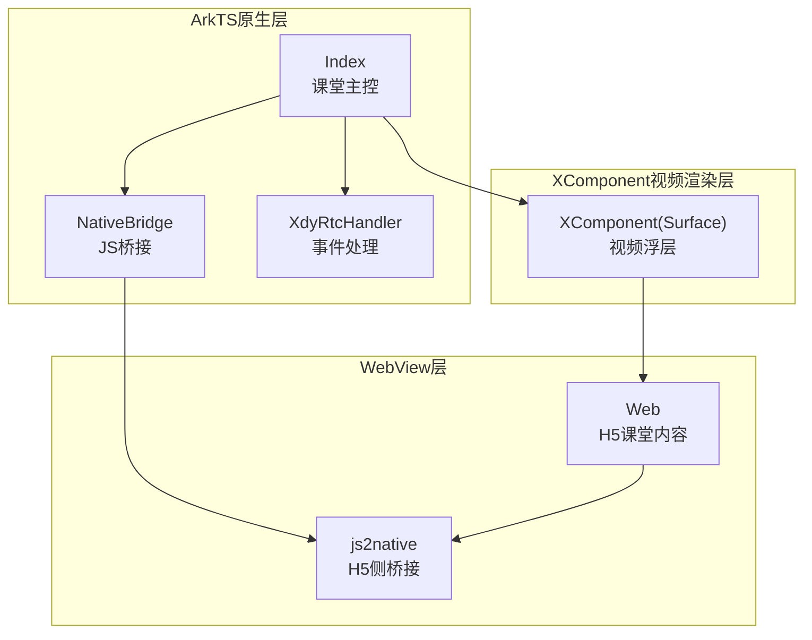
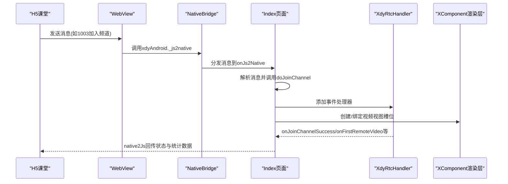
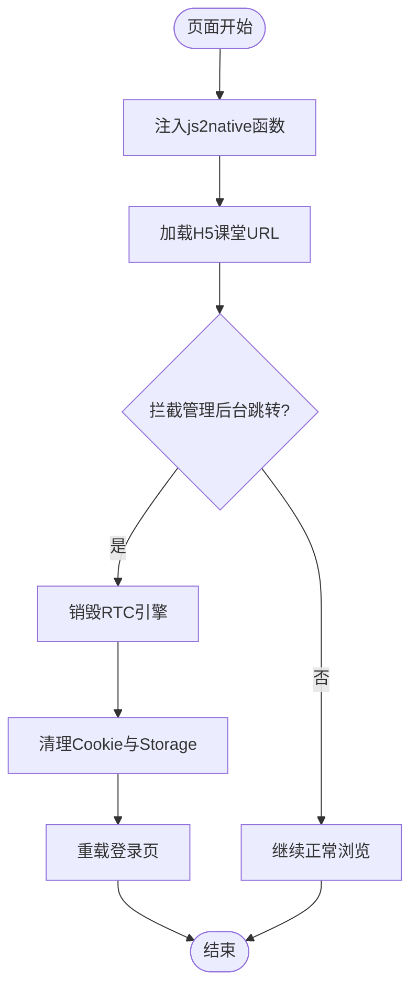
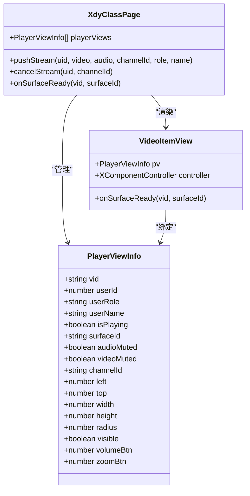
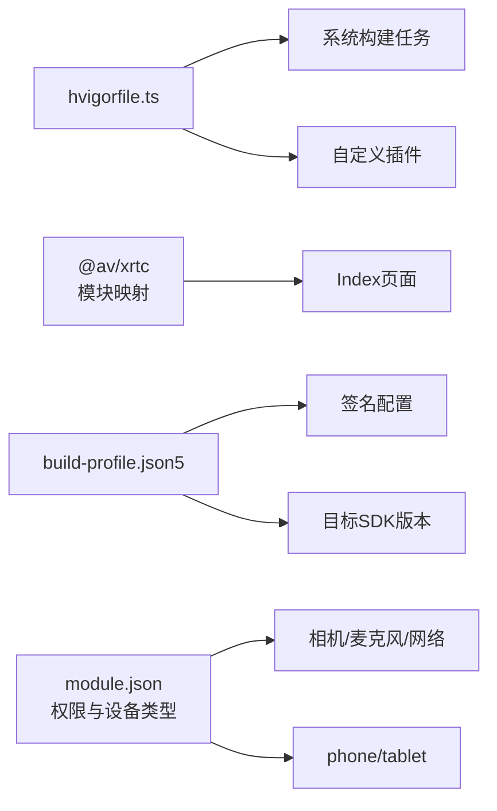

# 项目概述

<cite>
**本文引用的文件**
- [Index.ets](file://entry/src/main/ets/pages/Index.ets)
- [EntryAbility.ets](file://entry/src/main/ets/entryability/EntryAbility.ets)
- [EntryBackupAbility.ets](file://entry/src/main/ets/entrybackupability/EntryBackupAbility.ets)
- [main_pages.json](file://entry/src/main/resources/base/profile/main_pages.json)
- [string.json](file://entry/src/main/resources/base/element/string.json)
- [string.json](file://AppScope/resources/base/element/string.json)
- [buildConfig.json](file://entry/build/config/buildConfig.json)
- [build-profile.json5](file://build-profile.json5)
- [hvigorfile.ts](file://hvigorfile.ts)
- [hvigorfile.ts](file://entry/hvigorfile.ts)
- [loader.json](file://entry/.preview/default/intermediates/loader/default/loader.json)
- [module.json](file://entry/.preview/default/intermediates/merge_profile/default/module.json)
- [module.json](file://entry/.preview/default/intermediates/process_profile/default/module.json)
- [鸿蒙端实现分析与优化建议.md](file://鸿蒙端实现分析与优化建议.md)
- [harmonylog.md](file://harmonylog.md)
- [patch.js](file://patch.js)
</cite>

## 目录
1. [引言](#引言)
2. [项目结构](#项目结构)
3. [核心组件](#核心组件)
4. [架构总览](#架构总览)
5. [详细组件分析](#详细组件分析)
6. [依赖分析](#依赖分析)
7. [性能考虑](#性能考虑)
8. [故障排查指南](#故障排查指南)
9. [结论](#结论)
10. [附录](#附录)

## 引言
本项目为HarmonyOS在线课堂应用，面向教育场景提供音视频互动课堂能力。应用通过ArkTS原生层、WebView层与XComponent视频渲染层的协同，实现与H5课堂系统的深度集成，支持课堂进入、音视频推拉流、用户视图布局、权限管理、统计上报与错误处理等完整闭环。项目强调与H5课堂系统的兼容一致性，并针对HarmonyOS平台特性进行适配与优化，确保在不同设备与系统版本上的稳定运行。

## 项目结构
项目采用HarmonyOS标准工程结构，入口模块为entry，包含ArkTS源码、资源文件与构建配置。核心页面为Index.ets，承载音视频课堂主流程；EntryAbility负责窗口生命周期与页面加载；资源文件统一管理字符串与媒体资源；构建配置文件定义编译参数与签名信息。

图表来源
- [EntryAbility.ets](file://entry/src/main/ets/entryability/EntryAbility.ets#L1-L65)
- [EntryBackupAbility.ets](file://entry/src/main/ets/entrybackupability/EntryBackupAbility.ets#L1-L16)
- [Index.ets](file://entry/src/main/ets/pages/Index.ets#L1-L120)
- [main_pages.json](file://entry/src/main/resources/base/profile/main_pages.json#L1-L6)
- [string.json](file://entry/src/main/resources/base/element/string.json#L1-L32)
- [string.json](file://AppScope/resources/base/element/string.json#L1-L9)
- [buildConfig.json](file://entry/build/config/buildConfig.json#L1-L1)
- [build-profile.json5](file://build-profile.json5#L1-L56)
- [hvigorfile.ts](file://hvigorfile.ts#L1-L6)
- [hvigorfile.ts](file://entry/hvigorfile.ts#L1-L6)
- [loader.json](file://entry/.preview/default/intermediates/loader/default/loader.json#L1-L24)
- [module.json](file://entry/.preview/default/intermediates/merge_profile/default/module.json#L1-L62)
- [module.json](file://entry/.preview/default/intermediates/process_profile/default/module.json#L1-L62)

章节来源
- [EntryAbility.ets](file://entry/src/main/ets/entryability/EntryAbility.ets#L1-L65)
- [EntryBackupAbility.ets](file://entry/src/main/ets/entrybackupability/EntryBackupAbility.ets#L1-L16)
- [Index.ets](file://entry/src/main/ets/pages/Index.ets#L1-L120)
- [main_pages.json](file://entry/src/main/resources/base/profile/main_pages.json#L1-L6)
- [string.json](file://entry/src/main/resources/base/element/string.json#L1-L32)
- [string.json](file://AppScope/resources/base/element/string.json#L1-L9)
- [buildConfig.json](file://entry/build/config/buildConfig.json#L1-L1)
- [build-profile.json5](file://build-profile.json5#L1-L56)
- [hvigorfile.ts](file://hvigorfile.ts#L1-L6)
- [hvigorfile.ts](file://entry/hvigorfile.ts#L1-L6)
- [loader.json](file://entry/.preview/default/intermediates/loader/default/loader.json#L1-L24)
- [module.json](file://entry/.preview/default/intermediates/merge_profile/default/module.json#L1-L62)
- [module.json](file://entry/.preview/default/intermediates/process_profile/default/module.json#L1-L62)

## 核心组件
- ArkTS原生层（Index.ets）
  - 负责音视频引擎初始化、事件处理、用户视图管理、JS桥接、统计上报与错误处理。
  - 提供完整的课堂生命周期管理：加入/离开频道、推流/取消推流、静音/取消静音、切换摄像头、音量增益等。
  - 与H5课堂系统通过JS Bridge通信，消息类型覆盖1000~1052范围，确保与Android端行为一致。
- WebView层
  - 承载H5课堂内容，注入全局js2native函数，拦截管理后台跳转，清理登录态并重载登录页。
  - 支持JavaScript代理，将NativeBridge对象暴露给H5，实现双向通信。
- XComponent视频渲染层
  - 通过Surface在WebView之上叠加视频浮层，实现多路音视频渲染与布局控制。
  - 与ArkTS原生层配合，完成视图绑定、解绑与可见性控制。

章节来源
- [Index.ets](file://entry/src/main/ets/pages/Index.ets#L108-L151)
- [Index.ets](file://entry/src/main/ets/pages/Index.ets#L197-L365)
- [Index.ets](file://entry/src/main/ets/pages/Index.ets#L1009-L1142)
- [Index.ets](file://entry/src/main/ets/pages/Index.ets#L1415-L1435)

## 架构总览
应用采用“ArkTS原生层 + WebView层 + XComponent视频渲染层”的三层架构，实现与H5课堂系统的无缝集成。

图表来源
- [Index.ets](file://entry/src/main/ets/pages/Index.ets#L108-L151)
- [Index.ets](file://entry/src/main/ets/pages/Index.ets#L197-L365)
- [Index.ets](file://entry/src/main/ets/pages/Index.ets#L1009-L1142)

## 详细组件分析

### ArkTS原生层（Index.ets）
- 页面与生命周期
  - 页面入口注解与构建器负责渲染WebView与XComponent叠加层。
  - 生命周期中申请相机与麦克风权限，注入应用上下文供SDK使用。
- JS桥接与消息分发
  - 通过javaScriptProxy将NativeBridge对象暴露给H5，消息类型覆盖1000~1052，实现与H5课堂系统的统一协议。
  - onLoadIntercept拦截管理后台跳转，销毁RTC引擎、清理Cookie与Storage并重载登录页。
- 音视频引擎与事件处理
  - 基于XRTC引擎创建与销毁、加入/离开频道、设置音频场景、配置视频编码。
  - 事件处理器XdyRtcHandler响应连接状态、首帧、静音、统计等事件，驱动UI更新与数据上报。
- 视图管理与推流绑定
  - pushStream根据用户角色与视图槽位进行精确绑定，支持本地/远端视频渲染与静音控制。
  - cancelStream解除绑定并停止本地音视频推流，避免资源泄漏。
- 统计与错误处理
  - 本地与远端音视频统计按帧聚合，满足课堂质量监控需求。
  - 错误事件统一上报至H5，便于前端提示与日志追踪。

图表来源
- [Index.ets](file://entry/src/main/ets/pages/Index.ets#L368-L429)
- [Index.ets](file://entry/src/main/ets/pages/Index.ets#L930-L990)
- [Index.ets](file://entry/src/main/ets/pages/Index.ets#L1175-L1201)
- [Index.ets](file://entry/src/main/ets/pages/Index.ets#L1415-L1435)

章节来源
- [Index.ets](file://entry/src/main/ets/pages/Index.ets#L197-L365)
- [Index.ets](file://entry/src/main/ets/pages/Index.ets#L368-L429)
- [Index.ets](file://entry/src/main/ets/pages/Index.ets#L930-L990)
- [Index.ets](file://entry/src/main/ets/pages/Index.ets#L1009-L1142)
- [Index.ets](file://entry/src/main/ets/pages/Index.ets#L1175-L1201)
- [Index.ets](file://entry/src/main/ets/pages/Index.ets#L1415-L1435)

### WebView层（H5课堂系统集成）
- 内容加载与桥接
  - WebView加载H5课堂地址，注入js2native全局函数，确保H5侧能调用Native方法。
  - javaScriptProxy将NativeBridge对象暴露给H5，实现双向通信。
- 导航拦截与会话清理
  - onLoadIntercept拦截管理后台跳转，销毁RTC引擎、清理Cookie与Storage并重载登录页。
- 权限与兼容性
  - mixedMode与UA设置确保H5正确识别移动端并启用所需功能。
  - onPageBegin阶段注入脚本，保障桥接函数可用性。

图表来源
- [Index.ets](file://entry/src/main/ets/pages/Index.ets#L289-L345)
- [Index.ets](file://entry/src/main/ets/pages/Index.ets#L292-L297)
- [Index.ets](file://entry/src/main/ets/pages/Index.ets#L304-L342)

章节来源
- [Index.ets](file://entry/src/main/ets/pages/Index.ets#L262-L365)
- [Index.ets](file://entry/src/main/ets/pages/Index.ets#L289-L345)

### XComponent视频渲染层
- 视图槽位与绑定
  - 通过XComponent(Surface)在WebView之上叠加视频浮层，支持多路渲染与布局控制。
  - onSurfaceReady回调获取surfaceId并完成本地/远端视频绑定，确保首帧及时显示。
- 交互与可见性
  - 通过透明穿透与层级控制，实现视频浮层与WebView的自然融合。
  - 视图可见性与用户信息叠加，提升课堂体验。

图表来源
- [Index.ets](file://entry/src/main/ets/pages/Index.ets#L26-L66)
- [Index.ets](file://entry/src/main/ets/pages/Index.ets#L154-L192)
- [Index.ets](file://entry/src/main/ets/pages/Index.ets#L1009-L1142)
- [Index.ets](file://entry/src/main/ets/pages/Index.ets#L1415-L1435)

章节来源
- [Index.ets](file://entry/src/main/ets/pages/Index.ets#L154-L192)
- [Index.ets](file://entry/src/main/ets/pages/Index.ets#L1009-L1142)
- [Index.ets](file://entry/src/main/ets/pages/Index.ets#L1415-L1435)

## 依赖分析
- 构建与模块映射
  - hvigorfile.ts定义系统构建任务与插件扩展点。
  - loader.json记录@av/xrtc等模块的字节码路径与兼容SDK版本，确保编译期与运行期一致性。
- 产品与签名配置
  - build-profile.json5定义签名配置、目标SDK版本与构建模式集合，确保发布一致性。
- 权限与设备类型
  - module.json声明网络、相机、麦克风等权限及设备类型，保障课堂功能可用性。

图表来源
- [hvigorfile.ts](file://hvigorfile.ts#L1-L6)
- [hvigorfile.ts](file://entry/hvigorfile.ts#L1-L6)
- [loader.json](file://entry/.preview/default/intermediates/loader/default/loader.json#L1-L24)
- [build-profile.json5](file://build-profile.json5#L1-L56)
- [module.json](file://entry/.preview/default/intermediates/merge_profile/default/module.json#L1-L62)
- [module.json](file://entry/.preview/default/intermediates/process_profile/default/module.json#L1-L62)

章节来源
- [hvigorfile.ts](file://hvigorfile.ts#L1-L6)
- [hvigorfile.ts](file://entry/hvigorfile.ts#L1-L6)
- [loader.json](file://entry/.preview/default/intermediates/loader/default/loader.json#L1-L24)
- [build-profile.json5](file://build-profile.json5#L1-L56)
- [module.json](file://entry/.preview/default/intermediates/merge_profile/default/module.json#L1-L62)
- [module.json](file://entry/.preview/default/intermediates/process_profile/default/module.json#L1-L62)

## 性能考虑
- 引擎复用策略
  - 退出课堂时仅离开频道而不销毁引擎，避免HarmonyOS平台下destroy不可靠导致的初始化失败，重进时复用引擎可显著降低延迟。
- 视图绑定与资源释放
  - reset流程中主动停止本地推流并解除所有视频绑定，防止刷新后旧轨道资源未释放引发卡顿。
- 统计上报与阈值
  - 本地与远端统计按帧聚合，满足课堂质量监控需求，同时避免频繁上报造成性能损耗。
- WebView与XComponent层级
  - 通过透明穿透与层级控制减少不必要的重绘，提升渲染效率。

章节来源
- [Index.ets](file://entry/src/main/ets/pages/Index.ets#L623-L642)
- [Index.ets](file://entry/src/main/ets/pages/Index.ets#L656-L698)
- [Index.ets](file://entry/src/main/ets/pages/Index.ets#L1324-L1406)

## 故障排查指南
- 退出课堂后跳转到管理后台
  - 现象：H5直接window.location跳转导致退出异常。
  - 处理：onLoadIntercept拦截管理后台域，销毁RTC引擎、清理Cookie与Storage并重载登录页。
- 登录态未清除导致自动登录
  - 现象：仅清Cookie，localStorage/sessionStorage未清导致自动登录。
  - 处理：增加localStorage.clear()与sessionStorage.clear()，确保登录态完全清除。
- 引擎初始化失败或重进异常
  - 现象：destroy不可靠导致重进初始化失败返回-7。
  - 处理：退出时仅leaveChannel不destroy，复用引擎直接joinChannel。
- 设备信息与UA不一致
  - 现象：H5识别为PC端或设备信息不一致。
  - 处理：硬编码Android UA与设备信息字段，确保与Android端完全对齐。

章节来源
- [Index.ets](file://entry/src/main/ets/pages/Index.ets#L304-L342)
- [Index.ets](file://entry/src/main/ets/pages/Index.ets#L392-L398)
- [Index.ets](file://entry/src/main/ets/pages/Index.ets#L623-L642)
- [Index.ets](file://entry/src/main/ets/pages/Index.ets#L840-L870)

## 结论
本项目通过ArkTS原生层、WebView层与XComponent视频渲染层的协同，实现了与H5课堂系统的深度集成，覆盖课堂进入、音视频推拉流、用户视图布局、权限管理与统计上报等核心能力。针对HarmonyOS平台特性，项目在引擎复用、会话清理、UA与设备信息对齐等方面进行了针对性优化，确保课堂体验的稳定性与一致性。建议持续关注H5适配与SDK版本演进，完善边界场景测试与日志分析能力。

## 附录
- 业务价值与应用场景
  - 教育场景：支持在线课堂音视频互动，满足教师与学生在HarmonyOS设备上的教学与学习需求。
  - 兼容性：与Android端行为对齐，便于统一运营与维护。
- 系统要求与兼容性
  - 目标API版本：60001021（HarmonyOS 6.0.1(21)），建议在目标设备上验证相机与麦克风权限。
  - 设备类型：phone、tablet，确保横屏与全屏体验。
- 部署环境准备
  - 签名配置：使用build-profile.json5中的默认签名，确保调试与发布一致性。
  - 构建工具：hvigorfile.ts定义系统构建任务，确保编译与打包流程稳定。
  - 模块依赖：@av/xrtc等模块通过loader.json映射，确保运行时可用。

章节来源
- [build-profile.json5](file://build-profile.json5#L1-L56)
- [hvigorfile.ts](file://hvigorfile.ts#L1-L6)
- [loader.json](file://entry/.preview/default/intermediates/loader/default/loader.json#L1-L24)
- [module.json](file://entry/.preview/default/intermediates/merge_profile/default/module.json#L1-L62)